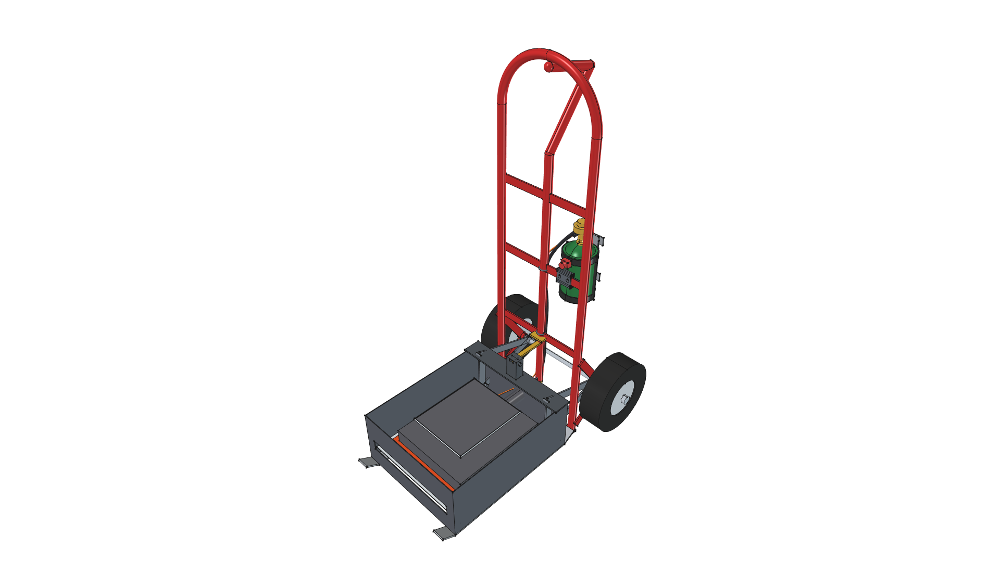
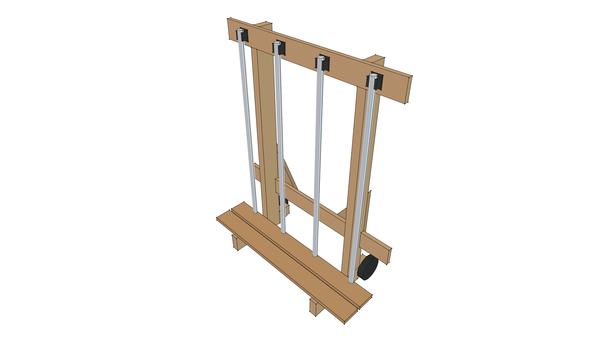

# Maker: AI-Augmented Physical Design & Fabrication Framework

---

> *"By 'augmenting human intellect' we mean increasing the capability of a man to approach a complex problem situation, to gain comprehension to suit his particular needs, and to derive solutions to problems... We envision a future where an architect collaborates interactively with a machine to design physical structures—manipulating representations, testing constraints, and realizing ideas in real time."*  
> — **Douglas Engelbart**, *Augmenting Human Intellect: A Conceptual Framework* (1962)

---

## Overview & Vision

**Maker** is a conceptual framework and practical workbench for **AI-Augmented Physical Fabrication and Design**. It realizes Douglas Engelbart's 1962 vision by pairing human design intent, physical fabrication experience, and practical shop constraints with AI-agentic coding, FreeCAD 3D parametric modeling, cut list generation, and automated documentation.

Rather than expecting an AI agent to generate complex physical objects out of whole cloth, **Maker** establishes an intelligent, collaborative pair-designing loop:
- **Human Partner**: Provides domain knowledge, physical requirements, ergonomic intuition, freehand sketches, material availability, and shop fabrication feedback.
- **AI Agent**: Translates prompts and field notes into formal parametric CAD code, enforces vector math safety rules, breaks assemblies into modular component libraries, generates exact cut lists / BOMs, and maintains version control integrity.

---

## Core Operating Principles

### 1. The Human-AI Collaborative Loop
The design and fabrication process follows a structured, evolutionary cycle:
```
┌───────────────────────────┐      ┌───────────────────────────────┐
│     Human Fabricator      │      │        AI Coding Agent        │
│  - Physical Intent & Goal │ ────►│  - Requirements Synthesis     │
│  - Hand Sketches & Specs  │      │  - Standalone Component Mod.  │
│  - Shop Tooling & Feedback│ ◄────│  - FreeCAD Parametric Code    │
└───────────────────────────┘      └───────────────────────────────┘
              │                                    │
              ▼                                    ▼
┌───────────────────────────┐      ┌───────────────────────────────┐
│     Shop Fabrication      │      │   Living Project Docs & Git   │
│  - Table Saw / Weld Prep  │      │  - REQUIREMENTS.md & CUT_LIST │
│  - Physical Test & Fit    │      │  - Git-Native Tagged Releases │
└───────────────────────────┘      └───────────────────────────────┘
```

### 2. Intelligent Work Partitioning & Component Library
Real-world physical assemblies are built from reusable commercial tools, standard hardware, and custom lumber/metal fabrications:
- **Commercial & Fabricated Components (`components/`)**: Discrete items such as torch burner nozzles, handle control cockpits, propane cylinders, bottle cages, steel wheels, and tool attachments are modeled as independent, reusable 3D CAD modules in `components/`.
- **Physical Assembly Projects (`projects/`)**: Complete physical designs (e.g. `kombi-kaddy`, `road-roaster`) import these pre-built components and structure frames around them.

### 3. Living Requirements Lifecycle & Git-Native Versioning
Physical design iterations follow Semantic Versioning (`vMAJOR.MINOR.PATCH`) paired with standard Lifecycle Status Badges (`🟡 IN PROGRESS`, `🔵 FABRICATION READY`, `🟢 BUILT & VERIFIED`, `📦 SUPERSEDED`).
- **Git-Native History**: Historical CAD model iterations are managed natively in Git history via tags (`v0.0.0`, `v0.1.0`...).
- **Visual Transformation Changelogs**: `projects/<project>/CHANGELOG.md` and `projects/<project>/changelog/` track the visual story of design evolution with historical thumbnails.

---

## Directory Architecture

```
/home/phi/PROJECTS/phi-WORKS/maker/
├── README.md                 # Master framework vision, philosophy & workspace index
├── CHANGELOG.md              # Master repository changelog & release history
├── WORKFLOW.md               # Operating guidelines, CAD best practices & Git branching rules
├── GEMINI.md                 # Agent context & operating manual for Gemini CLI
├── ROADMAP.md                # Component library roadmap & physical project goals
├── pyproject.toml            # Python package metadata & build settings
├── src/                      # Primary Python library source (phi_works_maker)
│
├── components/               # Standalone Reusable Commercial Tools & Hardware Library
│   ├── commercial_hand_truck/ # Vintage Restored Hand Truck Chassis & Triangular Trusses
│   ├── platform_cart_24x36/  # Commercial 24x36 Platform Cart (5in Wheels, 29in Handle)
│   ├── propane_cylinder_20lb/# Standard DOT 20 lb Propane Tank module & 3D model
│   ├── solaronics_infrared_burner/ # Solaronics High-Intensity Ceramic Infrared Burner Engine
│   ├── torch_control_handle/ # Ergonomic Squeeze Cockpit & Valve module & 3D model
│   ├── torch_burner_head/    # 500k BTU Venturi Burner Nozzle module & 3D model
│   ├── propane_cylinder_1lb/ # 1 lb Propane Cylinder module & 3D model
│   ├── propane_harness/      # Quick-release bottle harness module & 3D model
│   ├── steel_caster_wheel/   # 4.0" Solid Steel Wheel module & 3D model
│   └── torch_hf91037/        # Harbor Freight #91037 full wand module & reference photos
│
└── projects/                 # Physical Projects & Master Assemblies
    ├── kombi-kaddy/          # STIHL Kombi Attachment Kaddy (Master active product & changelog)
    ├── road-roaster/         # Compact Hand Truck Weed Shock Sled (Master active product & changelog)
    └── road-roaster-4w/      # 4-Wheel Platform Dolly Weed Shock Sled (Master active product & changelog)
```

---

## [Physical Projects](projects/README.md)

*See the full [Projects Visual Catalog](projects/README.md) for master model summaries and engineering documentation.*

### 1. [Road Roaster 4W](projects/road-roaster-4w/README.md)
*4-Wheel Commercial Platform Dolly Architecture for Infrared Thermal Weed Eradication*

| Project Master Render | Quick Specs & Master Links |
| :---: | :--- |
| [](projects/road-roaster-4w/) | • **Application**: Heavy-duty commercial 24" × 36" platform cart for large-scale driveway & headland weed shock.<br>• **Core Advantage**: Carries full 20 lb propane cylinder (~7.2 hrs runtime) & 2.5 gal water safety tank; front cantilevered burner with 180° flip-back transit stowage; auxiliary torch wand on handle; crawl propulsion ready.<br>• **Active Master**: [**v0.1.0**](projects/road-roaster-4w/) 🟡 **`[IN PROGRESS]`**<br>• 📖 [**README.md**](projects/road-roaster-4w/README.md)<br>• 📐 [**SPECIFICATION.md**](projects/road-roaster-4w/SPECIFICATION.md)<br>• 📜 [**CHANGELOG.md**](projects/road-roaster-4w/CHANGELOG.md)<br>• 🛠️ [**build.py**](projects/road-roaster-4w/build.py)<br>• 📦 [**road-roaster-4w.FCStd**](projects/road-roaster-4w/road-roaster-4w.FCStd) |

### 2. [Road Roaster](projects/road-roaster/README.md)
*Directional Ceramic Infrared Thermal Weed Shock Sled (Compact 2-Wheel Hand Truck Variant)*

| Project Master Render | Quick Specs & Master Links |
| :---: | :--- |
| [](projects/road-roaster/) | • **Application**: Chemical-free hardscape weed eradication via Solaronics ceramic infrared radiant shock.<br>• **Core Advantage**: Zero aerodynamic blast pressure; 15–30s deep heat-soak kills root crowns; ultra-compact 2-wheel hand truck maneuverability.<br>• **Active Master**: [**v0.7.0**](projects/road-roaster/) 🟡 **`[IN PROGRESS]`**<br>• 📖 [**README.md**](projects/road-roaster/README.md)<br>• 📐 [**SPECIFICATION.md**](projects/road-roaster/SPECIFICATION.md)<br>• 📜 [**CHANGELOG.md**](projects/road-roaster/CHANGELOG.md)<br>• 🛠️ [**build.py**](projects/road-roaster/build.py)<br>• 📦 [**road-roaster.FCStd**](projects/road-roaster/road-roaster.FCStd) |

### 3. [Kombi Kaddy](projects/kombi-kaddy/README.md)
*Mobile STIHL KombiSystem Attachment Rack*

| Project Master Render | Quick Specs & Master Links |
| :---: | :--- |
| [](projects/kombi-kaddy/) | • **Application**: Heavy-duty mobile 2x4 wooden rack for STIHL KombiSystem storage.<br>• **Active Master**: [**v0.9.0**](projects/kombi-kaddy/) 🟡 **`[IN PROGRESS]`**<br>• 📖 [**README.md**](projects/kombi-kaddy/README.md)<br>• 📐 [**SPECIFICATION.md**](projects/kombi-kaddy/SPECIFICATION.md)<br>• 📜 [**CHANGELOG.md**](projects/kombi-kaddy/CHANGELOG.md)<br>• 🛠️ [**build.py**](projects/kombi-kaddy/build.py)<br>• 📦 [**caddy.FCStd**](projects/kombi-kaddy/caddy.FCStd) |

---

## [Component Libraries](components/README.md)

*See the full [Components Visual Catalog](components/README.md) for insertion origins, 6-view galleries, and specs.*

### 1. [Commercial Hand Truck Chassis](components/commercial_hand_truck/README.md)

| Component Render | Specifications & Links |
| :---: | :--- |
| [](components/commercial_hand_truck/) | • **Application**: Vintage restored $1.0''\text{ OD}$ tubular steel U-frame, center spine handle, triangular axle trusses & $9.5''$ wheels.<br>• 🛠️ [**`build.py`**](components/commercial_hand_truck/build.py)<br>• 📦 [**`commercial_hand_truck.FCStd`**](components/commercial_hand_truck/commercial_hand_truck.FCStd) |

### 2. [Commercial 24" × 36" Platform Cart](components/platform_cart_24x36/README.md)

| Component Render | Specifications & Links |
| :---: | :--- |
| [](components/platform_cart_24x36/) | • **Application**: Heavy-duty diamond plate dolly deck (24x36in), 29" push handle with dual rails, 5" casters (2 rigid, 2 rear swivel w/ locks).<br>• 🛠️ [**`build.py`**](components/platform_cart_24x36/build.py)<br>• 📦 [**`platform_cart_24x36.FCStd`**](components/platform_cart_24x36/platform_cart_24x36.FCStd) |

### 3. [Solaronics High-Intensity Ceramic Infrared Burner](components/solaronics_infrared_burner/README.md)

| Component Render | Specifications & Links |
| :---: | :--- |
| [](components/solaronics_infrared_burner/) | • **Application**: $173\text{ sq. in}$ cordierite ceramic plaque matrix ($1,800^\circ\text{F}$), parabolic aluminum reflector, and Inconel rock shield.<br>• 🛠️ [**`build.py`**](components/solaronics_infrared_burner/build.py)<br>• 📦 [**`solaronics_infrared_burner.FCStd`**](components/solaronics_infrared_burner/solaronics_infrared_burner.FCStd) |

### 4. [Standard DOT 20 lb Propane Cylinder](components/propane_cylinder_20lb/README.md)

| Component Render | Specifications & Links |
| :---: | :--- |
| [](components/propane_cylinder_20lb/) | • **Application**: Standard 20 lb LP gas container with foot ring, dual-slot collar, OPD brass valve & 11" W.C. regulator.<br>• 🛠️ [**`build.py`**](components/propane_cylinder_20lb/build.py)<br>• 📦 [**`propane_cylinder_20lb.FCStd`**](components/propane_cylinder_20lb/propane_cylinder_20lb.FCStd) |

### 5. [1 lb Disposable/Refillable Propane Cylinder](components/propane_cylinder_1lb/README.md)

| Component Render | Specifications & Links |
| :---: | :--- |
| [](components/propane_cylinder_1lb/) | • **Application**: Standard 16.4 oz / 1 lb LP bottle with 1"-20 UNEF male threaded brass connector.<br>• 🛠️ [**`build.py`**](components/propane_cylinder_1lb/build.py)<br>• 📦 [**`propane_cylinder_1lb.FCStd`**](components/propane_cylinder_1lb/propane_cylinder_1lb.FCStd) |

### 6. [1 lb Propane Bottle Harness](components/propane_harness/README.md)

| Component Render | Specifications & Links |
| :---: | :--- |
| [](components/propane_harness/) | • **Application**: Quick-release steel bottle cage for 1 lb propane canisters with bottom seat cup and knurled latch.<br>• 🛠️ [**`build.py`**](components/propane_harness/build.py)<br>• 📦 [**`propane_harness.FCStd`**](components/propane_harness/propane_harness.FCStd) |

### 7. [Harbor Freight #91037 Propane Torch](components/torch_hf91037/README.md)

| Component Render | Specifications & Links |
| :---: | :--- |
| [](components/torch_hf91037/) | • **Application**: Complete Harbor Freight #91037 propane torch wand with grip, trigger, piezo lighter, and 2.375" bell.<br>• 🛠️ [**`torch_hf91037.py`**](components/torch_hf91037/torch_hf91037.py)<br>• 📦 [**`torch_hf91037.FCStd`**](components/torch_hf91037/torch_hf91037.FCStd) |

### 8. [Torch Control Handle Cockpit](components/torch_control_handle/README.md)

| Component Render | Specifications & Links |
| :---: | :--- |
| [](components/torch_control_handle/) | • **Application**: Handle-mounted brass valve, squeeze boost lever & piezo spark igniter.<br>• 🛠️ [**`build.py`**](components/torch_control_handle/build.py)<br>• 📦 [**`torch_control_handle.FCStd`**](components/torch_control_handle/torch_control_handle.FCStd) |

### 9. [500,000 BTU Torch Burner Head](components/torch_burner_head/README.md)

| Component Render | Specifications & Links |
| :---: | :--- |
| [](components/torch_burner_head/) | • **Application**: Chassis-mounted 2.5" combustion bell, venturi cone & spark electrode.<br>• 🛠️ [**`build.py`**](components/torch_burner_head/build.py)<br>• 📦 [**`torch_burner_head.FCStd`**](components/torch_burner_head/torch_burner_head.FCStd) |

### 10. [4.0" Solid Steel Wheel](components/steel_caster_wheel/README.md)

| Component Render | Specifications & Links |
| :---: | :--- |
| [](components/steel_caster_wheel/) | • **Application**: Solid machined cast steel wheel and 1/2" Grade 5 axle hardware.<br>• 🛠️ [**`build.py`**](components/steel_caster_wheel/build.py)<br>• 📦 [**`steel_caster_wheel.FCStd`**](components/steel_caster_wheel/steel_caster_wheel.FCStd) |

### 11. [STIHL Kombi Tools & Attachments](components/kombi_tools/README.md)

| Component Render | Specifications & Links |
| :---: | :--- |
| [](components/kombi_tools/) | • **Application**: 3D parametric CAD models for STIHL line trimmers, curved edgers, gearbox elbows, and debris shields.<br>• 🛠️ [**`build_trimmer.py`**](components/kombi_tools/build_trimmer.py)<br>• 📦 [**`trimmer.FCStd`**](components/kombi_tools/trimmer.FCStd) |

---

## FreeCAD Execution Commands

```bash
# Build Kombi Kaddy Master Model
/home/phi/AppImages/FreeCAD_1.1.3-Linux-x86_64-py311.AppImage -c "__file__='/home/phi/PROJECTS/phi-WORKS/maker/projects/kombi-kaddy/build.py'; exec(open(__file__).read())"

# Build Road Roaster Master Model (Compact Hand Truck)
/home/phi/AppImages/FreeCAD_1.1.3-Linux-x86_64-py311.AppImage -c "__file__='/home/phi/PROJECTS/phi-WORKS/maker/projects/road-roaster/build.py'; exec(open(__file__).read())"

# Build Road Roaster 4W Master Model (4-Wheel Platform Cart)
/home/phi/AppImages/FreeCAD_1.1.3-Linux-x86_64-py311.AppImage -c "__file__='/home/phi/PROJECTS/phi-WORKS/maker/projects/road-roaster-4w/build.py'; exec(open(__file__).read())"
```
