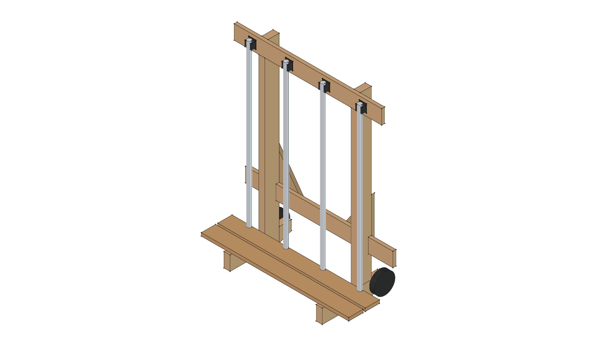

# Maker: AI-Augmented Physical Design & Fabrication Framework

---

> *"By 'augmenting human intellect' we mean increasing the capability of a man to approach a complex problem situation, to gain comprehension to suit his particular needs, and to derive solutions to problems... We envision a future where an architect collaborates interactively with a machine to design physical structures—manipulating representations, testing constraints, and realizing ideas in real time."*  
> — **Douglas Engelbart**, *Augmenting Human Intellect: A Conceptual Framework* (1962)

---

## Overview & Vision

**Maker** is a conceptual framework and practical workbench for **AI-Augmented Physical Fabrication and Design**. It realizes Douglas Engelbart's 1962 vision by pairing human design intent, physical fabrication experience, and practical shop constraints with AI-agentic coding, FreeCAD 3D parametric modeling, cut list generation, and automated documentation.

Rather than expecting an AI agent to generate complex physical objects out of whole cloth, **Maker** establishes an intelligent, collaborative pair-designing loop:
- **Human Partner**: Provides domain knowledge, physical requirements, ergonomic intuition, freehand sketches, material availability, and shop fabrication feedback.
- **AI Agent**: Translates prompts and field notes into formal parametric CAD code, enforces vector math safety rules, breaks assemblies into modular component libraries, generates exact cut lists / BOMs, and maintains version control integrity.

---

## Core Operating Principles

### 1. The Human-AI Collaborative Loop
The design and fabrication process follows a structured, evolutionary cycle:
```
┌───────────────────────────┐      ┌───────────────────────────────┐
│     Human Fabricator      │      │        AI Coding Agent        │
│  - Physical Intent & Goal │ ────►│  - Requirements Synthesis     │
│  - Hand Sketches & Specs  │      │  - Standalone Component Mod.  │
│  - Shop Tooling & Feedback│ ◄────│  - FreeCAD Parametric Code    │
└───────────────────────────┘      └───────────────────────────────┘
              │                                    │
              ▼                                    ▼
┌───────────────────────────┐      ┌───────────────────────────────┐
│     Shop Fabrication      │      │   Living Project Docs & Git   │
│  - Table Saw / Weld Prep  │      │  - REQUIREMENTS.md & CUT_LIST │
│  - Physical Test & Fit    │      │  - Version Folders (v01..vXX) │
└───────────────────────────┘      └───────────────────────────────┘
```

### 2. Intelligent Work Partitioning & Component Library
Real-world physical assemblies are built from reusable commercial tools, standard hardware, and custom lumber/metal fabrications:
- **Commercial & Purchased Tools (`components/`)**: Items such as the Harbor Freight #91037 Propane Torch, STIHL Kombi tool attachments, fixed caster wheels, and clevis hitches are modeled once as standalone, independent 3D modules in `components/`. Once modeled, they become permanent, reusable building blocks for any host assembly.
- **Physical Assembly Projects (`projects/`)**: Complete physical designs (e.g. `caddy`, `flame-weeding-sled`) import these component modules and structure lumber/metal frames around them.

### 3. Living Requirements Lifecycle (`REQUIREMENTS.md`)
Requirements are not static one-time prompts. Each project maintains:
- **`projects/<project>/REQUIREMENTS.md`**: Master project vision, constraints, and target specifications.
- **`projects/<project>/vXX/REQUIREMENTS.md`**: Iteration-specific requirements, design trade-offs, and delta refinements.

---

## Directory Architecture

```
/home/phi/PROJECTS/phi-WORKS/maker/
├── README.md                 # Master framework vision, philosophy & workspace index
├── CHANGELOG.md              # Master repository changelog & release history
├── WORKFLOW.md               # Operating guidelines, CAD best practices & Git branching rules
├── GEMINI.md                 # Agent context & operating manual for Gemini CLI
├── ROADMAP.md                # Component library roadmap & physical project goals
├── pyproject.toml            # Python package metadata & build settings
├── src/                      # Primary Python library source (phi_works_maker)
│
├── components/               # Standalone Reusable Commercial Tools & Hardware Library
│   ├── torch_hf91037/        # Harbor Freight #91037 Propane Torch module & 3D model
│   └── kombi_tools/          # STIHL Kombi tool attachments & trimmer 3D models
│
└── projects/                 # Physical Projects & Master Assemblies
    ├── caddy/                # STIHL Kombi Attachment Caddy (v01..v10 master)
    └── flame-weeding-sled/   # Towable Flame Weeding Sled (v01..v04 master)
```

---

## Physical Projects

### 1. [Road Roaster](projects/flame-weeding-sled/README.md)
*Towable Thermal Weed Shock Sled*

| Project Master Render | Quick Specs & Master Links |
| :---: | :--- |
|  | • **Application**: Non-chemical gravel driveway weed management via thermal shock ($150^\circ\text{F}$–$180^\circ\text{F}$).<br>• **Master Version**: [**Version 04**](projects/flame-weeding-sled/v04/)<br>• 📋 [**REQUIREMENTS.md**](projects/flame-weeding-sled/REQUIREMENTS.md)<br>• 📐 [**SPECIFICATION.md**](projects/flame-weeding-sled/v04/SPECIFICATION.md)<br>• ✂️ [**CUT_LIST.md**](projects/flame-weeding-sled/v04/CUT_LIST.md)<br>• 🛠️ [**FABRICATION_GUIDE.md**](projects/flame-weeding-sled/v04/FABRICATION_GUIDE.md)<br>• 📦 [**BOM.md**](projects/flame-weeding-sled/v04/BOM.md) |

### 2. [Kombi Kaddy](projects/caddy/README.md)
*Mobile STIHL KombiSystem Attachment Rack*

| Project Master Render | Quick Specs & Master Links |
| :---: | :--- |
|  | • **Application**: Heavy-duty mobile 2x4 wooden rack for STIHL KombiSystem storage.<br>• **Master Version**: [**Version 10**](projects/caddy/v10/)<br>• 📋 [**REQUIREMENTS.md**](projects/caddy/REQUIREMENTS.md)<br>• 📐 [**SPECIFICATION.md**](projects/caddy/v10/SPECIFICATION.md)<br>• ✂️ [**CUT_LIST.md**](projects/caddy/v10/CUT_LIST.md)<br>• 🛠️ [**build.py**](projects/caddy/v10/build.py) |

---

## Component Libraries

### 1. [Harbor Freight #91037 Propane Torch](components/torch_hf91037/README.md)

| Component Render | Specifications & Links |
| :---: | :--- |
|  | • **Application**: High-output propane burner with push-button igniter.<br>• 🛠️ [**`torch_hf91037.py`**](components/torch_hf91037/torch_hf91037.py)<br>• 📦 [**`torch_hf91037.FCStd`**](components/torch_hf91037/torch_hf91037.FCStd) |

### 2. [STIHL Kombi Tools Component Library](components/kombi_tools/README.md)

| Component Render | Specifications & Links |
| :---: | :--- |
|  | • **Application**: 3D parametric models for STIHL straight-shaft attachments.<br>• 🛠️ [**`build_trimmer.py`**](components/kombi_tools/build_trimmer.py)<br>• 📦 [**`trimmer.FCStd`**](components/kombi_tools/trimmer.FCStd) |

---

## FreeCAD Execution Commands

```bash
# Build Caddy Version 10 Master Model
/home/phi/AppImages/FreeCAD_1.1.3-Linux-x86_64-py311.AppImage -c "__file__='/home/phi/PROJECTS/phi-WORKS/maker/projects/caddy/v10/build.py'; exec(open(__file__).read())"

# Build Flame Weeding Sled Version 04 Master Model
/home/phi/AppImages/FreeCAD_1.1.3-Linux-x86_64-py311.AppImage -c "__file__='/home/phi/PROJECTS/phi-WORKS/maker/projects/flame-weeding-sled/v04/build.py'; exec(open(__file__).read())"
```
