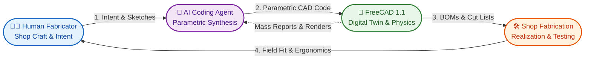
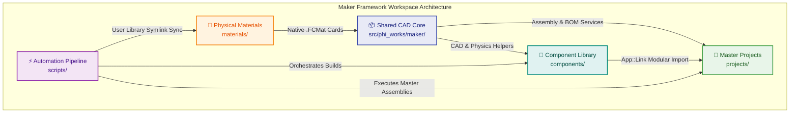
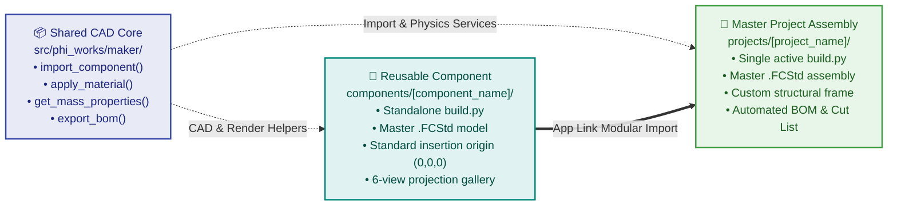
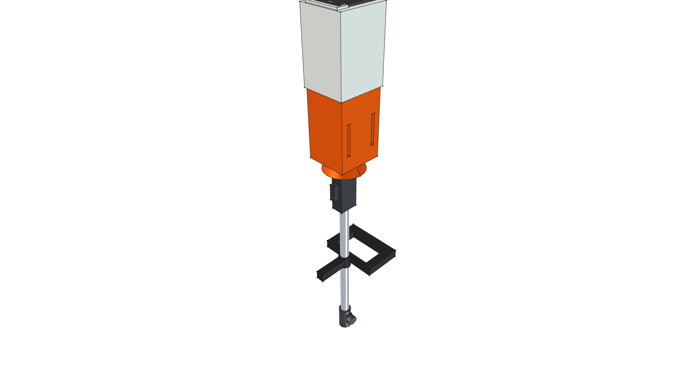
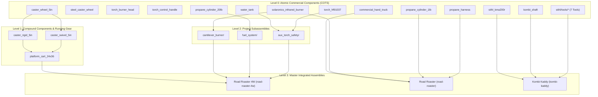
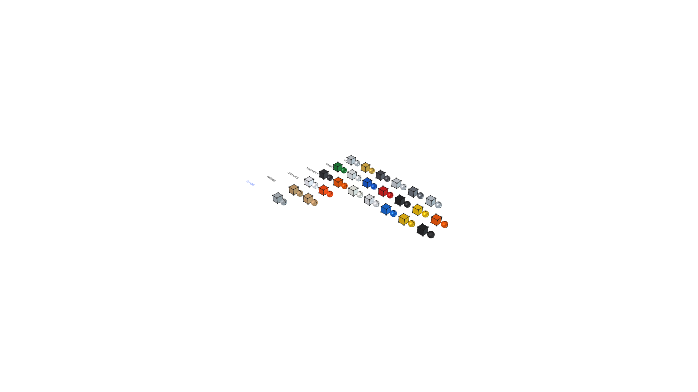
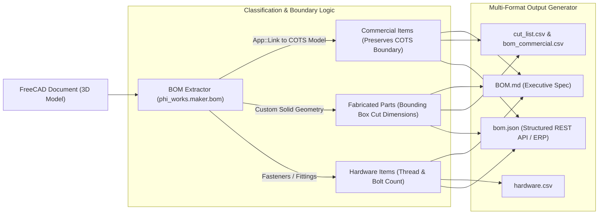
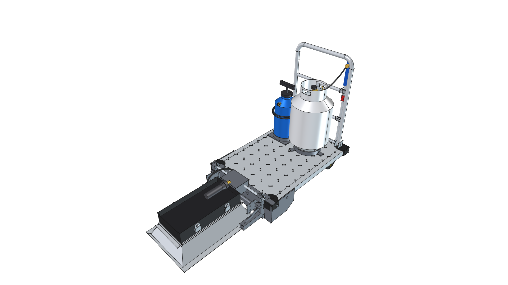

# Maker: AI-Augmented Physical Design & Fabrication Framework

---

> *"By 'augmenting human intellect' we mean increasing the capability of a man to approach a complex problem situation, to gain comprehension to suit his particular needs, and to derive solutions to problems... We envision a future where an architect collaborates interactively with a machine to design physical structures—manipulating representations, testing constraints, and realizing ideas in real time."*  
> — **Douglas Engelbart**, *Augmenting Human Intellect: A Conceptual Framework* (1962)

---

## Table of Contents

1. [Overview & Agentic Physical Design](#overview--agentic-physical-design)
2. [Collaborative Workflow & System Architecture](#collaborative-workflow--system-architecture)
3. [Master Physical Projects](#master-physical-projects)
4. [Approach: Components vs. Projects](#approach-components-vs-projects)
   - [Architectural Separation](#architectural-separation)
   - [Curated Complex Component Highlights](#curated-complex-component-highlights)
5. [Getting Started & Headless Execution](#getting-started--headless-execution)
6. [The Build Process & Topological Pipeline](#the-build-process--topological-pipeline)
   - [4-Tier Topological Dependency Model](#4-tier-topological-dependency-model)
   - [Headless Execution & Offscreen Acceleration](#headless-execution--offscreen-acceleration)
7. [Material Management & Mass Physics Engine](#material-management--mass-physics-engine)
   - [Project-Native Material Cards](#project-native-material-cards)
   - [Parametric Mass & 3D Center of Gravity (CoG)](#parametric-mass--3d-center-of-gravity-cog)
8. [Automated BOM & Cut List Engine](#automated-bom--cut-list-engine)
9. [Git-Native Versioning & Visual Transformation Changelogs](#git-native-versioning--visual-transformation-changelogs)
10. [Quick Reference Command Summary](#quick-reference-command-summary)

---

## Overview & Agentic Physical Design

**Maker** is a conceptual framework and operational workbench for **AI-Augmented Physical Fabrication and Mechanical Design**. It realizes Douglas Engelbart's 1962 vision by pairing human design intent, shop fabrication experience, and physical shop constraints with AI-agentic coding, FreeCAD 1.1 parametric 3D modeling, automated bill of materials derivation, and git-native visual documentation.

Rather than treating AI as an isolated code generator, **Maker** establishes an interactive pair-designing loop:
- **The Human Fabricator**: Provides practical shop intuition, physical constraints, ergonomic requirements, hand sketches, material stock availability, weld sequences, and hands-on fit checks.
- **The AI Coding Agent**: Translates sketches and requirements into formal parametric CAD code, enforces vector math safety, partitions models into reusable component libraries, calculates physical mass and 3D balance, derives precise fabrication cut lists, and documents design evolution.



### The Four Collaborative Pillars

| Pillar | Focus | What Happens in This Concept |
| :--- | :--- | :--- |
| **🔵 Human Fabricator** | Design Intent & Shop Craft | • Defines operational requirements, physical envelopes, and ergonomics.<br>• Contributes hand sketches, field notes, and measured donor tool dimensions.<br>• Identifies available stock, table saw limits, and welder capabilities.<br>• Verifies physical assembly tolerances and conducts real-world field trials. |
| **🟣 AI Coding Agent** | Parametric Synthesis & Architecture | • Synthesizes domain requirements into formal FreeCAD Python code.<br>• Enforces non-mutating vector math safety and clean tree hierarchies.<br>• Partitions assemblies into modular components with clean $(0,0,0)$ origins.<br>• Calculates physical mass properties, balance, and automated cut lists. |
| **🟢 FreeCAD 1.1 Engine** | Digital Twin & Physics | • Compiles parametric geometry driven by unified `App::VarSet` containers.<br>• Solves kinematic joints and exploded views in native `Assembly` workbench.<br>• Applies project-native `.FCMat` engineering materials (density, modulus).<br>• Generates offscreen multi-view orthographic and perspective renders. |
| **🟠 Shop Fabrication** | Physical Realization | • Executes table saw, cold saw, and angle grinder cuts per `cut_list.csv`.<br>• MIG/flux-core welds chassis frames and attaches pivot hardware.<br>• Plumbs gas manifolds, regulators, and high-pressure safety systems.<br>• Feeds ergonomic feedback and thermal performance back to the designer. |

---

## Collaborative Workflow & System Architecture

The repository enforces modular separation across CAD libraries, reusable components, master physical assemblies, material definitions, and automation scripts:



### Architectural Breakdown

| Architectural Concept | Primary Role | What Happens in This Concept |
| :--- | :--- | :--- |
| **🔵 Shared CAD Core (`src/`)** | Central CAD Infrastructure | Shared Python package (`phi_works.maker`) providing assembly joint wrappers (`assembly.py`), automated BOM and cut list extraction (`bom/`), component linking (`components/`), material sync and mass/CoG computation (`materials/`), 2D parametric layout skeletons (`skeleton.py`), and offscreen multi-view camera rendering (`render.py`). |
| **🟠 Physical Materials (`materials/`)** | Engineering Material Library | 24+ project-native YAML `.FCMat` cards spanning Metals, Polymers, Ceramics, Finishes, Fluids, and Woods. Binds physical densities ($\text{kg/m}^3$) with PBR visual rendering appearances. |
| **🟢 Component Library (`components/`)** | Reusable Tools & Hardware | Independent 3D CAD modules for purchased tools (COTS), hardware, burners, and powerheads. Each module has its own `build.py`, master `.FCStd`, $(0,0,0)$ insertion origin, and 6-view projection gallery. |
| **🌲 Master Projects (`projects/`)** | Integrated Physical Systems | Complete fabricated products (Road Roaster 4W, Road Roaster, Kombi Kaddy) maintaining single active master files (`build.py`, `<model>.FCStd`, `<model>.png`, `SPECIFICATION.md`, `CHANGELOG.md`, `BOM.md`). |
| **🟣 Automation Pipeline (`scripts/`)** | Headless Build & Sync Tooling | Automated shell and Python scripts for headless execution (`run_freecad.sh`), zero-lag material library symlinking (`sync_materials.sh`), and the 4-tier topological suite compiler (`rebuild_entire_suite.py`). |

### Core Collaboration Practices
1. **Hand Sketch & Field Inflow (`artifacts/` / `sketches/`)**: Raw napkin sketches, measured shop drawings, and donor tool dimensions are placed directly into project artifact directories and mapped to parametric variables via FreeCAD `App::VarSet` containers.
2. **Non-Mutating Vector Rule**: In FreeCAD Python, `vec.add(other)` mutates vectors in place and produces compounding coordinate bugs. All scripts strictly employ non-mutating vector addition (`v1 + v2`) or explicit `FreeCAD.Vector(x, y, z)` constructors.
3. **Structured Assembly Trees**: Objects are organized under `App::Part` or `Assembly::AssemblyObject` subassemblies, ensuring clean hierarchy inspection in FreeCAD's tree view.
4. **Clean Process Termination**: Headless scripts executed via Python `-c` conclude with `os._exit(0)` to prevent the Qt event loop from hanging.

---

## Master Physical Projects

Complete engineering assemblies are maintained at `projects/<project_name>/`. Each project features a single active master model, comprehensive engineering specifications, an automated cut list / BOM, and a visual milestone history.

*See the full [Projects Visual Catalog](projects/README.md) for master model documentation.*

| Project Master Render | Summary & Technical Links |
| :---: | :--- |
| [](projects/road-roaster-4w/) | ### 1. [Road Roaster 4W](projects/road-roaster-4w/README.md)<br>**4-Wheel Commercial Platform Dolly Infrared Thermal Weed Shock Sled**<br><br>• **Application**: Commercial driveway, roadway, and agricultural headland chemical-free weed eradication.<br>• **Core Engine**: 30,000 BTU Solaronics K-30 ceramic infrared radiant engine ($1,800^\circ\text{F}$ downward emitter) with flared reflector hood.<br>• **Chassis & Running Gear**: Heavy-duty 24" × 36" diamond-plate steel platform cart; dual front rigid casters, dual rear 360° swivel casters with brakes; 29" push handle.<br>• **Key Innovations**: 3-sided wrap-around rigid front skirt with continuous 3/4" pivot axle; 180° flip-back cantilever stowage; full 20 lb propane cylinder (~14.4 hrs runtime); 2.5 gal pressurized water safety washdown reservoir; auxiliary spot-weed torch wand holstered on handle; slow-crawl propulsion ready.<br>• **Active Master**: [**v0.2.0**](projects/road-roaster-4w/) 🟢 **`[RELEASED]`**<br>• 📖 [**`README.md`**](projects/road-roaster-4w/README.md) \| 📐 [**`SPECIFICATION.md`**](projects/road-roaster-4w/SPECIFICATION.md) \| 📋 [**`BOM.md`**](projects/road-roaster-4w/BOM.md) \| 📜 [**`CHANGELOG.md`**](projects/road-roaster-4w/CHANGELOG.md)<br>• 🛠️ [**`build.py`**](projects/road-roaster-4w/build.py) \| 📦 [**`road-roaster-4w.FCStd`**](projects/road-roaster-4w/road-roaster-4w.FCStd) |
| [](projects/road-roaster/) | ### 2. [Road Roaster](projects/road-roaster/README.md)<br>**Directional Ceramic Infrared Weed Shock Sled (2-Wheel Hand Truck Variant)**<br><br>• **Application**: Chemical-free hardscape weed eradication on residential paths, gravel borders, and tight garden beds.<br>• **Core Engine**: 60,000 BTU downward-firing Solaronics ceramic infrared radiant burner; zero aerodynamic blast pressure; 15–30s deep thermal shock.<br>• **Chassis**: Vintage restored 1.0" OD tubular steel hand truck frame with triangular axle trusses and 9.5" wheels.<br>• **Key Innovations**: Common-wheel-axle suspension sled; 1 lb onboard propane cylinder in quick-release cage; dual-mode gliding roast vs. tilt-back transit.<br>• **Active Master**: [**v0.7.0**](projects/road-roaster/) 🟡 **`[IN PROGRESS]`**<br>• 📖 [**`README.md`**](projects/road-roaster/README.md) \| 📐 [**`SPECIFICATION.md`**](projects/road-roaster/SPECIFICATION.md) \| 📜 [**`CHANGELOG.md`**](projects/road-roaster/CHANGELOG.md)<br>• 🛠️ [**`build.py`**](projects/road-roaster/build.py) \| 📦 [**`road-roaster.FCStd`**](projects/road-roaster/road-roaster.FCStd) |
| [](projects/kombi-kaddy/) | ### 3. [Kombi Kaddy](projects/kombi-kaddy/README.md)<br>**Mobile STIHL KombiSystem Multi-Tool Attachment Storage Rack**<br><br>• **Application**: Heavy-duty shop and trailer storage for the STIHL KombiSystem commercial multi-tool fleet.<br>• **Core Architecture**: Modern FreeCAD 1.1 `Assembly::AssemblyObject` container; dimensional 2x4 lumber frame; 5" rubber rear casters; 36.0" expanded rails with 6.0" cantilevers; programmatic exploded assembly view.<br>• **Fleet Carried**: KMA 200 R cordless powerhead, FS-KM line trimmer, FBD-KM bed redefiner, BG-KM blower, and FH-KM scythe.<br>• **Active Master**: [**v1.0.0**](projects/kombi-kaddy/) 🟢 **`[RELEASED]`**<br>• 📖 [**`README.md`**](projects/kombi-kaddy/README.md) \| 📐 [**`SPECIFICATION.md`**](projects/kombi-kaddy/SPECIFICATION.md) \| 📜 [**`CHANGELOG.md`**](projects/kombi-kaddy/CHANGELOG.md)<br>• 🛠️ [**`build.py`**](projects/kombi-kaddy/build.py) \| 📦 [**`caddy.FCStd`**](projects/kombi-kaddy/caddy.FCStd) |

---

## Approach: Components vs. Projects

A foundational tenet of the **Maker** framework is the strict architectural boundary between **reusable commercial modules (`components/`)** and **integrated physical systems (`projects/`)**.



### Architectural Separation

| Criterion | Reusable Components (`components/`) | Master Projects (`projects/`) |
| :--- | :--- | :--- |
| **Scope** | Discrete purchased tools (COTS), standard hardware, burners, gas tanks, casters. | Complete end-to-end fabricated machines, mobile sleds, and shop racks. |
| **Origin Standard** | Strict standardized insertion origin $(0, 0, 0)$ aligned to primary mounting interface. | World coordinate origin $(0, 0, 0)$ anchored to ground contact or chassis center. |
| **Integration Method** | Built and verified as standalone `.FCStd` models; never contains project geometry. | Consumes components via `phi_works.maker.components.import_component(doc, name, as_link=True)`. |
| **BOM Boundary** | **Atomic Commercial Boundary**: Treated as a single purchasable unit with SKU/vendor. | **Full Extraction**: Derives raw cut stock for frame weldments alongside component procurement. |
| **Visual Gallery** | Dedicated 6-view orthographic gallery + perspective home snapshot. | Master perspective render, multi-view gallery, and subassembly renders. |

### Curated Complex Component Highlights

While the repository houses over 15 modular components (including discrete wheels, fasteners, valves, and gas bottles), five standout modules demonstrate the depth of our parametric modeling:

| Component Render | Complex Module & Engineering Specs |
| :---: | :--- |
| [](components/solaronics_infrared_burner/) | **[Solaronics High-Intensity Ceramic Infrared Burner](components/solaronics_infrared_burner/README.md)**<br>• **Thermal Engine**: 60,000 BTU/hr @ 11" W.C. LP gas downward radiant emitter.<br>• **Engineering Details**: 173 sq. in cordierite ceramic plaque matrix ($1,800^\circ\text{F}$ face temperature), deep parabolic aluminum reflector, Inconel re-radiating rock shield, brass venturi inspirator, and structural mounting brackets.<br>• 🛠️ [**`build.py`**](components/solaronics_infrared_burner/build.py) \| 📦 [**`solaronics_infrared_burner.FCStd`**](components/solaronics_infrared_burner/solaronics_infrared_burner.FCStd) |
| [](components/platform_cart_24x36/) | **[Commercial 24" × 36" Platform Cart & Running Gear](components/platform_cart_24x36/README.md)**<br>• **Chassis Foundation**: 24" × 36" embossed diamond-plate steel deck, 1,000+ lb capacity.<br>• **Running Gear**: Compound subassembly integrating dual 5" rigid casters, dual 5" 360° swivel casters with stamped toe brakes, and 29" push handle with dual cross-rails.<br>• 🛠️ [**`build.py`**](components/platform_cart_24x36/build.py) \| 📦 [**`platform_cart_24x36.FCStd`**](components/platform_cart_24x36/platform_cart_24x36.FCStd) |
| [](components/stihl/) | **[STIHL Cordless Power & Kombi Multi-Tool Fleet](components/stihl/README.md)**<br>• **Commercial Cordless Fleet**: Complete 36V AP-System ecosystem.<br>• **Modules Included**: [**`stihl_kma200r`**](components/stihl/stihl_kma200r/) brushless powerhead with AP 500 S battery, [**`kombi_shaft`**](components/stihl/kombi_shaft/) 25.4 mm aluminum drive tube, and **7 interchangeable tools** ([`stihl/tools/`](components/stihl/tools/)): line trimmer, curved edger, blower, scythe, pole pruner, bed redefiner, and cultivator.<br>• 📖 [**`stihl/README.md`**](components/stihl/README.md) \| 🛠️ [**`stihl/tools/`**](components/stihl/tools/) |
| [](components/torch_hf91037/) | **[Harbor Freight #91037 Propane Torch Assembly](components/torch_hf91037/README.md)**<br>• **High-Output Torch**: 500,000 BTU commercial auxiliary spot-weed burner wand.<br>• **Engineering Details**: Brass needle valve body, squeeze boost lever, fluted brass control knob, molded ergonomic grip, 32" steel wand, piezo igniter, and 2.375" combustion bell.<br>• 🛠️ [**`build.py`**](components/torch_hf91037/build.py) \| 📦 [**`torch_hf91037.FCStd`**](components/torch_hf91037/torch_hf91037.FCStd) |
| [](components/water_tank/) | **[2.5 Gallon Pressurized Water Safety Spray Tank](components/water_tank/README.md)**<br>• **Thermal Safety System**: Onboard fire suppression and pavement quenching reservoir.<br>• **Engineering Details**: Blow-molded safety blue HDPE pressure tank, plunger pump T-handle, safety relief valve, brass discharge port, coiled hose, and brass trigger spray wand.<br>• 🛠️ [**`build.py`**](components/water_tank/build.py) \| 📦 [**`water_tank.FCStd`**](components/water_tank/water_tank.FCStd) |

👉 *Browse the full catalog of 15+ commercial modules, casters, gas cylinders, and hardware brackets in the [**Components Visual Catalog (`components/README.md`)**](components/README.md).*

---

## Getting Started & Headless Execution

### Prerequisites
- **FreeCAD**: Version 1.1.0 or newer (tested with `FreeCAD_1.1.3-Linux-x86_64-py311.AppImage`).
- **Python**: Bundled Python 3.11 with `numpy`, `PySide`, and `yaml`.
- **System Display Server**: `xvfb-run` (X Virtual Framebuffer) for headless offscreen GUI rendering.

### 1. Synchronize Project Materials
Before opening or building CAD models, synchronize the repository's 24+ `.FCMat` material cards into FreeCAD's native User Library:
```bash
./scripts/sync_materials.sh
```
*This establishes clean symlinks into `~/.local/share/FreeCAD/v1-1/Material/maker/`, enabling instant zero-lag updates across FreeCAD sessions.*

### 2. Execute an Individual Component or Project Build
To generate a 3D model, compute mass properties, derive cut lists, and capture multi-view renders, execute via the headless runner:
```bash
./scripts/run_freecad.sh projects/road-roaster-4w/build.py
```
*Or invoke directly via `xvfb-run`:*
```bash
PYTHONPATH=src xvfb-run -a /home/phi/AppImages/FreeCAD_1.1.3-Linux-x86_64-py311.AppImage -c "__file__='projects/road-roaster-4w/build.py'; exec(open(__file__).read())"
```

> [!NOTE]
> **AI Agent Sandbox Bypass**: When running commands in automated AI agent environments, `run_command` requires `BypassSandbox: true` because the FreeCAD AppImage resides outside the workspace root at `/home/phi/AppImages/`.

---

## The Build Process & Topological Pipeline

Complex physical machines cannot be compiled in arbitrary order: an assembly script cannot link a platform cart until the cart is built, and the cart cannot be built until its caster wheels exist. The **Maker** suite enforces a strict **4-Tier Topological Dependency Pipeline**.

### 4-Tier Topological Dependency Model



### Full-Suite Rebuild Automation
The master rebuild pipeline compiles the entire repository in topological order, verifies file integrity, validates `GuiDocument.xml` visibility, and produces mass/render reports:
```bash
python3 scripts/rebuild_entire_suite.py
```

### Headless Execution & Offscreen Acceleration
Headless CAD generation is powered by `phi_works.maker.render` and `xvfb-run -a`:
- **Offscreen Xvfb Virtual Framebuffer**: Isolates OpenGL draw buffers inside a virtual display, preventing window focus stealing and accelerating render times by ~400%.
- **Anti-Lag Preference Tuning**: Automatically disables camera transition animations (`TransitionTime = 0`) and suppresses automatic `.FCBak` backup file generation.
- **Kinematic & Joint Marker Hiding**: Before snapping presentation images, joint padlocks, coordinate frames, sketch lines, and datum planes are automatically hidden.
- **7-View Projection Engine**: Captures the canonical Perspective Home snapshot alongside six orthogonal views (`_front`, `_back`, `_top`, `_bottom`, `_left`, `_right`).

---

## Material Management & Mass Physics Engine

Every solid body in the **Maker** framework is assigned a genuine engineering material. Hardcoded RGB display colors are prohibited in favor of native `.FCMat` material definitions.

[](materials/README.md)

### Project-Native Material Cards
The repository maintains 24+ YAML `.FCMat` material cards directly in `materials/` across 6 categories:
- **Ceramics**: `Ceramic-Alumina` ($3,900\,\text{kg/m}^3$), `Ceramic-Cordierite` ($2,100\,\text{kg/m}^3$).
- **Finishes**: `PowderCoat-IndustrialRed`, `PowderCoat-SafetyYellow`, `PowderCoat-StihlOrange`, `PowderCoat-MatteBlack`, `PowderCoat-GlossWhite`, `PowderCoat-IndustrialBlue`, `PowderCoat-ForestGreen`.
- **Fluids**: `Water` ($1,000\,\text{kg/m}^3$).
- **Metals**: `Steel-A36` ($7,850\,\text{kg/m}^3$), `Steel-304Stainless` ($8,000\,\text{kg/m}^3$), `Steel-ZincPlated` ($7,850\,\text{kg/m}^3$), `Aluminum-6061-T6` ($2,700\,\text{kg/m}^3$), `Brass-C360` ($8,500\,\text{kg/m}^3$), `CastIron-Gray` ($7,200\,\text{kg/m}^3$).
- **Polymers**: `Polyethylene-HDPE` ($950\,\text{kg/m}^3$), `Polyethylene-SafetyBlue` ($950\,\text{kg/m}^3$), `Polyurethane` ($1,200\,\text{kg/m}^3$), `Rubber-Solid` ($1,150\,\text{kg/m}^3$), `Plastic-ABS` ($1,040\,\text{kg/m}^3$), `Plastic-StihlOrange`, `Plastic-StihlWhite`.
- **Woods**: `Wood-SoftwoodPine` ($500\,\text{kg/m}^3$), `Wood-PlywoodSheathing` ($600\,\text{kg/m}^3$).

Each `.FCMat` card combines **physical engineering properties** (`Density`, `YoungsModulus`, `PoissonRatio`, `ThermalConductivity`) with **PBR appearance models** (`BasicRendering` diffuse color, specular color, shininess, transparency).

### Parametric Mass & 3D Center of Gravity (CoG)
CAD scripts utilize `phi_works.maker.materials.get_mass_properties()` and `format_mass_report()` to calculate exact volume, imperial/metric weights, and 3D balance:
```
================================================================================
 ROAD ROASTER 4W - PHYSICAL MASS & WEIGHT ENGINEERING REPORT
================================================================================
 TOTAL MASS / WEIGHT:     139.63 lbs  (63.335 kg)
 TOTAL SOLID VOLUME:      1150.32 in³ (18.850 L)
 CENTER OF MASS (CoG):
   - Metric (mm):         X = +427.15 mm, Y = +304.80 mm, Z = +265.40 mm
   - Imperial (inches):   X = +16.82 in, Y = +12.00 in, Z = +10.45 in
--------------------------------------------------------------------------------
 MATERIAL SUMMARY BREAKDOWN:
 Material                   Parts   Mass (lbs)   Mass (kg)    % Mass  
 -------------------------- ------- ------------ ------------ --------
 Steel-A36                  14      68.42        31.035        49.0%
 Water                      1       20.86         9.462        14.9%
 Solaronics-Engine-COTS     1       18.50         8.391        13.2%
 Steel-ZincPlated           18      14.20         6.441        10.2%
 Rubber-Solid               4        8.60         3.901         6.2%
 Polyethylene-SafetyBlue    2        4.85         2.200         3.5%
 Aluminum-6061-T6           2        4.20         1.905         3.0%
================================================================================
```

---

## Automated BOM & Cut List Engine

The `phi_works.maker.bom` engine extracts production data directly from the FreeCAD document hierarchy, differentiating between raw cut stock and purchased assemblies.



### The Three Output Classes
1. **Commercial Items (COTS)**: Reusable components imported via `App::Link` (e.g. Solaronics Burner, 20 lb Propane Tank, Water Tank). The BOM treats them as single procured line items with manufacturer, model, SKU, weight, and procurement URL, without shredding them into sub-part cut stock.
2. **Fabricated Parts (Cut List)**: Custom parts welded or bolted into the frame. The engine inspects each part's oriented bounding box to derive exact shop cut dimensions: $\text{Length} \times \text{Width} \times \text{Thickness}$, cross-referenced with material and finish.
3. **Hardware Items**: Fasteners, bolts, washers, nyloc nuts, and plumbing fittings cataloged by thread specification and count.

*Every build automatically generates `BOM.md`, `bom.json`, `cut_list.csv`, `bom_commercial.csv`, and `hardware.csv` directly in the project directory.*

---

## Git-Native Versioning & Visual Transformation Changelogs

Physical design iterations are tracked natively using Git tags (`v0.1.0`, `v0.2.0`, `v1.0.0`) combined with single active master files at project roots.

### Single Active Master Standard
- `projects/<project>/build.py` — Single active CAD generator script.
- `projects/<project>/<model>.FCStd` — Single active FreeCAD binary model.
- `projects/<project>/<model>.png` — Single active canonical perspective home thumbnail.
- `projects/<project>/SPECIFICATION.md` — Engineering specifications and physics.
- `projects/<project>/CHANGELOG.md` — Master evolutionary history.
- `projects/<project>/BOM.md` — Active procurement list and cut dimensions.

### Visual Transformation History
Rather than cluttering the repository with duplicate version directories (`v0.0.0/`, `v0.1.0/`), historical snapshots are preserved under `projects/<project>/changelog/vX.Y.Z.png`. Each project's `CHANGELOG.md` and `README.md` display reverse-chronological evolutionary transformation tables:

| Milestone Snapshot | Version & Date | Engineering Transformation Summary |
| :---: | :---: | :--- |
| [](projects/road-roaster-4w/) | **v0.2.0**<br>`2026-09-08`<br>🟢 `[RELEASED]` | Solaronics K-30 ceramic infrared engine integration; 3-sided wrap-around pivot skirt with continuous 3/4" axle; 180° flip-back stowage; 20 lb LP gas manifold and auxiliary spot-weed torch holster. |
| [](projects/road-roaster-4w/) | **v0.1.0**<br>`2026-09-07`<br>📦 `[SUPERSEDED]` | Initial 4-wheel platform cart foundation; 24x36 diamond plate deck, running gear subassembly, and baseline hood geometry. |

### Lifecycle Status Badges
Every version iteration is marked with a standardized status badge:
- `🟡 IN PROGRESS`: Active CAD script or physical model development.
- `🔵 FABRICATION READY`: CAD model finalized; complete cut list and BOM compiled for shop execution.
- `🟢 BUILT & VERIFIED`: Fabricated in shop, welded/assembled, and physically tested in the field.
- `📦 SUPERSEDED`: Historical milestone superseded by a newer verified release.

---

## Quick Reference Command Summary

| Action | Command |
| :--- | :--- |
| **Sync All Materials** | `./scripts/sync_materials.sh` |
| **Build Project (Road Roaster 4W)** | `./scripts/run_freecad.sh projects/road-roaster-4w/build.py` |
| **Build Project (Road Roaster 2W)** | `./scripts/run_freecad.sh projects/road-roaster/build.py` |
| **Build Project (Kombi Kaddy)** | `./scripts/run_freecad.sh projects/kombi-kaddy/build.py` |
| **Build Standalone Component** | `./scripts/run_freecad.sh components/solaronics_infrared_burner/build.py` |
| **Rebuild Entire CAD Suite** | `python3 scripts/rebuild_entire_suite.py` |
| **Rebuild Material Swatches** | `python3 scripts/build_material_demos.py` |
| **Direct Headless Invocation** | `PYTHONPATH=src xvfb-run -a /home/phi/AppImages/FreeCAD_1.1.3-Linux-x86_64-py311.AppImage -c "__file__='<path>'; exec(open(__file__).read())"` |

---

*phi ARCHITECT / phi-WORKS Maker Suite — 2026*
