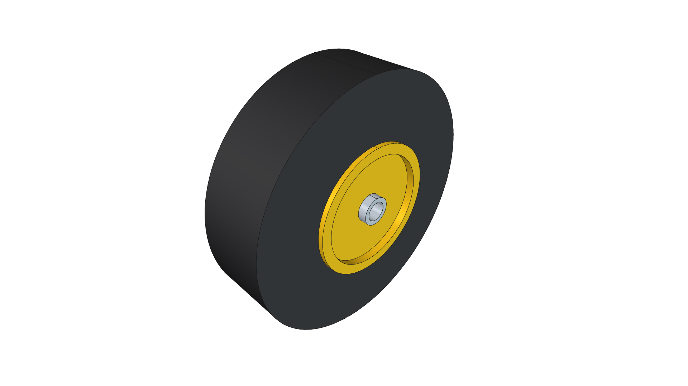
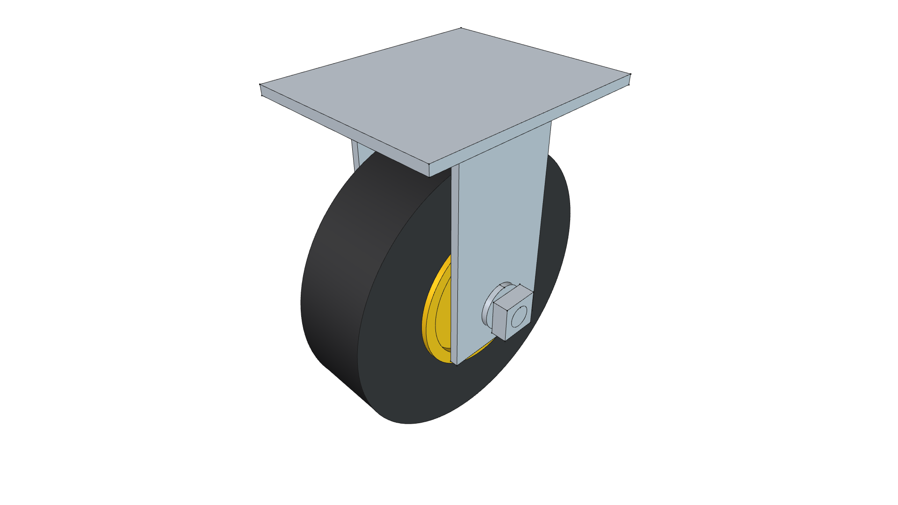
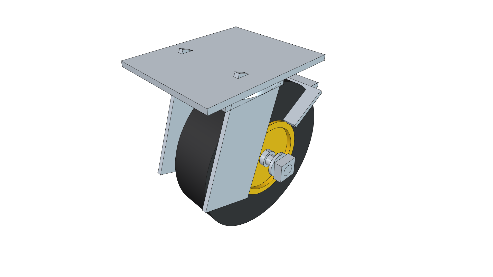
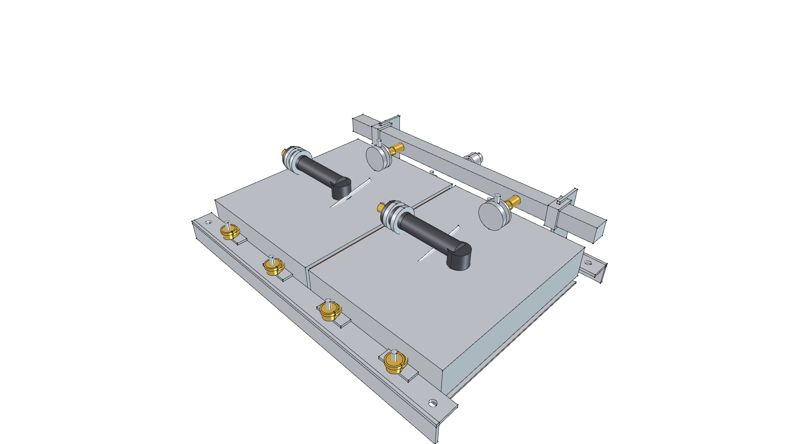

# Component Libraries Index

> **Reusable Commercial Tools, Hardware Modules & Parametric CAD Components**  
> *phi-WORKS Maker Framework (`components/`)*

---

## Overview

The `components/` directory is the central repository for discrete, reusable 3D CAD modules. Instead of embedding complex component geometry directly into project assembly scripts, each commercial tool, gas cylinder, burner engine, or hardware subassembly is built and maintained as an independent, parametric CAD module with its own:
- Dedicated generator script (`build.py` or `<component>.py`)
- Standalone FreeCAD 3D master model (`.FCStd`)
- Perspective home view thumbnail (`<component>.png`)
- 6-view orthogonal projection gallery (`_front.png`, `_back.png`, `_top.png`, `_bottom.png`, `_left.png`, `_right.png`)
- Engineering documentation (`README.md`) detailing insertion origins, mounting interfaces, and technical specs

Host assembly projects under `projects/` import these pre-built components via `import_component(doc, "<component_name>", placement=...)`.

---

## Component Catalog

### 1. [Commercial Hand Truck Chassis](commercial_hand_truck/)

| Component Preview | Technical Specifications & Files |
| :---: | :--- |
|  | • **Description**: Vintage restored tubular steel hand truck chassis with center spine handle & triangular axle trusses. • **Dimensions**: $1.0''\text{ OD}$ tubing, $12.5''$ riser spacing, $46.0''$ overall height, $9.5'' \times 3.0''$ wheels on $5/8''$ continuous axle. • **Role**: Mobile structural chassis for the [Road Roaster 2W](../projects/road-roaster/road-roaster-2w/) radiant weed shock sled. • 📖 [**`README.md`**](commercial_hand_truck/README.md) • 🛠️ [**`build.py`**](commercial_hand_truck/build.py) • 📦 [**`commercial_hand_truck.FCStd`**](commercial_hand_truck/commercial_hand_truck.FCStd) |

### 2. [Commercial 24" × 36" Platform Cart](platform_cart_24x36/)

| Component Preview | Technical Specifications & Files |
| :---: | :--- |
|  | • **Description**: Heavy-duty commercial platform truck (flatbed dolly) with diamond-plate deck, folding handle, and 5" casters. • **Dimensions**: 24" W × 36" L deck footprint, 6.89" deck height, 29" push handle with dual cross rails, 1,000+ lb rating. • **Running Gear**: 2 front rigid casters, 2 rear 360° swivel casters with foot brakes, high-visibility yellow hubs. • **Role**: Rolling chassis foundation for the [Road Roaster 4W](../projects/road-roaster/road-roaster-4w/) platform sled. • 📖 [**`README.md`**](platform_cart_24x36/README.md) • 🛠️ [**`build.py`**](platform_cart_24x36/build.py) • 📦 [**`platform_cart_24x36.FCStd`**](platform_cart_24x36/platform_cart_24x36.FCStd) |

### 3. [Solaronics High-Intensity Ceramic Infrared Burner](solaronics_infrared_burner/)

| Component Preview | Technical Specifications & Files |
| :---: | :--- |
|  | • **Description**: Industrial-grade ceramic infrared radiant heater engine with deep parabolic reflector and Inconel face grid. • **Thermal Specs**: 60,000 BTU/hr @ 11" W.C. LP gas, 1,800°F glowing cordierite ceramic matrix (173 sq. in active area), zero dynamic blast pressure. • **Role**: Primary downward-firing thermal radiant engine for the Road Roaster series. • 📖 [**`README.md`**](solaronics_infrared_burner/README.md) • 🛠️ [**`build.py`**](solaronics_infrared_burner/build.py) • 📦 [**`solaronics_infrared_burner.FCStd`**](solaronics_infrared_burner/solaronics_infrared_burner.FCStd) |

### 4. [Standard DOT 20 lb Propane Cylinder](propane_cylinder_20lb/)

| Component Preview | Technical Specifications & Files |
| :---: | :--- |
|  | • **Description**: Industry-standard DOT 20 lb (5-gallon) LP gas pressure vessel with foot ring, protective collar, OPD brass valve, and 11" W.C. regulator. • **Capacity**: 430,960 BTU total energy (~7.2 continuous hours @ 60k BTU/hr). 12.2" OD × 18.0" height. • **Role**: High-capacity fuel reservoir for [Road Roaster 4W](../projects/road-roaster/road-roaster-4w/). • 📖 [**`README.md`**](propane_cylinder_20lb/README.md) • 🛠️ [**`build.py`**](propane_cylinder_20lb/build.py) • 📦 [**`propane_cylinder_20lb.FCStd`**](propane_cylinder_20lb/propane_cylinder_20lb.FCStd) |

### 5. [1 lb Disposable/Refillable Propane Cylinder](propane_cylinder_1lb/)

| Component Preview | Technical Specifications & Files |
| :---: | :--- |
|  | • **Description**: Standard 16.4 oz / 1 lb LP gas cylinder with threaded 1"-20 UNEF valve connection. • **Dimensions**: 3.875" OD × 7.8" overall height, 3.46" seat collar base. • **Role**: Lightweight, highly portable onboard fuel source for the compact [Road Roaster 2W](../projects/road-roaster/road-roaster-2w/). • 📖 [**`README.md`**](propane_cylinder_1lb/README.md) • 🛠️ [**`build.py`**](propane_cylinder_1lb/build.py) • 📦 [**`propane_cylinder_1lb.FCStd`**](propane_cylinder_1lb/propane_cylinder_1lb.FCStd) |

### 6. [1 lb Propane Bottle Harness](propane_harness/)

| Component Preview | Technical Specifications & Files |
| :---: | :--- |
|  | • **Description**: Bike-cage-style quick-release retention harness for 1 lb propane bottles with bottom seat cup, side arms, and knurled latch. • **Mounting**: Rear saddle clamps for direct attachment to 3/4" square tubing or round frame pipes. • **Role**: Rigid bottle retention cage on [Road Roaster 2W](../projects/road-roaster/road-roaster-2w/). • 📖 [**`README.md`**](propane_harness/README.md) • 🛠️ [**`build.py`**](propane_harness/build.py) • 📦 [**`propane_harness.FCStd`**](propane_harness/propane_harness.FCStd) |

### 7. [Harbor Freight #91037 Propane Torch](torch_hf91037/)

| Component Preview | Technical Specifications & Files |
| :---: | :--- |
|  | • **Description**: Full assembly model of the commercial Harbor Freight #91037 high-output propane torch with brass valve, ergonomic grip, squeeze boost lever, 32" wand, piezo igniter, and 2.375" bell. • **Role**: Standalone reference model and auxiliary spot-weeding wand holstered on [Road Roaster 4W](../projects/road-roaster/road-roaster-4w/). • 📖 [**`README.md`**](torch_hf91037/README.md) • 🛠️ [**`torch_hf91037.py`**](torch_hf91037/torch_hf91037.py) • 📦 [**`torch_hf91037.FCStd`**](torch_hf91037/torch_hf91037.FCStd) |

### 8. [Torch Control Handle Cockpit](torch_control_handle/)

| Component Preview | Technical Specifications & Files |
| :---: | :--- |
|  | • **Description**: Decomposed handle cockpit from the HF #91037 torch: brass needle valve body, fluted knob, dead-man squeeze boost lever, piezo igniter, and 3/4" square tube clamp. • **Role**: Ergonomic operator gas control cockpit mounted to hand truck handle on early Road Roaster revisions. • 📖 [**`README.md`**](torch_control_handle/README.md) • 🛠️ [**`build.py`**](torch_control_handle/build.py) • 📦 [**`torch_control_handle.FCStd`**](torch_control_handle/torch_control_handle.FCStd) |

### 9. [500,000 BTU Torch Burner Head](torch_burner_head/)

| Component Preview | Technical Specifications & Files |
| :---: | :--- |
|  | • **Description**: Decomposed combustion bell head from HF #91037: 2.5" flared combustion bell, venturi air-induction cone, brass hex orifice, ceramic electrode, and 4-bolt mounting flange. • **Role**: Chassis-mounted open-flame burner nozzle on early Road Roaster revisions. • 📖 [**`README.md`**](torch_burner_head/README.md) • 🛠️ [**`build.py`**](torch_burner_head/build.py) • 📦 [**`torch_burner_head.FCStd`**](torch_burner_head/torch_burner_head.FCStd) |

### 10. [4.0" Solid Steel Wheel](steel_caster_wheel/)

| Component Preview | Technical Specifications & Files |
| :---: | :--- |
|  | • **Description**: Heat-resistant machined cast steel wheel with 1/2" Grade 5 axle bolt hardware, machined spacers, and nyloc nut. • **Dimensions**: 4.0" OD × 1.5" tread face width, 1.75" hub width across bearing faces. • **Role**: High-temperature ground contact wheels for thermal agricultural sleds. • 📖 [**`README.md`**](steel_caster_wheel/README.md) • 🛠️ [**`build.py`**](steel_caster_wheel/build.py) • 📦 [**`steel_caster_wheel.FCStd`**](steel_caster_wheel/steel_caster_wheel.FCStd) |

### 11. [5.0" Standard Caster Wheel](caster_wheel_5in/)

| Component Preview | Technical Specifications & Files |
| :---: | :--- |
|  | • **Description**: 5.0" (127 mm) COTS running gear wheel with molded industrial polyurethane core and vulcanized non-marking rubber tire tread. • **Dimensions**: 5.0" OD × 1.25" tread width, 1.50" hub length, 3/8" precision axle bore. • **Role**: Base rolling element for rigid and swivel casters across platform carts and mobile dollies. • 📖 [**`README.md`**](caster_wheel_5in/README.md) • 🛠️ [**`build.py`**](caster_wheel_5in/build.py) • 📦 [**`caster_wheel_5in.FCStd`**](caster_wheel_5in/caster_wheel_5in.FCStd) |

### 12. [5.0" Heavy-Duty Rigid Caster](caster_rigid_5in/)

| Component Preview | Technical Specifications & Files |
| :---: | :--- |
|  | • **Description**: Commercial fixed/rigid caster assembly with cold-formed 10-gauge zinc-plated steel horn and top mounting plate. • **Mounting**: Standard 4.0" × 4.5" mounting top plate with slotted bolt pattern, 6.0" overall mounted height. • **Role**: Directional tracking running gear for [platform_cart_24x36](platform_cart_24x36/) and [Road Roaster 4W](../projects/road-roaster/road-roaster-4w/). • 📖 [**`README.md`**](caster_rigid_5in/README.md) • 🛠️ [**`build.py`**](caster_rigid_5in/build.py) • 📦 [**`caster_rigid_5in.FCStd`**](caster_rigid_5in/caster_rigid_5in.FCStd) |

### 13. [5.0" 360-Degree Swivel Caster with Foot Brake](caster_swivel_5in/)

| Component Preview | Technical Specifications & Files |
| :---: | :--- |
|  | • **Description**: Precision 360° swivel caster with double ball raceway swivel crown, stamped toe brake pedal, and integrated wheel lock. • **Mounting**: 4.0" × 4.5" mounting top plate, 1.35" swivel trail offset, 6.0" overall mounted height. • **Role**: Steering and parking running gear for platform carts and mobile tool kaddies. • 📖 [**`README.md`**](caster_swivel_5in/README.md) • 🛠️ [**`build.py`**](caster_swivel_5in/build.py) • 📦 [**`caster_swivel_5in.FCStd`**](caster_swivel_5in/caster_swivel_5in.FCStd) |

### 14. [STIHL Professional Equipment Ecosystem](stihl/)

| Component Preview | Technical Specifications & Files |
| :---: | :--- |
|  | • **Description**: Complete commercial-grade cordless power and multi-tasking attachment ecosystem. • **Powerhead**: [**`stihl_kma200r`**](stihl/stihl_kma200r/) 36V AP-System cordless KombiEngine with AP 500 S battery (14.16 lbs). • **Modular Drive Shaft**: [**`kombi_shaft`**](stihl/kombi_shaft/) 25.4 mm (1.0") aluminum drive tube (0.72 lbs). • **Attachments ([`stihl/tools/`](stihl/tools/))**: 7 independent parametric CAD attachments: line trimmer (FS-KM), brush cutter (FS-KM), axial blower (BG-KM), articulating scythe (FH-KM), 12" pole pruner (HT-KM), bed redefiner (FBD-KM), and mini-cultivator (BF-KM). • 📖 [**`stihl/README.md`**](stihl/README.md) & [**`stihl/tools/README.md`**](stihl/tools/README.md) |

### 15. [2.5 Gallon Pressurized Water Safety Spray Tank](water_tank/)

| Component Preview | Technical Specifications & Files |
| :---: | :--- |
|  | • **Description**: 2.5-gallon (9.5 L) pressurized water safety tank with blow-molded safety blue HDPE vessel, plunger pump T-handle, brass discharge port, reinforced coiled washdown hose, and trigger spray wand. • **Dimensions**: 7.09" OD × 18.2" overall height, ~2.8 lb empty tare weight (24.6 lbs charged with water). • **Role**: Onboard fire-suppression and pavement-quenching safety system on [Road Roaster 4W](../projects/road-roaster/road-roaster-4w/). • 📖 [**`README.md`**](water_tank/README.md) • 🛠️ [**`build.py`**](water_tank/build.py) • 📦 [**`water_tank.FCStd`**](water_tank/water_tank.FCStd) |

### 16. [Modular Ceramic Infrared Burner Ecosystem](modular_burner/)

| Component Preview | Technical Specifications & Files |
| :---: | :--- |
|  | • **Description**: Scalable, commodity-based ceramic infrared radiant thermal engine suite for custom arrays, replacing proprietary industrial heaters. • **Building Block ([`cassette/`](modular_burner/cassette/))**: Standard 220 × 170 mm cordierite ceramic cassette (10,000 BTU/hr @ 11" W.C. LP, 5.19 lbs, quick-swap M5 slide tabs). • **Connection System ([`interconnect/`](modular_burner/interconnect/))**: Detailed CAD model of dual 1" stainless angle slide rails, captive M5 studs, knurled thumb nuts, ceramic fiber expansion gasket, flame crossover tunnel, 3/4" manifold rail, and #60 brass spuds with 6 mm air gaps (14.45 lbs). • **Road Roaster 2W ([`array_2w/`](modular_burner/array_2w/))**: Dual-cassette 20,000 BTU array with 85 mm low-profile aluminum cowl & skids (15.89 lbs, 46% lighter than Solaronics K-30). • **Road Roaster 4W ([`array_4w/`](modular_burner/array_4w/))**: 4-cassette 2×2 grid (40,000 BTU, 232 sq. in. active radiant area) with continuous 3/4" pivot hinge ears for 180° flip-back stowage on platform cart deck (29.87 lbs). • 📖 [**`modular_burner/README.md`**](modular_burner/README.md) (Includes Abstract Tank-to-Burner Schematic) |

