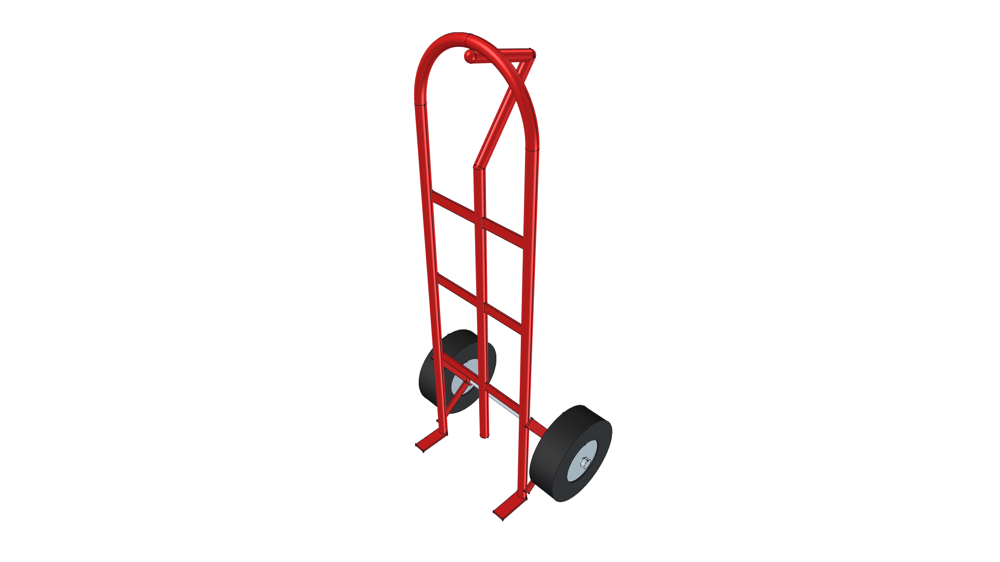
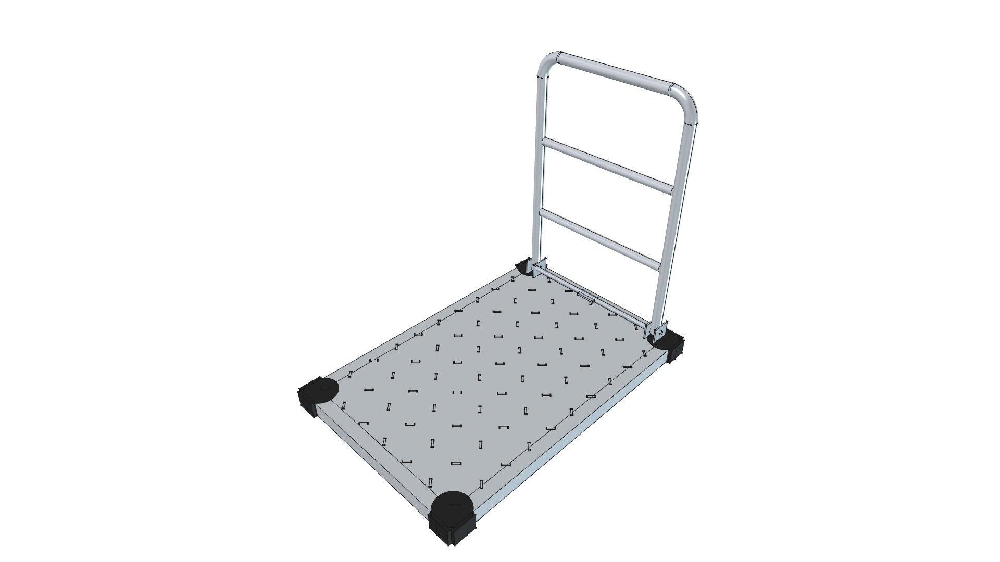
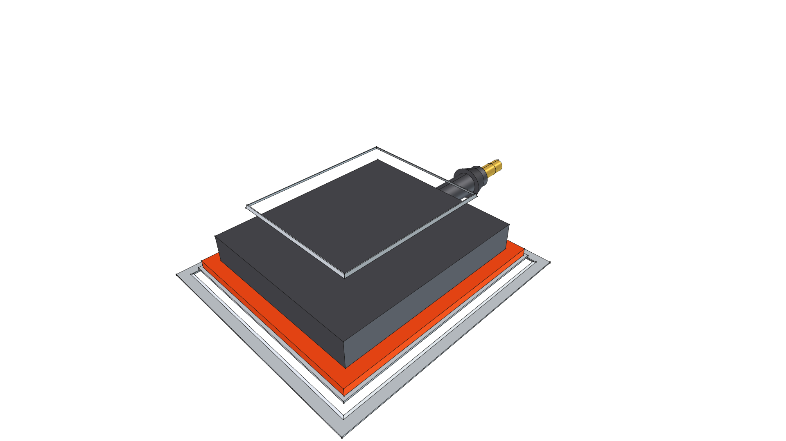
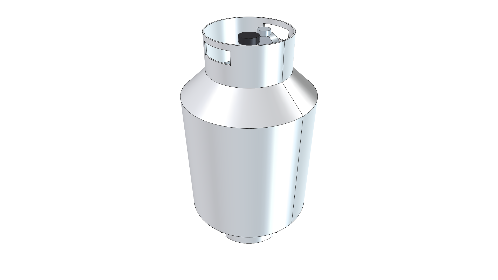
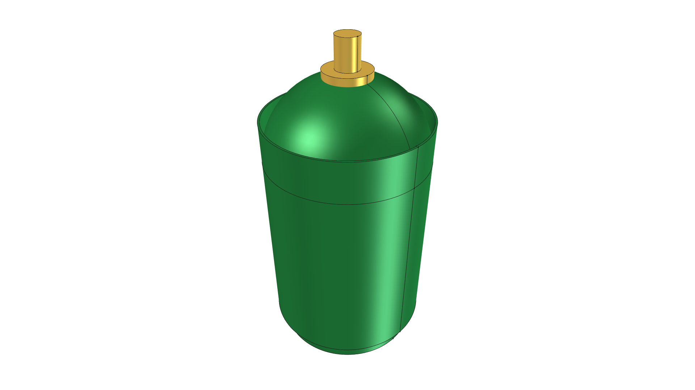
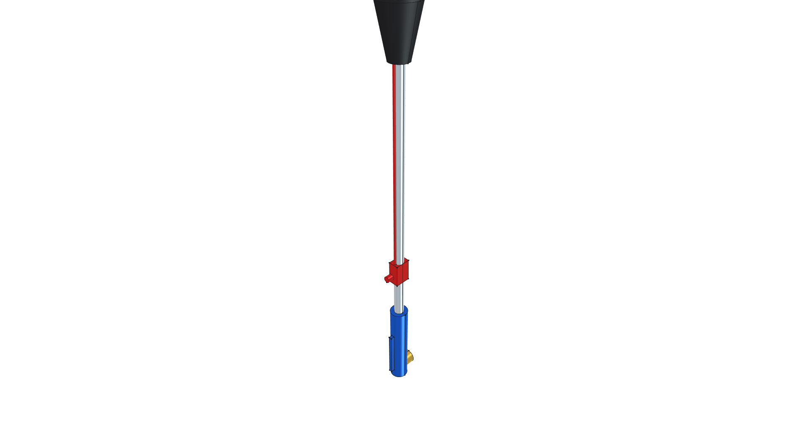
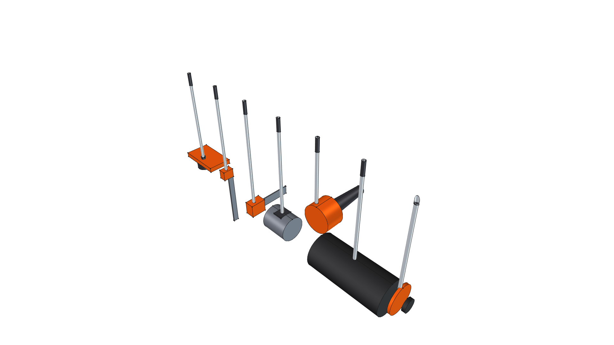
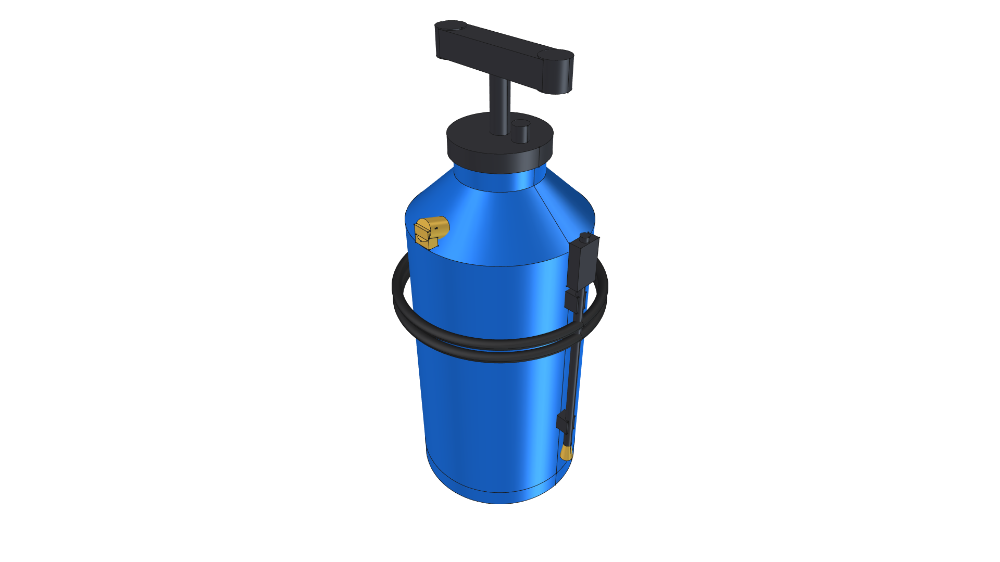

# Component Libraries Index

> **Reusable Commercial Tools, Hardware Modules & Parametric CAD Components**  
> *phi-WORKS Maker Framework (`components/`)*

---

## Overview

The `components/` directory is the central repository for discrete, reusable 3D CAD modules. Instead of embedding complex component geometry directly into project assembly scripts, each commercial tool, gas cylinder, burner engine, or hardware subassembly is built and maintained as an independent, parametric CAD module with its own:
- Dedicated generator script (`build.py` or `<component>.py`)
- Standalone FreeCAD 3D master model (`.FCStd`)
- Perspective home view thumbnail (`<component>.png`)
- 6-view orthogonal projection gallery (`_front.png`, `_back.png`, `_top.png`, `_bottom.png`, `_left.png`, `_right.png`)
- Engineering documentation (`README.md`) detailing insertion origins, mounting interfaces, and technical specs

Host assembly projects under `projects/` import these pre-built components via `import_component(doc, "<component_name>", placement=...)`.

---

## Component Catalog

### 1. [Commercial Hand Truck Chassis](commercial_hand_truck/)

| Component Preview | Technical Specifications & Files |
| :---: | :--- |
|  | • **Description**: Vintage restored tubular steel hand truck chassis with center spine handle & triangular axle trusses. • **Dimensions**: $1.0''\text{ OD}$ tubing, $12.5''$ riser spacing, $46.0''$ overall height, $9.5'' \times 3.0''$ wheels on $5/8''$ continuous axle. • **Role**: Mobile structural chassis for the [Road Roaster](../projects/road-roaster/) 2-wheel radiant weed shock sled. • 📖 [**`README.md`**](commercial_hand_truck/README.md) • 🛠️ [**`build.py`**](commercial_hand_truck/build.py) • 📦 [**`commercial_hand_truck.FCStd`**](commercial_hand_truck/commercial_hand_truck.FCStd) |

### 2. [Commercial 24" × 36" Platform Cart](platform_cart_24x36/)

| Component Preview | Technical Specifications & Files |
| :---: | :--- |
|  | • **Description**: Heavy-duty commercial platform truck (flatbed dolly) with diamond-plate deck, folding handle, and 5" casters. • **Dimensions**: 24" W × 36" L deck footprint, 6.89" deck height, 29" push handle with dual cross rails, 1,000+ lb rating. • **Running Gear**: 2 front rigid casters, 2 rear 360° swivel casters with foot brakes, high-visibility yellow hubs. • **Role**: Rolling chassis foundation for the [Road Roaster 4W](../projects/road-roaster-4w/) platform sled. • 📖 [**`README.md`**](platform_cart_24x36/README.md) • 🛠️ [**`build.py`**](platform_cart_24x36/build.py) • 📦 [**`platform_cart_24x36.FCStd`**](platform_cart_24x36/platform_cart_24x36.FCStd) |

### 3. [Solaronics High-Intensity Ceramic Infrared Burner](solaronics_infrared_burner/)

| Component Preview | Technical Specifications & Files |
| :---: | :--- |
|  | • **Description**: Industrial-grade ceramic infrared radiant heater engine with deep parabolic reflector and Inconel face grid. • **Thermal Specs**: 60,000 BTU/hr @ 11" W.C. LP gas, 1,800°F glowing cordierite ceramic matrix (173 sq. in active area), zero dynamic blast pressure. • **Role**: Primary downward-firing thermal radiant engine for the Road Roaster series. • 📖 [**`README.md`**](solaronics_infrared_burner/README.md) • 🛠️ [**`build.py`**](solaronics_infrared_burner/build.py) • 📦 [**`solaronics_infrared_burner.FCStd`**](solaronics_infrared_burner/solaronics_infrared_burner.FCStd) |

### 4. [Standard DOT 20 lb Propane Cylinder](propane_cylinder_20lb/)

| Component Preview | Technical Specifications & Files |
| :---: | :--- |
|  | • **Description**: Industry-standard DOT 20 lb (5-gallon) LP gas pressure vessel with foot ring, protective collar, OPD brass valve, and 11" W.C. regulator. • **Capacity**: 430,960 BTU total energy (~7.2 continuous hours @ 60k BTU/hr). 12.2" OD × 18.0" height. • **Role**: High-capacity fuel reservoir for [Road Roaster 4W](../projects/road-roaster-4w/). • 📖 [**`README.md`**](propane_cylinder_20lb/README.md) • 🛠️ [**`build.py`**](propane_cylinder_20lb/build.py) • 📦 [**`propane_cylinder_20lb.FCStd`**](propane_cylinder_20lb/propane_cylinder_20lb.FCStd) |

### 5. [1 lb Disposable/Refillable Propane Cylinder](propane_cylinder_1lb/)

| Component Preview | Technical Specifications & Files |
| :---: | :--- |
|  | • **Description**: Standard 16.4 oz / 1 lb LP gas cylinder with threaded 1"-20 UNEF valve connection. • **Dimensions**: 3.875" OD × 7.8" overall height, 3.46" seat collar base. • **Role**: Lightweight, highly portable onboard fuel source for the compact 2-wheel [Road Roaster](../projects/road-roaster/). • 📖 [**`README.md`**](propane_cylinder_1lb/README.md) • 🛠️ [**`build.py`**](propane_cylinder_1lb/build.py) • 📦 [**`propane_cylinder_1lb.FCStd`**](propane_cylinder_1lb/propane_cylinder_1lb.FCStd) |

### 6. [1 lb Propane Bottle Harness](propane_harness/)

| Component Preview | Technical Specifications & Files |
| :---: | :--- |
|  | • **Description**: Bike-cage-style quick-release retention harness for 1 lb propane bottles with bottom seat cup, side arms, and knurled latch. • **Mounting**: Rear saddle clamps for direct attachment to 3/4" square tubing or round frame pipes. • **Role**: Rigid bottle retention cage on [Road Roaster](../projects/road-roaster/). • 📖 [**`README.md`**](propane_harness/README.md) • 🛠️ [**`build.py`**](propane_harness/build.py) • 📦 [**`propane_harness.FCStd`**](propane_harness/propane_harness.FCStd) |

### 7. [Harbor Freight #91037 Propane Torch](torch_hf91037/)

| Component Preview | Technical Specifications & Files |
| :---: | :--- |
|  | • **Description**: Full assembly model of the commercial Harbor Freight #91037 high-output propane torch with brass valve, ergonomic grip, squeeze boost lever, 32" wand, piezo igniter, and 2.375" bell. • **Role**: Standalone reference model and auxiliary spot-weeding wand holstered on [Road Roaster 4W](../projects/road-roaster-4w/). • 📖 [**`README.md`**](torch_hf91037/README.md) • 🛠️ [**`torch_hf91037.py`**](torch_hf91037/torch_hf91037.py) • 📦 [**`torch_hf91037.FCStd`**](torch_hf91037/torch_hf91037.FCStd) |

### 8. [Torch Control Handle Cockpit](torch_control_handle/)

| Component Preview | Technical Specifications & Files |
| :---: | :--- |
|  | • **Description**: Decomposed handle cockpit from the HF #91037 torch: brass needle valve body, fluted knob, dead-man squeeze boost lever, piezo igniter, and 3/4" square tube clamp. • **Role**: Ergonomic operator gas control cockpit mounted to hand truck handle on early Road Roaster revisions. • 📖 [**`README.md`**](torch_control_handle/README.md) • 🛠️ [**`build.py`**](torch_control_handle/build.py) • 📦 [**`torch_control_handle.FCStd`**](torch_control_handle/torch_control_handle.FCStd) |

### 9. [500,000 BTU Torch Burner Head](torch_burner_head/)

| Component Preview | Technical Specifications & Files |
| :---: | :--- |
|  | • **Description**: Decomposed combustion bell head from HF #91037: 2.5" flared combustion bell, venturi air-induction cone, brass hex orifice, ceramic electrode, and 4-bolt mounting flange. • **Role**: Chassis-mounted open-flame burner nozzle on early Road Roaster revisions. • 📖 [**`README.md`**](torch_burner_head/README.md) • 🛠️ [**`build.py`**](torch_burner_head/build.py) • 📦 [**`torch_burner_head.FCStd`**](torch_burner_head/torch_burner_head.FCStd) |

### 10. [4.0" Solid Steel Wheel](steel_caster_wheel/)

| Component Preview | Technical Specifications & Files |
| :---: | :--- |
|  | • **Description**: Heat-resistant machined cast steel wheel with 1/2" Grade 5 axle bolt hardware, machined spacers, and nyloc nut. • **Dimensions**: 4.0" OD × 1.5" tread face width, 1.75" hub width across bearing faces. • **Role**: High-temperature ground contact wheels for thermal agricultural sleds. • 📖 [**`README.md`**](steel_caster_wheel/README.md) • 🛠️ [**`build.py`**](steel_caster_wheel/build.py) • 📦 [**`steel_caster_wheel.FCStd`**](steel_caster_wheel/steel_caster_wheel.FCStd) |

### 11. [STIHL Kombi Tools & Attachments](kombi_tools/)

| Component Preview | Technical Specifications & Files |
| :---: | :--- |
|  | • **Description**: 3D parametric CAD models for STIHL KombiSystem power heads and attachments (straight-shaft line trimmer, curved edger, gearbox elbows, orange debris shields). • **Role**: Clearance verification and storage rack fitting models for the [Kombi Kaddy](../projects/kombi-kaddy/). • 📖 [**`README.md`**](kombi_tools/README.md) • 🛠️ [**`build_trimmer.py`**](kombi_tools/build_trimmer.py) / [**`build_kombi_tools.py`**](kombi_tools/build_kombi_tools.py) • 📦 [**`trimmer.FCStd`**](kombi_tools/trimmer.FCStd) / [**`kombi_tools.FCStd`**](kombi_tools/kombi_tools.FCStd) |

### 12. [2.5 Gallon Pressurized Water Safety Spray Tank](water_tank/)

| Component Preview | Technical Specifications & Files |
| :---: | :--- |
|  | • **Description**: 2.5-gallon (9.5 L) pressurized water safety tank with blow-molded safety blue HDPE vessel, plunger pump T-handle, brass discharge port, reinforced coiled washdown hose, and trigger spray wand. • **Dimensions**: 7.09" OD × 18.2" overall height, ~2.8 lb empty tare weight (24.6 lbs charged with water). • **Role**: Onboard fire-suppression and pavement-quenching safety system on [Road Roaster 4W](../projects/road-roaster-4w/). • 📖 [**`README.md`**](water_tank/README.md) • 🛠️ [**`build.py`**](water_tank/build.py) • 📦 [**`water_tank.FCStd`**](water_tank/water_tank.FCStd) |
