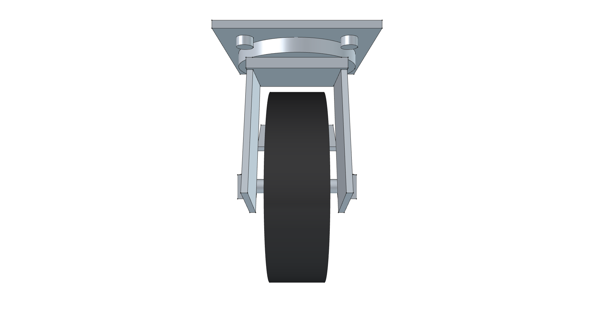
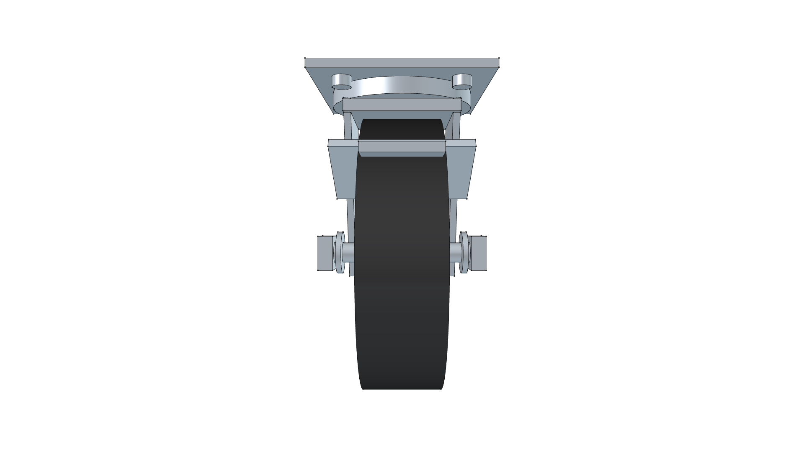
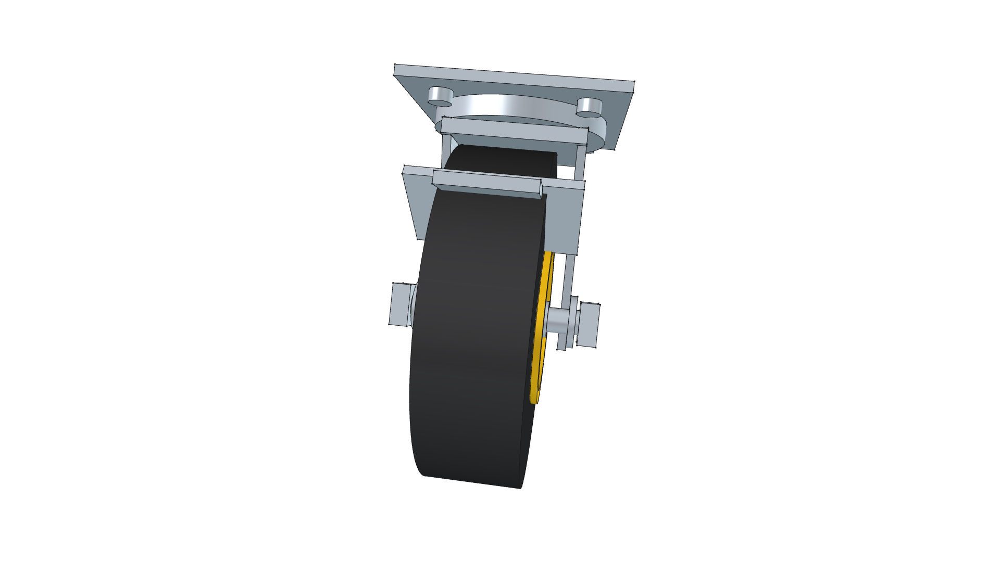
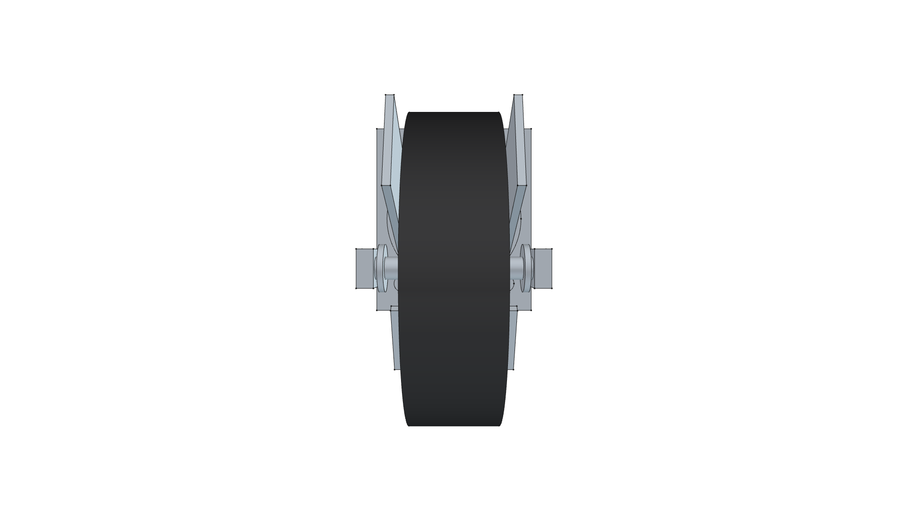
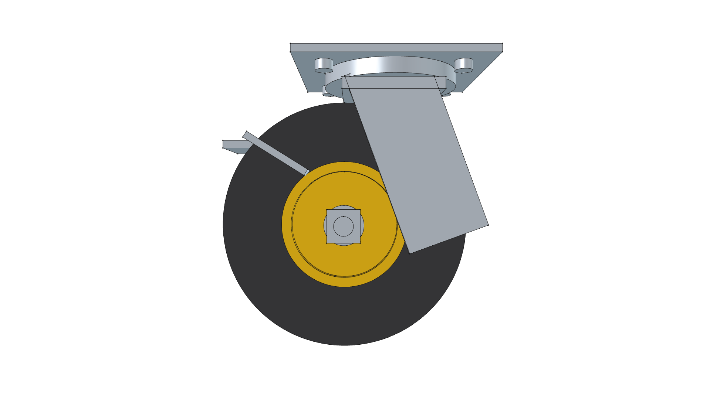
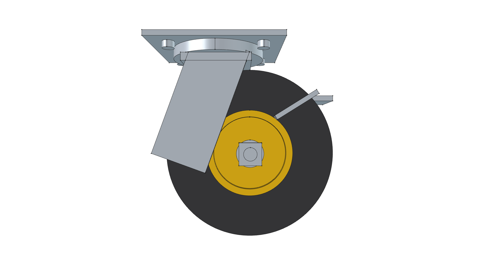

# 5.0" Commercial Swivel Plate Caster with Foot Brake

**Component Type**: Commercial Off-The-Shelf (COTS) Running Gear Subassembly  
**Target Applications**: Commercial Platform Dollies, Mobile Material Carts, Kombi Kaddy

---

## Component Overview

This module provides a standalone 3D CAD model for a heavy-duty industrial **5.0" (127 mm) 360-degree swivel plate caster with foot-locking brake**:
* **Mounting Plate**: Heavy-gauge stamped steel top plate ($85.0\text{ mm} \times 100.0\text{ mm} \times 4.0\text{ mm}$) with 4 Grade 5 mounting fasteners.
* **Swivel Head**: Dual-ball bearing raceway ($\varnothing 72.0\text{ mm}$) allowing full $360^\circ$ continuous swiveling.
* **Trailing Fork Legs**: Formed $3.5\text{ mm}$ stamped steel fork legs with a $25.0\text{ mm}$ trailing offset for smooth rolling stability.
* **Foot Brake Mechanism**: Integrated foot lock lever and serrated cam brake tab (`Steel-ZincPlated`) to simultaneously lock wheel rotation.
* **Running Gear**: Directly consumes the [5.0" Caster Wheel](../caster_wheel_5in/) component (`Rubber-Solid` tread on `Polyurethane` safety yellow hub).

---


---

## Specifications

| Parameter | Metric (mm) | Imperial (in) | Material |
| :--- | :--- | :--- | :--- |
| **Overall Height** | $150.0\text{ mm}$ | $5.91''$ | `Steel-ZincPlated` |
| **Wheel Diameter** | $127.0\text{ mm}$ | $5.00''$ | Composite |
| **Tread Face Width** | $35.0\text{ mm}$ | $1.38''$ | `Rubber-Solid` |
| **Swivel Trail Offset** | $25.0\text{ mm}$ | $0.98''$ | `Steel-ZincPlated` |
| **Top Plate Dimensions** | $85.0 \times 100.0\text{ mm}$ | $3.35 \times 3.94''$ | `Steel-ZincPlated` |
| **Plate Thickness** | $4.0\text{ mm}$ | $0.16''$ | `Steel-ZincPlated` |
| **Axle Bolt Size** | $\varnothing 9.525\text{ mm}$ | $3/8''$ Grade 5 | `Steel-ZincPlated` |
| **Total Weight** | $1.541\text{ kg}$ | $3.40\text{ lbs}$ | Composite |

---

## 3D CAD Multi-View Gallery

| Front Elevation | Rear Elevation | Top Plan |
| :---: | :---: | :---: |
|  |  |  |
| **Bottom Plan** | **Left Side** | **Right Side** |
|  |  |  |

---

## Python Usage

```python
from phi_works.maker.components import import_component
# Import swivel caster into any assembly
caster = import_component(doc, "caster_swivel_5in", placement=placement)
```
