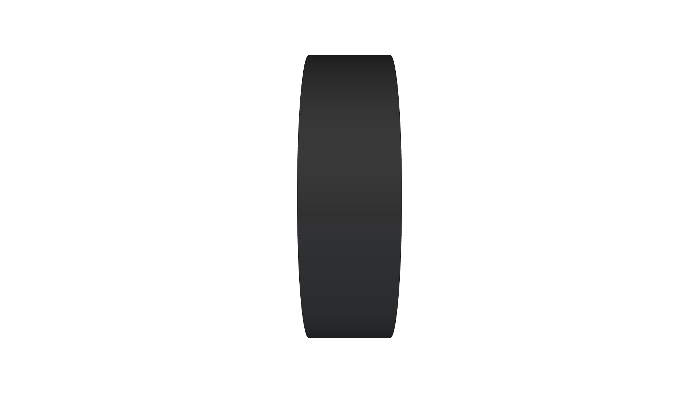
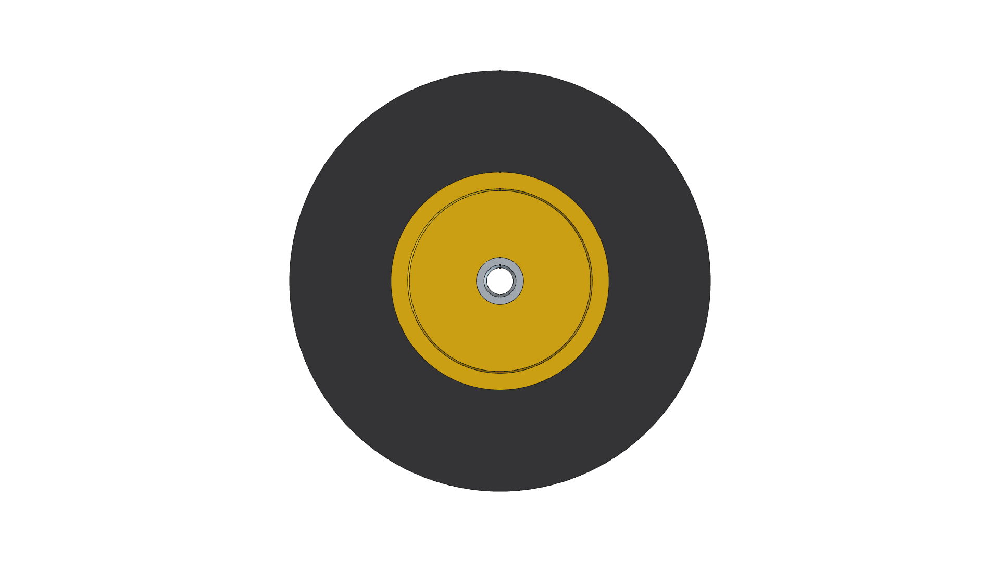
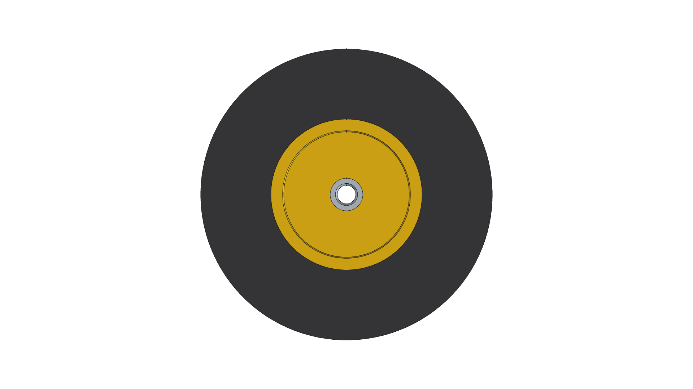

# 5.0" Commercial Caster Wheel Component

**Component Type**: Commercial Off-The-Shelf (COTS) Running Gear  
**Target Applications**: Commercial Platform Dollies, Workshop Carts, Kombi Kaddy

---

## Component Overview

This module provides a standalone 3D CAD model for an industrial **5.0" (127 mm) caster wheel**:
* **Hub Core**: Molded high-visibility safety yellow `Polyurethane` with structural web recesses.
* **Tread Face**: Solid non-marking molded industrial `Rubber-Solid` with radiused shoulders.
* **Bushing Sleeve**: Zinc-plated steel center bearing sleeve (`Steel-ZincPlated`) sized for standard $3/8''$ ($9.525\text{ mm}$) through-axle bolts.

---


---

## Specifications

| Parameter | Metric (mm) | Imperial (in) | Material |
| :--- | :--- | :--- | :--- |
| **Outer Diameter** | $127.0\text{ mm}$ | $5.0''$ | `Rubber-Solid` |
| **Tread Width** | $35.0\text{ mm}$ | $1.38''$ | `Rubber-Solid` |
| **Hub Diameter** | $65.0\text{ mm}$ | $2.56''$ | `Polyurethane` |
| **Hub Width (Bearing Faces)** | $40.0\text{ mm}$ | $1.57''$ | `Polyurethane` |
| **Axle Bore Diameter** | $9.525\text{ mm}$ | $3/8''$ | `Steel-ZincPlated` |
| **Total Weight** | $0.534\text{ kg}$ | $1.18\text{ lbs}$ | Composite |

---

## 3D CAD Multi-View Gallery

| Front Elevation | Rear Elevation | Top Plan |
| :---: | :---: | :---: |
|  |  |  |
| **Bottom Plan** | **Left Side** | **Right Side** |
|  |  |  |

---

## Python Usage

```python
from phi_works.maker.components import import_component
# Import wheel into any assembly
wheel = import_component(doc, "caster_wheel_5in", placement=placement)
```
