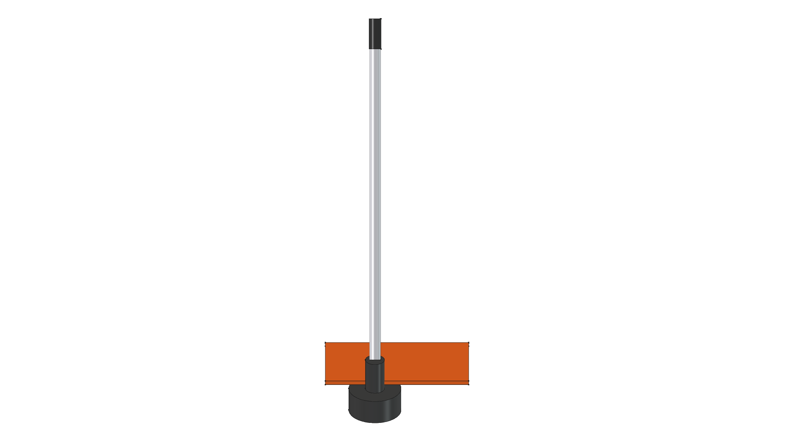
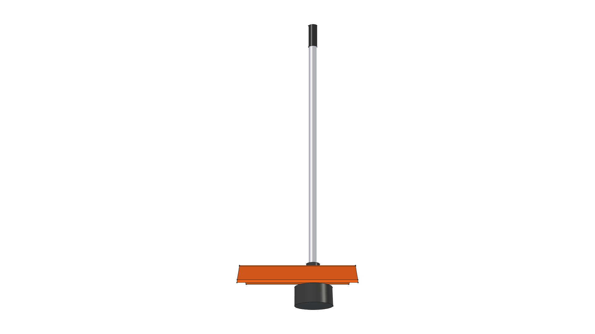
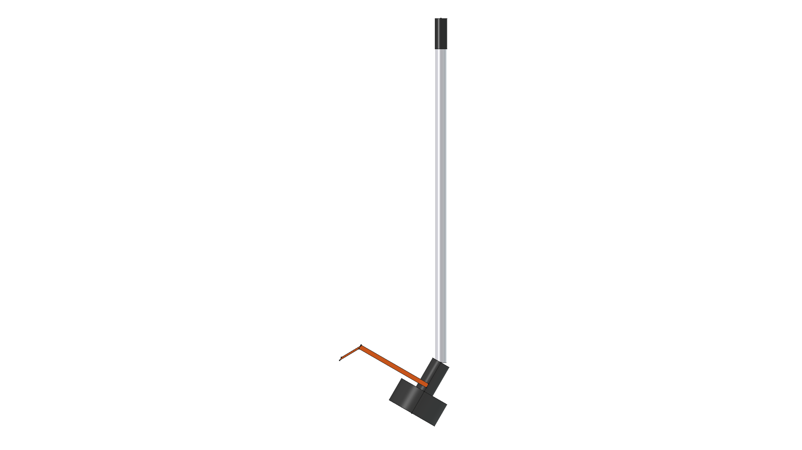

# STIHL Kombi Tool Attachments Component Library

**Component Directory**: `components/kombi_tools/`  
**Equipment Ecosystem**: STIHL KombiSystem Multi-Tasking Outdoor Power Equipment  

---

## Library Overview

This component library provides 3D parametric CAD models for **STIHL KombiSystem power heads and attachments** (line trimmers, hedge trimmers, pole pruners, lawn edgers). Modeled as reusable 3D modules in `components/`, they serve as accurate building blocks for designing storage solutions like the [Kombi Kaddy](../../projects/kombi-kaddy/).

---

## 3D CAD Multi-View Projection Gallery (Straight Shaft Trimmer)

| Isometric (Home View) | Top Plan View |
| :---: | :---: |
|  |  |
| **Front Elevation** | **Rear Elevation** |
|  |  |
| **Right Side Elevation** | **Left Side Elevation** |
|  |  |
| **Bottom Plan View** | |
|  | |

---

## Model Specifications & Insertion Origins

1. **Straight Shaft Line Trimmer (`trimmer.FCStd`)**:
   - **Shaft Diameter**: 25.4 mm ($1.0''$) aluminum drive tube.
   - **Overall Length**: 950 mm ($37.4''$) from coupler sleeve to bump head.
   - **Angled Gearbox**: 35-degree downward tilt at gearbox elbow.
   - **Debris Shield**: STIHL Orange curved shield ($7.5''$ width).
   - **Insertion Origin $(0,0,0)$**: Centered at the top end of the aluminum drive coupler shaft.

2. **Kombi Attachment Assembly Suite (`kombi_tools.FCStd`)**:
   - Multi-tool CAD assembly combining straight shaft trimmer, curved edger, and gearhead modules for clearance checking.

---

## Component Files Index

- 🛠️ [**`build_trimmer.py`**](build_trimmer.py): Standalone FreeCAD script for the STIHL Line Trimmer attachment.
- 🛠️ [**`build_kombi_tools.py`**](build_kombi_tools.py): Multi-tool assembly build script.
- 📦 [**`trimmer.FCStd`**](trimmer.FCStd): FreeCAD Line Trimmer 3D Model file.
- 📦 [**`kombi_tools.FCStd`**](kombi_tools.FCStd): FreeCAD Multi-Tool Suite 3D Model file.

---

## FreeCAD Execution Commands

```bash
# Build Standalone Line Trimmer Component & 7-View Gallery
/home/phi/AppImages/FreeCAD_1.1.3-Linux-x86_64-py311.AppImage -c "__file__='/home/phi/PROJECTS/phi-WORKS/maker/components/kombi_tools/build_trimmer.py'; exec(open(__file__).read())"

# Build Multi-Tool Kombi Suite Assembly
/home/phi/AppImages/FreeCAD_1.1.3-Linux-x86_64-py311.AppImage -c "__file__='/home/phi/PROJECTS/phi-WORKS/maker/components/kombi_tools/build_kombi_tools.py'; exec(open(__file__).read())"
```
