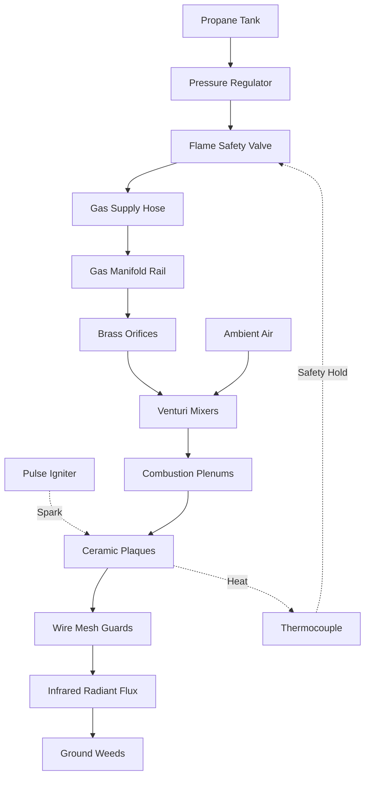

# Modular Ceramic Infrared Burner Ecosystem (`modular_burner`)

> **Scalable, Commodity-Based Radiant Thermal Engine Library**  
> *phi-WORKS Maker Component Library (`components/modular_burner/`)*

---

## Overview

The `modular_burner/` component suite provides a standardized, scalable alternative to bulky, expensive commercial radiant heaters (such as the Solaronics K-30). By standardizing on mass-market **220 × 170 mm cordierite ceramic plaque cassettes** (10,000 BTU/hr each), physical projects can scale thermal power and radiant footprint modularly:
- **`cassette/`**: Autonomous 10,000 BTU ($2.93\text{ kW}$) ceramic infrared plaque cassette ($5.19\text{ lbs}$).
- **`interconnect/`**: Full mechanical, pneumatic, flame bridging, and electrical connection system ($14.45\text{ lbs}$).
- **`array_2w/`**: Dual-cassette 20,000 BTU ($5.86\text{ kW}$) low-profile array for Road Roaster 2W ($15.89\text{ lbs}$).
- **`array_4w/`**: 4-cassette 40,000 BTU ($11.72\text{ kW}$) $2 \times 2$ grid array with 180° flip-back transit hinge ears for Road Roaster 4W ($29.87\text{ lbs}$).

---

## Abstract Schematic: From Tank to Burner

Below is the complete architectural schematic and Mermaid power-system diagram mapping the pneumatic gas train, electrical ignition circuit, and thermoelectric safety loop from the liquid propane fuel tank down to the radiant ground Broiler face:

### Burner Power System Flowchart



---

### End-to-End Architectural System Diagram

```
====================================================================================================
                        MODULAR CERAMIC INFRARED BURNER SYSTEM SCHEMATIC
====================================================================================================

 [ PROPANE RESERVOIR ]
   ├── 20 lb DOT LP Cylinder (Road Roaster 4W)   [Liquid Propane @ 100 - 180 PSI]
   └── 1 lb Coleman Cylinder (Road Roaster 2W)
            │
            ▼ [Tank Service Valve / OPD / QCC-1 Acme Thread]
 ┌──────────────────────────────────────────────────────────────────┐
 │ 1. PRIMARY PRESSURE REGULATOR                                    │
 │    • Drops raw tank pressure (100-180 PSI) to 11.0" W.C. (0.4 PSI)│
 │    • Integrated excess-flow automatic surge check valve          │
 └──────────────────┬───────────────────────────────────────────────┘
                    │ 11" W.C. LP Gas @ 0.4 PSI
                    ▼
 ┌──────────────────────────────────────────────────────────────────┐
 │ 2. COCKPIT SAFETY & FLOW CONTROLS (Operator Handle Console)      │
 │    ├── Push-to-Turn Flame Safety Valve (Electromagnetic Solenoid)│
 │    └── Momentary Push-Button (1.5V AA Multi-Port Pulse Sparker)  │
 └─────────┬───────────────────────────────┬────────────────────────┘
           │                               │ 1.5V DC Trigger
           │ Gas Flow (Held Open by 25mV)  ▼
           │                     ┌──────────────────────────────────┐
           │                     │ 3. MULTI-PORT PULSE IGNITER      │
           │                     │    • 1.5V AA Battery Spark Box   │
           │                     │    • 12 kV Pulse Output (4 Hz)   │
           │                     └───────┬──────────────────┬───────┘
           │                             │ High-Voltage     │ High-Voltage
           │                             │ Lead #1          │ Lead #2
           │                             ▼                  ▼
           │                     [Silicone Boot 1]  [Silicone Boot 2]
           │                             │                  │
           │                             ▼                  ▼
           │                     [Spark Probe 1]    [Spark Probe 2]
           │                             │ (3-4mm Gap)      │
           │                             ▼                  ▼
           │                     ┌───────────────┐  ┌───────────────┐
           │                     │ SPARK ARCS    │  │ SPARK ARCS    │
           │                     └───────┬───────┘  └───────┬───────┘
           ▼                             │                  │
 ┌───────────────────────────────────────┼──────────────────┼───────┐
 │ 4. SAFETY INTERLOCK CIRCUIT           │                  │       │
 │    • Mechanical Ball Tilt Switch      │                  │       │
 │      (Drops loop if tilted > 45°)     │                  │       │
 │    • Copper Capillary Closed Loop ◄───┼──────────────────┤       │
 └─────────┬─────────────────────────────┼──────────────────┼───────┘
           │ 25 - 30 mV DC Millivolt Loop│                  │
           │                             │                  │
           ▼                             │                  │
 ┌──────────────────────────────────┐    │                  │
 │ 5. FLEXIBLE REINFORCED SUPPLY    │    │                  │
 │    • 3/8" SAE 45° Flare Swivel   │    │                  │
 │    • 350 PSI High-Temp LP Hose   │    │                  │
 └─────────────────┬────────────────┘    │                  │
                   │                     │                  │
                   ▼                     │                  │
 ┌──────────────────────────────────────────────────────────┴───────┐
 │ 6. GAS DISTRIBUTION MANIFOLD RAIL                                │
 │    • 3/4" Square 6061-T6 Aluminum Extrusion                      │
 │    • Rigid Standoff Brackets Bolted to Chassis Angle Tray        │
 └─────────┬───────────────────────────────┬────────────────────────┘
           │                               │
       [1/8" NPT Port]                 [1/8" NPT Port]
           │                               │
           ▼                               ▼
 ┌───────────────────┐           ┌───────────────────┐
 │ Brass Hex Orifice │           │ Brass Hex Orifice │
 │ Spud (#60 Drill)  │           │ Spud (#60 Drill)  │
 └─────────┬─────────┘           └─────────┬─────────┘
           │ 10,000 BTU/hr Gas Jet         │ 10,000 BTU/hr Gas Jet
           ▼                               ▼
     (6mm Air Gap)                   (6mm Air Gap)
  ◄── Primary Air Induction ──►   ◄── Primary Air Induction ──►
 ┌───────────────────┐           ┌───────────────────┐
 │ Venturi Bellmouth │           │ Venturi Bellmouth │
 │ & Air Shutter     │           │ & Air Shutter     │
 ├───────────────────┤           ├───────────────────┤
 │ Atmospheric Pre-  │           │ Atmospheric Pre-  │
 │ Mix Venturi Tube  │           │ Mix Venturi Tube  │
 └─────────┬─────────┘           └─────────┬─────────┘
           │ 24:1 Air/Fuel Mixture         │ 24:1 Air/Fuel Mixture
           ▼                               ▼
 ┌───────────────────┐           ┌───────────────────┐
 │ Combustion Plenum │           │ Combustion Plenum │
 │ (Deep-Drawn 304SS)│           │ (Deep-Drawn 304SS)│
 └─────────┬─────────┘           └─────────┬─────────┘
           │ Diffused Vapor                │ Diffused Vapor
           ▼                               ▼
 ┌───────────────────┐           ┌───────────────────┐
 │ Cordierite Ceramic│           │ Cordierite Ceramic│
 │ Plaque (Micro-Pore│           │ Plaque (Micro-Pore│
 │ Surface Combust.) │           │ Surface Combust.) │
 ├───────────────────┤           ├───────────────────┤
 │ 304 SS Wire Mesh  │           │ 304 SS Wire Mesh  │
 └─────────┬─────────┘           └─────────┬─────────┘
           │ 1,600°F - 1,800°F             │ 1,600°F - 1,800°F
           │                               │
           ├──► [Thermocouple Probe] ──────┤
           │    (Generates 25-30 mV DC     │
           │     to Hold Valve Open)       │
           │                               │
           └──► [Flame Crossover Tunnel] ──┘
                (Transfers Flame Front
                 Across Plaques in < 0.25s)
           │                               │
           ▼                               ▼
 ====================================================================
      DOWNWARD RADIANT INFRARED FLUX (3 - 5 µm Wavelength Beam)
 ====================================================================
                               │
                               ▼
        [ TARGET: WEED CANOPY & GRAVEL (Cellular Lysis) ]
```

---

## Component-by-Component Interface Specification

| Stage | Subsystem Component | Input Interface | Output Interface | Operating Parameters |
| :---: | :--- | :--- | :--- | :--- |
| **1** | **Propane Reservoir** | Fuel Fill / Cylinder Seat | CGA 510 / QCC-1 Acme Valve | $100 - 180\text{ PSI}$ saturated vapor |
| **2** | **Pressure Regulator** | Tank Acme Fitting | $3/8''\text{ Male Flare}$ | Steps pressure down to **$11.0''\text{ W.C.}$ ($0.4\text{ PSI}$)** |
| **3** | **Thermoelectric Valve**| $3/8''\text{ Female Flare}$ | $3/8''\text{ Male Flare}$ | Millivolt solenoid ($25\text{ mV}$ hold threshold, $<20\text{s}$ drop) |
| **4** | **Tilt / Dump Switch** | Thermocouple Terminal 1 | Thermocouple Terminal 2 | Mechanical rolling ball; opens circuit if tilt $> 45^\circ$ |
| **5** | **Supply Hose** | Valve Flare Fitting | Manifold Inlet Flare | $3/8''\text{ ID}$ stainless-braided / reinforced LP hose |
| **6** | **Manifold Rail** | Central $3/8''\text{ Flare}$ | Spaced $1/8''\text{ NPT}$ Ports | $3/4''$ square 6061-T6 aluminum extrusion |
| **7** | **Orifice Spud** | $1/8''\text{ NPT}$ Male Thread | Chamfered Jet Tip | **#60 Drill ($0.040''$ / $1.016\text{ mm}$)** meters $10\text{k BTU/hr}$ |
| **8** | **Air Induction Gap** | Orifice Jet Stream | Venturi Bellmouth Horn | Calibrated **$6.0\text{ mm}$ gap** draws $50\%-60\%$ primary air |
| **9** | **Venturi Tube** | Bellmouth Intake | Plenum Flange Elbow | Cast iron mixing tube; ensures stoichiometric $24:1$ ratio |
| **10**| **Combustion Plenum** | Venturi Throat Elbow | Ceramic Gasket Seat | Deep-drawn 304 SS box with pan diffuser plate |
| **11**| **Ceramic Plaque** | Plenum Gas Vapor | Micro-Pore Face | Cordierite matrix; flameless surface glow @ $1,700^\circ\text{F}$ |
| **12**| **Wire Mesh Screen** | Tile Perimeter Crimp | Radiant Egress | 304 SS $1.2\text{ mm}$ wire mesh; protects from stone strike |
| **13**| **Crossover Bridge** | Burner 1 Flame Edge | Burner 2 Flame Edge | Formed 304 SS perforated tunnel; instant flame propagation |
| **14**| **Thermocouple** | Radiant Heat of Burner 1 | Safety Valve Solenoid | Copper junction; generates **$25 - 30\text{ mV DC}$** @ $600^\circ\text{C}$ |

---

## Component Directory Index

```
components/modular_burner/
├── README.md               <-- Master index and abstract system schematic (this document)
├── cassette/               <-- Standalone 10,000 BTU modular ceramic cassette
│   ├── modular_ceramic_burner.py
│   ├── build.py
│   ├── modular_ceramic_burner.FCStd
│   └── README.md
├── interconnect/           <-- Dual-cassette connection system (rails, studs, manifold, bridge)
│   ├── modular_burner_interconnect.py
│   ├── build.py
│   ├── modular_burner_interconnect.FCStd
│   └── README.md
├── array_2w/               <-- 20,000 BTU dual-cassette array for Road Roaster 2W
│   ├── modular_burner_array_2w.py
│   ├── build.py
│   ├── modular_burner_array_2w.FCStd
│   └── README.md
└── array_4w/               <-- 40,000 BTU 2x2 grid array with 180° hinge for Road Roaster 4W
    ├── modular_burner_array_4w.py
    ├── build.py
    ├── modular_burner_array_4w.FCStd
    └── README.md
```

### 1. [Burner Cassette (`cassette/`)](cassette/)
The standalone mass-market $220 \times 170\text{ mm}$ building block.
- Power: 10,000 BTU/hr (2.93 kW) @ 11" W.C. LP
- Mass: $5.19\text{ lbs}$ ($2.355\text{ kg}$)
- Quick-swap slotted tabs for M5 studs

### 2. [Interconnect System (`interconnect/`)](interconnect/)
Detailed 3D model of two adjacent cassettes mounted on dual 1" stainless angle slide rails with knurled brass thumb nuts, ceramic expansion gasket, perforated flame crossover arch, and $3/4''$ manifold rail with #60 brass spuds and 6mm air gaps.
- Mass: $14.45\text{ lbs}$ ($6.555\text{ kg}$)

### 3. [Road Roaster 2W Array (`array_2w/`)](array_2w/)
Dual-cassette array ($20,000\text{ BTU/hr}$) tailored for the 15" × 18" vintage hand truck sled.
- Mass: **$15.89\text{ lbs}$** (46% lighter than Solaronics K-30)

### 4. [Road Roaster 4W Array (`array_4w/`)](array_4w/)
4-cassette ($2 \times 2$ grid) array ($40,000\text{ BTU/hr}$) delivering $232\text{ sq. in.}$ radiant coverage (+34% vs Solaronics) with continuous $\varnothing 3/4''$ pivot hinge ears for 180° flip-back transit stowage onto the cart deck.
- Mass: **$29.87\text{ lbs}$**
