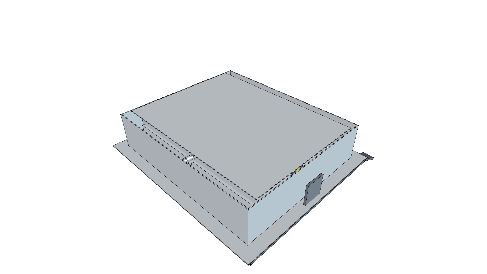
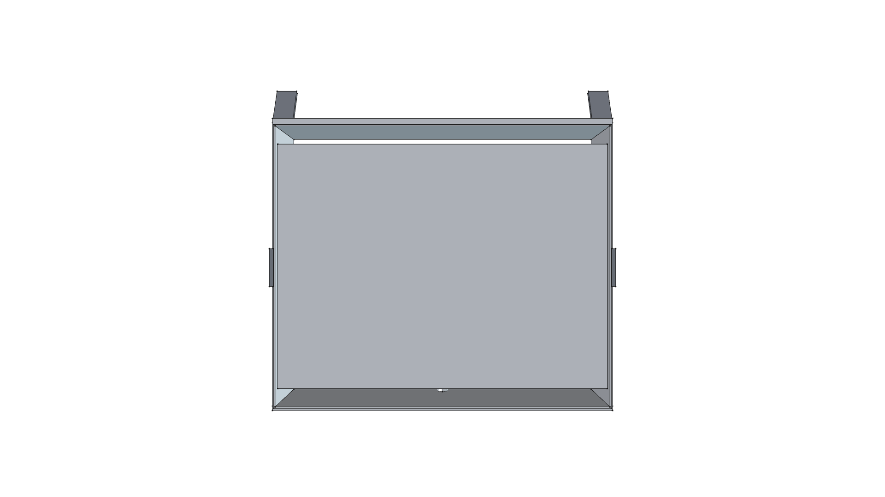
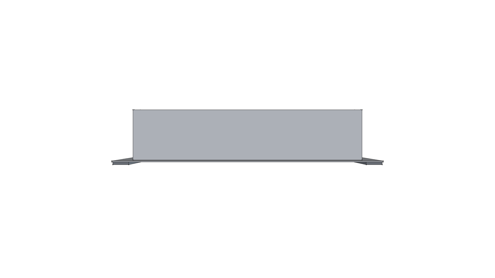
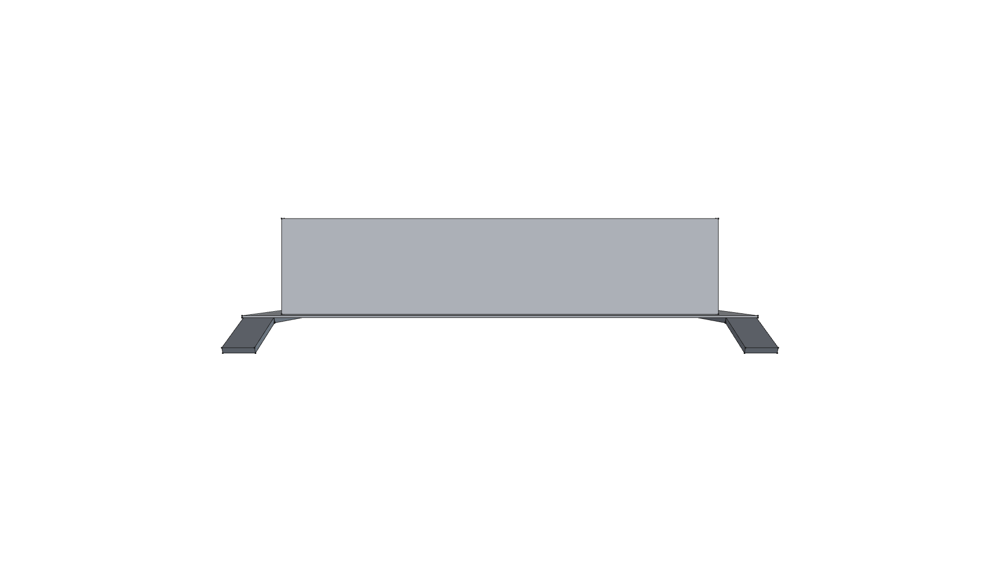
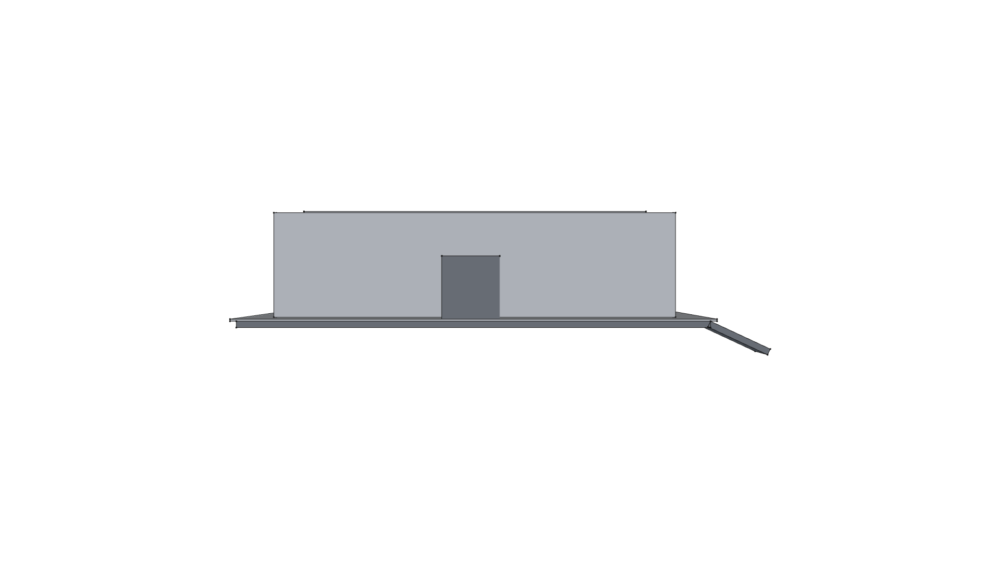
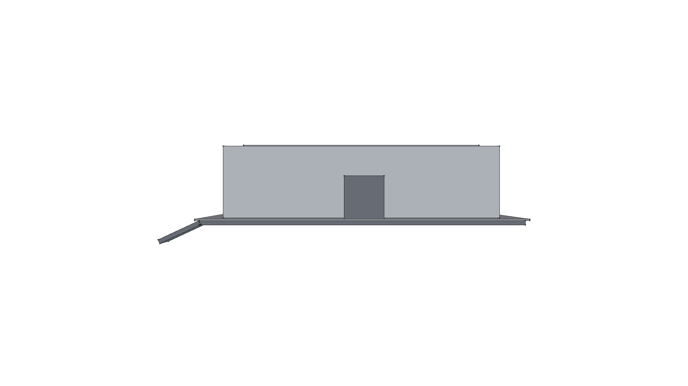
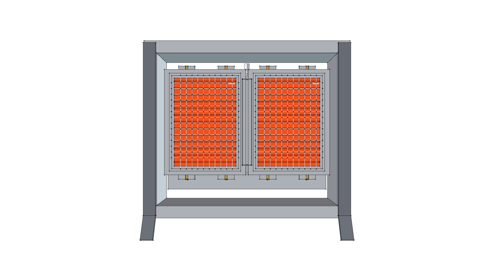

# Road Roaster 2W Modular Burner Array (20,000 BTU)

> **Standalone 3D CAD Component Module**  
> *phi-WORKS Maker Component Library (`components/modular_burner_array_2w/`)*

---



---

## Visual Projection Gallery

| Home (Perspective) View | Top (Manifold & Roof) View |
| :---: | :---: |
|  |  |
| **Front Elevation** | **Rear Elevation (Gas Manifold Rail)** |
|  |  |
| **Right Side Elevation (Skid Profile)** | **Left Side Elevation** |
|  |  |
| **Bottom (Dual Radiant Matrix) View** | |
|  | |

---

## 1. Overview & Architecture

This assembly integrates **two (2) standalone modular ceramic burner cassettes** into a unified, low-profile radiant array engineered specifically to fit the **Road Roaster 2W** vintage hand truck chassis.

Key Engineering Features:
- **Thermal Power**: **$20,000\text{ BTU/hr}$ ($5.86\text{ kW}$)** at standard $11''\text{ W.C.}$ LP gas pressure.
- **Active Radiant Area**: $355\text{ mm} \times 230\text{ mm}$ ($13.98'' \times 9.06''$), yielding **$116.6\text{ sq. in.}$** of incandescent cordierite surface.
- **Gas Manifold Rail**: $3/4''$ square aluminum extrusion with central $3/8''$ male flare gas supply port feeding dual #60 brass orifice spuds.
- **Stainless Flame Crossover Channel**: Spans the gap between plaques for instantaneous cross-lighting in $<0.25\text{ seconds}$.
- **Ultra Low-Profile Reflector Cowl**: Fabricated from 16-gauge 5052-H32 aluminum with a depth of only **$85\text{ mm}$ ($3.35\text{ in}$)** (saving $137\text{ mm}$ of vertical height compared to the $222\text{ mm}$ Solaronics unit).
- **Ground Skids**: High-strength flat bar skids with 30° ski tips and upright suspension bracket ears that bolt directly to the 2W chassis A-frame trailing arms.
- **Massive Weight Reduction**: Weighs only **$15.89\text{ lbs}$ ($7.21\text{ kg}$)**—slashing front cantilevered weight by **$13.76\text{ lbs}$ (46% lighter)** compared to the commercial Solaronics K-30.

---

## 2. Technical Specifications

| Parameter | Metric | Imperial | Engineering Notes |
| :--- | :--- | :--- | :--- |
| **Burner Architecture** | Dual Modular Cassettes ($1 \times 2$) | Two HD220 10,000 BTU plaques |
| **Overall Cowl Width ($X$)** | $380.0\text{ mm}$ | $14.96\text{ in}$ | Fits within 15" hand truck frame |
| **Overall Cowl Length ($Y$)**| $320.0\text{ mm}$ | $12.60\text{ in}$ | Fits within 18" sled envelope |
| **Cowl Profile Depth ($Z$)** | $85.0\text{ mm}$ | $3.35\text{ in}$ | Ultra-compact low profile |
| **Gross Thermal Input** | $5.86\text{ kW}$ | **$20,000\text{ BTU/hr}$** | Continuous low-pressure LP |
| **Operating Pressure** | $2.74\text{ kPa}$ | $11.0''\text{ W.C.}$ | Standard outdoor LP regulator |
| **Gas Consumption Rate** | $0.42\text{ kg/hr}$ | $0.93\text{ lbs/hr}$ | ~1.1 hours on 1 lb LP bottle |
| **Total Assembly Weight** | **$7.21\text{ kg}$** | **$15.89\text{ lbs}$** | **46% lighter than Solaronics K-30** |

---

## 3. Physical Mass Properties

Computed via FreeCAD using repository material definitions (`phi_works.maker.materials`):

```
================================================================================
 ROAD ROASTER 2W MODULAR BURNER ARRAY MASS REPORT
================================================================================
 TOTAL MASS / WEIGHT:     15.89 lbs  (7.210 kg)
 TOTAL SOLID VOLUME:      111.32 in³ (1.824 L)
 CENTER OF MASS (CoG):
   - Metric (mm):         X = +3.45 mm, Y = +1.71 mm, Z = +29.07 mm
   - Imperial (inches):   X = +0.14 in, Y = +0.07 in, Z = +1.14 in
--------------------------------------------------------------------------------
 MATERIAL SUMMARY BREAKDOWN:
 Material                   Parts   Mass (lbs)   Mass (kg)    % Mass  
 -------------------------- ------- ------------ ------------ --------
 Steel-304Stainless         5       5.64         2.558          35.5%
 Ceramic-Cordierite         2       3.38         1.533          21.3%
 Aluminum-6061-T6           4       3.35         1.518          21.1%
 Steel-A36                  1       2.08         0.944          13.1%
 CastIron-Gray              2       1.15         0.520           7.2%
 Brass-C360                 4       0.24         0.111           1.5%
 Ceramic-Alumina            3       0.06         0.026           0.4%
================================================================================
```

---

## 4. Python API Usage

To instantiate the 2W modular array inside the Road Roaster 2W assembly:

```python
import FreeCAD
from phi_works.maker.components import import_component

doc = FreeCAD.newDocument("RoadRoaster2W")

# Method A: Import pre-built .FCStd model
array_2w = import_component(
    doc,
    "modular_burner_array_2w",
    placement=FreeCAD.Placement(FreeCAD.Vector(0, 0, 50), FreeCAD.Rotation(0, 0, 0, 1))
)

# Method B: Direct Python API instantiation
from modular_burner_array_2w import create_modular_burner_array_2w_component

array_part = create_modular_burner_array_2w_component(
    doc,
    name="Radiant_Array_2W",
    placement=FreeCAD.Placement(FreeCAD.Vector(0, 0, 50), FreeCAD.Rotation(0, 0, 0, 1))
)
```

---

## 5. Build & Verification

To re-build the CAD model and update all orthogonal PNG renders:

```bash
./scripts/run_freecad.sh components/modular_burner_array_2w/build.py
```
