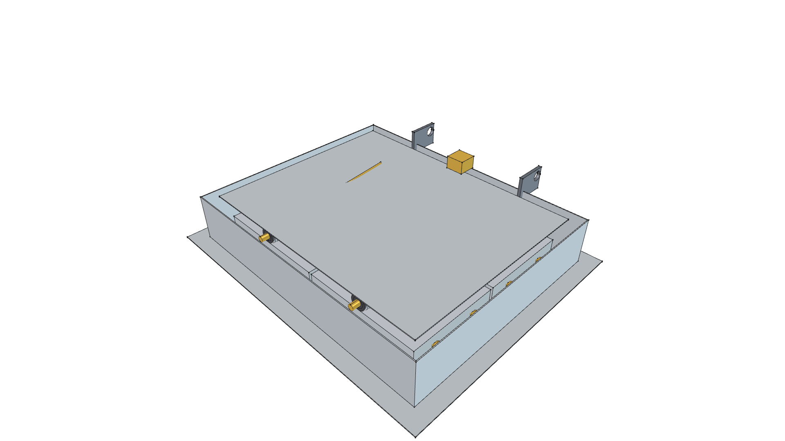
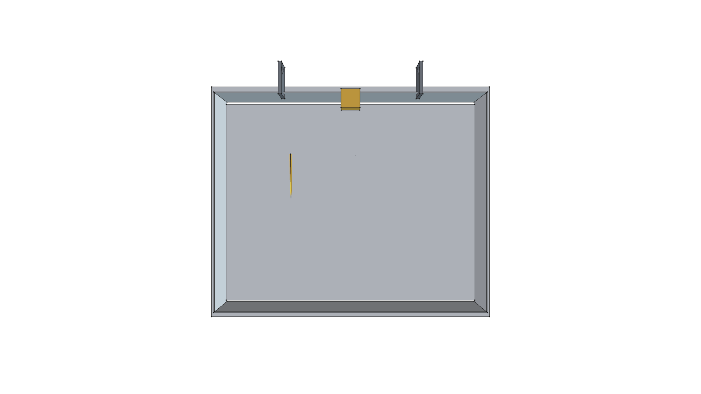
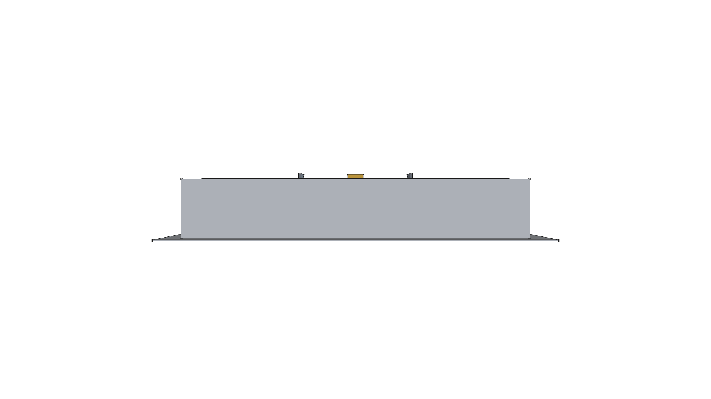
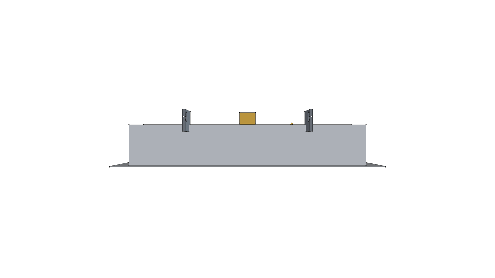
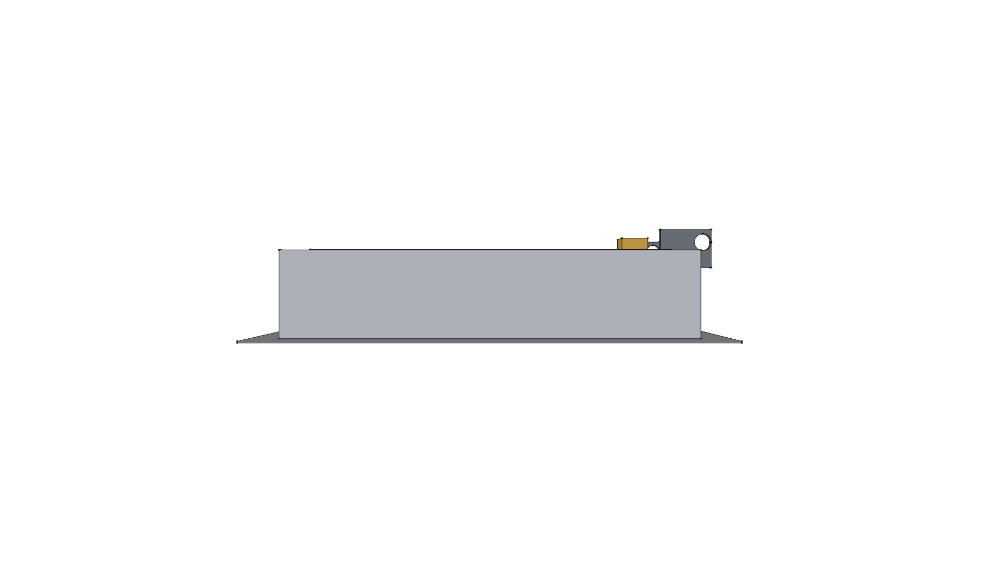
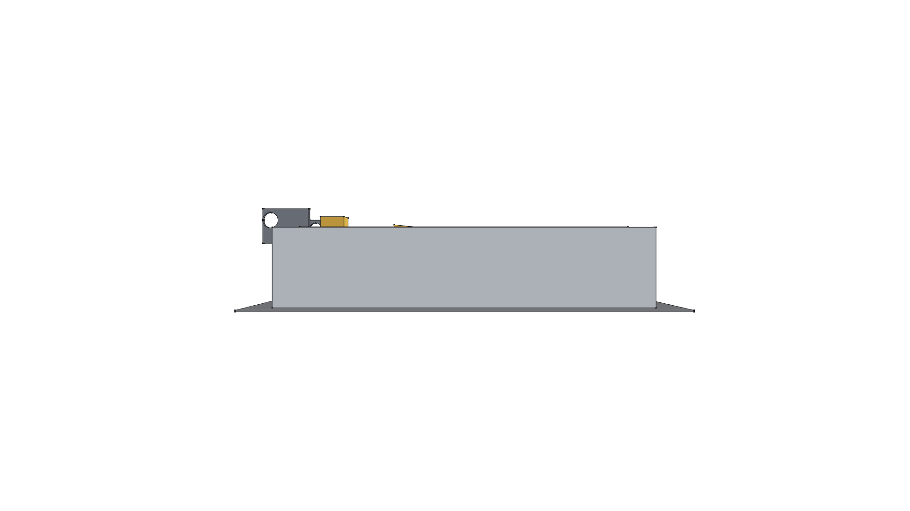
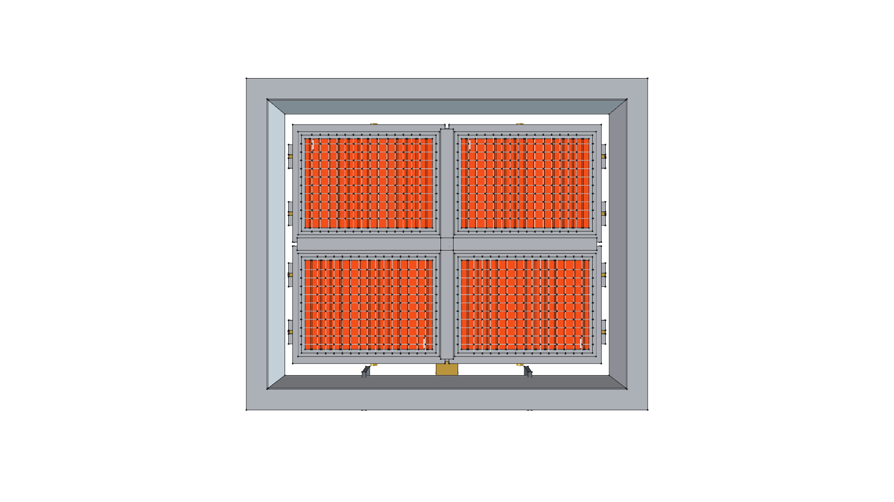

# Road Roaster 4W Modular Burner Array (40,000 BTU)

> **Standalone 3D CAD Component Module**  
> *phi-WORKS Maker Component Library (`components/modular_burner_array_4w/`)*

---



---

## Visual Projection Gallery

| Home (Perspective) View | Top (H-Manifold & Roof) View |
| :---: | :---: |
|  |  |
| **Front Elevation** | **Rear Elevation (Pivot Hinge Ears & Gas Inlet)** |
|  |  |
| **Right Side Elevation (Low Profile 90mm)** | **Left Side Elevation** |
|  |  |
| **Bottom (4-Tile Radiant Grid) View** | |
|  | |

---

## 1. Overview & Architecture

This assembly integrates **four (4) standalone modular ceramic burner cassettes** into a 2×2 grid radiant array engineered specifically to mount on the front cantilever arms of the **Road Roaster 4W** commercial platform cart.

Key Engineering Features:
- **Thermal Power**: **$40,000\text{ BTU/hr}$ ($11.72\text{ kW}$)**—delivering **33% more thermal output** than the Solaronics K-30 baseline ($30,000\text{ BTU/hr}$).
- **Active Radiant Surface**: $452\text{ mm} \times 352\text{ mm}$ ($17.80'' \times 13.86''$), yielding **$232\text{ sq. in.}$** of cordierite infrared emitter (**34% larger** than Solaronics $173\text{ sq. in.}$).
- **H-Pattern Gas Manifold Rail**: $3/4''$ square aluminum balanced flow manifold rail with central $3/8''$ male flare inlet feeding four #60 brass orifice spuds.
- **Orthogonal Flame Cross-Lighting Matrix**: Perforated stainless steel cross channels connecting all 4 cassettes for instantaneous flame propagation in $<0.25\text{ seconds}$.
- **180° Flip-Back Transit Hinge Ears**: Twin $3/16''$ ($4.76\text{ mm}$) steel pivot brackets with precision $\varnothing 3/4''$ ($19.05\text{ mm}$) bore holes, enabling the entire burner to rotate 180° backward onto the front stow zone of the cart deck during transport.
- **Ultra Low-Profile Cowl**: Overall depth of only **$90\text{ mm}$ ($3.54\text{ in}$)** (saving $132\text{ mm}$ of vertical height compared to the $222\text{ mm}$ Solaronics unit), keeping the stowed center of gravity extremely low.
- **Modular Field Serviceability**: Individual cassettes are held by knurled brass thumb nuts and slide out in under 2 minutes for ~$25 replacement cost.

---

## 2. Technical Specifications

| Parameter | Metric | Imperial | Engineering Notes |
| :--- | :--- | :--- | :--- |
| **Burner Architecture** | $2 \times 2$ Grid (4 Cassettes) | Four HD220 10,000 BTU plaques |
| **Active Radiant Area** | $1,496\text{ cm}^2$ | **$232.0\text{ sq. in.}$** | **+34% over Solaronics K-30** |
| **Gross Thermal Input** | $11.72\text{ kW}$ | **$40,000\text{ BTU/hr}$** | **+33% over Solaronics K-30** |
| **Overall Cowl Width ($X$)** | $520.0\text{ mm}$ | $20.47\text{ in}$ | Fits inside 24" cart deck width |
| **Overall Cowl Length ($Y$)**| $420.0\text{ mm}$ | $16.54\text{ in}$ | Fits inside 18" front stow zone |
| **Cowl Profile Depth ($Z$)** | $90.0\text{ mm}$ | $3.54\text{ in}$ | **60% lower profile than Solaronics** |
| **Operating Pressure** | $2.74\text{ kPa}$ | $11.0''\text{ W.C.}$ | Standard outdoor LP regulator |
| **Gas Consumption Rate** | $0.84\text{ kg/hr}$ | $1.86\text{ lbs/hr}$ | ~10.8 hours on 20 lb LP tank |
| **Pivot Axle Bore** | $\varnothing 19.05\text{ mm}$ | $3/4\text{ in}$ | Matches continuous skirt axle |
| **Total Assembly Weight** | **$13.55\text{ kg}$** | **$29.87\text{ lbs}$** | Parametric CAD physical weight |

---

## 3. Physical Mass Properties

Computed via FreeCAD using repository material definitions (`phi_works.maker.materials`):

```
================================================================================
 ROAD ROASTER 4W MODULAR BURNER ARRAY MASS REPORT
================================================================================
 TOTAL MASS / WEIGHT:     29.87 lbs  (13.551 kg)
 TOTAL SOLID VOLUME:      212.17 in³ (3.477 L)
 CENTER OF MASS (CoG):
   - Metric (mm):         X = -0.16 mm, Y = +7.58 mm, Z = +36.32 mm
   - Imperial (inches):   X = -0.01 in, Y = +0.30 in, Z = +1.43 in
--------------------------------------------------------------------------------
 MATERIAL SUMMARY BREAKDOWN:
 Material                   Parts   Mass (lbs)   Mass (kg)    % Mass  
 -------------------------- ------- ------------ ------------ --------
 Steel-304Stainless         9       12.89        5.848          43.2%
 Ceramic-Cordierite         4       6.76         3.066          22.6%
 Aluminum-6061-T6           6       6.22         2.821          20.8%
 CastIron-Gray              4       2.29         1.039           7.7%
 Brass-C360                 9       1.17         0.530           3.9%
 Steel-A36                  1       0.50         0.225           1.7%
 Ceramic-Alumina            4       0.05         0.023           0.2%
================================================================================
```

---

## 4. Python API Usage

To instantiate the 4W modular array inside the Road Roaster 4W assembly:

```python
import FreeCAD
from phi_works.maker.components import import_component

doc = FreeCAD.newDocument("RoadRoaster4W")

# Method A: Import pre-built .FCStd model
array_4w = import_component(
    doc,
    "modular_burner_array_4w",
    placement=FreeCAD.Placement(FreeCAD.Vector(0, -500, 100), FreeCAD.Rotation(0, 0, 0, 1))
)

# Method B: Direct Python API instantiation
from modular_burner_array_4w import create_modular_burner_array_4w_component

array_part = create_modular_burner_array_4w_component(
    doc,
    name="Cantilever_Radiant_Array_4W",
    placement=FreeCAD.Placement(FreeCAD.Vector(0, -500, 100), FreeCAD.Rotation(0, 0, 0, 1))
)
```

---

## 5. Build & Verification

To re-build the CAD model and update all orthogonal PNG renders:

```bash
./scripts/run_freecad.sh components/modular_burner_array_4w/build.py
```
