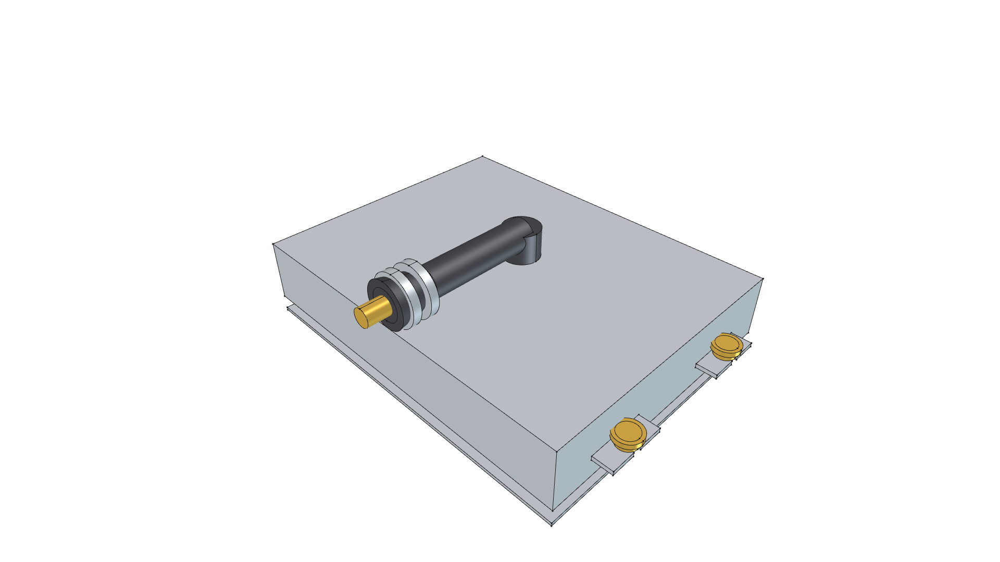
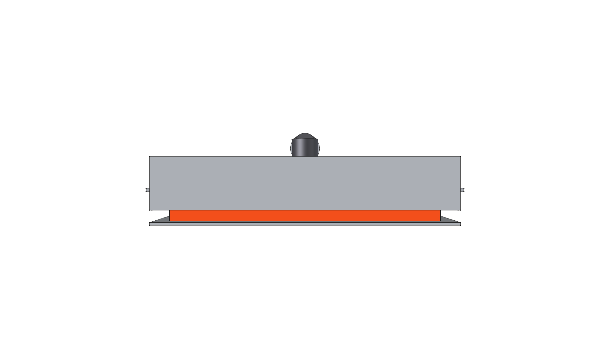
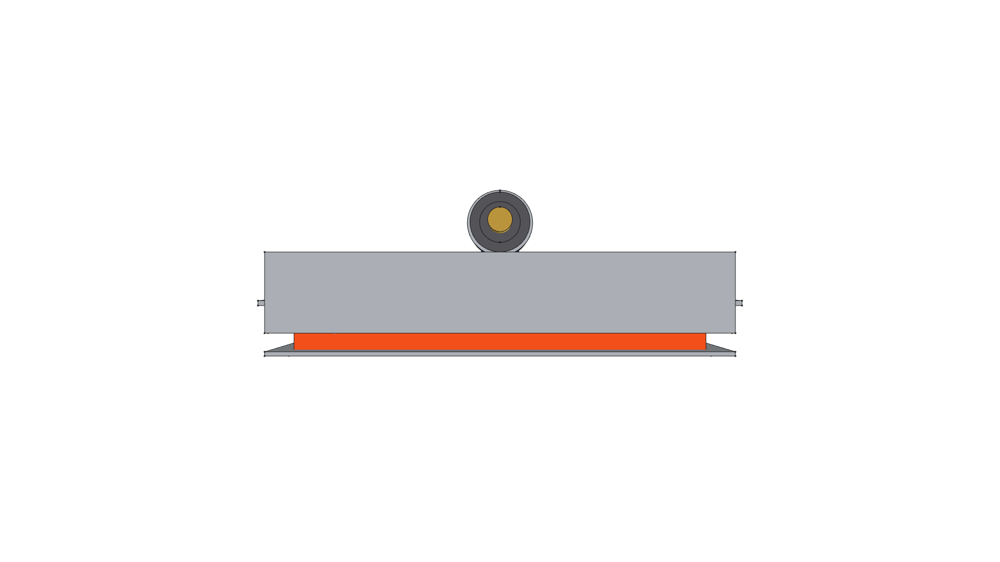
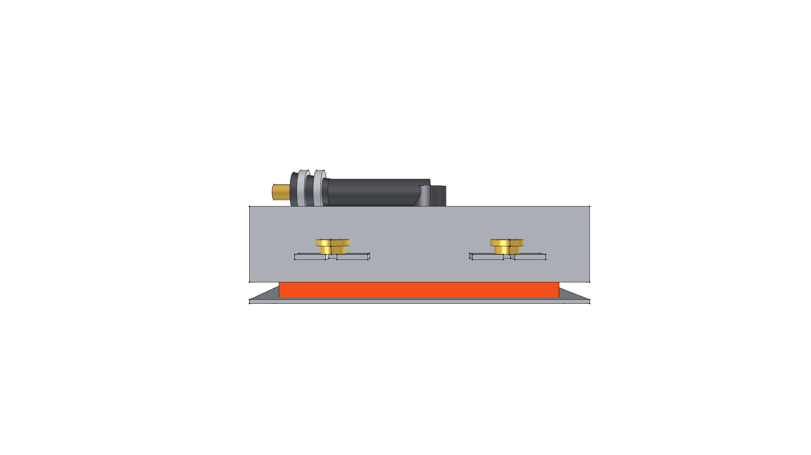
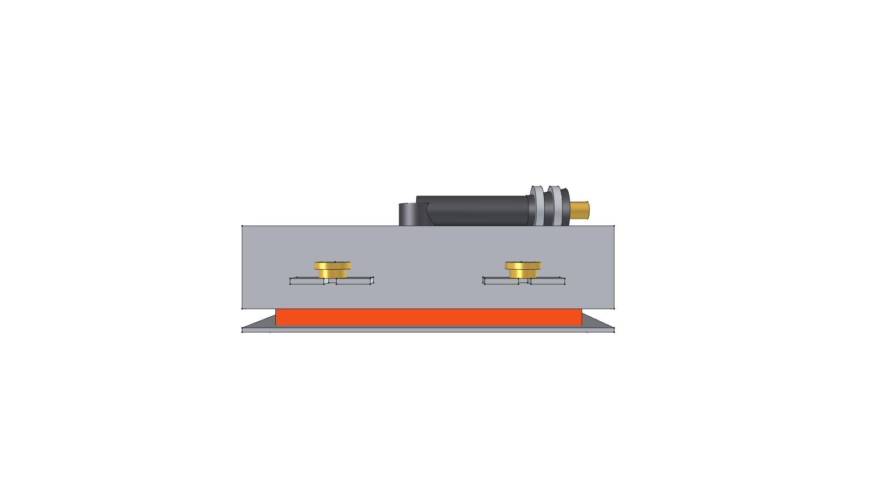
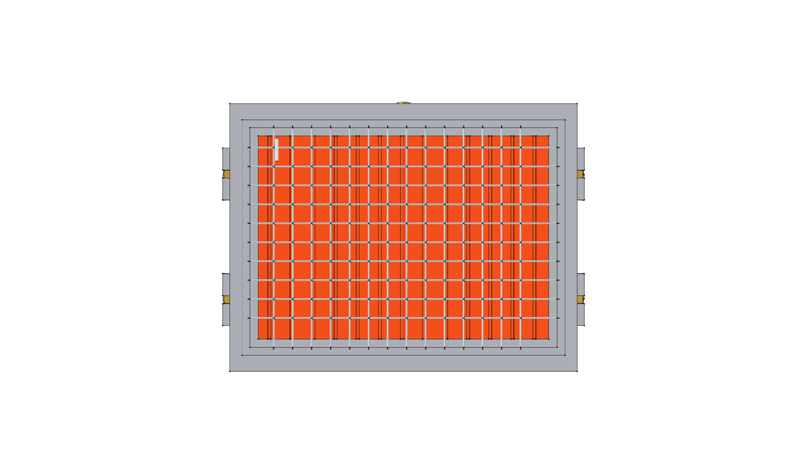

# Modular Ceramic Infrared Burner Cassette (10,000 BTU)

> **Standalone 3D CAD Component Module**  
> *phi-WORKS Maker Component Library (`components/modular_ceramic_burner/`)*

---



---

## Visual Projection Gallery

| Home (Perspective) View | Top (Plenum & Venturi) View |
| :---: | :---: |
|  |  |
| **Front Elevation** | **Rear Elevation (Venturi Induction Horn)** |
|  |  |
| **Right Side Elevation** | **Left Side Elevation** |
|  |  |
| **Bottom (Radiant Ceramic Face) View** | |
|  | |

---

## 1. Overview & Architecture

This module models a standardized mass-market **220 mm × 170 mm (HD220 format)** modular ceramic infrared burner cassette, engineered as the core scalable thermal building block for custom radiant broilers and the **Road Roaster** platform.

Key design highlights:
- **Autonomous Emitter**: Delivers **10,000 BTU/hr (2.93 kW)** from a low-pressure ($11''\text{ W.C.}$) Liquid Propane (LP) supply.
- **Cordierite Honeycomb Ceramic Matrix**: Emits incandescent infrared radiation ($3 - 5\,\mu\text{m}$ wavelength) at **$1,600^\circ\text{F} - 1,800^\circ\text{F}$** ($870^\circ\text{C} - 980^\circ\text{C}$) via gentle surface micro-pore combustion.
- **304 Stainless Steel Protective Wire Mesh Screen**: Guards the brittle ceramic matrix against stone chips, debris, and physical shock while aiding combustion stability.
- **Atmospheric Pre-Mix Venturi Induction Tube**: Heavy-duty cast iron induction tube with bellmouth air horn and rotatable aluminum air shutter collar for precision stoichiometric primary air adjustment.
- **Machined Brass Hex Orifice Spud**: Calibrated **#60 drill ($0.040''$ / $1.016\text{ mm}$)** gas orifice spud.
- **Quick-Swap Slotted Mounting Tabs**: Features perimeter slide slots and **M5 knurled brass thumb nuts**, enabling wrench-free replacement in under 2 minutes in the field.
- **Integrated Ignition Terminal**: Alumina ceramic electrode insulator with nickel spark probe tip positioned near the ceramic perimeter margin.

---

## 2. Technical Specifications & Operating Parameters

| Parameter | Metric | Imperial | Engineering Notes |
| :--- | :--- | :--- | :--- |
| **Overall Casing Width ($X$)** | $220.0\text{ mm}$ | $8.66\text{ in}$ | Stamped 304 stainless steel body |
| **Overall Casing Length ($Y$)**| $170.0\text{ mm}$ | $6.69\text{ in}$ | Stamped 304 stainless steel body |
| **Total Assembly Depth ($Z$)** | $60.0\text{ mm}$ | $2.36\text{ in}$ | Low-profile radiant face to venturi top |
| **Active Radiant Area** | $290.0\text{ cm}^2$ | $44.9\text{ sq. in.}$ | Cordierite honeycomb micro-pore matrix |
| **Thermal Power Input** | $2.93\text{ kW}$ | **$10,000\text{ BTU/hr}$** | Nominal firing rate @ 11" W.C. LP |
| **Manifold Supply Pressure** | $2.74\text{ kPa}$ | $11.0''\text{ W.C.}$ ($0.4\text{ PSI}$) | Standard low-pressure LP regulator |
| **Gas Consumption Rate** | $0.21\text{ kg/hr}$ | $0.46\text{ lbs/hr}$ | Propane HD-5 |
| **Orifice Specification** | $\varnothing 1.016\text{ mm}$ | Drill #60 ($0.0400''$) | Machined brass hex spud, 1/8" NPT / M10 |
| **Operating Temperature** | $870^\circ\text{C} - 980^\circ\text{C}$ | $1,600^\circ\text{F} - 1,800^\circ\text{F}$ | Bright incandescent radiant glow |
| **Total Cassette Mass** | **$2.355\text{ kg}$** | **$5.19\text{ lbs}$** | Parametric CAD physical weight |

---

## 3. Physical Mass Properties

Computed via FreeCAD using repository material definitions (`phi_works.maker.materials`):

```
================================================================================
 MODULAR CERAMIC BURNER CASSETTE MASS REPORT
================================================================================
 TOTAL MASS / WEIGHT:     5.19 lbs  (2.355 kg)
 TOTAL SOLID VOLUME:      34.93 in³ (0.572 L)
 CENTER OF MASS (CoG):
   - Metric (mm):         X = -0.22 mm, Y = -5.33 mm, Z = +27.35 mm
   - Imperial (inches):   X = -0.01 in, Y = -0.21 in, Z = +1.08 in
--------------------------------------------------------------------------------
 MATERIAL SUMMARY BREAKDOWN:
 Material                   Parts   Mass (lbs)   Mass (kg)    % Mass  
 -------------------------- ------- ------------ ------------ --------
 Steel-304Stainless         2       2.75         1.247          53.0%
 Ceramic-Cordierite         1       1.69         0.766          32.5%
 CastIron-Gray              1       0.57         0.260          11.0%
 Brass-C360                 2       0.12         0.055           2.4%
 Aluminum-6061-T6           1       0.04         0.020           0.9%
 Ceramic-Alumina            1       0.01         0.006           0.2%
================================================================================
```

---

## 4. Python API Usage

To instantiate this modular cassette inside project assemblies or custom array frames:

```python
import FreeCAD
from phi_works.maker.components import import_component

doc = FreeCAD.newDocument("ArrayAssembly")

# Method A: Import pre-built .FCStd model
cassette = import_component(
    doc,
    "modular_ceramic_burner",
    placement=FreeCAD.Placement(FreeCAD.Vector(0, 0, 0), FreeCAD.Rotation(0, 0, 0, 1))
)

# Method B: Direct Python API generation
from modular_ceramic_burner import create_modular_ceramic_burner_component

cassette_part = create_modular_ceramic_burner_component(
    doc,
    name="Burner_Cassette_1",
    placement=FreeCAD.Placement(FreeCAD.Vector(120, 0, 0), FreeCAD.Rotation(0, 0, 0, 1))
)
```

---

## 5. Build & Verification

To re-build the standalone CAD model and update orthogonal PNG renders:

```bash
./scripts/run_freecad.sh components/modular_ceramic_burner/build.py
```
