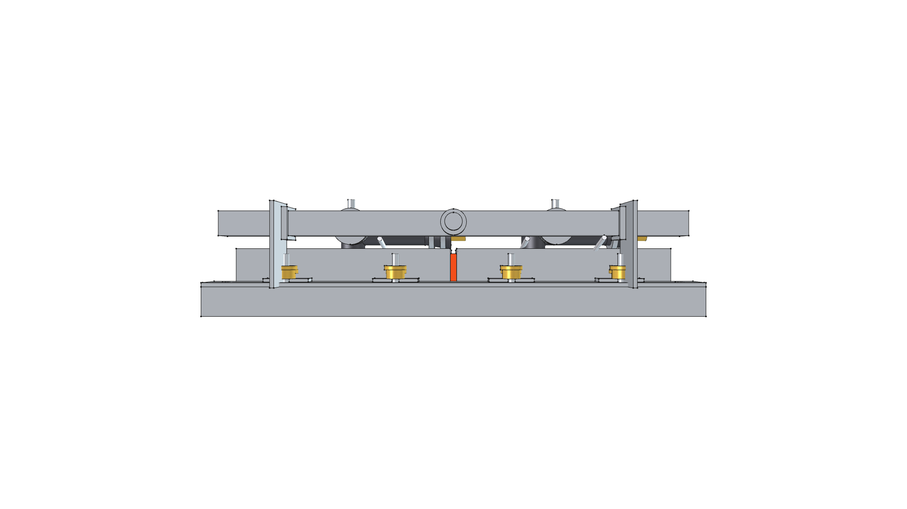
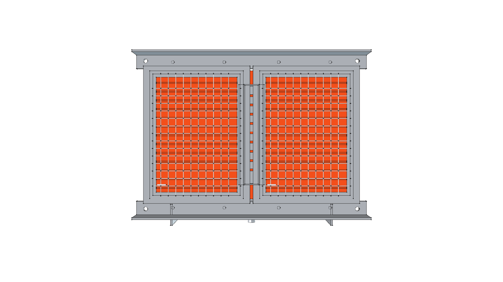
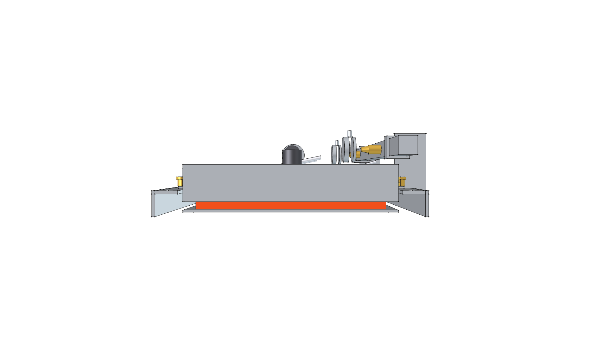
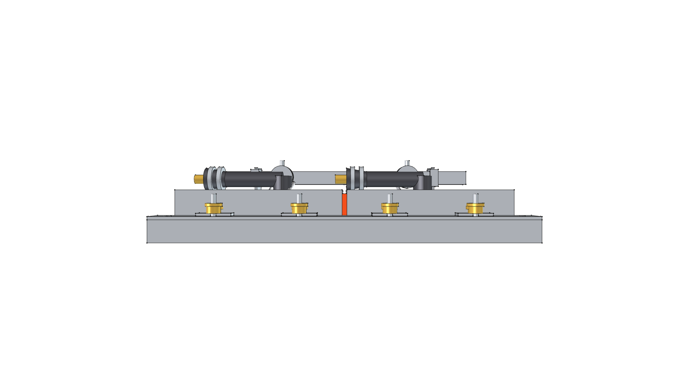

# Modular Burner Interconnect & Array Connection System

> **Standalone 3D CAD Component Module**  
> *phi-WORKS Maker Component Library (`components/modular_burner_interconnect/`)*

---


---

## Visual Projection Gallery

| Home (Perspective) View | Top (Slide Rails & Manifold) View |
| :---: | :---: |
|  |  |
| **Rear Elevation (Manifold & Orifices)** | **Bottom (Radiant Face & Crossover Bridge)** |
|  |  |
| **Right Side Elevation (Air Gap & Standoffs)** | **Front Elevation** |
|  |  |

---

## 1. Overview & Connection Architecture

This module provides a detailed, high-fidelity 3D parametric CAD model illustrating **how modular ceramic infrared burners physically and pneumatically connect together** into a scalable radiant array.

It explicitly models all four interconnected subsystems:

```
                      [ INTERCONNECT SUBSYSTEMS ]

    ┌────────────────────────────────────────────────────────┐
    │ 1. Structural Slide Rails & Captive Studs              │
    │    Dual 1" x 1" x 1/8" 304 SS angle rails              │
    │    8x M5 captive studs + knurled brass thumb nuts      │
    ├────────────────────────────────────────────────────────┤
    │ 2. Inter-Cassette Thermal Cushion                      │
    │    High-temp ceramic fiber expansion gasket (5mm gap)  │
    ├────────────────────────────────────────────────────────┤
    │ 3. Flame Bridging & Crossover Tunnel                   │
    │    Formed 304 SS perforated crossover arch            │
    ├────────────────────────────────────────────────────────┤
    │ 4. Gas Plumbing & Venturi Alignment                    │
    │    3/4" square manifold rail on twin standoff brackets │
    │    Dual #60 brass orifice spuds with 6mm air gap       │
    │    Rotatable aluminum primary air shutter collars      │
    ├────────────────────────────────────────────────────────┤
    │ 5. Ignition & Safety Lead Routing                      │
    │    90° silicone spark boots & copper thermocouple lead │
    └────────────────────────────────────────────────────────┘
```

---

## 2. Technical Specifications

| Parameter | Metric | Imperial | Engineering Notes |
| :--- | :--- | :--- | :--- |
| **Slide Angle Rails** | $25.4 \times 25.4 \times 3.175\text{ mm}$ | $1.0'' \times 1.0'' \times 1/8''$ | 304 Stainless Steel, $380\text{ mm}$ length |
| **Cassette Clamping** | 8x M5 Captive Studs | $\varnothing 5\text{ mm} \times 25\text{ mm}$ | Knurled brass thumb nuts (tool-free) |
| **Thermal Expansion Gap** | $5.0\text{ mm}$ | $0.20\text{ in}$ | Cushioned by ceramic fiber rope gasket |
| **Gas Manifold Rail** | $19.05\text{ mm}$ square | $3/4\text{ in}$ square | 6061-T6 aluminum extrusion |
| **Supply Inlet** | $3/8''\text{ SAE } 45^\circ\text{ flare}$ | $3/8''\text{ flare}$ | Standard brass flare connection |
| **Orifice Spuds** | 2x Machined Brass Hex | Drill #60 ($0.040''$) | Threaded 1/8" NPT into manifold |
| **Primary Air Induction Gap** | $6.0\text{ mm}$ | $0.24\text{ in}$ | Calibrated jet gap to bellmouth horn |
| **Flame Crossover Arch**| $24\text{ mm W} \times 160\text{ mm L}$ | $0.94'' \times 6.30''$ | Formed 304 SS with laser-cut slots |
| **Total Assembly Mass** | **$6.555\text{ kg}$** | **$14.45\text{ lbs}$** | Parametric CAD physical weight |

---

## 3. Physical Mass Properties

Computed via FreeCAD using repository material definitions (`phi_works.maker.materials`):

```
================================================================================
 MODULAR BURNER INTERCONNECT SYSTEM MASS REPORT
================================================================================
 TOTAL MASS / WEIGHT:     14.45 lbs  (6.555 kg)
 TOTAL SOLID VOLUME:      91.43 in³ (1.498 L)
 CENTER OF MASS (CoG):
   - Metric (mm):         X = -4.01 mm, Y = +10.08 mm, Z = +28.61 mm
   - Imperial (inches):   X = -0.16 in, Y = +0.40 in, Z = +1.13 in
--------------------------------------------------------------------------------
 MATERIAL SUMMARY BREAKDOWN:
 Material                   Parts   Mass (lbs)   Mass (kg)    % Mass  
 -------------------------- ------- ------------ ------------ --------
 Steel-304Stainless         8       8.15         3.696          56.4%
 Ceramic-Cordierite         3       3.53         1.603          24.5%
 CastIron-Gray              2       1.15         0.520           7.9%
 Aluminum-6061-T6           4       0.93         0.422           6.4%
 Brass-C360                 6       0.57         0.261           4.0%
 Ceramic-Alumina            3       0.12         0.054           0.8%
================================================================================
```

---

## 4. Field Replacement Procedure

To replace any individual cassette in the field:
1. **Shut Off Gas & Allow Cooling** (wait 3–5 minutes).
2. **Loosen Knurled Brass Thumb Nuts**: Spin off the two M5 knurled brass nuts securing that cassette's slotted mounting tabs.
3. **Slide Cassette Out**: Because the mounting tabs are slotted, the cassette slides forward clear of the angle rails without needing to disassemble the frame or manifold.
4. **Drop in Replacement Cassette**: Slide the new cassette onto the captive studs until its venturi horn aligns with the manifold's brass orifice spud.
5. **Tighten Thumb Nuts Hand-Tight**: Re-engage the knurled brass nuts.
6. **Snap On Spark Boot**: Re-attach the high-voltage silicone boot to the electrode post.
7. **Total Downtime**: **$< 2\text{ minutes}$**.

---

## 5. Build & Verification

To re-build the CAD model and update orthogonal PNG renders:

```bash
./scripts/run_freecad.sh components/modular_burner_interconnect/build.py
```
