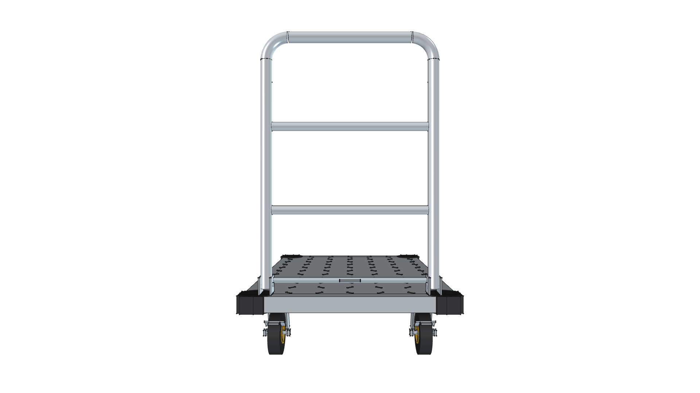
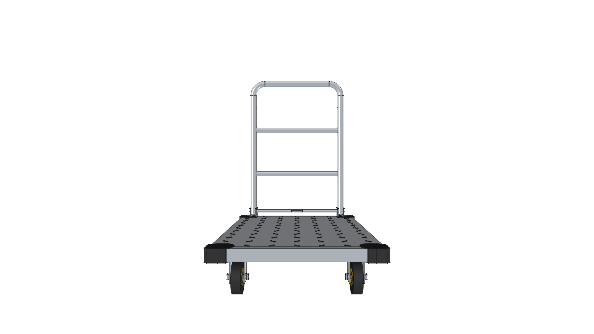
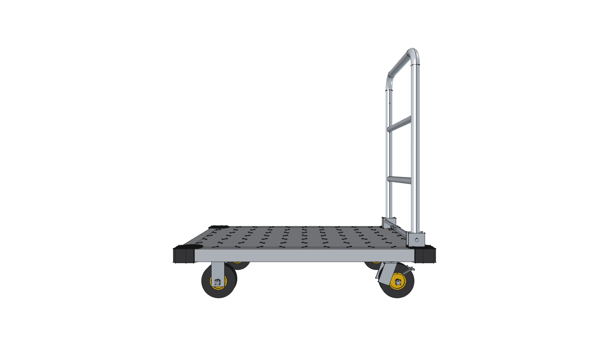
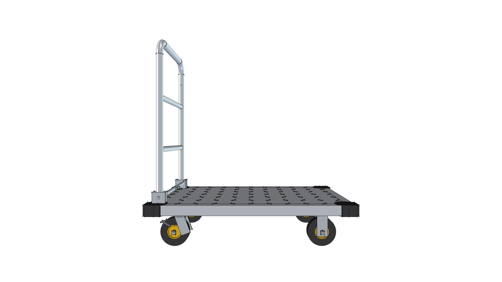
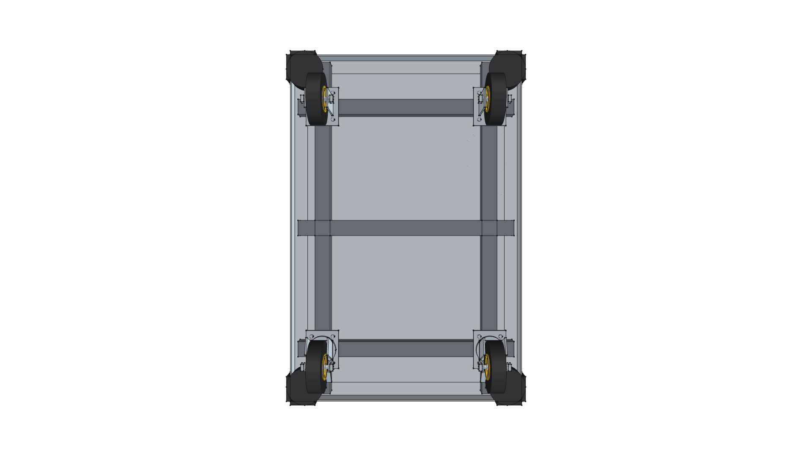

# Commercial 24" x 36" Platform Cart Component (Dolly Chassis)

## Overview & Purpose

The **Commercial 24" x 36" Platform Cart** (`platform_cart_24x36`) is a standardized 3D parametric CAD component representing a commercial heavy-duty steel/aluminum platform truck (flatbed dolly). It serves as the mobile rolling foundation for the **Road Roaster Dolly** (`road-roaster-dolly`) project.

| Specification | Dimension / Value |
| :--- | :--- |
| **Deck Footprint** | 24.0" W × 36.0" L (609.6 mm × 914.4 mm) |
| **Deck Surface Height** | 7.68" (195.0 mm) from ground level |
| **Deck Construction** | Diamond non-skid plate with 1.75" (45 mm) perimeter skirt |
| **Under-Deck Frame** | Longitudinal C-channels & cross stringers (1000+ lb rating) |
| **Corner Protection** | 4 Molded rubber wrap-around bumpers with recessed fasteners |
| **Push Handle Height** | **29.0" (736.6 mm)** above deck (user specified) |
| **Push Handle Tubing** | 1.25" OD (31.75 mm) tubular steel with 2 intermediate cross rails |
| **Handle Base Mechanism** | Heavy-duty folding pivot brackets with foot-release cross bar |
| **Wheel Diameter** | **5.0" (127.0 mm)** solid rubber tread tires |
| **Running Gear Setup** | 2 Front rigid stamped casters (`caster_rigid_5in`), 2 Rear 360° swivel casters with foot brakes (`caster_swivel_5in`) |
| **Assembly Container** | FreeCAD 1.1 `Assembly::AssemblyObject` with Ground joint & Exploded View |


---

## Visual Projection Gallery

| Home (Perspective) View | Top Plan View |
| :---: | :---: |
|  |  |
| **Front Elevation** | **Rear Elevation** |
|  |  |
| **Right Side Elevation** | **Left Side Elevation** |
|  |  |
| **Bottom Plan View** | |
|  | |

---

## CAD Assembly Hierarchy

```
Platform_Cart_24x36 [Assembly::AssemblyObject]
├── Joints
│   └── GroundJoint_Deck [GroundedJoint -> Platform_Deck_Plate]
├── Views
│   └── ExplodedView_RunningGear [App::FeaturePython (ExplodedView)]
│       ├── Step 1: Explode FL Caster (offset: -30, -60, -70 mm)
│       ├── Step 2: Explode FR Caster (offset: +30, -60, -70 mm)
│       ├── Step 3: Explode RL Caster (offset: -30, +60, -70 mm)
│       ├── Step 4: Explode RR Caster (offset: +30, +60, -70 mm)
│       └── Step 5: Explode Push Handle (offset: 0, 0, +100 mm)
├── 1. Deck & Frame Subassembly (24x36in Diamond Plate)
│   ├── Platform_Deck_Plate (24x36in Aluminum Diamond-Plate Deck & Skirt)
│   ├── Deck_Traction_Ribs (Diamond Non-Skid Traction Grid)
│   ├── Under_Deck_Frame_Channels (Structural Steel C-Channels & Stringers)
│   ├── Corner_Rubber_Bumpers (Molded Impact Rubber Corner Bumpers)
│   └── Corner_Bumper_Fasteners (Corner Bumper Recessed Fastener Hardware)
├── 2. Running Gear (5in COTS Rigid & Swivel Casters)
│   ├── Front Left Rigid Caster (5in) [caster_rigid_5in]
│   ├── Front Right Rigid Caster (5in) [caster_rigid_5in]
│   ├── Rear Left Swivel Caster (5in Brake) [caster_swivel_5in]
│   └── Rear Right Swivel Caster (5in Brake) [caster_swivel_5in]
└── 3. Push Handle Subassembly (29in Height, Folding Base)
    ├── Tubular_Push_Handle (29in Tubular Steel Push Handle with Dual Cross Rails)
    └── Handle_Folding_Hinges (Folding Base Hinge Brackets & Foot Release Bar)
```

---

## Integration in Road Roaster Dolly

This platform cart is imported into project assemblies using:
```python
from phi_works.maker.components import import_component

cart_grp = import_component(doc, "platform_cart_24x36", placement=FreeCAD.Placement())
```

### Deck Payload Allocation:
1. **Rear Zone (Near Handle)**: 20 lb LP Propane Tank (upright cylinder) + torch wand clip on handle cross rail.
2. **Center Zone**: Clear payload area for water safety reservoir / tools / stowed burner.
3. **Front Zone**: Hinged cantilever mounting bracket for front radiant ceramic burner engine (with 180° flip transit fold onto center deck).
