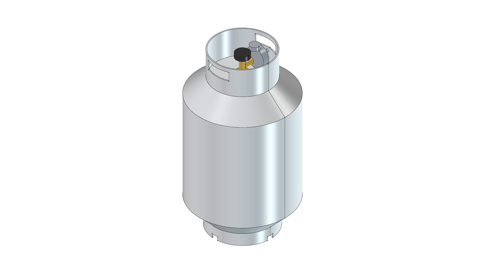
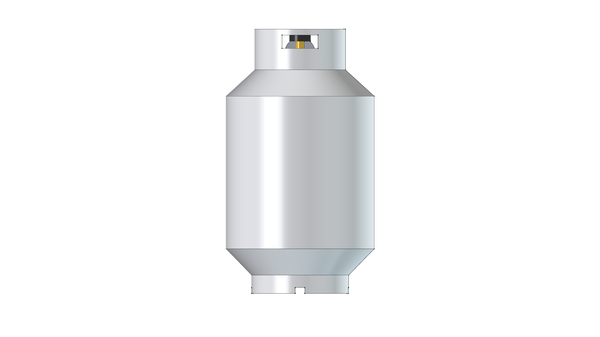

# Standard DOT 20 lb Propane Cylinder Component

## Overview & Purpose

The **Standard DOT 20 lb Propane Cylinder** (`propane_cylinder_20lb`) is a reusable 3D CAD model representing the industry-standard 20 lb (5-gallon) LP gas container used for commercial radiant heating, grills, and mobile thermal equipment.

| Parameter | Specification |
| :--- | :--- |
| **Tank Outer Diameter** | 12.2" (310.0 mm) |
| **Overall Height** | 18.0" (457.0 mm) to top of collar |
| **Tare Weight (Empty)** | ~17.0 lbs (7.7 kg) |
| **Full Propane Weight** | ~37.0 lbs (16.8 kg) |
| **Total Thermal Energy** | **430,960 BTU** |
| **Runtime @ 60,000 BTU/hr** | **~7.2 Continuous Hours** |
| **Foot Ring** | 8.0" (203.2 mm) diameter with ground drain slots |
| **Collar** | 7.5" (190.5 mm) diameter with dual oblong hand grip slots |
| **Valve System** | Standard OPD (Overfill Protection Device) brass valve with triangular shutoff knob |
| **Regulator** | Integrated 11" W.C. low-pressure regulator with pressure gauge |

---

## Visual Gallery

| Isometric View | Front Elevation View |
| :---: | :---: |
|  |  |

---

## CAD Assembly Hierarchy

```
Propane_Cylinder_20lb [App::DocumentObjectGroup]
├── Propane_Tank_Vessel (20 lb Steel Pressure Vessel, Foot Ring & Collar)
├── OPD_Valve_Body (Brass OPD Service Valve & Threaded Outlet)
├── Valve_Handwheel (Polymer Triangular Shutoff Handwheel)
└── LP_Gas_Regulator (11in W.C. Low-Pressure Gas Regulator & Gauge)
```
