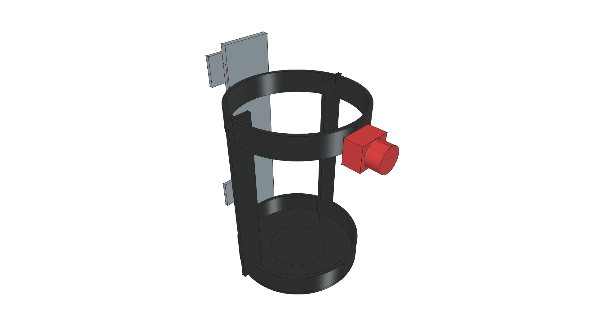
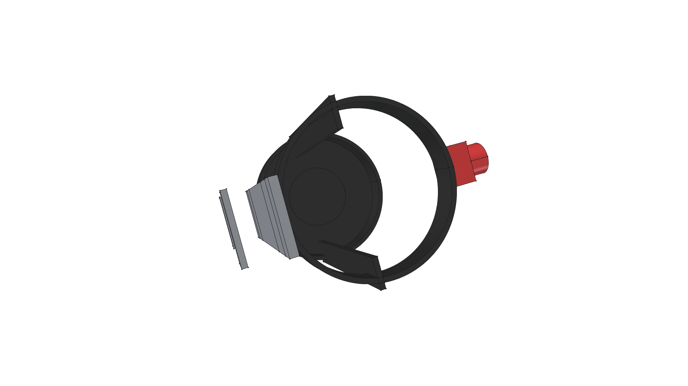
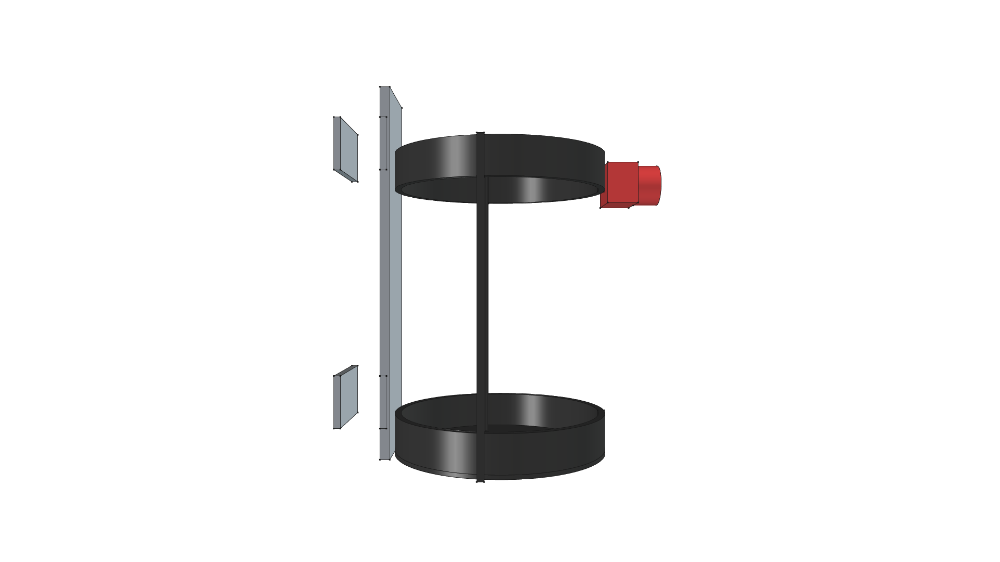
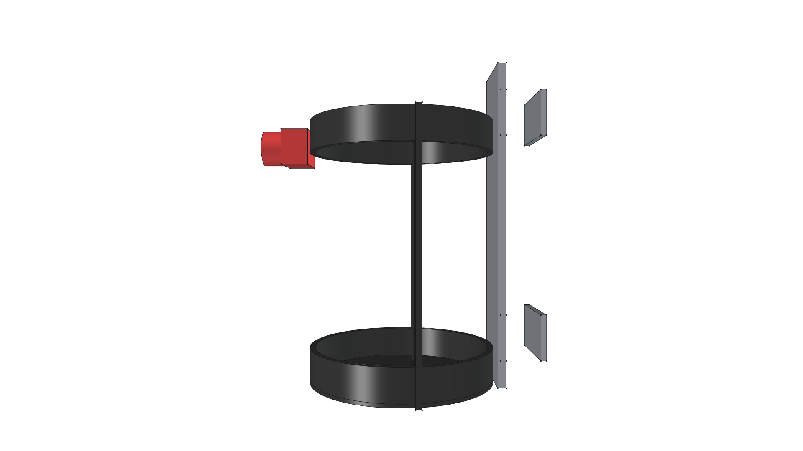
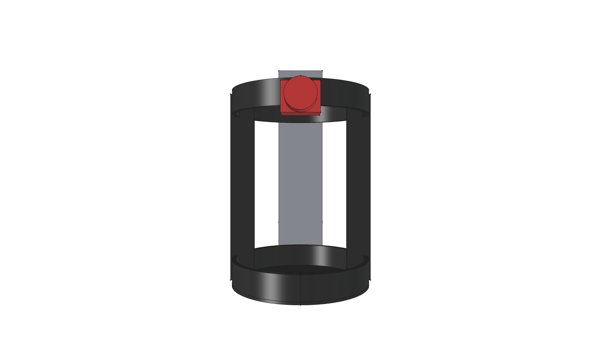
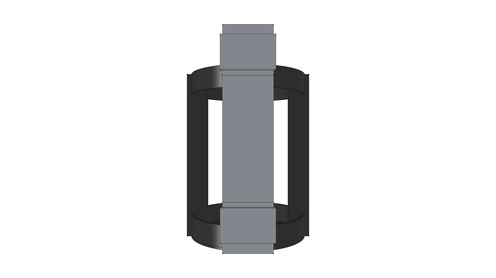
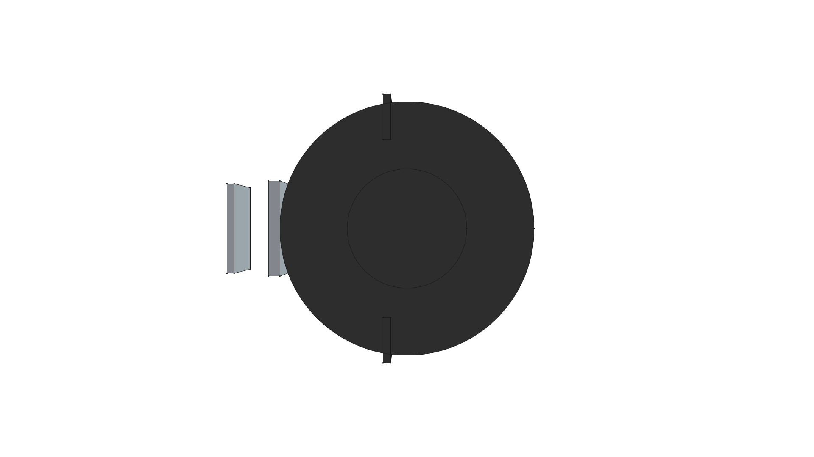

# Propane Bottle Harness Component (1 lb Canister Cage)

**Commercial & DIY Design**: Bike-cage-style quick-slip retention harness designed for standard 1 lb propane cylinders ($3.875'' / 98.4\text{ mm}$ outer diameter). Mounts directly to $3/4''$ ($19.05\text{ mm}$) square tubing or round tool handles.

---



---

## Visual Projection Gallery

| Home (Perspective) View | Top Plan View |
| :---: | :---: |
|  |  |
| **Front Elevation** | **Rear Elevation** |
|  |  |
| **Right Side Elevation** | **Left Side Elevation** |
|  |  |
| **Bottom Plan View** | |
|  | |

---

## Key Features & Construction Specs

- **Inner Cage Clearance**: $100.0\text{ mm}$ ($3.94''$) ID for smooth slip-in / slip-out operation.
- **Bottom Support Seat Cup**: Recessed $20.0\text{ mm}$ deep cup catching the cylinder's bottom seat collar with a central $25\text{ mm}$ drain hole.
- **Side Retention Arms**: Dual $1/8'' \times 3/4''$ steel flat bar uprights cradling the cylinder body.
- **Upper Quick-Release Latch**: Red knurled thumb-screw tension latch securing the bottle against vibration during transport.
- **Rear Mounting Spine**: $3/16'' \times 1.5''$ steel spine plate with upper and lower $3/4''$ square tube saddle clamp ears.

---

## Model Usage & Insertion Origin

- **Insertion Origin $(0,0,0)$**: Bottom center of the seat cup base.
- **Tube Mounting Offset**: Rear mounting clamps extend rearward along $-X$ by $65\text{ mm}$ to clamp centered around $3/4''$ square tubing.
- **Python Import**:
  ```python
  from phi_works.maker.components.propane_harness import create_propane_harness_component

  harness_grp = create_propane_harness_component(doc, placement)
  ```
