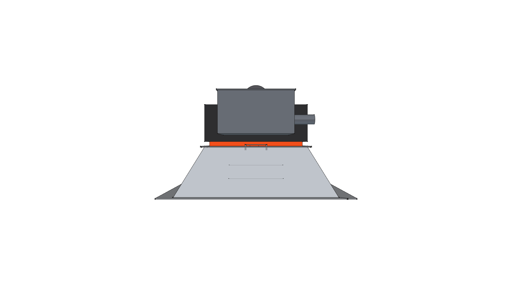
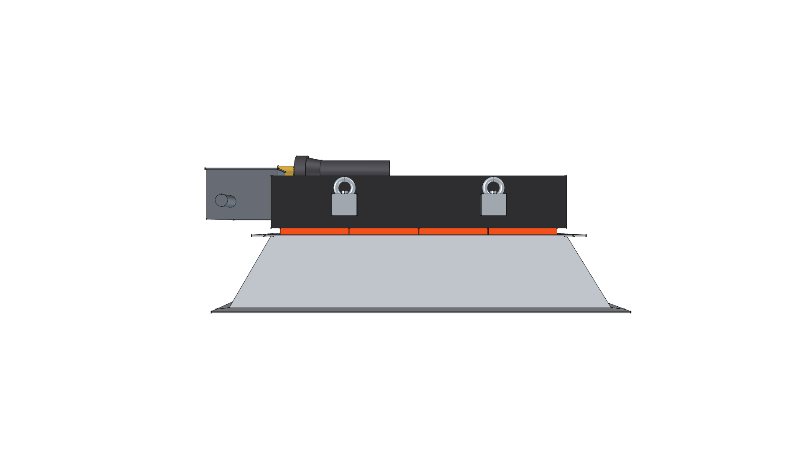
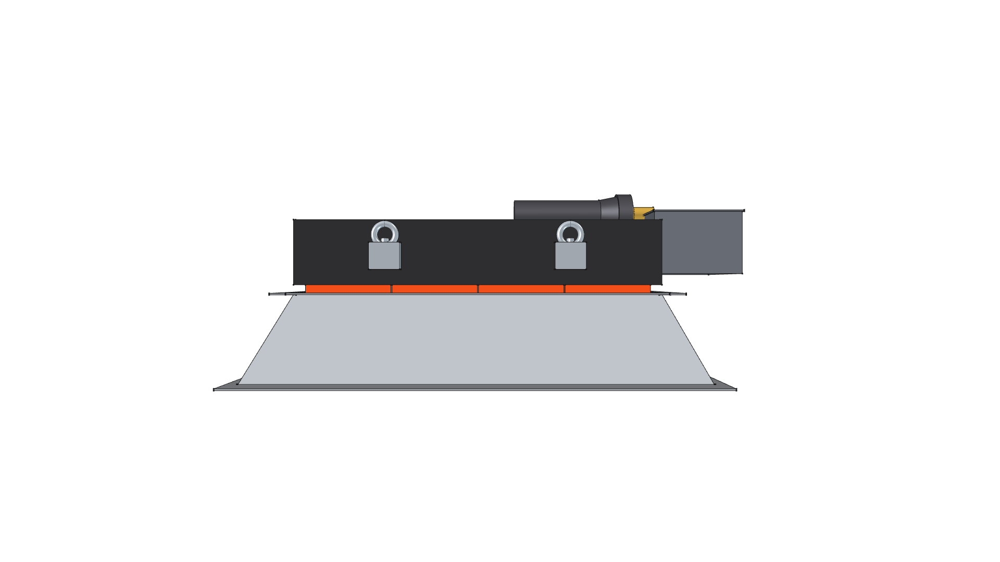
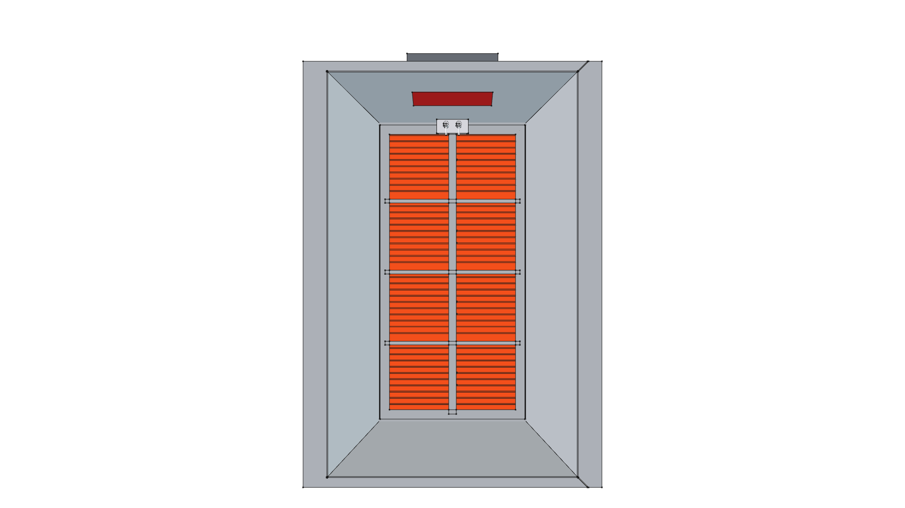

# Solaronics K-30 High-Intensity Ceramic Infrared Burner & Flared Reflector

> **Standalone 3D CAD Component Module**  
> *phi-WORKS Maker Component Library (`components/solaronics_infrared_burner/`)*

---


---

## Visual Projection Gallery

| Home (Perspective) View | Top Plan View |
| :---: | :---: |
|  |  |
| **Front Elevation** | **Rear Elevation** |
|  |  |
| **Right Side Elevation** | **Left Side Elevation** |
|  |  |
| **Bottom (Radiant Face) Plan View** | |
|  | |

---

## 1. Overview & Architecture

This module models the commercial **Solaronics USA K-30** high-intensity ceramic infrared burner and flared focusing reflector hood, adapted as the primary downward-firing radiant thermal engine for the **Road Roaster** platform.

The CAD model is organized into two independent modular subcomponents inside the master `App::Part` assembly:
1. **`Solaronics_Burner_Core` (`create_solaronics_burner_core_component`)**:
   - **4x Cordierite Ceramic Radiant Matrix Plaques**: $173\text{ sq. in}$ active radiant surface operating at **$1,600^\circ\text{F} - 1,800^\circ\text{F}$** ($870^\circ\text{C} - 980^\circ\text{C}$). Features surface grooving and embossed chevron/lightning markers.
   - **304 Stainless Plaque Retention Frame**: Precision perimeter bezel with center runner bar, divider ribs, and notched end mounting brackets with corner screw holes per manufacturer CAD drawings.
   - **Combustion Plenum Chamber**: Heavy-gauge steel back box with heat-resistant matte black finish, internal pan diffuser plate for uniform air-gas distribution, and upper flue exhaust relief gap.
   - **Premix Venturi Induction Manifold**: Cast iron venturi mixing tube with bellmouth air induction horn and adjustable air shutter collar.
   - **Gas Train & Brass Orifice**: 1/2" NPT gas manifold pipe with precision-machined brass hex orifice spud.
   - **Direct Spark Ignition & Pilot Assembly**: Dual alumina ceramic insulator posts ($\varnothing 8\text{ mm}$), spark probe, and flame-rectification sensor rod enclosed in a protective stainless steel pilot shield.
   - **Control Enclosure**: 16-gauge hollow sheet metal automatic gas valve & DSI ignition module box with flexible armored conduit fitting.
   - **Suspension Hardware**: 4 side mounting ears with zinc-plated forged eye bolts for chain or chassis hanging.

2. **`Solaronics_Reflector_Hood` (`create_solaronics_reflector_hood_component`)**:
   - **4-Sided Deep Focusing Cavity**: Mirror-polished aluminum/stainless sloping reflector walls expanding from the burner throat down to the radiant mouth.
   - **Outward Flared Perimeter Rim Flange**: $1.33''$ ($33.75\text{ mm}$) flat perimeter flare flange extending outwards parallel to the radiant plane, expanding mouth dimensions to $16\,\frac{3}{4}'' \times 23.9''$.
   - **45° Mitered Corner Seams**: Authentic diagonal miter relief seams at the 4 corners of the flared flange matching physical unit photographs.
   - **Throat Mounting Collar**: Stainless mating collar securing the hood to the plenum perimeter.
   - **Solaronics Identification Nameplate**: Red branding badge mounted flush on the lower sloping reflector panel below the pilot electrode.

---

## 2. Technical Specifications & Operating Parameters

*Compiled directly from Solaronics K-Series Technical Brochure (`K_SERIES_REV2.pdf`) and Master Architectural Engineering Specifications (`Infrared_Heater_Specs_R2_20181129_K_Series.doc`):*

### Dimensional & Physical Specifications
| Parameter | Metric | Imperial | Description / Source Reference |
| :--- | :--- | :--- | :--- |
| **Model Number** | Solaronics K-30 | Solaronics K-30 | High-intensity ceramic infrared radiant heater |
| **Radiating Surface** | $1,116\text{ cm}^2$ | $173\text{ sq. in.}$ | 4x Cordierite ceramic radiant plaques |
| **Overall Mouth Length ($X$)** | $425.45\text{ mm}$ | $16\,\frac{3}{4}''$ | Across flared reflector flange outer perimeter |
| **Overall Width w/ Controls ($Y$)** | $727.08\text{ mm}$ | $28\,\frac{5}{8}''$ | Full longitudinal span including gas control valve box |
| **Overall Depth ($Z$)** | $222.25\text{ mm}$ | $8\,\frac{3}{4}''$ | Flared outer flange rim to rear venturi / plenum |
| **Total Weight (CAD Computed)** | $13.45\text{ kg}$ | $29.65\text{ lbs}$ | Parametric physical mass (matches $30\text{ lbs}$ shipping spec) |
| **Shipping Weight** | $13.61\text{ kg}$ | $30.0\text{ lbs}$ | Manufacturer boxed shipping weight |
| **Plaque Array Layout** | $216\text{ mm} \times 456\text{ mm}$ | $8.5'' \times 18.0''$ | 4 plaques arranged in single vertical column |
| **Plaque Thickness** | $12.7\text{ mm}$ | $0.5\text{ in}$ | Standard cordierite ceramic tile gauge |

### Thermal & Gas Performance
| Parameter | Natural Gas (NAT) | Propane Gas (LP) | Notes |
| :--- | :--- | :--- | :--- |
| **Thermal Input Rating** | $30,000\text{ BTU/hr}$ ($8.8\text{ kW}$) | $30,000\text{ BTU/hr}$ ($8.8\text{ kW}$) | Single-stage input rating |
| **Manifold Operating Pressure** | $6.0''\text{ W.C.}$ ($1.49\text{ kPa}$) | $10.0''\text{ W.C.}$ ($2.49\text{ kPa}$) | At gas valve test port |
| **Minimum Supply Inlet Pressure** | $7.0''\text{ W.C.}$ ($1.74\text{ kPa}$) | $11.0''\text{ W.C.}$ ($2.74\text{ kPa}$) | Required for full input |
| **Maximum Supply Inlet Pressure** | $14.0''\text{ W.C.}$ ($3.48\text{ kPa}$) | $14.0''\text{ W.C.}$ ($3.48\text{ kPa}$) | Maximum valve rating |
| **Gas Supply Inlet Size** | $1/2''\text{ FPT}$ | $1/2''\text{ FPT}$ | Standard female pipe thread |
| **Operating Surface Temperature** | $1,600^\circ\text{F} - 1,800^\circ\text{F}$ | $1,600^\circ\text{F} - 1,800^\circ\text{F}$ | Incandescent radiant micro-pore emission |
| **Warm-Up Time** | $< 60\text{ seconds}$ | $< 60\text{ seconds}$ | Rapid full thermal shock reach |

### Clearances to Combustibles (K-30 to K-60 Series)
| Location | Standard Clearance | With Heat Shield | Notes |
| :--- | :--- | :--- | :--- |
| **Side of Heater** | $30''$ ($762\text{ mm}$) | $30''$ ($762\text{ mm}$) | Lateral combustible clearance |
| **Back of Heater** | $30''$ ($762\text{ mm}$) | $30''$ ($762\text{ mm}$) | Rear clearance from plenum |
| **Top of Heater (0°–29° Mount)** | $60''$ ($1,524\text{ mm}$) | $34''$ ($864\text{ mm}$) | Overhead clearance (reduced w/ shield) |
| **Top of Heater (30° Only Mount)** | $48''$ ($1,219\text{ mm}$) | $34''$ ($864\text{ mm}$) | Angled suspension clearance |
| **Below Heater (Standard Reflector)**| $68''$ ($1,727\text{ mm}$) | — | Direct radiant beam zone |
| **Below Heater (Parabolic Reflector)**| $110''$ ($2,794\text{ mm}$) | — | High-concentration focused beam |

### Electrical & Control Packages
| Suffix | Gas Type | Ignition System | Safety Shut-Off | Voltage / Power | Pilot Type |
| :--- | :--- | :--- | :--- | :--- | :--- |
| **`STN` / `STL`** | Nat / LP | Direct Spark Ignition (DSI) | 100% Flame Sensing | $24\text{ VAC}$ / $23\text{ VA}$ | Intermittent Spark |
| **`QSAN` / `QSAL`** | Nat / LP | Direct Spark Ignition (DSI) | 100% Flame Sensing | $24\text{ VAC}$ / $16\text{ VA}$ | Intermittent Spark |
| **`DSAN` / `DSAL`** | Nat / LP | Direct Spark Ignition (DSI) | 100% Flame Sensing | $115\text{ VAC}$ / $17\text{ VA}$ | Intermittent Spark |
| **`TAN` / `TAL`** | Nat / LP | Manual Piezo Pilot | 100% Thermocouple | Millivolt (Self-Powered) | Constant Standing Pilot |

---

## 3. Materials & Engineering Construction

*Per Section 23 55 23 Master Specification Requirements:*

- **Ceramic Radiant Emitter**: Cordierite-based grooved ceramic plaque matrix with alternate rows of **230 perforations per square inch** terminating at the bottom of radiant slots. This geometry embeds 50% of the flame envelope below the outer ceramic face, enhancing surface contact, draft resistance, and radiant conversion efficiency. Withstands thermal shock and water quenching without structural fracture.
- **Combustion Plenum**: $20\text{ ga.}$ ($0.035''$) corrosion-free aluminized steel, one-piece seamless fabrication, finished in high-temperature matte black coating.
- **Plaque Retention Bezel**: Heavy-gauge 304 stainless steel one-piece perimeter clamp frame with notched end mounting brackets and center runner bar, removable via single-screw release.
- **Reflector Hood**: $21\text{ ga.}$ ($0.032''$) mirror-bright polished aluminum with $\ge 98\%$ reflectivity. Formed with a $1.33''$ ($33.75\text{ mm}$) outward flared perimeter flange and 45° mitered corner seams for structural rigidity.
- **Pre-Mix Venturi & Induction Tube**: Heavy-duty cast iron induction tube with bellmouth primary air horn and rotatable slotted air shutter collar.
- **Gas Manifold & Orifice**: $1/2''$ rigid steel manifold pipe with precision brass hex orifice spud aligned coaxially with the venturi throat.
- **Suspension Hardware**: Four (4) $3/8''$ diameter suspension points on the side frames equipped with forged zinc-plated eye bolts for chain rigging.

---

## 4. Physical Mass Properties

Computed via FreeCAD using repository material cards (`phi_works.maker.materials`):

```
================================================================================
 SOLARONICS CERAMIC INFRARED BURNER MASS REPORT
================================================================================
 TOTAL MASS / WEIGHT:     29.65 lbs  (13.447 kg)
 TOTAL SOLID VOLUME:      174.22 in³ (2.855 L)
 CENTER OF MASS (CoG):
   - Metric (mm):         X = +0.80 mm, Y = -51.58 mm, Z = +39.55 mm
   - Imperial (inches):   X = +0.03 in, Y = -2.03 in, Z = +1.56 in
--------------------------------------------------------------------------------
 MATERIAL SUMMARY BREAKDOWN:
 Material                   Parts   Mass (lbs)   Mass (kg)    % Mass  
 -------------------------- ------- ------------ ------------ --------
 PowderCoat-MatteBlack      1       11.62        5.271          39.2%
 Ceramic-Cordierite         1       5.65         2.561          19.0%
 CastIron-Gray              1       4.31         1.954          14.5%
 Steel-A36                  1       2.53         1.148           8.5%
 Aluminum-6061-T6           1       2.05         0.932           6.9%
 Steel-304Stainless         1       1.53         0.695           5.2%
 Steel-ZincPlated           1       1.42         0.644           4.8%
 Brass-C360                 1       0.41         0.188           1.4%
 PowderCoat-IndustrialRed   1       0.07         0.030           0.2%
 Ceramic-Alumina            1       0.05         0.024           0.2%
================================================================================
```

---

## 5. Python API & Subcomponent Usage

Projects can import the full integrated assembly or either subcomponent independently:

```python
import FreeCAD
from phi_works.maker.components import import_component

doc = FreeCAD.newDocument("AssemblyDoc")

# Option A: Import complete Solaronics K-30 burner + flared hood assembly
burner_full = import_component(doc, "solaronics_infrared_burner", placement=FreeCAD.Placement(...))

# Option B: Programmatic subcomponent instantiation via Python API
from solaronics_infrared_burner import (
    create_solaronics_burner_core_component,
    create_solaronics_reflector_hood_component,
    create_solaronics_infrared_burner_component,
)

# Build only the burner core engine (e.g. for custom chassis/cowl mounting)
core_grp = create_solaronics_burner_core_component(doc, placement=FreeCAD.Placement(...))

# Build only the flared reflector hood
hood_grp = create_solaronics_reflector_hood_component(doc, placement=FreeCAD.Placement(...))
```

---

## 6. Build & Verification

To re-build the standalone `.FCStd` CAD model and regenerate orthogonal and perspective PNG renders:

```bash
./scripts/run_freecad.sh components/solaronics_infrared_burner/build.py
```


