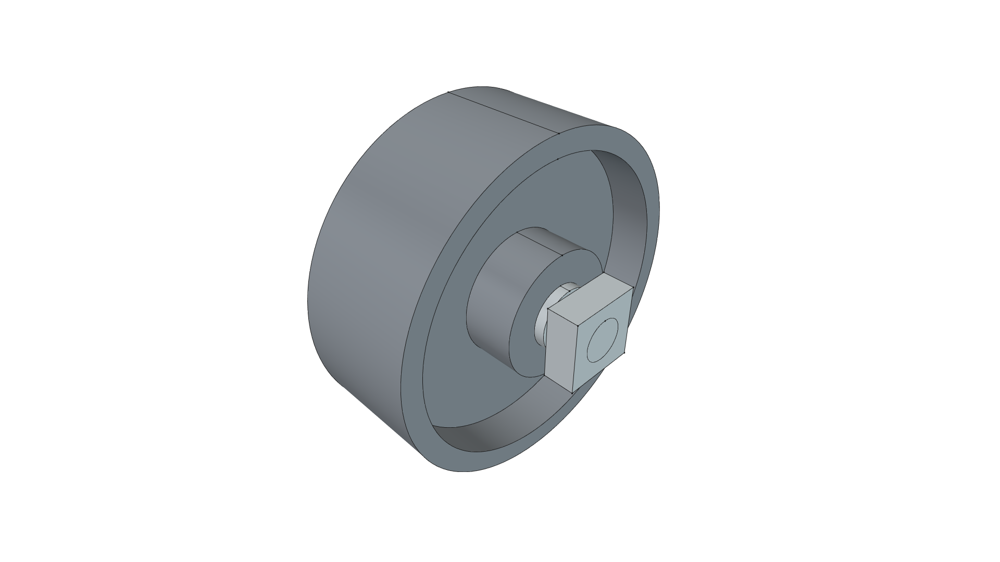
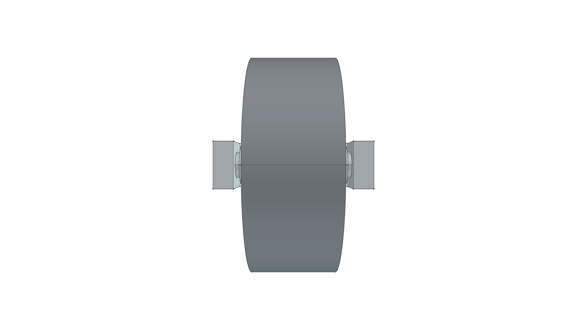
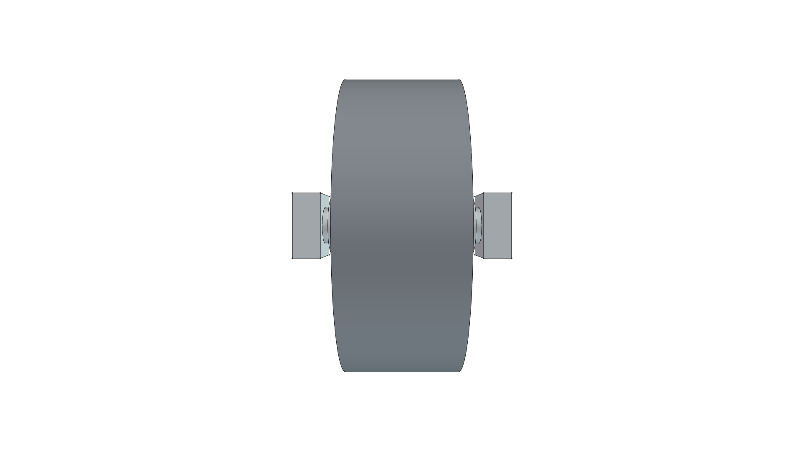
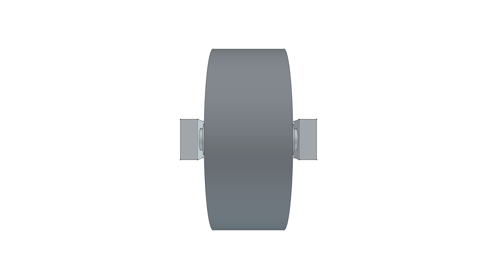
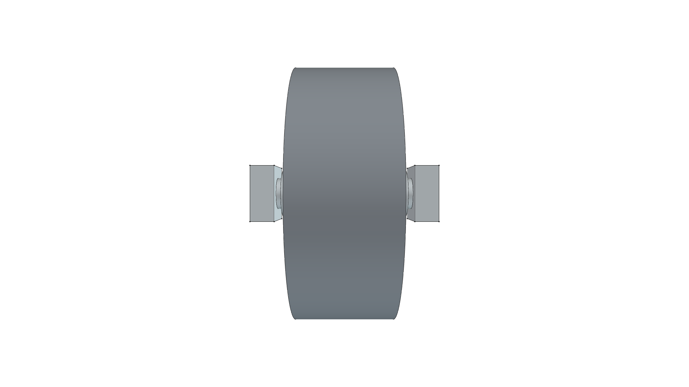

# 4.0" Heavy-Duty Solid Steel Wheel Component

> **Heat-Resistant All-Metal Solid Wheel & Axle Assembly**  
> *Reusable FreeCAD 3D Parametric CAD Component*

**Active CAD Model**: [`steel_caster_wheel.FCStd`](steel_caster_wheel.FCStd)  
**Status**: 🟢 **`[RELEASED]`**  

---



---

## 1. Visual Model Gallery

| Home (Perspective) View | Top Plan View |
| :---: | :---: |
|  |  |
| **Front Elevation** | **Rear Elevation** |
|  |  |
| **Right Side Elevation** | **Left Side Elevation** |
|  |  |
| **Bottom Plan View** | |
|  | |

---

## 2. Component Specifications

- **Wheel Diameter**: $101.6\text{ mm}$ ($4.0\text{ in}$)
- **Tread Face Width**: $38.1\text{ mm}$ ($1.5\text{ in}$)
- **Hub Diameter & Width**: $38.1\text{ mm}$ ($1.5\text{ in}$) diameter $\times 44.45\text{ mm}$ ($1.75\text{ in}$) width across bearing faces
- **Material**: Solid Machined Cast Steel / Ductile Iron
- **Axle Diameter**: $12.7\text{ mm}$ ($1/2\text{ in}$) Grade 5 Zinc-Plated Bolt with Nyloc Nut & Machined Spacers
- **Mounting**: Direct chassis-pin or axle-ear mounting (bracket-less)
- **Application**: High-heat agricultural sleds, thermal weed burners, mobile foundry carts.

---

## 3. Build & Render Command

```bash
/home/phi/AppImages/FreeCAD_1.1.3-Linux-x86_64-py311.AppImage -c "__file__='/home/phi/PROJECTS/phi-WORKS/maker/components/steel_caster_wheel/build.py'; exec(open(__file__).read())"
```
