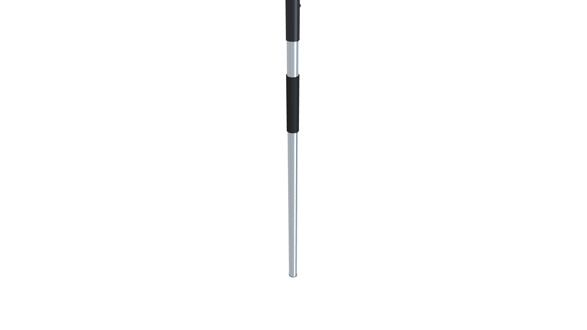
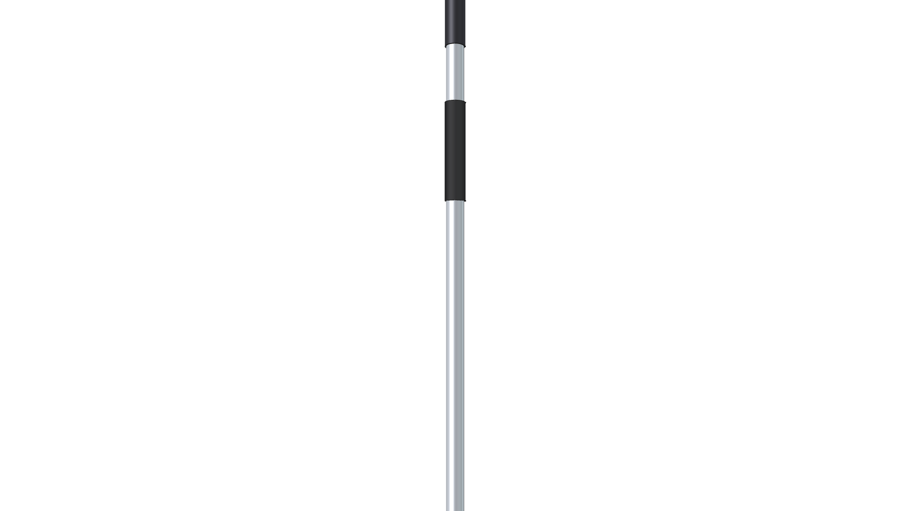
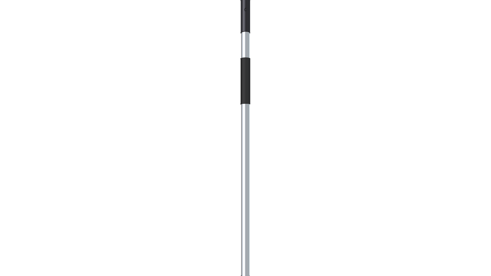
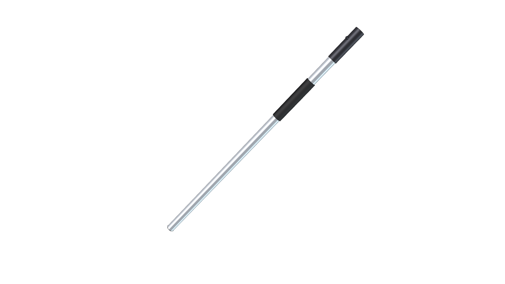
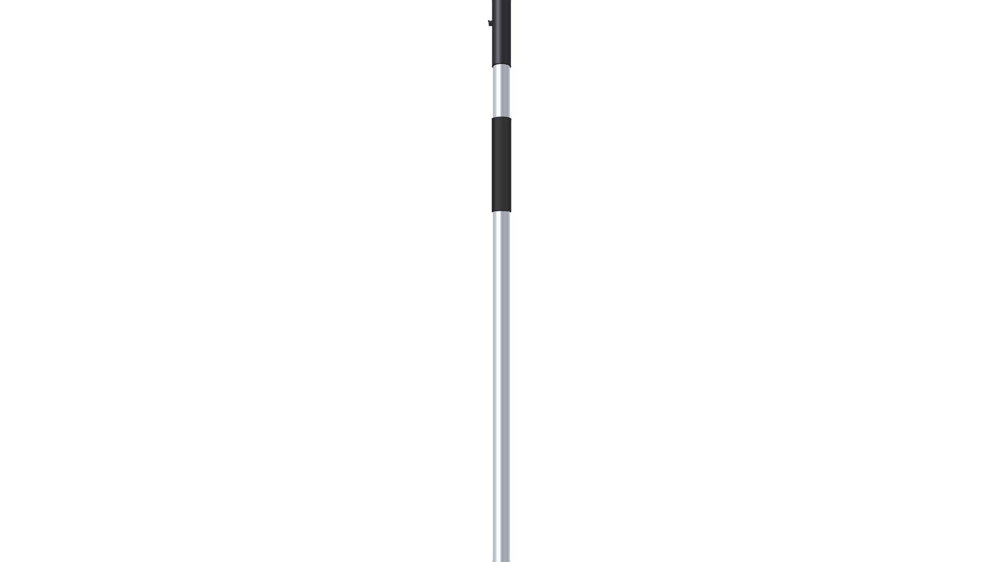
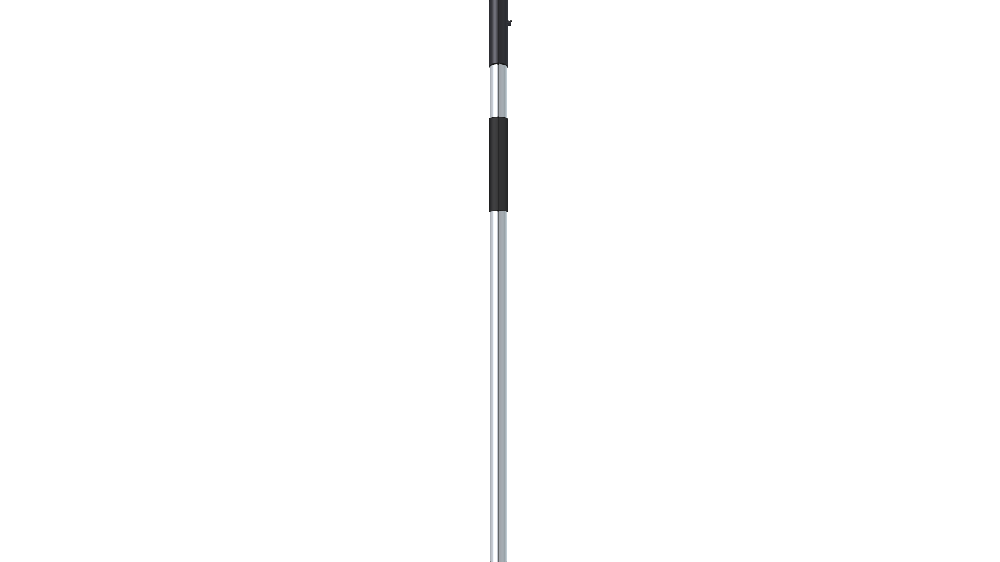

# STIHL KombiSystem Standard Drive Shaft Component

**Component Type**: Commercial Tool Hardware Module  
**Target Applications**: STIHL KombiSystem Attachments (FS-KM, Brush Cutter, FH-KM, HT-KM, FBD-KM)

---

## Component Overview

This module provides the standard, reusable **STIHL 25.4 mm ($1.0''$) aluminum drive shaft tube** shared across straight-shaft attachments:
* **Drive Tube**: Seamless drawn `Aluminum-6061-T6` tube ($25.4\text{ mm}$ OD, $1.65\text{ mm}$ wall).
* **Coupler Sleeve**: Molded polymer quick-connect sleeve with alignment spring-lug (`Plastic-ABS`).
* **Protective Grip**: Molded rubber warning label and safety grip sleeve (`Rubber-Solid`).
* **Standard Length**: $850.0\text{ mm}$ ($33.5''$) from coupler insertion shoulder to lower gearbox receiver.

---



---

## Specifications

| Parameter | Metric (mm) | Imperial (in) | Material |
| :--- | :--- | :--- | :--- |
| **Drive Tube OD** | $25.4\text{ mm}$ | $1.00''$ | `Aluminum-6061-T6` |
| **Tube Wall Thickness** | $1.65\text{ mm}$ | $0.065''$ | `Aluminum-6061-T6` |
| **Coupler Collar OD** | $28.6\text{ mm}$ | $1.125''$ | `Plastic-ABS` |
| **Standard Tube Length** | $850.0\text{ mm}$ | $33.46''$ | `Aluminum-6061-T6` |
| **Total Weight** | $0.325\text{ kg}$ | $0.72\text{ lbs}$ | Composite |

---

## 3D CAD Multi-View Gallery

| Front Elevation | Rear Elevation | Top Plan |
| :---: | :---: | :---: |
|  |  |  |
| **Bottom Plan** | **Left Side** | **Right Side** |
|  |  |  |

---

## Python Usage

```python
from components.kombi_shaft.kombi_shaft import create_kombi_shaft_component

# Add standard shaft to any Kombi tool assembly
shaft_grp = create_kombi_shaft_component(doc, length_mm=850.0, placement=placement)
```
