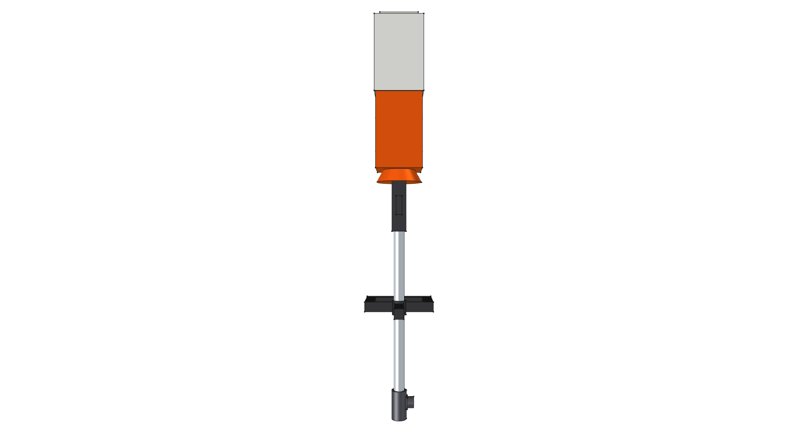
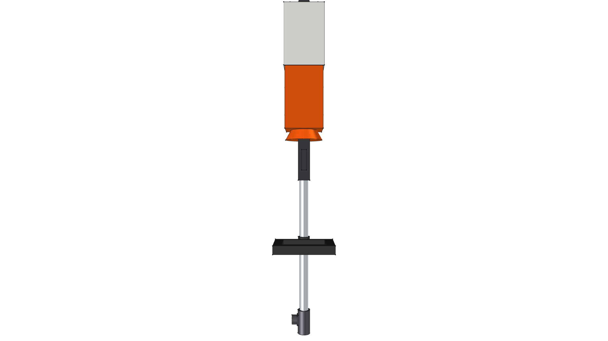
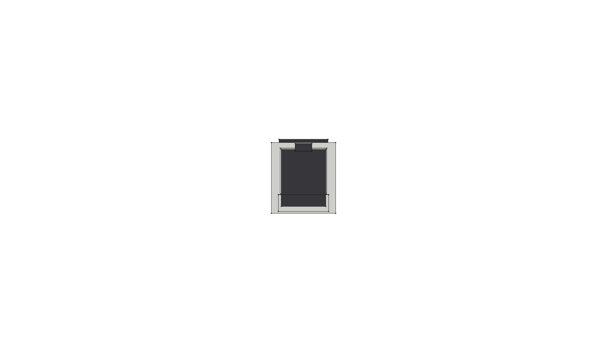
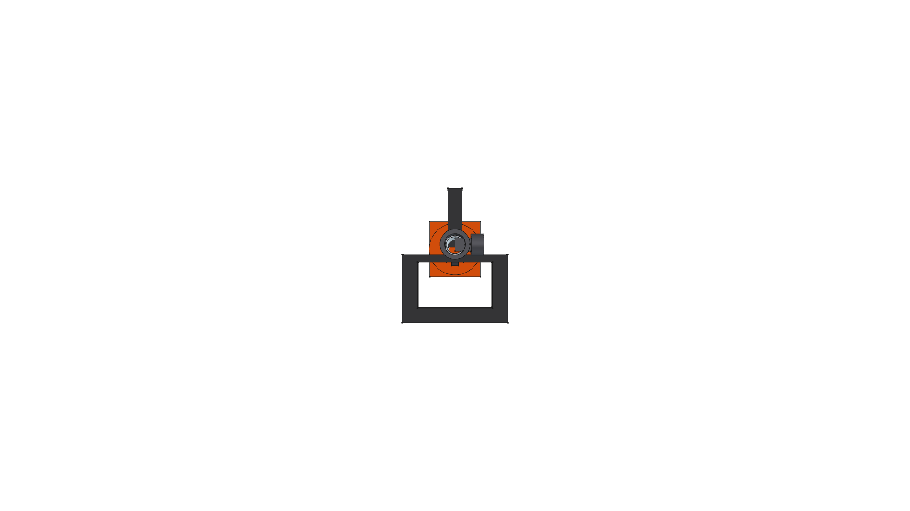
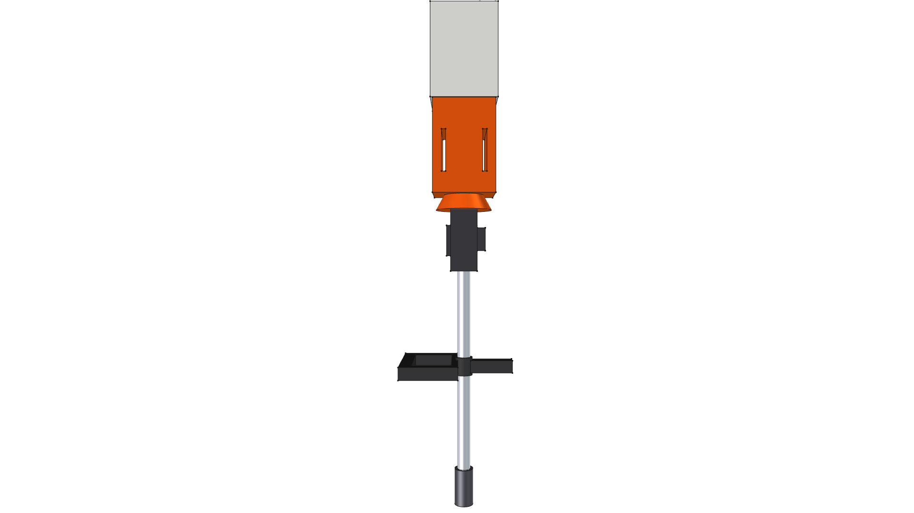
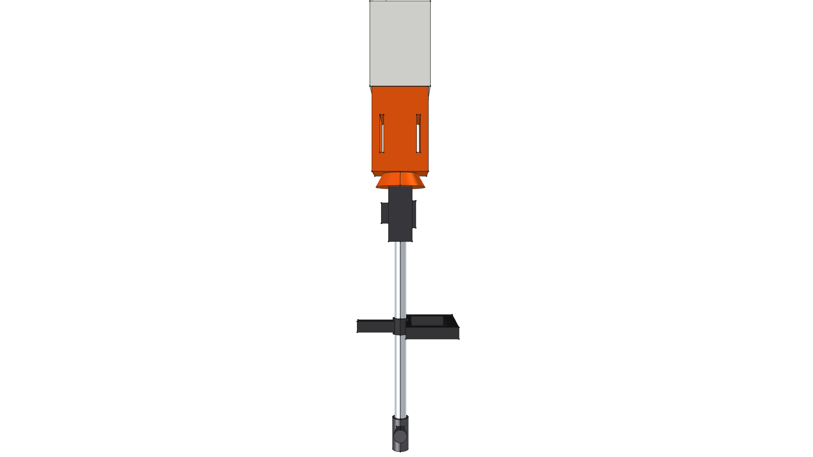

# STIHL KMA 200 R Cordless KombiEngine Power Head Component

**Component Type**: Commercial Power Unit Module  
**Ecosystem**: STIHL AP-System & KombiSystem Multi-Tasking System  
**Target Applications**: Kombi Kaddy Mobile Tool Rack, Ergonomic Cordless Power Driving

---

## Component Overview

This module provides a standalone 3D CAD model for the **STIHL KMA 200 R AP-System KombiEngine Power Head**:
* **EC Brushless Motor Shroud**: STIHL Orange motor casing (`Plastic-StihlOrange`) housing the high-efficiency commercial-grade brushless electric motor and side air louvers.
* **Rear Powerhead & Battery Bay**: STIHL White polymer rear chassis (`Plastic-StihlWhite`) containing electronics and the direct battery insertion slot.
* **AP 500 S Battery Pack**: High-capacity $36\text{V}$ lithium-ion AP-series battery pack (`Plastic-ABS`) with locking release latch.
* **Ergonomic Control Handle**: Multi-function control grip with safety lock lever, variable throttle trigger, and LED speed display.
* **Loop Handle (R)**: Rubberized loop handle clamp (`Rubber-Solid`) with integrated barrier bar for comfortable multi-position maneuvering and leg safety.
* **Quick-Release Tool Coupler**: Split clamping sleeve (`CastIron-Gray`) at the $Z = 0$ mating datum, ready to receive any standard KombiSystem attachment shaft.

---


---

## Specifications

| Parameter | Metric (mm) | Imperial (in) | Material |
| :--- | :--- | :--- | :--- |
| **Overall Length** | $970.0\text{ mm}$ | $38.19''$ | Composite |
| **Drive Tube OD** | $25.4\text{ mm}$ | $1.00''$ | `Aluminum-6061-T6` |
| **Coupler Socket ID** | $25.4\text{ mm}$ | $1.00''$ | `CastIron-Gray` |
| **Battery Compatibility** | STIHL AP System | AP 300 S / AP 500 S | `Plastic-ABS` |
| **Total Weight (with AP 500 S)** | $6.424\text{ kg}$ | $14.16\text{ lbs}$ | Composite |
| **Center of Gravity (Z)** | $+686.97\text{ mm}$ | $+27.05''$ | Centered at rear motor/battery |

---

## 3D CAD Multi-View Gallery

| Front Elevation | Rear Elevation | Top Plan |
| :---: | :---: | :---: |
|  |  |  |
| **Bottom Plan** | **Left Side** | **Right Side** |
|  |  |  |

---

## Python Usage

```python
from phi_works.maker.components import import_component
# Import KMA 200 R power head into any assembly
powerhead = import_component(doc, "stihl_kma200r", placement=placement)
```
