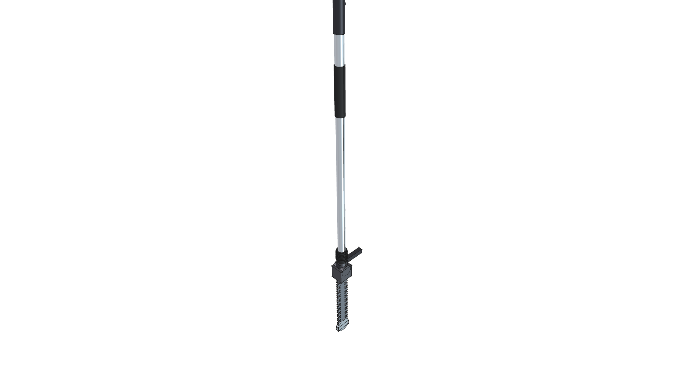
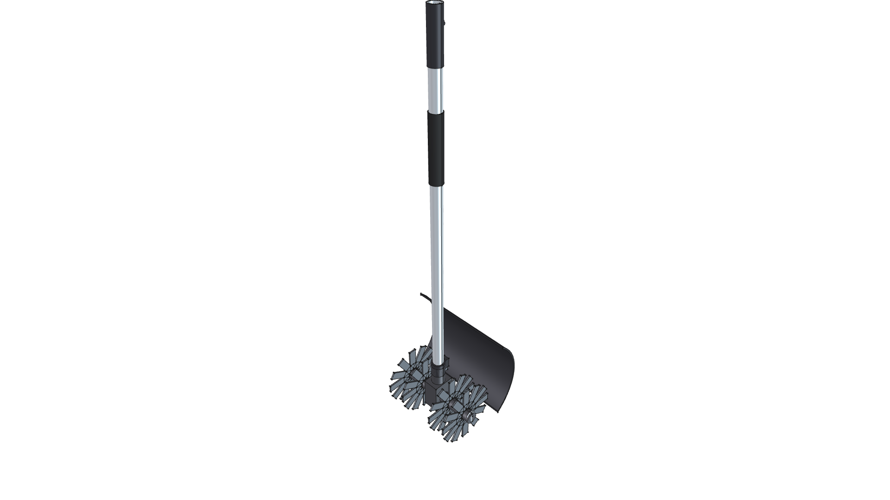

# STIHL KombiSystem Tool Attachments

> **Parametric 3D CAD Library for STIHL Commercial Kombi Attachments**  
> *phi-WORKS Maker Framework (`components/stihl/tools/`)*

---

## Overview

The `components/stihl/tools/` library provides standalone, high-fidelity 3D parametric CAD models for the user's complete fleet of **STIHL KombiSystem Multi-Tasking Attachments**. Each attachment is built as an independent, modular CAD component with FreeCAD 1.1 material definitions, computed mass properties, 3D Center of Gravity (CoG), and a 7-view orthogonal render gallery.

All straight-shaft attachments consume the standardized [**`kombi_shaft`**](../kombi_shaft/) module ($25.4\text{ mm} / 1.0''$ aluminum drive tube with quick-connect coupler), and seamlessly couple with the [**`stihl_kma200r`**](../stihl_kma200r/) cordless KombiEngine at the $Z = 0$ mating datum.

---

## Attachment Fleet Index

| Tool Attachment | Key Features & Specifications | Weight / CoG | Primary Materials | Master Files |
| :--- | :--- | :--- | :--- | :--- |
| [](kombi_trimmer_fs/)<br>**[FS-KM / FSS-KM Line Trimmer](kombi_trimmer_fs/)** | • $35^\circ$ cast magnesium elbow gearcase.<br>• AutoCut 25-2 bump-feed head with white spool rim, white bump knob & dual $2.4\text{ mm}$ orange lines.<br>• Shaft-mounted concentric swept debris guard with line limiter knife. | **4.17 lbs**<br>$(1.890\text{ kg})$<br>CoG Z: $-756.6\text{ mm}$ | `CastIron-Gray`<br>`Plastic-StihlOrange`<br>`Plastic-StihlWhite`<br>`Plastic-ABS` | 📖 [README](kombi_trimmer_fs/README.md)<br>🛠️ [`build.py`](kombi_trimmer_fs/build.py)<br>📦 [`kombi_trimmer_fs.FCStd`](kombi_trimmer_fs/kombi_trimmer_fs.FCStd) |
| [](kombi_brushcutter_fs/)<br>**[FS-KM Brush Cutter](kombi_brushcutter_fs/)** | • $35^\circ$ cast magnesium gearcase.<br>• $250\text{ mm}$ ($9.8''$) 3-tooth triangular hardened steel brush knife.<br>• Gliding ground rider cup & clamp nut.<br>• Shaft-mounted concentric swept debris shield. | **4.54 lbs**<br>$(2.059\text{ kg})$<br>CoG Z: $-765.8\text{ mm}$ | `Steel-A36`<br>`CastIron-Gray`<br>`Steel-ZincPlated`<br>`Plastic-StihlOrange` | 📖 [README](kombi_brushcutter_fs/README.md)<br>🛠️ [`build.py`](kombi_brushcutter_fs/build.py)<br>📦 [`kombi_brushcutter_fs.FCStd`](kombi_brushcutter_fs/kombi_brushcutter_fs.FCStd) |
| [](kombi_blower_bg/)<br>**[BG-KM In-Line Blower](kombi_blower_bg/)** | • Concentric coaxial architecture.<br>• $6.0''$ ($152.4\text{ mm}$) diameter ribbed white polymer impeller housing with clamshell screw bosses.<br>• STIHL Orange top collar cap.<br>• Two-stage tapered black discharge funnel & nozzle. | **2.59 lbs**<br>$(1.173\text{ kg})$<br>CoG Z: $-448.5\text{ mm}$ | `Plastic-StihlWhite`<br>`Plastic-StihlOrange`<br>`Plastic-ABS`<br>`Aluminum-6061-T6` | 📖 [README](kombi_blower_bg/README.md)<br>🛠️ [`build.py`](kombi_blower_bg/build.py)<br>📦 [`kombi_blower_bg.FCStd`](kombi_blower_bg/kombi_blower_bg.FCStd) |
| [](kombi_scythe_fh/)<br>**[FH-KM 145° Power Scythe](kombi_scythe_fh/)** | • $145^\circ$ articulating indexing knuckle gearbox.<br>• Top ergonomic angle adjustment latch lever.<br>• Corrugated black rubber joint boot.<br>• $250\text{ mm}$ dual reciprocating scythe teeth & rounded curb skid shoe. | **4.31 lbs**<br>$(1.955\text{ kg})$<br>CoG Z: $-854.7\text{ mm}$ | `CastIron-Gray`<br>`Steel-A36`<br>`Steel-ZincPlated`<br>`Rubber-Solid` | 📖 [README](kombi_scythe_fh/README.md)<br>🛠️ [`build.py`](kombi_scythe_fh/build.py)<br>📦 [`kombi_scythe_fh.FCStd`](kombi_scythe_fh/kombi_scythe_fh.FCStd) |
| [](kombi_pruner_ht/)<br>**[HT-KM 12" Pole Pruner](kombi_pruner_ht/)** | • In-line $12''$ ($300\text{ mm}$) Rollomatic E Mini guide bar & Picco saw chain extending along drive shaft axis.<br>• Lower shaft ribbed rubber grip sleeve.<br>• Cast head with branch hook.<br>• Translucent oil tank & single captive bar nut cover. | **6.67 lbs**<br>$(3.026\text{ kg})$<br>CoG Z: $-828.1\text{ mm}$ | `CastIron-Gray`<br>`Plastic-StihlWhite`<br>`Steel-A36`<br>`Plastic-StihlOrange` | 📖 [README](kombi_pruner_ht/README.md)<br>🛠️ [`build.py`](kombi_pruner_ht/build.py)<br>📦 [`kombi_pruner_ht.FCStd`](kombi_pruner_ht/kombi_pruner_ht.FCStd) |
| [](kombi_bed_redefiner_fbd/)<br>**[FBD-KM Bed Redefiner](kombi_bed_redefiner_fbd/)** | • Right-angle cast gearbox with transverse axle journal.<br>• $180\text{ mm}$ white hub wheel with solid black rubber tire on right (+X) side.<br>• 4-tine bent scoop digging rotor ($200\text{ mm}$ dia) on left (-X) side.<br>• Contoured STIHL Orange debris canopy. | **10.98 lbs**<br>$(4.981\text{ kg})$<br>CoG Z: $-844.0\text{ mm}$ | `CastIron-Gray`<br>`Steel-A36`<br>`Rubber-Solid`<br>`Plastic-StihlWhite` | 📖 [README](kombi_bed_redefiner_fbd/README.md)<br>🛠️ [`build.py`](kombi_bed_redefiner_fbd/build.py)<br>📦 [`kombi_bed_redefiner_fbd.FCStd`](kombi_bed_redefiner_fbd/kombi_bed_redefiner_fbd.FCStd) |
| [](kombi_cultivator_bf/)<br>**[BF-KM Mini-Cultivator](kombi_cultivator_bf/)** | • Center worm-drive cast transmission gearbox.<br>• Arched black high-impact polymer soil fender clamped to shaft.<br>• 4-rotor starburst pick tines ($220\text{ mm}$ tilling width) with 12 curved digging teeth per rotor.<br>• Hairpin lynch pin axle retainers. | **8.38 lbs**<br>$(3.803\text{ kg})$<br>CoG Z: $-842.3\text{ mm}$ | `CastIron-Gray`<br>`Steel-A36`<br>`Plastic-ABS`<br>`Steel-ZincPlated` | 📖 [README](kombi_cultivator_bf/README.md)<br>🛠️ [`build.py`](kombi_cultivator_bf/build.py)<br>📦 [`kombi_cultivator_bf.FCStd`](kombi_cultivator_bf/kombi_cultivator_bf.FCStd) |

---

## Python Assembly Usage

Import any Kombi tool directly into project assemblies (e.g., [Kombi Kaddy](../../../projects/kombi-kaddy/)):

```python
from phi_works.maker.components import import_component

# Import tools by name (automatic recursive resolution)
trimmer = import_component(doc, "kombi_trimmer_fs", placement=placement_slot1)
pruner  = import_component(doc, "kombi_pruner_ht",  placement=placement_slot2)
edger   = import_component(doc, "kombi_bed_redefiner_fbd", placement=placement_slot3)
tiller  = import_component(doc, "kombi_cultivator_bf", placement=placement_slot4)
blower  = import_component(doc, "kombi_blower_bg",  placement=placement_slot5)
scythe  = import_component(doc, "kombi_scythe_fh",  placement=placement_slot6)
brush   = import_component(doc, "kombi_brushcutter_fs", placement=placement_slot7)
```
