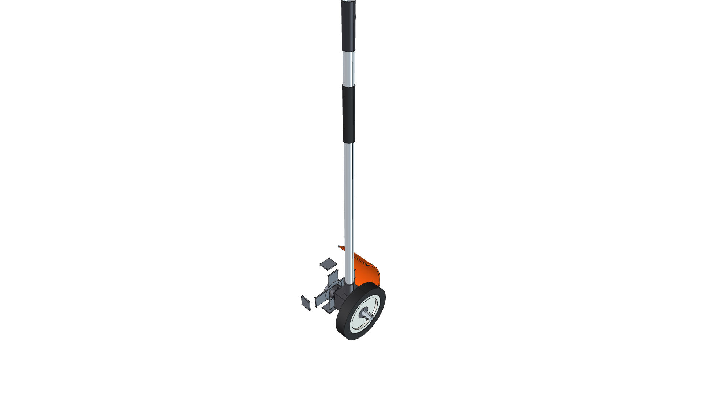
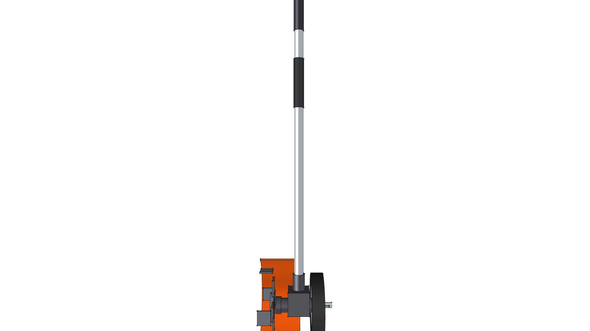
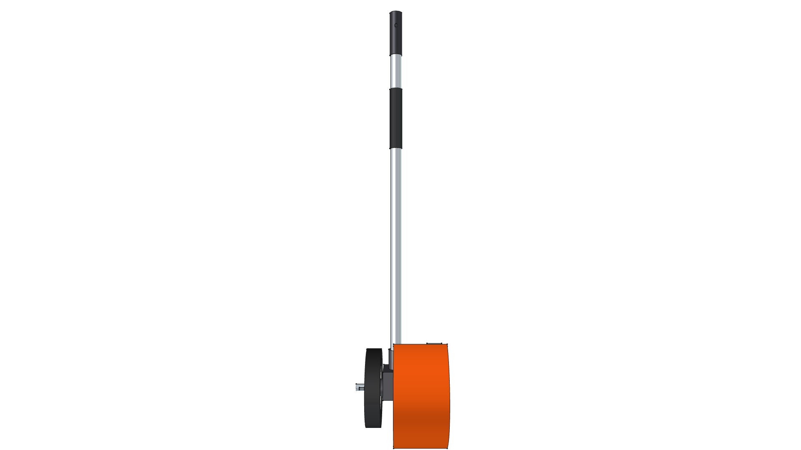
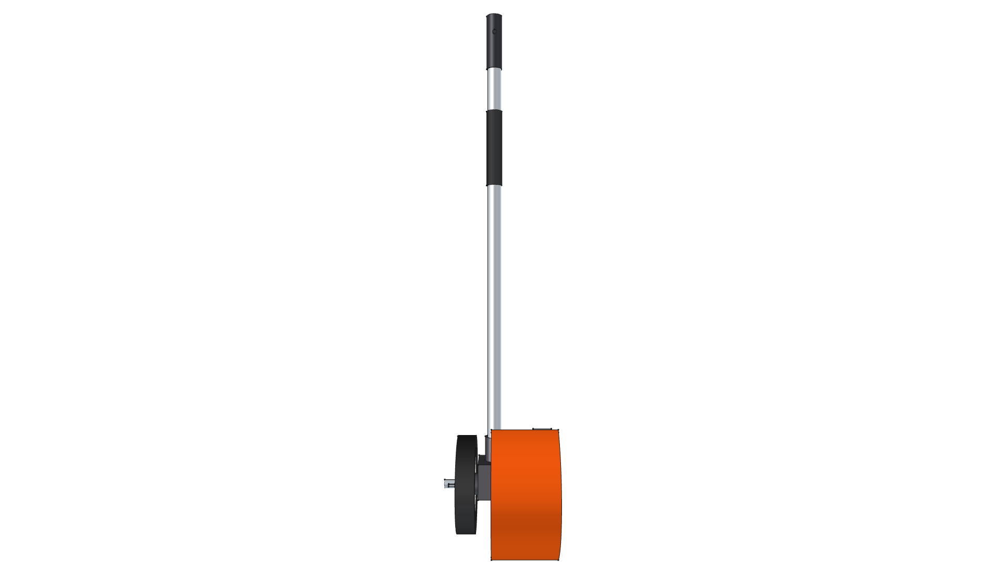
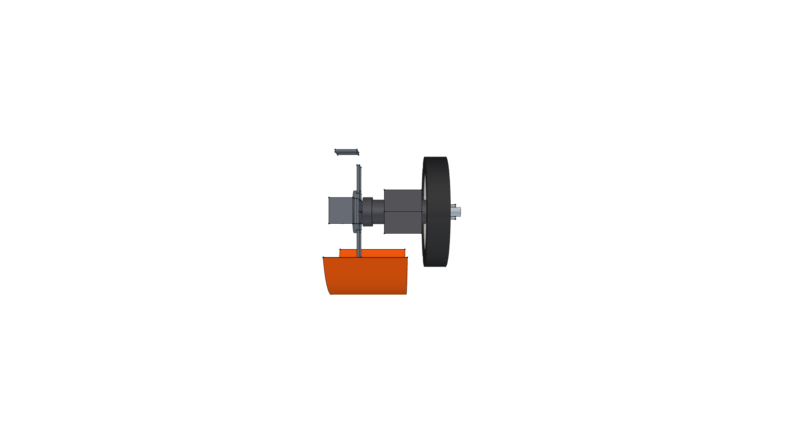
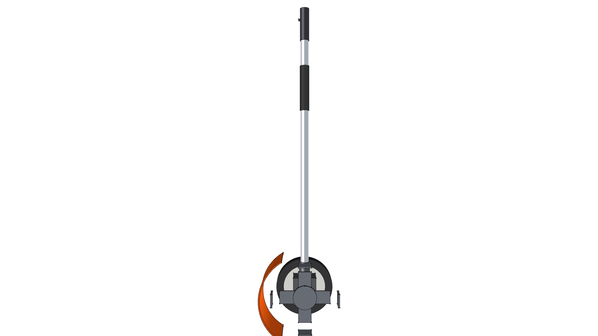
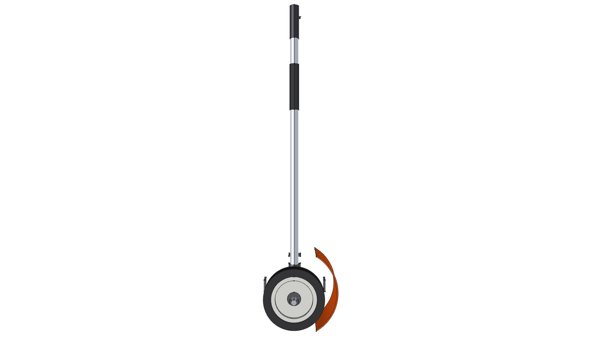

# STIHL FBD-KM Bed Redefiner Component

**Component Type**: Commercial Tool Attachment Module  
**Ecosystem**: STIHL KombiSystem Multi-Tasking System  
**Target Applications**: Kombi Kaddy Mobile Tool Rack, Landscape Flowerbed Trenching & Edging

---

## Component Overview

This module provides a standalone 3D CAD model for the **STIHL FBD-KM Bed Redefiner Attachment**:
* **Drive Shaft**: Standard STIHL 25.4 mm ($1.0''$) aluminum drive tube consuming the [kombi_shaft](../kombi_shaft/) module.
* **Cast Gearcase with Axle Journal**: Heavy-duty right-angle gearbox (`CastIron-Gray`) with transverse axle and bearing housing.
* **White Hub Guide Wheel**: $180\text{ mm}$ ($7.09''$) guide wheel featuring a STIHL White molded polymer hub (`Plastic-StihlWhite`) and solid black rubber tire (`Rubber-Solid`), retained by zinc-plated axle bolt and wing nut (`Steel-ZincPlated`) on the right (+X) side.
* **4-Tine Digging Rotor**: 200 mm ($7.87''$) steel rotor (`Steel-A36`) with $90^\circ$ bent spade scoop tines on the left (-X) side designed to slice and throw edge mulch cleanly into the landscape bed.
* **STIHL Orange Debris Canopy**: High-impact polymer deflector shield (`Plastic-StihlOrange`) overarching the cutting rotor to protect against flying dirt and stones.

---



---

## Specifications

| Parameter | Metric (mm) | Imperial (in) | Material |
| :--- | :--- | :--- | :--- |
| **Overall Length** | $970.0\text{ mm}$ | $38.19''$ | Composite |
| **Drive Tube OD** | $25.4\text{ mm}$ | $1.00''$ | `Aluminum-6061-T6` |
| **Digging Rotor Diameter** | $200.0\text{ mm}$ | $7.87''$ | `Steel-A36` |
| **Guide Wheel OD** | $180.0\text{ mm}$ | $7.09''$ | `Rubber-Solid` / `Plastic-StihlWhite` |
| **Total Weight** | $4.981\text{ kg}$ | $10.98\text{ lbs}$ | Composite |
| **Center of Gravity (Z)** | $-843.96\text{ mm}$ | $-33.23''$ | Concentrated at gearhead |

---

## 3D CAD Multi-View Gallery

| Front Elevation | Rear Elevation | Top Plan |
| :---: | :---: | :---: |
|  |  |  |
| **Bottom Plan** | **Left Side** | **Right Side** |
|  |  |  |

---

## Python Usage

```python
from phi_works.maker.components import import_component
# Import bed redefiner into any assembly
redefiner = import_component(doc, "kombi_bed_redefiner_fbd", placement=placement)
```
