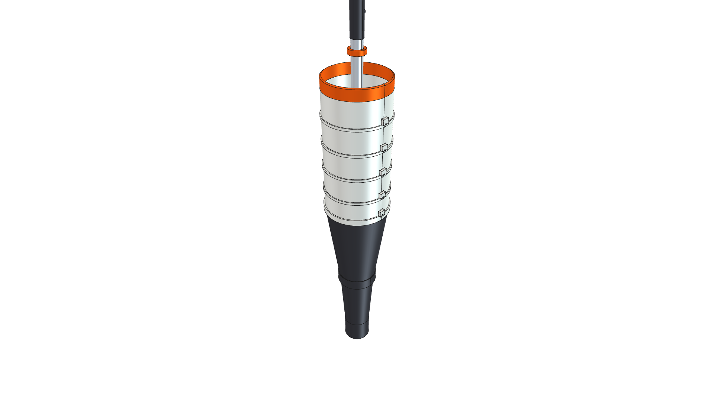
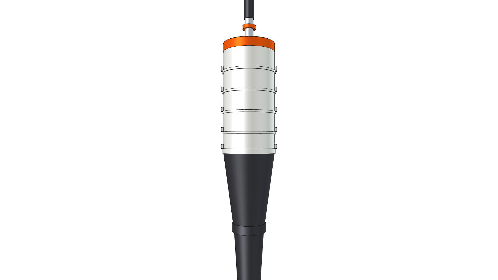
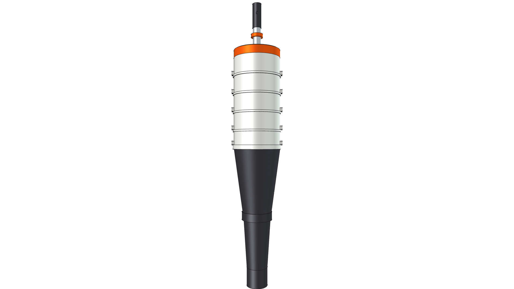
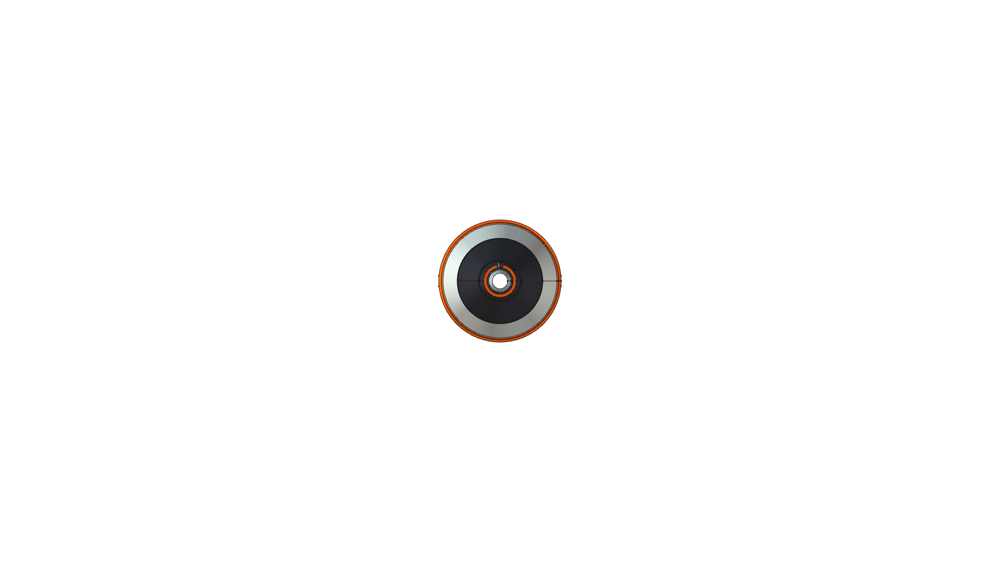
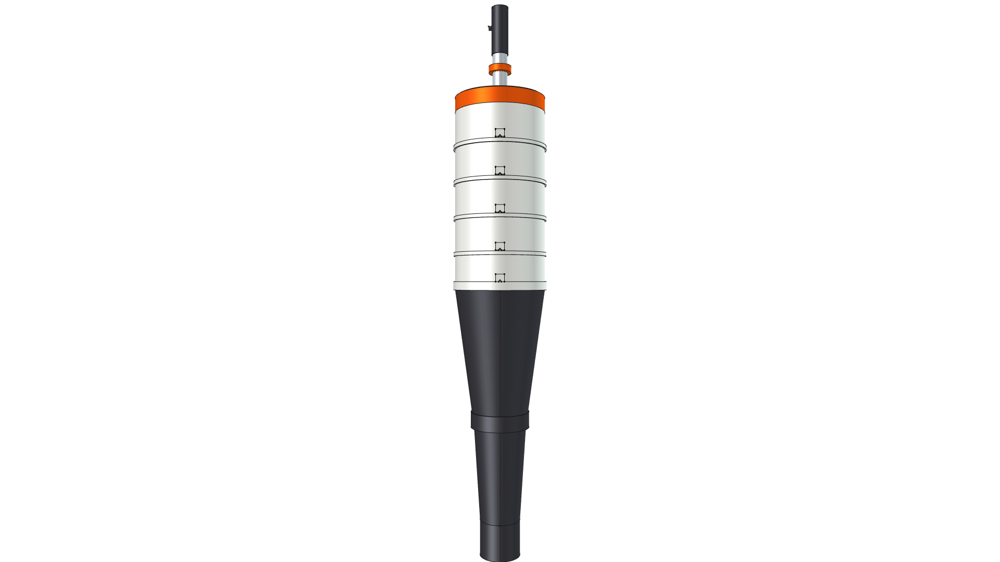

# STIHL BG-KM In-Line Axial Blower Attachment Component

**Component Type**: Commercial Tool Attachment Module  
**Ecosystem**: STIHL KombiSystem Multi-Tasking System  
**Target Applications**: Kombi Kaddy Mobile Tool Rack, High-Velocity Air Clearance

---

## Component Overview

This module provides a standalone 3D CAD model for the **STIHL BG-KM In-Line Axial Blower Attachment**:
* **Coaxial Architecture**: The entire blower body and discharge tube are mounted concentrically along the drive shaft axis.
* **Drive Shaft Stub**: Standard STIHL 25.4 mm ($1.0''$) aluminum drive tube with quick-connect coupler sleeve.
* **Top Air Cap / Housing**: Contoured $6.0''$ ($152.4\text{ mm}$) diameter polymer collar cap (`Plastic-StihlOrange`).
* **White Ribbed Blower Body**: High-impact polymer cylindrical clamshell housing ($6.0''$ / $152.4\text{ mm}$ OD, `Plastic-StihlWhite`) featuring circumferential stiffening ribs and clamshell screw bosses.
* **Black Two-Stage Discharge Nozzle**:
  * **Reduction Cone**: Smooth $6.0''$ to $3.6''$ ($92\text{ mm}$) aerodynamic transition cone with latch collar ring.
  * **Extension Tube & Tip**: $3.5''$ down to $2.7''$ ($68\text{ mm}$) high-velocity straight discharge nozzle mouth (`Plastic-ABS`).

---



---

## Specifications

| Parameter | Metric (mm) | Imperial (in) | Material |
| :--- | :--- | :--- | :--- |
| **Overall Length** | $930.0\text{ mm}$ | $36.61''$ | Composite |
| **Drive Tube OD** | $25.4\text{ mm}$ | $1.00''$ | `Aluminum-6061-T6` |
| **Blower Body OD** | $152.4\text{ mm}$ | $6.00''$ | `Plastic-StihlWhite` |
| **Nozzle Tip OD** | $68.0\text{ mm}$ | $2.68''$ | `Plastic-ABS` |
| **Total Weight** | $1.191\text{ kg}$ | $2.63\text{ lbs}$ | Composite |
| **Center of Gravity (Z)** | $-459.03\text{ mm}$ | $-18.07''$ | Concentric along centerline |

---

## 3D CAD Multi-View Gallery

| Front Elevation | Rear Elevation | Top Plan |
| :---: | :---: | :---: |
|  |  |  |
| **Bottom Plan** | **Left Side** | **Right Side** |
|  |  |  |

---

## Python Usage

```python
from phi_works.maker.components import import_component
# Import axial blower into any assembly
blower = import_component(doc, "kombi_blower_bg", placement=placement)
```
