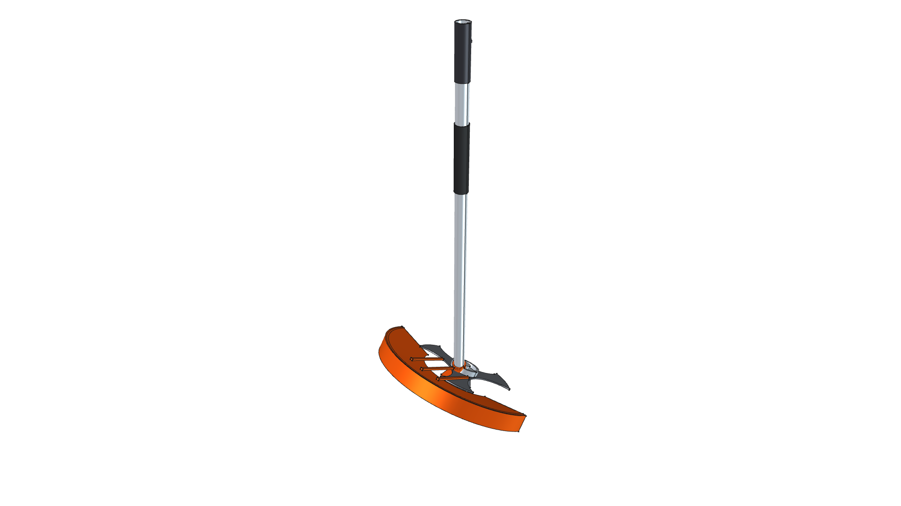
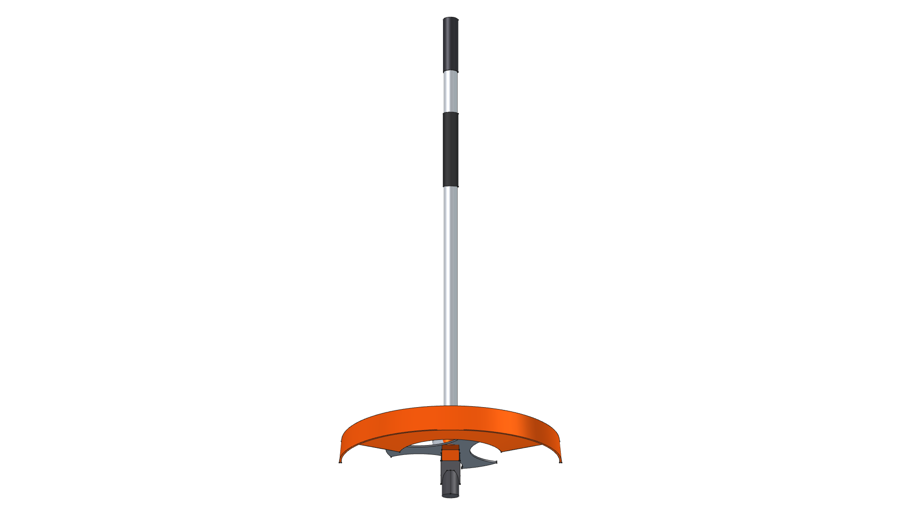
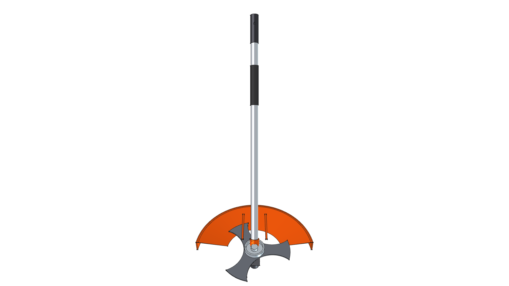
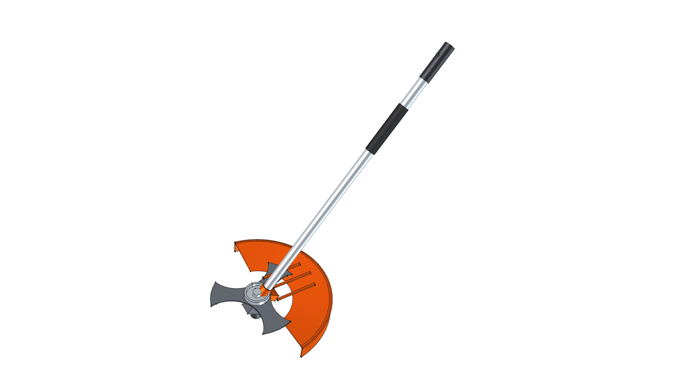
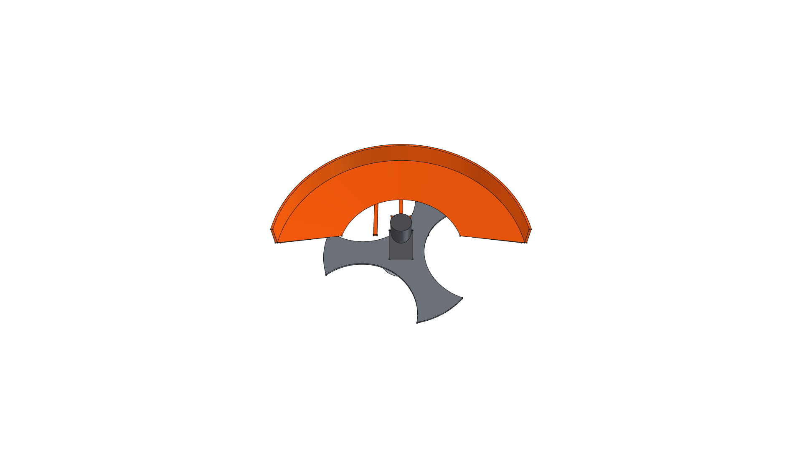
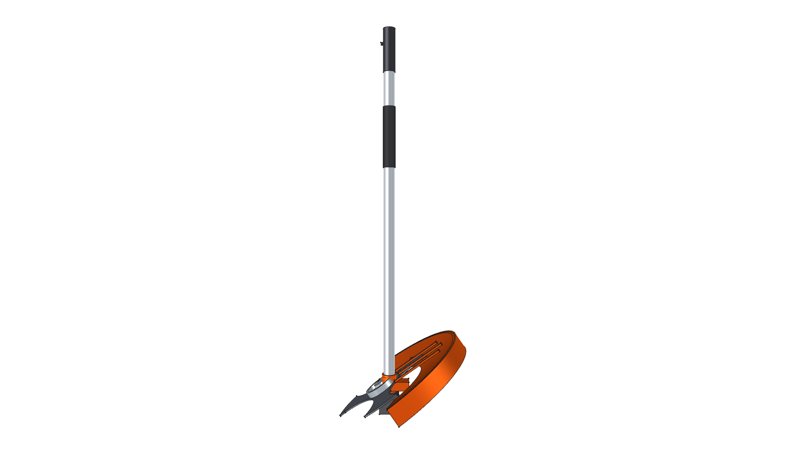
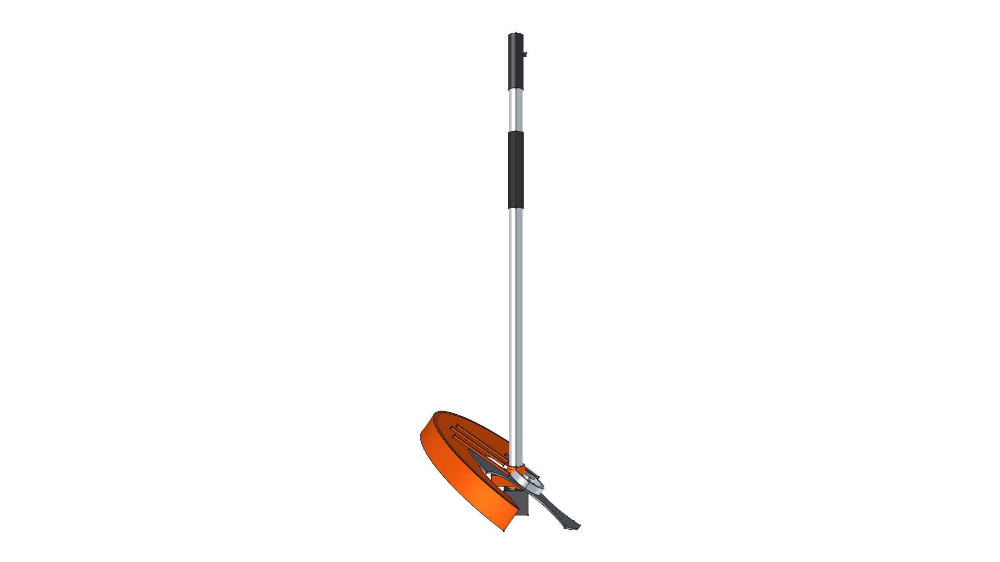

# STIHL FS-KM Brush Cutter Component (3-Tooth Metal Brush Knife)

**Component Type**: Commercial Tool Attachment Module  
**Ecosystem**: STIHL KombiSystem Multi-Tasking System  
**Target Applications**: Kombi Kaddy Mobile Tool Rack, Heavy Scrub & Brush Clearing

---

## Component Overview

This module provides a standalone 3D CAD model for the **STIHL FS-KM Brush Cutter Attachment**:
* **Drive Shaft**: Standard STIHL 25.4 mm ($1.0''$) aluminum drive tube consuming the [kombi_shaft](../kombi_shaft/) module.
* **$35^\circ$ Cast Gearcase**: Die-cast aluminum/magnesium gearhead (`CastIron-Gray`) with service lube port.
* **Shaft-Mounted Concentric Debris Shield**: STIHL Orange polymer guard (`Plastic-StihlOrange`) clamped directly to the aluminum drive tube, identical to the string trimmer mounting architecture.
* **3-Tooth Triangular Steel Brush Knife**: $250\text{ mm}$ ($9.8''$) diameter, $3\text{ mm}$ thick hardened steel brush knife (`Steel-A36`) designed for thick weeds, reeds, and tough scrub.
* **Gliding Ground Rider Cup**: Stamped zinc-plated steel runner cup (`Steel-ZincPlated`) with recessed retaining nut to glide smoothly over rocks and uneven terrain.

---



---

## Specifications

| Parameter | Metric (mm) | Imperial (in) | Material |
| :--- | :--- | :--- | :--- |
| **Overall Length** | $925.0\text{ mm}$ | $36.42''$ | Composite |
| **Drive Tube OD** | $25.4\text{ mm}$ | $1.00''$ | `Aluminum-6061-T6` |
| **Blade Diameter** | $250.0\text{ mm}$ | $9.84''$ | `Steel-A36` |
| **Blade Thickness** | $3.0\text{ mm}$ | $0.12''$ | `Steel-A36` |
| **Rider Cup Diameter** | $70.0\text{ mm}$ | $2.76''$ | `Steel-ZincPlated` |
| **Total Weight** | $2.059\text{ kg}$ | $4.54\text{ lbs}$ | Composite |
| **Center of Gravity (Z)** | $-765.78\text{ mm}$ | $-30.15''$ | Concentrated at gearhead |

---

## 3D CAD Multi-View Gallery

| Front Elevation | Rear Elevation | Top Plan |
| :---: | :---: | :---: |
|  |  |  |
| **Bottom Plan** | **Left Side** | **Right Side** |
|  |  |  |

---

## Python Usage

```python
from phi_works.maker.components import import_component
# Import brush cutter into any assembly
brushcutter = import_component(doc, "kombi_brushcutter_fs", placement=placement)
```
