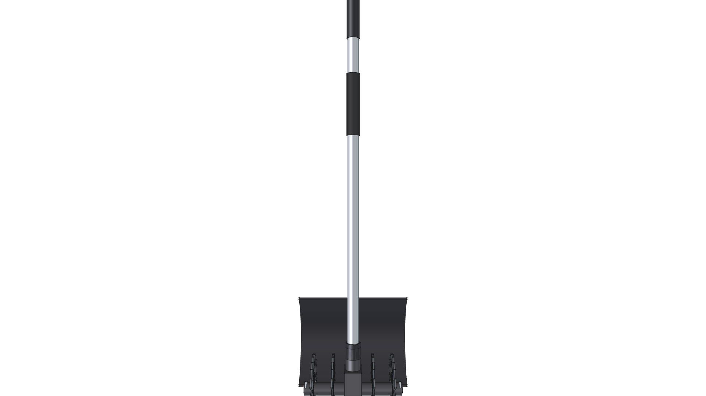
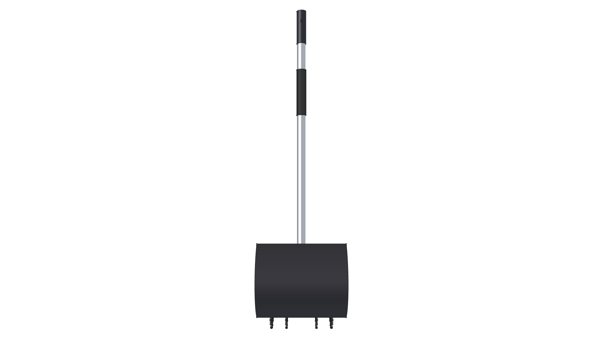
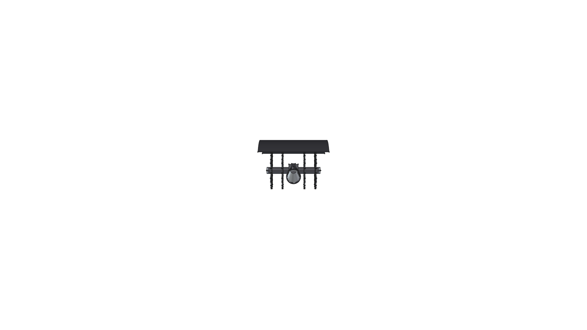
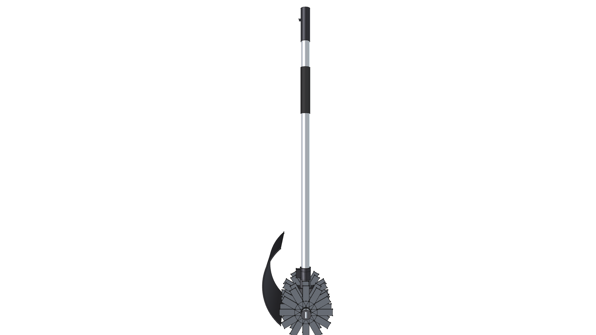
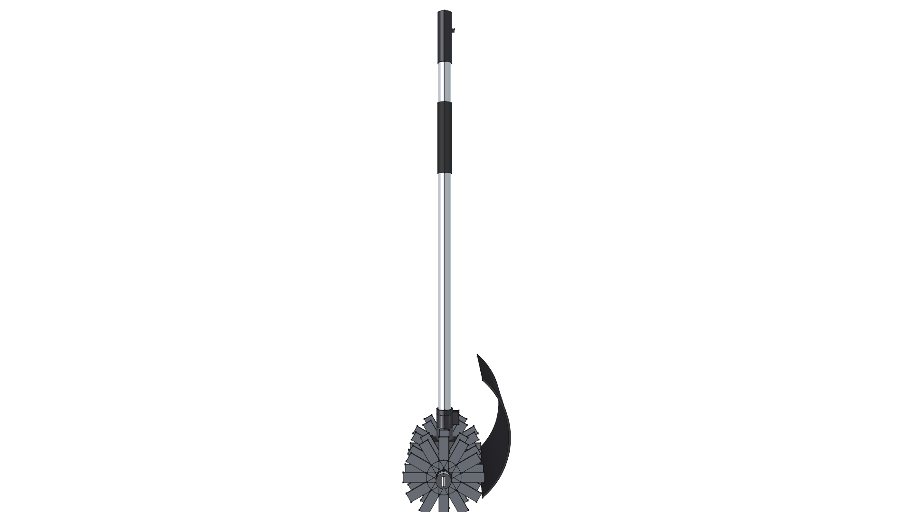

# STIHL BF-KM Mini-Cultivator Component

**Component Type**: Commercial Tool Attachment Module  
**Ecosystem**: STIHL KombiSystem Multi-Tasking System  
**Target Applications**: Kombi Kaddy Mobile Tool Rack, Garden Bed Tilling & Soil Aeration

---

## Component Overview

This module provides a standalone 3D CAD model for the **STIHL BF-KM Mini-Cultivator Attachment**:
* **Drive Shaft**: Standard STIHL 25.4 mm ($1.0''$) aluminum drive tube consuming the [kombi_shaft](../kombi_shaft/) module.
* **Center Worm-Drive Transmission**: High-reduction cast magnesium worm drive gearbox (`CastIron-Gray`) driving the heavy-duty horizontal rotor axle.
* **Arched Soil Debris Fender**: Wide-coverage black polymer hood (`Plastic-ABS`) clamped directly to the lower drive shaft tube to shield the operator from flying rocks and tilled soil.
* **4-Rotor Digging Pick Tines**: Four heavy-duty pick tine discs (`Steel-A36`) featuring 12 curved starburst digging teeth per rotor ($220\text{ mm} / 8.7''$ total working width, $200\text{ mm} / 7.9''$ tine diameter).
* **Lynch Pin Retainers**: Zinc-plated hairpin lynch pins (`Steel-ZincPlated`) securing the tine rotors to the axle shafts.

---


---

## Specifications

| Parameter | Metric (mm) | Imperial (in) | Material |
| :--- | :--- | :--- | :--- |
| **Overall Length** | $975.0\text{ mm}$ | $38.39''$ | Composite |
| **Drive Tube OD** | $25.4\text{ mm}$ | $1.00''$ | `Aluminum-6061-T6` |
| **Working Tilling Width** | $220.0\text{ mm}$ | $8.66''$ | `Steel-A36` |
| **Tine Rotor OD** | $200.0\text{ mm}$ | $7.87''$ | `Steel-A36` |
| **Total Weight** | $3.803\text{ kg}$ | $8.38\text{ lbs}$ | Composite |
| **Center of Gravity (Z)** | $-842.30\text{ mm}$ | $-33.16''$ | Concentrated at rotor center |

---

## 3D CAD Multi-View Gallery

| Front Elevation | Rear Elevation | Top Plan |
| :---: | :---: | :---: |
|  |  |  |
| **Bottom Plan** | **Left Side** | **Right Side** |
|  |  |  |

---

## Python Usage

```python
from phi_works.maker.components import import_component
# Import mini-cultivator into any assembly
cultivator = import_component(doc, "kombi_cultivator_bf", placement=placement)
```
