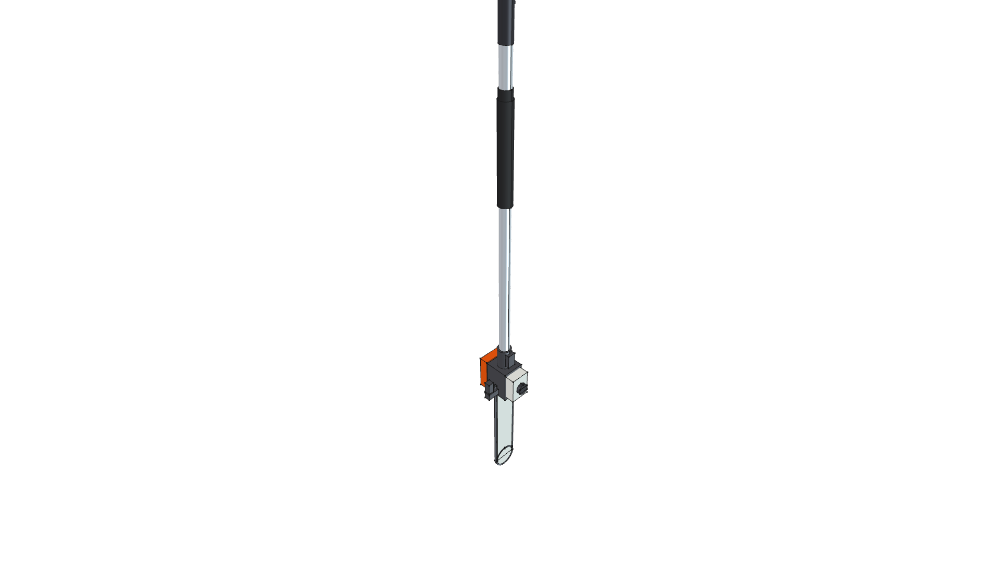
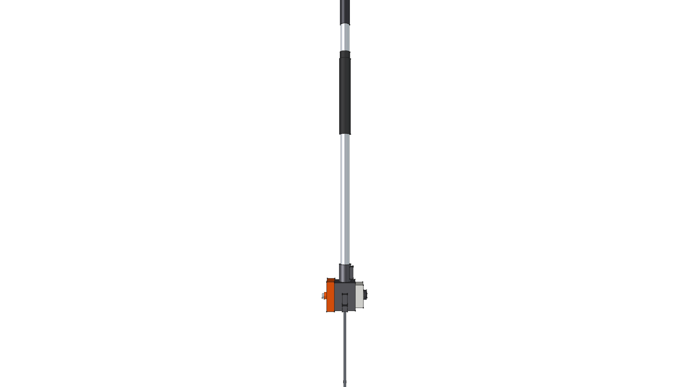
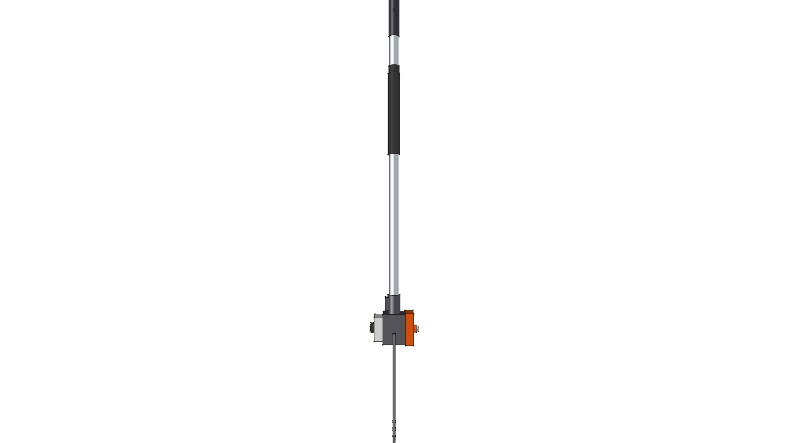
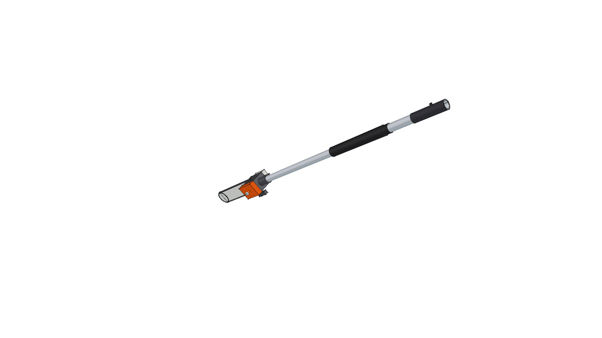
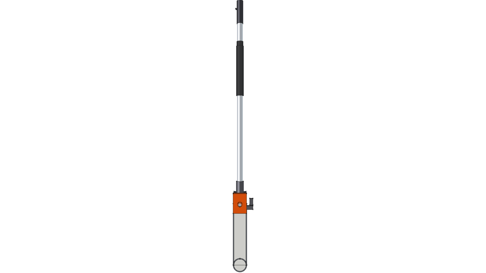
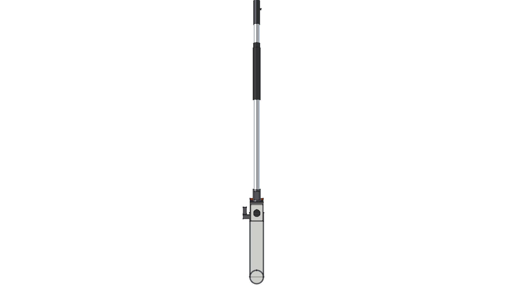

# STIHL HT-KM 12" Pole Pruner Chainsaw Component

**Component Type**: Commercial Tool Attachment Module  
**Ecosystem**: STIHL KombiSystem Multi-Tasking System  
**Target Applications**: Kombi Kaddy Mobile Tool Rack, Overhead Branch Trimming

---

## Component Overview

This module provides a standalone 3D CAD model for the authentic **STIHL HT-KM 12" Pole Pruner Attachment**:
* **Drive Shaft**: Standard STIHL 25.4 mm ($1.0''$) aluminum drive tube consuming the [kombi_shaft](../kombi_shaft/) module, equipped with a lower ribbed rubber handle grip sleeve (`Rubber-Solid`).
* **In-Line Guide Bar & Chain**: The 12" ($300\text{ mm}$) Rollomatic E Mini guide bar (`Plastic-StihlWhite`) and Picco Micro Mini saw chain (`Steel-A36`) extend straight along the axis of the drive tube for maximum reach into tree canopies.
* **Cast Magnesium Drive Head**: Compact cast gearcase (`CastIron-Gray`) with clamp collar and integrated rear branch hook.
* **Translucent Bar Oil Reservoir**: Side-mounted tank with black quarter-turn toolless filler cap (`Plastic-ABS`).
* **Sprocket Cover**: Contoured STIHL Orange polymer cover (`Plastic-StihlOrange`) retained by a single captive zinc-plated bar nut (`Steel-ZincPlated`).

---



---

## Specifications

| Parameter | Metric (mm) | Imperial (in) | Material |
| :--- | :--- | :--- | :--- |
| **Overall Length** | $1245.0\text{ mm}$ | $49.02''$ | Composite |
| **Drive Tube OD** | $25.4\text{ mm}$ | $1.00''$ | `Aluminum-6061-T6` |
| **Guide Bar Length** | $300.0\text{ mm}$ | $12.00''$ | `Plastic-StihlWhite` / `Steel-A36` |
| **Bar Nut** | Single Captive Nut | $19\text{ mm}$ Hex | `Steel-ZincPlated` |
| **Total Weight** | $3.026\text{ kg}$ | $6.67\text{ lbs}$ | Composite |
| **Center of Gravity (Z)** | $-828.12\text{ mm}$ | $-32.60''$ | Concentrated at gearhead |

---

## 3D CAD Multi-View Gallery

| Front Elevation | Rear Elevation | Top Plan |
| :---: | :---: | :---: |
|  |  |  |
| **Bottom Plan** | **Left Side** | **Right Side** |
|  |  |  |

---

## Python Usage

```python
from phi_works.maker.components import import_component
# Import pole pruner into any assembly
pruner = import_component(doc, "kombi_pruner_ht", placement=placement)
```
