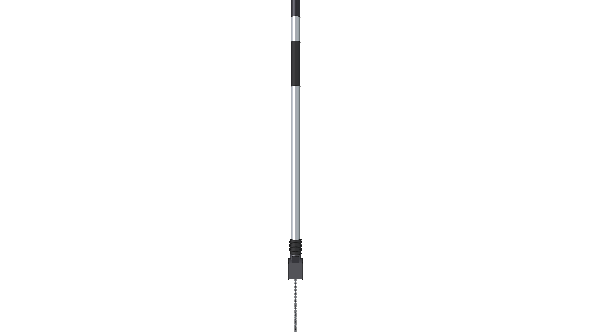
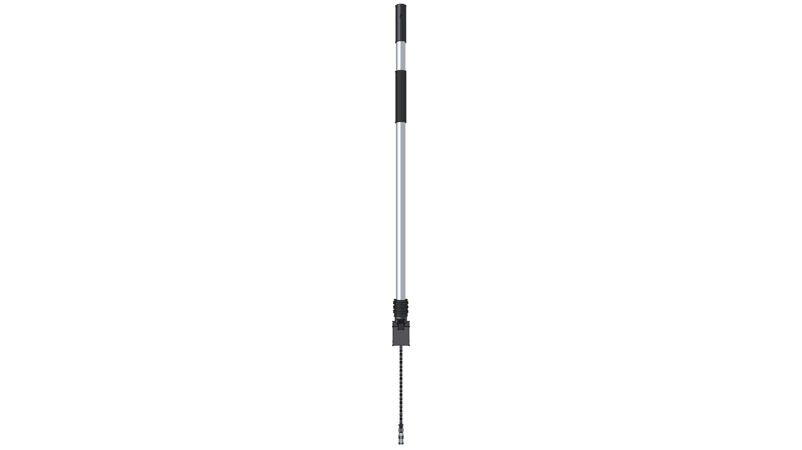
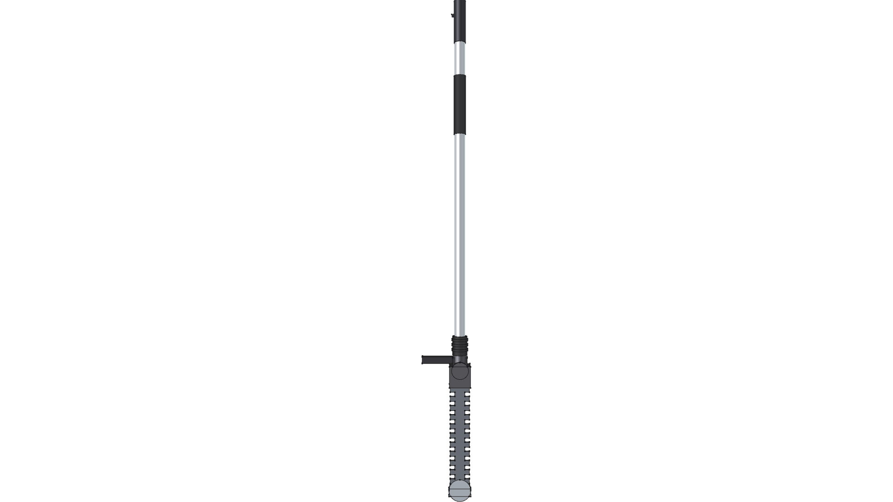
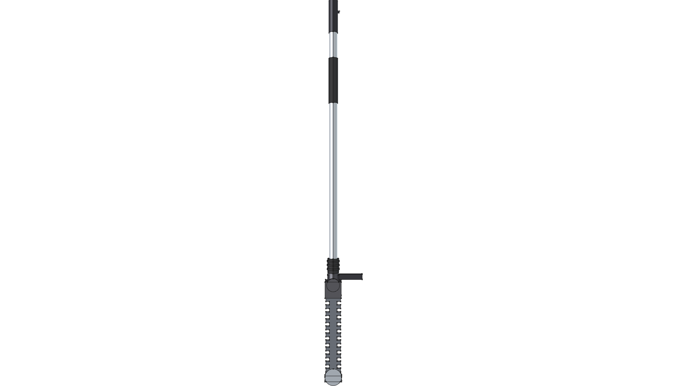

# STIHL FH-KM 145-Degree Adjustable Power Scythe Component

**Component Type**: Commercial Tool Attachment Module  
**Ecosystem**: STIHL KombiSystem Multi-Tasking System  
**Target Applications**: Kombi Kaddy Mobile Tool Rack, Low-Throw Precision Trimming

---

## Component Overview

This module provides a standalone 3D CAD model for the **STIHL FH-KM $145^\circ$ adjustable power scythe attachment**:
* **Drive Shaft**: Standard STIHL 25.4 mm ($1.0''$) aluminum drive tube consuming the [kombi_shaft](../kombi_shaft/) module.
* **Articulating Gearhead**: Cast magnesium $145^\circ$ indexing gearbox (`CastIron-Gray`) enabling multi-position angle locking and fold-flat transport position.
* **Angle Control Handle**: Ergonomic adjustment handle and spring-loaded locking pin (`Plastic-ABS`).
* **Scythe Cutter Blades**: Dual counter-reciprocating hardened steel serrated scrub cutter blades ($250\text{ mm} / 9.8''$ cut length, `Steel-A36`) designed for low-velocity, non-throwing weeding along fence lines, walls, and curbs.
* **Pavement Skid Shoe**: Heavy zinc-plated steel gliding runner (`Steel-ZincPlated`) to protect cutter blades from ground strike.

---


---

## Specifications

| Parameter | Metric (mm) | Imperial (in) | Material |
| :--- | :--- | :--- | :--- |
| **Overall Extended Length** | $1160.0\text{ mm}$ | $45.67''$ | Composite |
| **Drive Tube OD** | $25.4\text{ mm}$ | $1.00''$ | `Aluminum-6061-T6` |
| **Blade Cutting Length** | $250.0\text{ mm}$ | $9.84''$ | `Steel-A36` |
| **Articulation Range** | $0^\circ \text{ to } 145^\circ$ | $0^\circ \text{ to } 145^\circ$ | `CastIron-Gray` |
| **Total Weight** | $1.919\text{ kg}$ | $4.23\text{ lbs}$ | Composite |

---

## 3D CAD Multi-View Gallery

| Front Elevation | Rear Elevation | Top Plan |
| :---: | :---: | :---: |
|  |  |  |
| **Bottom Plan** | **Left Side** | **Right Side** |
|  |  |  |

---

## Python Usage

```python
from phi_works.maker.components import import_component
# Import power scythe into any assembly
scythe = import_component(doc, "kombi_scythe_fh", placement=placement)
```
