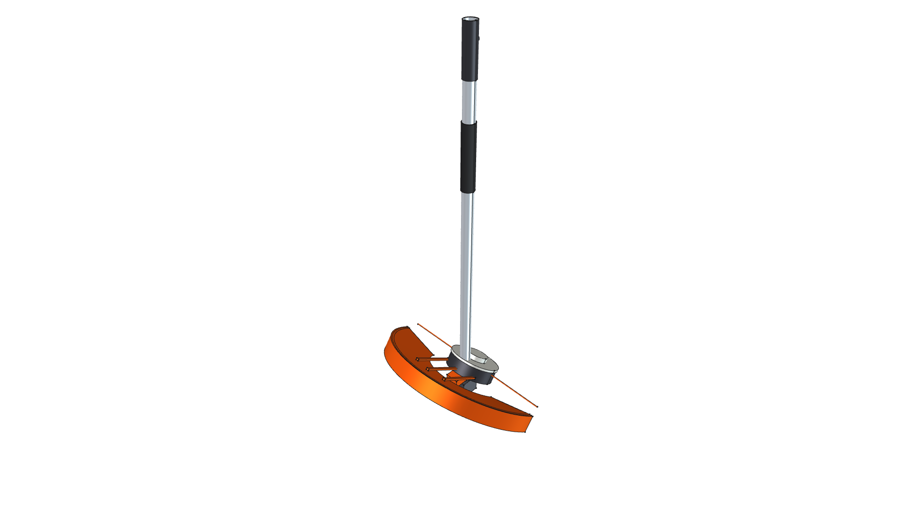
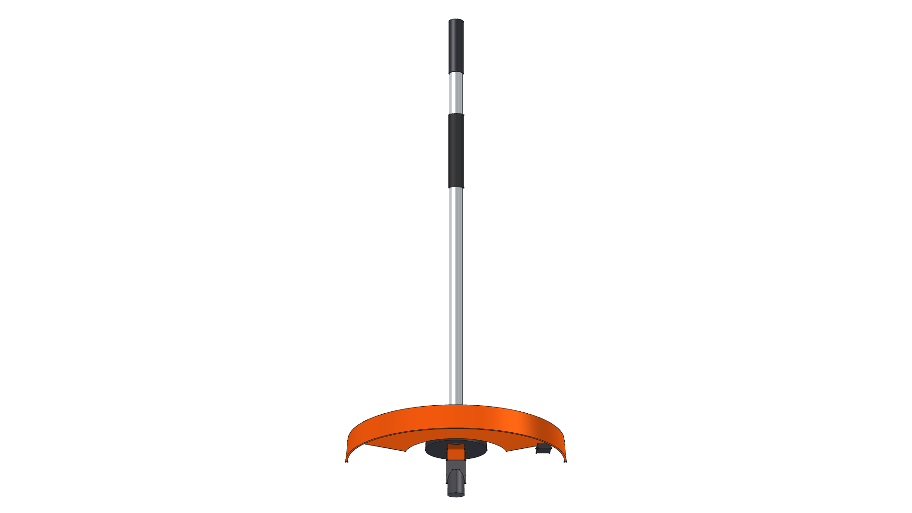
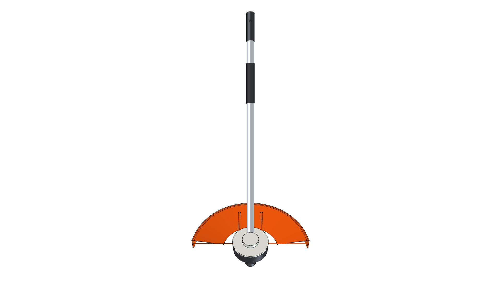
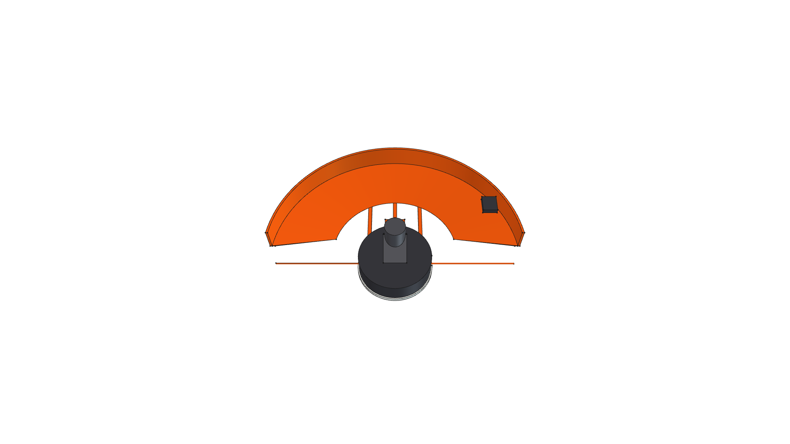
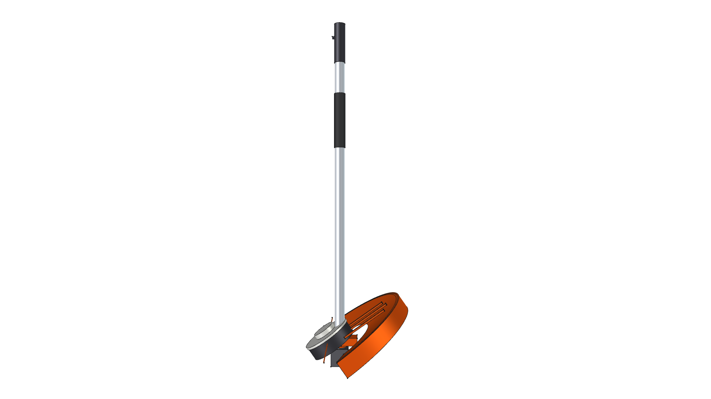
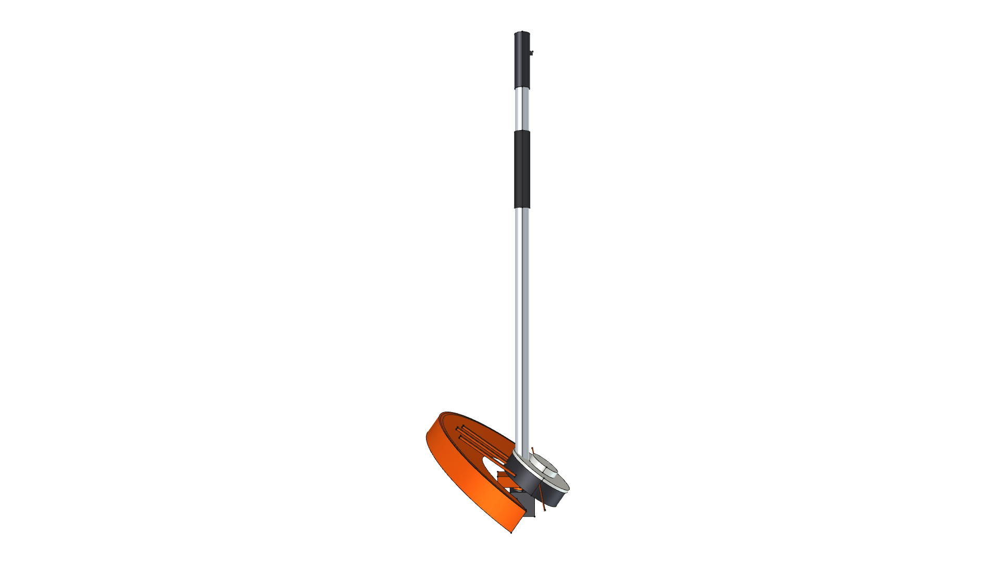

# STIHL FS-KM / FSS-KM Straight Shaft String Trimmer Component

**Component Type**: Commercial Tool Attachment Module  
**Ecosystem**: STIHL KombiSystem Multi-Tasking System  
**Target Applications**: Kombi Kaddy Mobile Tool Rack, Precision Turf Trimming & Clearing

---

## Component Overview

This module provides a standalone 3D CAD model for the **STIHL FS-KM / FSS-KM Straight Shaft String Trimmer Attachment**:
* **Drive Shaft**: Standard STIHL 25.4 mm ($1.0''$) aluminum drive tube consuming the [kombi_shaft](../kombi_shaft/) module.
* **$35^\circ$ Cast Gearcase**: Die-cast aluminum/magnesium gearhead (`CastIron-Gray`) with service lube port.
* **AutoCut 25-2 Bump-Feed Trimmer Head**: Two-piece composite spool head with black body (`Plastic-ABS`), white spool rim & bump knob (`Plastic-StihlWhite`), and dual orange 2.4 mm monofilament nylon cutting lines (`Plastic-StihlOrange`).
* **Concentric Swept Debris Deflector Guard**: Authentic STIHL Orange polymer safety guard (`Plastic-StihlOrange`) sweeping behind the head concentric with the $35^\circ$ cutting spindle axis, complete with molded radial stiffening ribs and downward perimeter skirt.
* **Steel Line Limiter Cutter Knife**: Hardened steel line-cutting blade (`Steel-A36`) mounted in a dedicated black holder bracket on the trailing guard skirt.

---



---

## Specifications

| Parameter | Metric (mm) | Imperial (in) | Material |
| :--- | :--- | :--- | :--- |
| **Overall Length** | $925.0\text{ mm}$ | $36.42''$ | Composite |
| **Drive Tube OD** | $25.4\text{ mm}$ | $1.00''$ | `Aluminum-6061-T6` |
| **Cutting Swath Radius** | $210.0\text{ mm}$ | $8.27''$ | `Plastic-StihlOrange` |
| **Deflector Sweep Angle** | $\sim 150^\circ$ Concentric Arc | $\sim 150^\circ$ Concentric Arc | `Plastic-StihlOrange` |
| **Total Weight** | $1.889\text{ kg}$ | $4.17\text{ lbs}$ | Composite |
| **Center of Gravity (Z)** | $-769.45\text{ mm}$ | $-30.29''$ | Concentrated at gearhead |

---

## 3D CAD Multi-View Gallery

| Front Elevation | Rear Elevation | Top Plan |
| :---: | :---: | :---: |
|  |  |  |
| **Bottom Plan** | **Left Side** | **Right Side** |
|  |  |  |

---

## Python Usage

```python
from phi_works.maker.components import import_component
# Import string trimmer into any assembly
trimmer = import_component(doc, "kombi_trimmer_fs", placement=placement)
```
