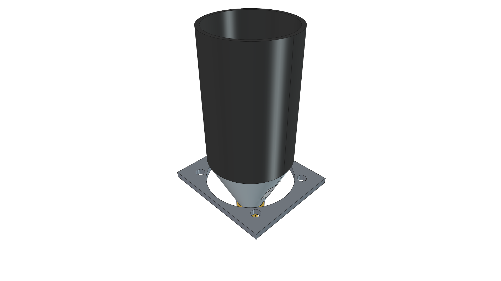
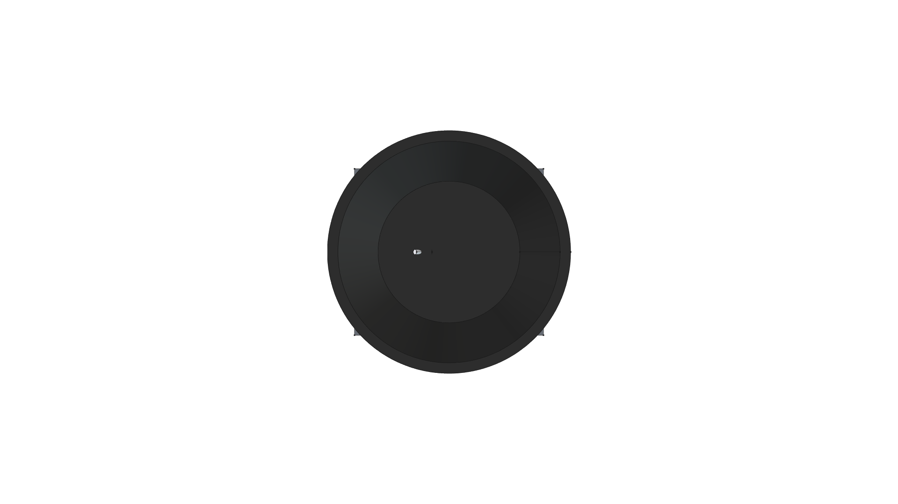
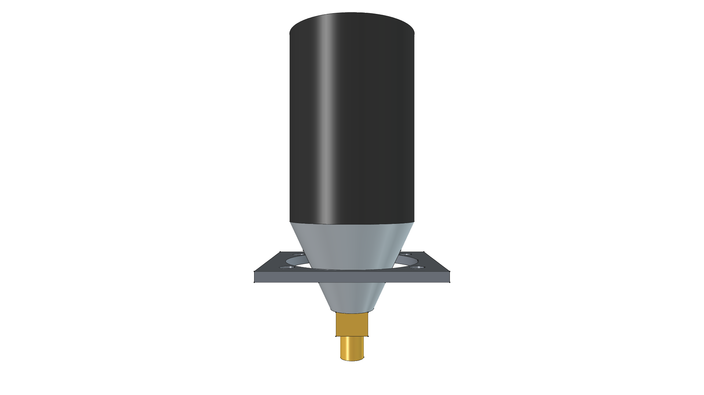
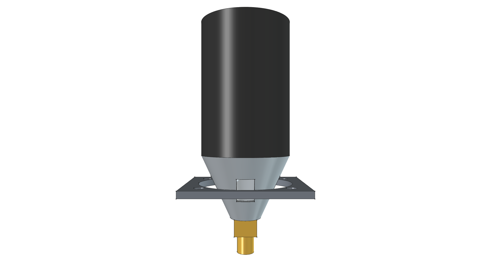
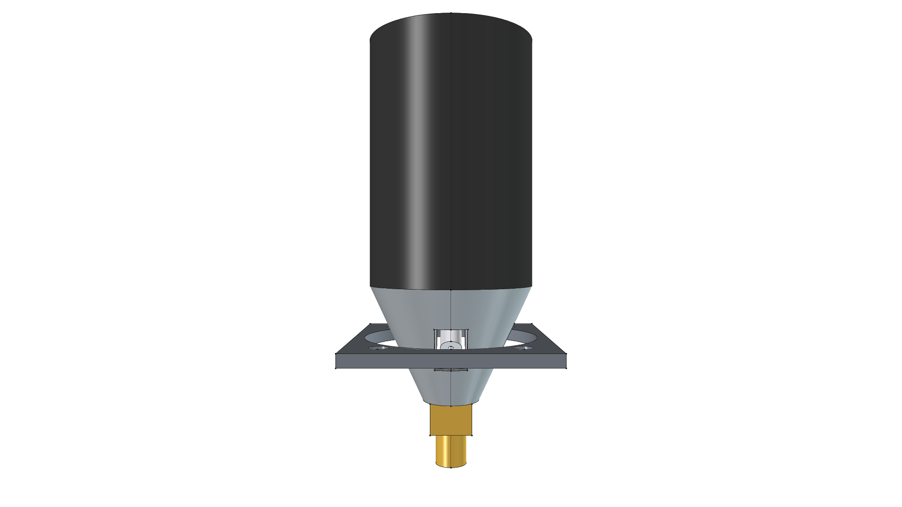
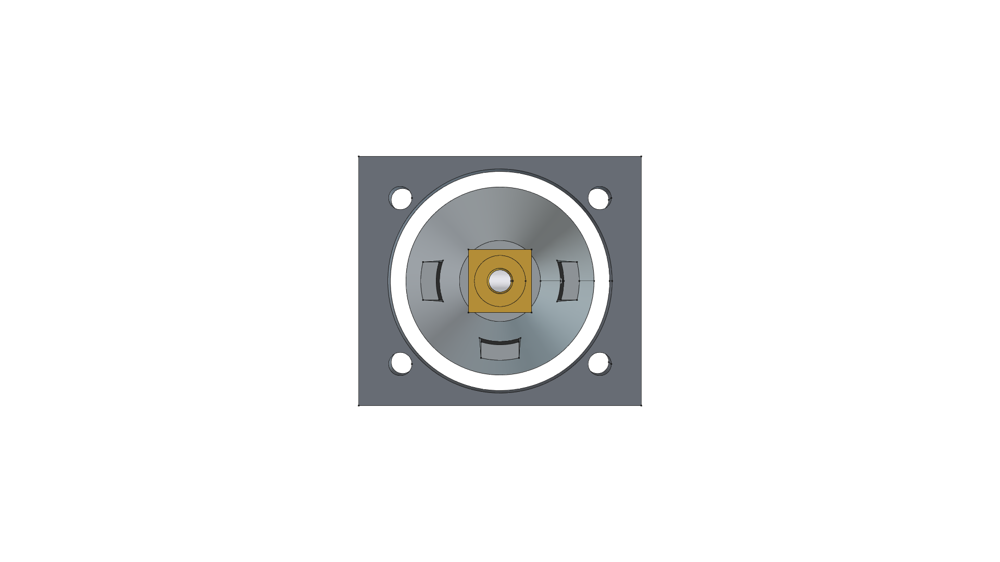

# 500,000 BTU Torch Burner Head Component

> **Chassis-Mounted Combustion Bell, Venturi Intake & Spark Electrode**  
> *Reusable FreeCAD 3D Parametric CAD Component*

**Active CAD Model**: [`torch_burner_head.FCStd`](torch_burner_head.FCStd)  
**Status**: 🟢 **`[RELEASED]`**  

---



---

## 1. Visual Model Gallery

| Home (Perspective) View | Top Plan View |
| :---: | :---: |
|  |  |
| **Front Elevation** | **Rear Elevation** |
|  |  |
| **Right Side Elevation** | **Left Side Elevation** |
|  |  |
| **Bottom Plan View** | |
|  | |

---

## 2. Component Specifications

- **Output Rating**: Up to $500,000\text{ BTU/hr}$ high-velocity vapor combustion.
- **Combustion Bell**: $63.5\text{ mm}$ ($2.5\text{ in}$) Outer Diameter flared black coated steel cup.
- **Air Induction**: Cast venturi cone with 3x triangular atmospheric oxygen mixing ports.
- **Fuel Orifice**: Precision-machined brass hex jet adapter ($1/4''\text{ NPT} / 3/8''\text{ Flare}$ gas inlet).
- **Ignition Interface**: High-voltage ceramic spark electrode positioned in the primary flame ignition zone.
- **Mounting Flange**: $85\text{ mm} \times 75\text{ mm}$ 4-bolt steel flange for rigid chassis/hood mounting.

---

## 3. Build & Render Command

```bash
/home/phi/AppImages/FreeCAD_1.1.3-Linux-x86_64-py311.AppImage -c "__file__='/home/phi/PROJECTS/phi-WORKS/maker/components/torch_burner_head/build.py'; exec(open(__file__).read())"
```
