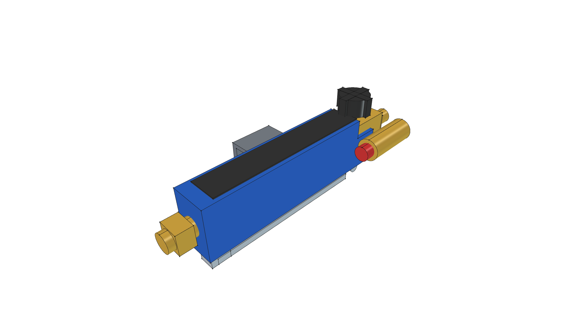
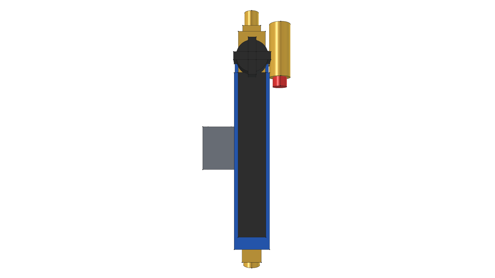
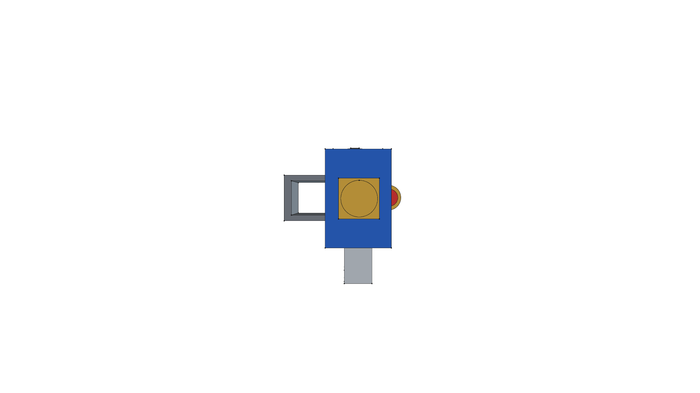
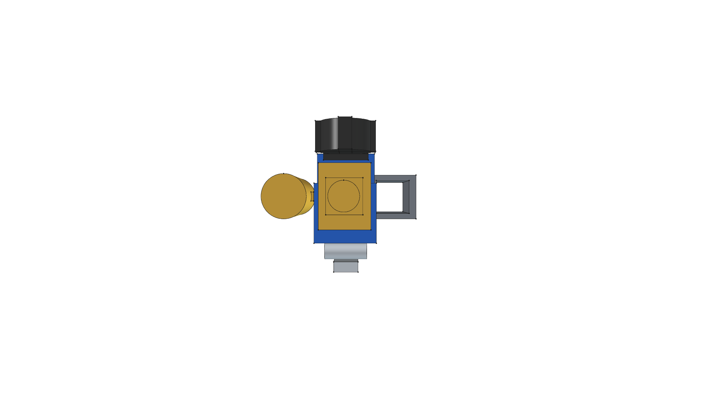
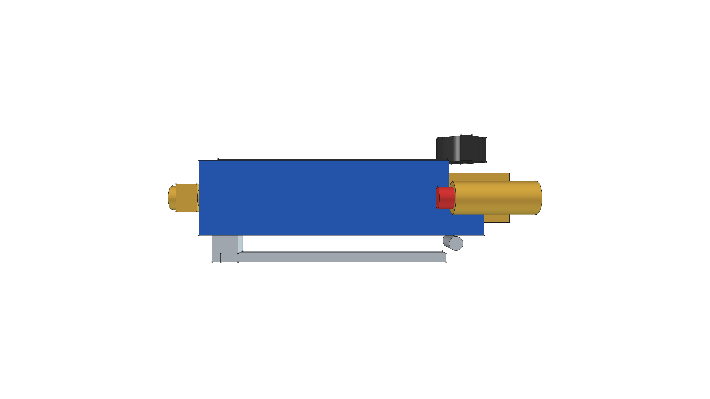
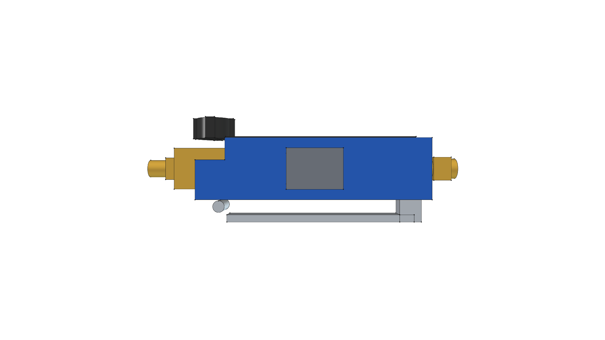
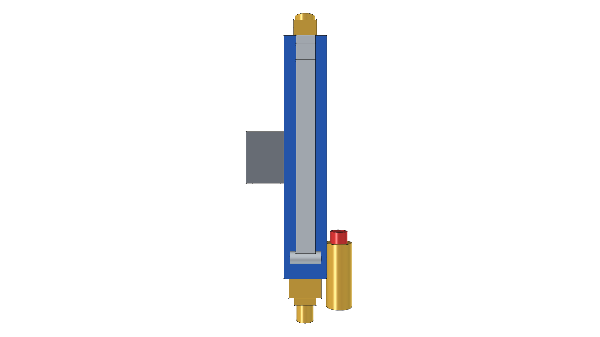

# Torch Control Handle & Squeeze Cockpit Component

> **Handle-Mounted Gas Valve, Turbo Boost Squeeze Lever & Piezo Igniter**  
> *Reusable FreeCAD 3D Parametric CAD Component*

**Active CAD Model**: [`torch_control_handle.FCStd`](torch_control_handle.FCStd)  
**Status**: 🟢 **`[RELEASED]`**  

---



---

## 1. Visual Model Gallery

| Home (Perspective) View | Top Plan View |
| :---: | :---: |
|  |  |
| **Front Elevation** | **Rear Elevation** |
|  |  |
| **Right Side Elevation** | **Left Side Elevation** |
|  |  |
| **Bottom Plan View** | |
|  | |

---

## 2. Component Specifications

- **Valve Body**: Forged Brass Dual-Stage Manifold with internal high-pressure bypass.
- **Pilot Flow Control**: Black Fluted Needle Valve Knob for pilot flame adjustment and emergency shutoff.
- **Boost Control**: Chrome-plated steel spring-return dead-man turbo squeeze lever ($500,000\text{ BTU/hr}$ on demand).
- **Ignition System**: Integrated push-button piezo crystal spark lighter with red protective cap.
- **Mounting Interface**: Integral clamp bracket for $3/4'' \times 3/4''$ steel square tubing.
- **Gas In/Out Ports**: 1/4" NPT / 3/8" Flare brass hex fittings.

---

## 3. Build & Render Command

```bash
/home/phi/AppImages/FreeCAD_1.1.3-Linux-x86_64-py311.AppImage -c "__file__='/home/phi/PROJECTS/phi-WORKS/maker/components/torch_control_handle/build.py'; exec(open(__file__).read())"
```
