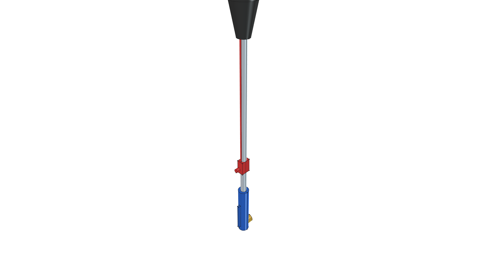
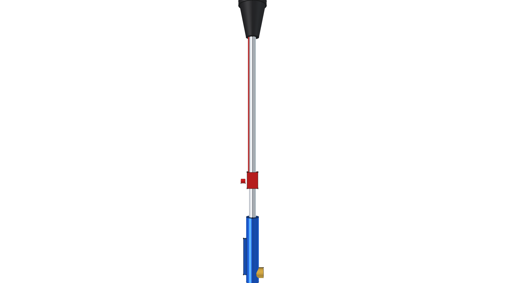
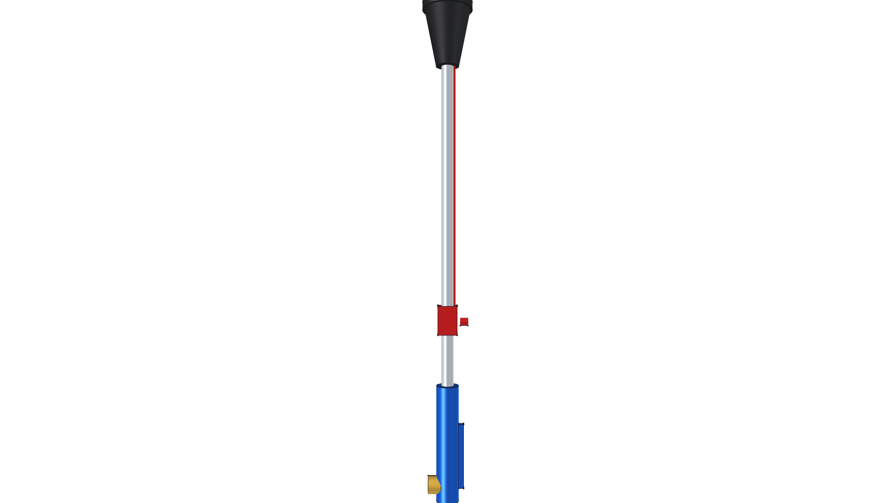

# Harbor Freight #91037 Propane Torch Component

**Component Directory**: `components/torch_hf91037/`  
**Commercial Product**: [Harbor Freight Propane Torch with Push-Button Igniter (Item #91037)](https://www.harborfreight.com/propane-torch-with-push-button-igniter-91037.html)  

---

## Component Overview

This module is a standalone 3D CAD representation of the **Harbor Freight #91037 High-Output Propane Torch**. Built as a reusable building block in `components/`, it provides accurate parametric geometry and clean insertion origins for host assembly projects (such as the [Road Roaster](../../projects/road-roaster/)).

---

## 3D CAD Multi-View Projection Gallery

| Isometric (Home View) | Top Plan View |
| :---: | :---: |
|  |  |
| **Front Elevation** | **Rear Elevation** |
|  |  |
| **Right Side Elevation** | **Left Side Elevation** |
|  |  |
| **Bottom Plan View** | |
|  | |

---

## Model Specifications & Insertion Origin

- **Insertion Origin $(0,0,0)$**: Centered at the base of the brass flow control valve / tank connection fitting.
- **Bell Nozzle Apex**: Positioned along $+Z$ axis with flame orifice at $(0, 0, 812.8\text{ mm})$.
- **Sub-Features**:
  - Brass Flow Control Knob & Needle Valve Body.
  - Ergonomic Blue Handle Sleeve & Spring Squeeze Trigger.
  - Chrome-plated Steel Wand Tube ($0.5''$ OD).
  - Push-Button Piezoelectric Spark Igniter & Wire.
  - Flared Steel Bell Burner Head ($2.375''$ OD nozzle tip).

---

## Component Files Index

- 🛠️ [**`torch_hf91037.py`**](torch_hf91037.py): Standalone FreeCAD Python parametric generator script.
- 📦 [**`torch_hf91037.FCStd`**](torch_hf91037.FCStd): FreeCAD 3D Component Master Model file.

---

## FreeCAD Execution Command

To re-generate the standalone FreeCAD torch model document and all 7 views:

```bash
/home/phi/AppImages/FreeCAD_1.1.3-Linux-x86_64-py311.AppImage -c "__file__='/home/phi/PROJECTS/phi-WORKS/maker/components/torch_hf91037/torch_hf91037.py'; exec(open(__file__).read())"
```
