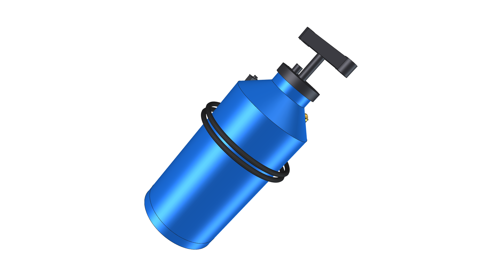
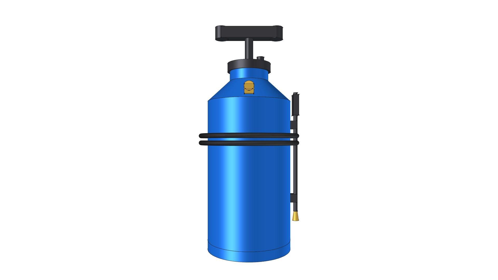
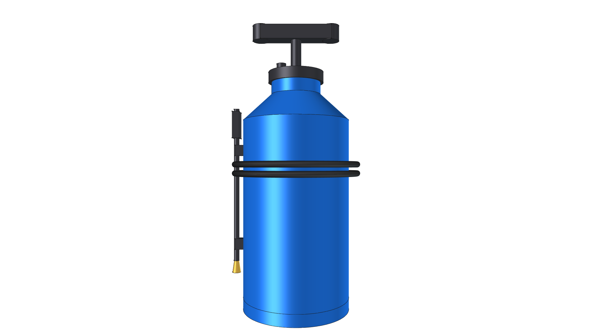
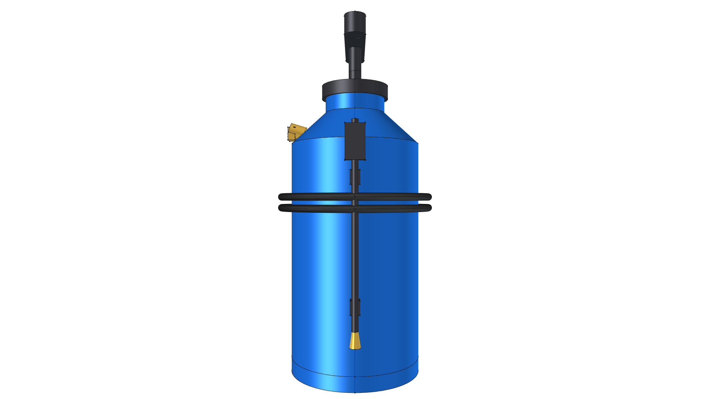
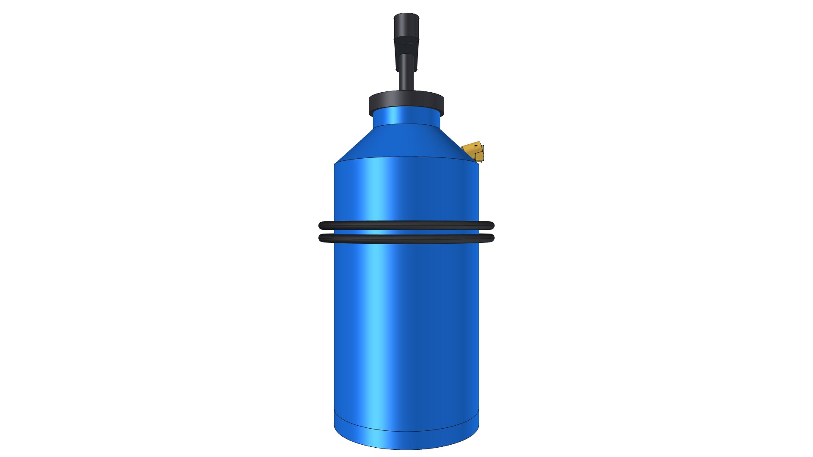

# 2.5 Gallon Pressurized Water Safety Spray Tank Component

## Overview & Purpose

The **2.5 Gallon Pressurized Water Safety Spray Tank** (`water_tank`) is a reusable parametric 3D CAD model representing an industrial safety water reservoir and washdown sprayer. It serves as the primary onboard fire-suppression and pavement-quenching safety system for thermal radiant weed eradication equipment such as the [Road Roaster 4W](../../projects/road-roaster-4w/).

| Parameter | Specification |
| :--- | :--- |
| **Tank Outer Diameter** | 7.09" (180.0 mm) |
| **Overall Height** | 18.2" (462.0 mm) to top of pump handle |
| **Vessel Height** | 14.57" (370.0 mm) body + shoulder |
| **Nominal Liquid Capacity** | 2.5 US Gallons (9.5 Liters) |
| **Tare Weight (Empty)** | ~3.8 lbs (1.7 kg) |
| **Full Charged Weight** | ~24.6 lbs (11.2 kg with 2.5 gal water) |
| **Vessel Material** | High-Density Polyethylene (`Polyethylene-SafetyBlue`) |
| **Pump Plunger** | Molded polymer manual pressurization pump with T-handle (`Plastic-ABS`) |
| **Discharge Valve** | Brass swivel connector & outlet port (`Brass-C360`) |
| **Hose & Wand** | Reinforced EPDM hose (`Rubber-Solid`) + brass trigger spray wand (`Brass-C360` / `Plastic-ABS`) |

---


---

## Visual Projection Gallery

| Home (Perspective) View | Top Plan View |
| :---: | :---: |
|  |  |
| **Front Elevation** | **Rear Elevation** |
|  |  |
| **Right Side Elevation** | **Left Side Elevation** |
|  |  |
| **Bottom Plan View** | |
|  | |

---

## CAD Assembly Hierarchy

```
Water_Tank_2_5Gal [App::DocumentObjectGroup]
├── Water_Tank_Vessel_Body (2.5 Gal Safety Blue HDPE Pressure Vessel)
├── Water_Tank_Pump_Assembly (Molded Plunger Pump Cap & T-Handle Assembly)
├── Water_Tank_Brass_Fittings (Brass Discharge Swivel Port & Spray Nozzle)
├── Water_Tank_Spray_Hose (Reinforced Flexible Spray Washdown Hose)
└── Water_Tank_Spray_Wand (Safety Washdown Spray Wand & Side Clip Holster)
```
