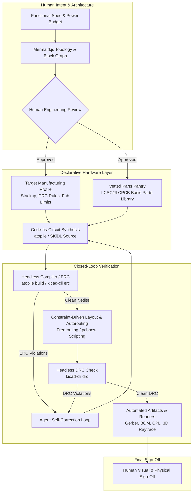
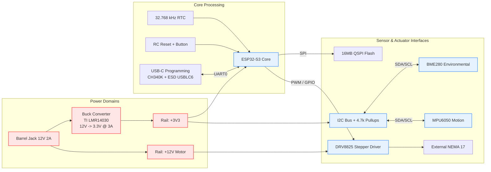

# Code-as-Hardware: A Compiler-Driven Strategy for AI-Assisted PCB Design
## Translating Parametric CAD, Declarative Topologies, and Target-Driven Manufacturing to Electronic Design Automation

**Author:** Clerk of the Works / phi ARCHITECT  
**Audience:** Electrical Engineers, Embedded Systems Designers, Hardware Engineering Leads  
**Date:** September 2026  
**Context:** Lessons learned from the `maker` Parametric Physical CAD Framework applied to Electronics Design Automation (EDA)

---

## Executive Summary

Artificial Intelligence—specifically Large Language Models (LLMs)—has fundamentally disrupted software engineering. Yet, when electrical engineers attempt to pair with AI for Printed Circuit Board (PCB) design, the experience is almost universally frustrating: hallucinated pinouts, impossible trace clearances, floating ground planes, broken netlists, and non-functional boards.

The failure is not due to a lack of electrical knowledge inside the LLM. Rather, it is an **architectural mismatch** between the way LLMs process information and the traditional, mouse-driven Graphical User Interface (GUI) workflows of EDA suites (Altium, Eagle, traditional KiCad). 

In physical mechanical design within our **`maker`** framework, we encountered and solved this exact problem. By abandoning manual mouse-pushing in CAD and moving to **code-as-model** (parametric Python driving FreeCAD headlessly), **strict target-driven manufacturing constraints** (machine-specific cut lists and material definition cards), **isolated commercial component modules**, and **closed-loop headless verification**, we enabled AI agents to design complex, verifiable physical assemblies reliably.

This white paper translates those mechanical CAD lessons into a robust, repeatable strategy for electrical engineering. By treating **hardware as code**, decoupling **logical topology** from **physical 2D/3D geometry**, leveraging intermediate representation languages (such as **Mermaid.js** and **atopile**), and establishing an automated, compiler-driven verification loop (via **`kicad-cli`** and algorithmic autorouters), electrical engineers can turn AI from an unreliable gimmick into an indispensable co-designer.



---

## 1. Deconstructing the Failure: Why AI Fails at Naive PCB Design

To solve the problem, we must first diagnose why asking a general-purpose LLM to "design an ESP32 sensor board" fails.

### 1.1 The Spatial-Cognitive Mismatch
LLMs are autoregressive token predictors operating over discrete symbolic streams. They excel at syntax, grammar, symbolic logic, and typed abstractions. However, raw PCB layout is a **continuous, non-planar, multi-layer geometric packing and topological routing problem**. Asking an LLM to generate raw coordinate points for copper traces `(x1, y1) -> (x2, y2)` is asking it to act as a spatial rasterizer—a task for which transformer tokenizers are fundamentally unsuited.

### 1.2 The GUI Impedance Trap
Traditional EDA tools are optimized for human eyes and human hands using mice. Schematics are drawn by visually arranging 2D symbols on a canvas; layouts are created by dragging footprints and nudging tracks. 
- GUI-centric workflows provide **zero structured feedback** to an AI.
- Binary project files or massive unstructured XML/JSON dumps overwhelm context windows.
- Without an interactive feedback loop, the AI operates "blind," unable to see whether its trace crossed a ground pour or violated a 5 mil clearance rule.

### 1.3 Topology vs. Geometry Confusion
In electrical engineering, there are two distinct domains:
1. **Logical Topology (The Circuit):** What components exist, and what connects to what (Nets, Buses, Pin mappings, Power domains, Impedance requirements).
2. **Physical Geometry (The Board):** Where components physically sit in 2D/3D space, how copper lines route without intersecting, thermal copper fills, layer transitions (vias), and manufacturing tolerances.

When engineers prompt an AI to "design a board," they conflate topology and geometry in a single prompt. The AI gets overwhelmed by spatial layout, causing it to make rookie electrical errors in the underlying schematic.

### 1.4 The Hallucination of Physical Hardware
An LLM asked for a "standard buck converter circuit" will happily output pin 1 as VCC, pin 2 as GND, pin 3 as SW, and pin 4 as FB. In the real world:
- The SOT-23-6 package pinout varies wildly between manufacturers (e.g. TI vs. Richtek vs. Silergy).
- Real fabrication houses have strict stock constraints. If the AI specifies a capacitor with an obsolete footprint or an out-of-stock PMIC, the design cannot be built without a complete redesign.

---

## 2. Core Philosophy: Lessons from the `maker` Framework

In our `maker` CAD repository, we build physical machines (such as the `kombi-kaddy` chassis and `road-roaster` agricultural heating assemblies). We faced identical roadblocks: asking an AI to output raw 3D mesh files or directly draw assemblies in GUI FreeCAD led to deformed models and broken geometric constraints.

We overcame this by establishing five core principles (codified in our `WORKFLOW.md` and `GEMINI.md`):

| `maker` Physical CAD Principle | Corresponding PCB / EDA Equivalent | Why It Unlocks AI |
| :--- | :--- | :--- |
| **Code-to-Model (`build.py`)** | **Code-as-Hardware (`atopile`, `SKiDL`)** | Text source code is diffable, versionable in Git, and directly synthesizable by LLMs. |
| **Separation of Component Modules** | **Hierarchical Subcircuits ("Blocks")** | Commercial chips/modules are verified in isolation with fixed insertion pins, preventing monolithic chaos. |
| **Material Cards (`.FCMat`)** | **Fab Target Profiles (Stackups & DRC)** | Board parameters (copper weight, $\varepsilon_r$, min clearance) are fixed beforehand as machine-readable constants. |
| **Commercial Hardware Isolation** | **The Curated "Parts Pantry" (LCSC/JLC)** | The AI picks only from pre-vetted parts with known footprints and in-stock supply chains. |
| **Closed-Loop Headless Verification** | **Headless ERC/DRC (`kicad-cli`)** | The AI executes the build, reads error codes/logs, and autonomously repairs its mistakes. |

---

## 3. The Declarative Paradigm: Languages for Electronics-as-Code

To empower an AI, we must replace graphical drawing with **declarative, text-based Hardware Description Languages (HDLs)** designed for board-level electronics.

### 3.1 `atopile`: Object-Oriented Architecture for Hardware
**atopile** is an open-source language and compiler (`ato`) that allows engineers to describe electronic circuits as code, structured much like modern software (with classes, inheritance, interfaces, and modules).

#### Example: Power Conditioning Subcircuit in `atopile`
```ato
import ElectricPower from "generics/interfaces.ato"
import Capacitor from "generics/capacitors.ato"
import Resistor from "generics/resistors.ato"

module BuckRegulator_3V3:
    # Define external interfaces
    power_in = new ElectricPower
    power_out = new ElectricPower

    # Instantiate IC with specific verified manufacturer part number
    ic = new LMR14030SDDAR
    cin = new Capacitor
    cout = new Capacitor
    rfb_top = new Resistor
    rfb_bot = new Resistor

    # Parametric constraints (enforced by the compiler!)
    cin.capacitance = 10uF +/- 20%
    cin.voltage = 25V to 50V
    cout.capacitance = 22uF +/- 20%
    cout.voltage = 10V to 25V

    # Wire up logical topology
    power_in ~ ic.power
    cin.power ~ power_in
    ic.power_out ~ power_out
    cout.power ~ power_out

    # Mathematical parameter definition for feedback
    # Vout = 0.8V * (1 + Rtop / Rbot)
    assert power_out.voltage within 3.25V to 3.35V
```
**Why this changes the game for AI:**
1. **Strong Typing & Assertions:** The compiler checks whether `cin.voltage` can handle `power_in.voltage`. If the AI specifies a 6.3V capacitor on a 12V rail, `ato build` throws a compile error.
2. **Standard Interfaces:** Defining `ElectricPower` (containing `VCC` and `GND`) means the AI cannot accidentally connect power without connecting ground.
3. **Compilation to KiCad:** `atopile` compiles directly into standard KiCad schematics and netlists.

### 3.2 `SKiDL`: Pythonic Circuit Synthesis
If your team is already proficient in Python, **SKiDL** provides a pure Python API for defining schematics. Instead of manually drawing lines between pins, you write:

```python
from skidl import *

# Define nets
vcc = Net('VCC')
gnd = Net('GND')
reset_l = Net('RESET_N')

# Instantiate pre-vetted components from KiCad library
mcu = Part('MCU_Espressif', 'ESP32-S3-WROOM-1', footprint='RF_Module:ESP32-S3-WROOM-1')
r_pullup = Part('Device', 'R_Small', value='10k', footprint='Resistor_SMD:R_0603_1608Metric')
c_decouple = Part('Device', 'C_Small', value='1uF', footprint='Capacitor_SMD:C_0603_1608Metric')

# Connect power pins
mcu['3V3'] += vcc
mcu['GND'] += gnd

# Pull-up reset line
r_pullup[1, 2] += vcc, reset_l
c_decouple[1, 2] += reset_l, gnd
mcu['CHIP_PU'] += reset_l

# Execute Electrical Rules Check (ERC) programmatically!
ERC()
generate_netlist(file_='main_board.net')
```

---

## 4. The Intermediate Representation: Mermaid as the Architectural Bridge

Before writing a single line of `atopile` or `SKiDL`, the engineer and AI must align on system architecture. Asking the AI to jump straight to circuit code often results in missing subsystems (such as TVS diodes on external USB lines or level shifters on mixed-voltage buses).

**Mermaid.js** is the ultimate intermediate representation language for this phase:
- It is native markdown text, readable by both human and AI.
- It exposes connection semantics (signals, voltages, protocols) clearly.
- It can be rendered natively in web UIs, documentation, and IDEs.

### 4.1 System Topology Diagram


### 4.2 Signal Interconnect & Pin Mapping Matrix
Before synthesis, require the AI to generate a strict Markdown / Mermaid pin assignment table. This catches bus contention and incompatible I/O voltages *before* schematic compilation:

| Subsystem | Signal Name | Net Name | MCU Pin | Voltage Level | Drive Type / Notes |
| :--- | :--- | :--- | :--- | :--- | :--- |
| **Power** | 3.3V Main | `+3V3` | `VDD3P3` | 3.3V | Decoupled with 10uF + 4x 100nF |
| **Debug** | UART TX | `ESP_TXD` | `GPIO43` | 3.3V | Connects to CH340K RXD via 1k damping |
| **Debug** | UART RX | `ESP_RXD` | `GPIO44` | 3.3V | Connects to CH340K TXD |
| **Sensors**| I2C SDA | `I2C_SDA` | `GPIO8` | 3.3V | Open-drain, 4.7k $\Omega$ pull-up to `+3V3` |
| **Sensors**| I2C SCL | `I2C_SCL` | `GPIO9` | 3.3V | Open-drain, 4.7k $\Omega$ pull-up to `+3V3` |
| **Motor**  | Step Pulse | `STP_PULSE`| `GPIO14` | 3.3V | Push-pull, fast edge |
| **Motor**  | Direction | `STP_DIR` | `GPIO15` | 3.3V | Push-pull |

---

## 5. Target-Driven Manufacturing: The PCB Equivalent of Material Cards

In our `maker` repository, we never say "make this frame from metal." We define a specific material card:
`materials/metals/Steel-A36.FCMat` containing:
- Density: $7850\ \text{kg/m}^3$
- Standard stock: 1" x 1" x 1/8" square tube
- Welding constraint: Flux-core MIG with 0.030" wire.

In PCB design, you must establish the exact same rigor. A PCB does not exist in the abstract; it is targeted at a specific **Fabrication & Assembly House** (e.g., JLCPCB, PCBWay, Eurocircuits).

### 5.1 The Target Fabrication Card (`fab_target.yaml`)
Create a machine-readable configuration file that sets the physical boundaries for the AI and routing engine:

```yaml
fabricator: "JLCPCB"
process: "Standard 4-Layer (JLC04161H-7628)"
board:
  thickness_mm: 1.6
  outer_copper_oz: 1.0  # 35 um
  inner_copper_oz: 0.5  # 17.5 um
  solder_mask: "Matte Black"
  silkscreen: "White"
  surface_finish: "ENIG"

layer_stackup:
  - layer: 1
    type: "signal/top"
    thickness_mm: 0.035
  - dielectric: "Prepreg 7628"
    thickness_mm: 0.21
    dielectric_constant: 4.6
  - layer: 2
    type: "plane/gnd"
    thickness_mm: 0.0175
  - dielectric: "Core FR4"
    thickness_mm: 1.065
    dielectric_constant: 4.5
  - layer: 3
    type: "plane/power"
    thickness_mm: 0.0175
  - dielectric: "Prepreg 7628"
    thickness_mm: 0.21
    dielectric_constant: 4.6
  - layer: 4
    type: "signal/bottom"
    thickness_mm: 0.035

design_rules:
  min_trace_width_mm: 0.127       # 5 mil
  min_trace_spacing_mm: 0.127     # 5 mil
  min_via_diameter_mm: 0.45       # 18 mil pad
  min_via_drill_mm: 0.25          # 10 mil hole
  min_annular_ring_mm: 0.10       # 4 mil
  edge_clearance_mm: 0.30         # 12 mil
  controlled_impedance_single_50ohm_trace_width_mm: 0.354 # calculated for L1 over L2
```

### 5.2 The "Parts Pantry": Solving Supply Chain Hallucinations
Never allow the AI to browse the open web or pick arbitrary parts from a 10-million-component distributor catalog. 

Instead, construct a **Project Pantry**: a YAML/JSON dictionary of pre-vetted components that are:
1. Guaranteed in-stock at the assembly house.
2. Classified as "Basic Parts" (zero reel-change fee at JLC/PCBWay).
3. Accompanied by pre-verified footprints and symbol pinouts.

```yaml
# parts_pantry.yaml (Excerpt)
passives:
  resistor_10k_0603:
    mpn: "UniOhm 0603WAF1002T5E"
    lcsc: "C25804"
    package: "Resistor_SMD:R_0603_1608Metric"
    tolerance: "1%"
    power: "0.1W"
  capacitor_100nf_0603:
    mpn: "Samsung CL10B104KB8NNNC"
    lcsc: "C1588"
    package: "Capacitor_SMD:C_0603_1608Metric"
    voltage: "50V"
    dielectric: "X7R"

ics:
  ldo_3v3_1a:
    mpn: "TI TLV1117LV33DCYR"
    lcsc: "C6186"
    package: "Package_TO_SOT_SMD:SOT-223-3_TabPin2"
    vin_max: 5.5
    vout: 3.3
    imax: 1.0
  usb_uart_bridge:
    mpn: "WCH CH340K"
    lcsc: "C2689098"
    package: "Package_SO:ESSOP-10_3.9x4.9mm_P1.00mm"
    notes: "Has built-in crystal oscillator; eliminates external 12MHz crystal"
```

When the AI synthesizes code, it is instructed: **"You may only select parts from `parts_pantry.yaml`. If an unlisted part is required, output an explicit request to the engineer to vet and add it to the pantry."**

---

## 6. The 5-Stage Agentic PCB Design Pipeline

Here is the operational step-by-step workflow that your EE friend can implement immediately:

```
[Phase 1: Spec]       Natural Language Requirements
                              │
                              ▼
[Phase 2: Topology]   Mermaid Block Diagram & Power Budget (Human Review)
                              │
                              ▼
[Phase 3: Synthesis]  atopile / SKiDL Code Generation constrained by Parts Pantry
                              │
                              ▼
[Phase 4: ERC Check]  Headless Compilation (ato build / kicad-cli)
                              │
                              ├── (Errors) ──► Agent Auto-Debug Loop
                              ▼ (Pass)
[Phase 5: Layout]     Spatial Heuristics + Algorithmic Autorouting (Freerouting)
                              │
                              ▼
[Phase 6: DRC Check]  Headless Design Rule Verification (kicad-cli drc)
                              │
                              ├── (Violations) ──► Clearance/Placement Adjustment
                              ▼ (Pass)
[Phase 7: Artifacts]  Fabrication Package (Gerber, Drill, BOM, CPL, 3D Render)
```

### Stage 1: Specification & Power Tree (Human + AI)
The engineer defines the inputs:
- Inputs: 12V DC via 2.1mm barrel jack.
- Outputs: Stepper motor output (12V @ 1.5A), 3.3V logic for ESP32-S3 and two I2C sensors.
- Mechanical: $80\text{mm} \times 50\text{mm}$ rectangular board, four M3 mounting holes in corners.
- Target Fab: JLCPCB 4-Layer.

The AI outputs the **Mermaid system diagram** and **power consumption budget table** (calculating total mA draw per rail and verifying thermal dissipation $P_D = (V_{in} - V_{out}) \times I$).

### Stage 2: Declarative Hardware Synthesis (AI Execution)
The AI generates the `atopile` module or `SKiDL` Python script. It imports modules from the local vetted subcircuit library:
- `power_supply_12v_to_3v3.ato`
- `esp32_s3_minimal_core.ato`
- `usb_c_programming_esd.ato`
- `sensor_headers.ato`

All resistor and capacitor values are calculated parametrically rather than guessed.

### Stage 3: The Headless ERC Verification Loop
The AI triggers the compiler in the execution environment:
```bash
ato build --target=kicad
```
Or with KiCad CLI:
```bash
kicad-cli sch erc --output-format=json main_board.kicad_sch
```
If an error occurs (e.g. Pin 14 of MCU is unrouted, or `VDD_SPI` is tied to an incorrect voltage net), the compiler outputs structured JSON error diagnostics:
```json
{
  "severity": "error",
  "type": "different_net_connected",
  "message": "Net /VCC_3V3 is connected to Net /VCC_5V at resistor R3",
  "sheet": "/",
  "position": {"x": 120.5, "y": 45.2}
}
```
**The Agent Self-Healing Mechanism:** The LLM receives this error stream directly in its context window. It parses the fault, modifies the declarative source code, and re-compiles until zero ERC errors remain.

### Stage 4: Constraint-Driven Spatial Placement
Once the netlist is 100% electrically valid, the workflow enters the physical domain. 

Instead of asking the AI to draw traces, we use a two-step approach:
1. **Algorithmic / Heuristic Placement Script (`place_components.py`):**
   Using KiCad's Python API (`pcbnew`), we write deterministic rules for component placement:
   - Mounting holes placed at $(X=\pm 35, Y=\pm 20)$.
   - Connectors (USB-C, Barrel Jack) snapped to the board edges facing outwards.
   - Decoupling capacitors snapped within 2 mm of their corresponding IC power pin.
   - Crystals positioned within 3 mm of MCU oscillator pins with ground guard rings.
2. **AI Layout Constraint Guide (`PLACEMENT.md`):**
   The AI generates the spatial zoning specification:
   - High-current motor driver traces confined to Quadrant 4 (bottom-right).
   - Sensitive I2C analog sensors isolated in Quadrant 1 (top-left).
   - Solid ground plane on Layer 2; uninterrupted power planes on Layer 3.

```python
# snippet of placement automation via pcbnew
import pcbnew

board = pcbnew.LoadBoard("main_board.kicad_pcb")

def place_adjacent(host_ref, cap_ref, offset_x=1.5, offset_y=0.0):
    host = board.FindFootprintByReference(host_ref)
    cap = board.FindFootprintByReference(cap_ref)
    pos = host.GetPosition()
    cap.SetPosition(pcbnew.VECTOR2I(pos.x + pcbnew.FromMM(offset_x), 
                                     pos.y + pcbnew.FromMM(offset_y)))

# Place decoupling caps directly next to ESP32 VDD pins
place_adjacent("U1", "C3", offset_x=2.0, offset_y=-1.0)
place_adjacent("U1", "C4", offset_x=2.0, offset_y=1.0)

board.Save("main_board.kicad_pcb")
```

### Stage 5: Algorithmic Routing via Freerouting
Routing traces is an algorithmic puzzle best left to topological routing solvers. We export the design as a standard Specctra Design file (`.dsn`):

```bash
# Export netlist & unrouted board to DSN
kicad-cli pcb export specctra -o main_board.dsn main_board.kicad_pcb

# Run Freerouting headless autorouter
freerouting -de main_board.dsn -do main_board.ses -mp 50 -us 4

# Import routed session back into KiCad
kicad-cli pcb import specctra -i main_board.ses -o main_board_routed.kicad_pcb
```

### Stage 6: Headless DRC & Automated Visual Snapshots
Finally, the automated pipeline verifies manufacturing readiness:
```bash
# 1. Run Design Rule Check
kicad-cli pcb drc --output-format=json --severity-all main_board_routed.kicad_pcb

# 2. Export 2D Visual Layer Renders (SVG/PNG)
kicad-cli pcb export svg --layers F.Cu,B.Cu,F.Silkscreen,Edge.Cuts -o renders/board.svg

# 3. Export 3D Raytraced Snapshot
kicad-cli pcb render --view top -o renders/board_3d_top.png main_board_routed.kicad_pcb
```

The AI examines the DRC log. If clearances pass, the pipeline automatically generates the fabrication package:
- **Gerber files (`.gbr`)** and **Excellon Drill files (`.drl`)**
- **Bill of Materials (`BOM.csv`)** matched to LCSC part numbers.
- **Pick-and-Place Centroid File (`CPL.csv`)** containing $(X, Y, \text{Rotation})$ for surface mount machines.

---

## 7. Comparative Tooling Matrix for Code-to-Hardware

When setting up this pipeline, choose the toolchain that fits your team's engineering stack:

| Tool / Technology | Role in Stack | Input Format | Output Format | AI Compatibility |
| :--- | :--- | :--- | :--- | :--- |
| **atopile (`ato`)** | High-level hardware compiler | Object-oriented `.ato` text files | KiCad schematics, netlists, BOM | **10/10**: Cleanest semantic abstraction; designed specifically for text-driven design. |
| **SKiDL** | Pythonic schematic capture | Python (`.py`) scripts | KiCad Netlists, SPICE models | **9/10**: Excellent for teams with Python automation expertise; integrates SPICE simulation. |
| **Mermaid.js** | Architectural intermediate representation | Markdown block diagrams | SVG, JSON AST, human visual | **10/10**: Perfect for human-AI alignment on power trees, pinouts, and system topology. |
| **`kicad-cli`** | Headless EDA verification & compiler | `.kicad_sch`, `.kicad_pcb` | ERC/DRC JSON logs, Gerbers, SVGs | **10/10**: Fast, reliable CLI interface that bridges code to industry-standard KiCad. |
| **Freerouting** | Algorithmic topological autorouter | Specctra `.dsn` | Specctra `.ses` | **8/10**: Solves complex multi-layer trace routing deterministically without LLM spatial hallucinations. |
| **FreeCAD StepUp** | ECAD-to-MCAD physical integration | `.kicad_pcb` + STEP models | FreeCAD 3D assembly, interference checks | **9/10**: Bridges the board design to mechanical enclosures and physical mounting constraints. |

---

## 8. Concrete Implementation Blueprint: Getting Started on Monday

To help your EE colleague test this methodology without over-engineering their workflow, here is a pragmatic 4-step adoption plan:

### Step 1: Install the Text-First Hardware Toolchain
Ensure the following CLI utilities are installed in the developer's environment:
- **KiCad 8+** (comes standard with `kicad-cli`).
- **atopile**: `pip install atopile` (or standalone binary).
- **Freerouting**: Headless jar or CLI wrapper.

### Step 2: Assemble a 50-Part "Company Pantry"
Before touching AI, create a single YAML file containing:
- 10 standard 0603 resistor values ($100\ \Omega, 1\text{k}, 4.7\text{k}, 10\text{k}, 100\text{k}$).
- 5 standard 0603 ceramic capacitor values ($100\text{pF}, 1\text{nF}, 100\text{nF}, 1\mu\text{F}, 10\mu\text{F}$).
- 2 standard linear regulators (AMS1117-3.3, AP2112K-3.3) and 1 buck regulator (TI LMR14030).
- 2 standard MCUs (ESP32-S3-WROOM-1, RP2040).
- Standard USB-C 16-pin connector with CC1/CC2 5.1k pulldowns.

*Rule: Every part must have a verified LCSC part number, symbol, and footprint.*

### Step 3: Write the AI System Prompt
Configure the AI coding assistant (in Antigravity, Claude Code, or Gemini CLI) with strict operational rules:

> **System Prompt Directive for Electrical Design Agent:**
> 
> You are an expert Electrical Engineering AI assistant specializing in compiler-driven hardware design.
> 
> **Operating Rules:**
> 1. **Topology First:** Never attempt to generate raw coordinate layouts directly. Always start by proposing a **Mermaid.js block diagram** showing power rails, communication buses, and pin-to-pin signal paths. Wait for human review.
> 2. **Code-as-Hardware:** Write all circuit descriptions in `atopile` (`.ato`) or `SKiDL` (`.py`). Do not edit raw `.kicad_sch` files directly.
> 3. **Parts Pantry Constraint:** You must ONLY select parts from `parts_pantry.yaml`. Never invent imaginary manufacturer part numbers. If an unlisted part is needed, request permission to add it.
> 4. **Parametric Calculations:** Show mathematical proofs for all component ratings (e.g. $V_{cap} \ge 1.5 \times V_{rail}$, $I_{L(sat)} \ge 1.2 \times I_{out}$, resistor dividers for feedback loops).
> 5. **Closed-Loop Verification:** After writing hardware code, run `ato build` or `kicad-cli erc`. If errors occur, parse the log and autonomously correct the source until the build passes cleanly.

### Step 4: Run a Pilot Subcircuit Project
Do not start with an entire 8-layer motherboard. Start with a self-contained module:
- A USB-C powered ESP32-S3 sensor breakout with one I2C sensor and a status LED.
- Guide the AI through: Spec $\to$ Mermaid $\to$ `atopile` $\to$ Headless ERC $\to$ Placement $\to$ Freerouting $\to$ DRC.
- Experience the thrill of having a fully DRC-verified, production-ready Gerber and BOM generated in under 15 minutes.

---

## 9. Conclusion: From Artisanal Drafting to Compiled Electronics

The electronics industry is standing on the brink of the same transition software underwent in the 1970s: moving from manual punch cards and assembly opcode drafting to high-level, compiled languages.

Drawing schematics with a mouse and manually nudging copper traces is the hardware equivalent of hand-crafting machine code. It is an artisanal craft that does not scale to the speed of modern product development—and it completely locks out artificial intelligence.

By borrowing the core lessons of our **`maker`** physical CAD framework:
1. **Code-as-Hardware** (`atopile`, `SKiDL`)
2. **Intermediate Topological Abstractions** (Mermaid)
3. **Strict Target Constraints & Material Definitions** (Fab profiles & Stackups)
4. **Vetted Component Pantries** (LCSC/Basic Parts)
5. **Closed-Loop Headless Verification** (`kicad-cli` ERC/DRC)

electrical engineers can stop wrestling with AI hallucinations and begin operating as **systems architects**, directing autonomous agents to compile complex, reliable, and manufacturing-ready printed circuit boards.

---
*End of White Paper*
