# Project Physical Materials Library & Visual Catalog

This directory contains project-native FreeCAD 1.1 material definitions (`.FCMat`) stored directly within the repository for full portability, Git version control, and reproducible fabrication engineering.

Each material is synchronized into FreeCAD's native User Library (`~/.local/share/FreeCAD/v1-1/Material/maker/`) via file symlinks, ensuring instant zero-lag updates and native visual rendering without 'Material not found' report view errors.


---

## 1. Quick Start & Synchronization

To synchronize all repository materials into your FreeCAD installation:
```bash
./scripts/sync_materials.sh
```
Or in Python CAD code, initialization happens automatically:
```python
from phi_works.maker.materials import init_materials, apply_material, get_mass_properties

# Initializes library and syncs User Material directory
init_materials()

# Assign material - visual appearance is derived 100% natively from the .FCMat card
apply_material(my_part, 'Steel-A36')
```

---

## 2. Visual Material Catalog & Demonstrations

Each material features a dedicated demonstration CAD model (`.FCStd`) with a 50mm cube and 50mm sphere, viewable in FreeCAD for property verification and inspection.

### CERAMICS (2 Materials)

| Snapshot | Material | Density | Modulus | Appearance (Diffuse) | Demo Model |
| :---: | :--- | :---: | :---: | :---: | :---: |
| [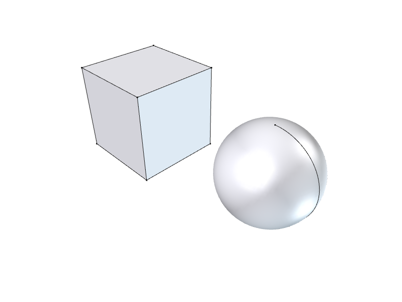](demos/ceramics/Ceramic-Alumina.png) | **[Ceramic-Alumina](ceramics/Ceramic-Alumina.FCMat)**<br><small>High-purity alumina oxide ceramic (spark igniter electrode insulators)</small> | `3900 kg/m^3` | `380000 MPa` | <small>`0.95, 0.95, 0.98, 1.0`</small> | [View Model](demos/ceramics/Ceramic-Alumina.FCStd) |
| [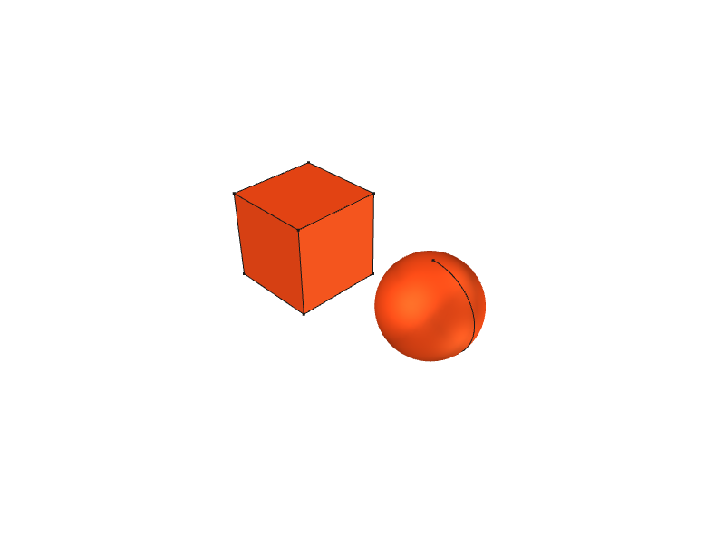](demos/ceramics/Ceramic-Cordierite.png) | **[Ceramic-Cordierite](ceramics/Ceramic-Cordierite.FCMat)**<br><small>Porous high-temperature cordierite ceramic matrix (infrared radiant burner tiles, glowing 1,800 deg F face)</small> | `2100 kg/m^3` | `135000 MPa` | <small>`0.95, 0.28, 0.08, 1.0`</small> | [View Model](demos/ceramics/Ceramic-Cordierite.FCStd) |

### FINISHES (7 Materials)

| Snapshot | Material | Density | Modulus | Appearance (Diffuse) | Demo Model |
| :---: | :--- | :---: | :---: | :---: | :---: |
| [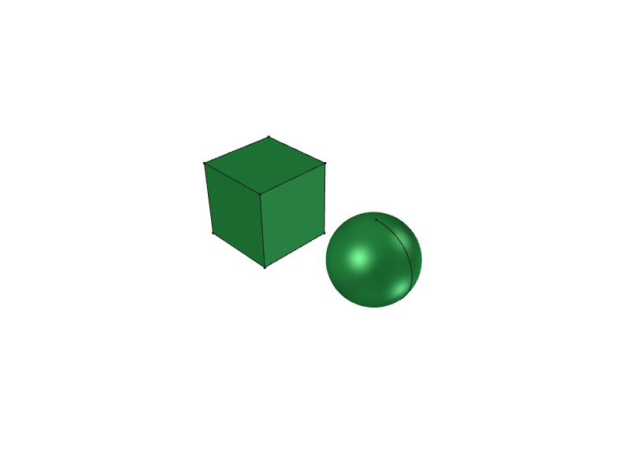](demos/finishes/PowderCoat-ForestGreen.png) | **[PowderCoat-ForestGreen](finishes/PowderCoat-ForestGreen.FCMat)**<br><small>Camping green coated steel (1 lb portable propane canisters)</small> | `7850 kg/m^3` | `N/A` | <small>`0.12, 0.48, 0.22, 1.0`</small> | [View Model](demos/finishes/PowderCoat-ForestGreen.FCStd) |
| [](demos/finishes/PowderCoat-GlossWhite.png) | **[PowderCoat-GlossWhite](finishes/PowderCoat-GlossWhite.FCMat)**<br><small>Durable white gloss powder-coated carbon steel (DOT propane cylinders, outdoor tanks)</small> | `7850 kg/m^3` | `200000 MPa` | <small>`0.90, 0.91, 0.93, 1.0`</small> | [View Model](demos/finishes/PowderCoat-GlossWhite.FCStd) |
| [](demos/finishes/PowderCoat-IndustrialBlue.png) | **[PowderCoat-IndustrialBlue](finishes/PowderCoat-IndustrialBlue.FCMat)**<br><small>Industrial blue powder-coated steel/aluminum (Harbor Freight tools, valve bodies)</small> | `7850 kg/m^3` | `N/A` | <small>`0.10, 0.35, 0.80, 1.0`</small> | [View Model](demos/finishes/PowderCoat-IndustrialBlue.FCStd) |
| [](demos/finishes/PowderCoat-IndustrialRed.png) | **[PowderCoat-IndustrialRed](finishes/PowderCoat-IndustrialRed.FCMat)**<br><small>Industrial red powder-coated structural carbon steel (hand truck frames, chassis)</small> | `7850 kg/m^3` | `200000 MPa` | <small>`0.82, 0.12, 0.12, 1.0`</small> | [View Model](demos/finishes/PowderCoat-IndustrialRed.FCStd) |
| [](demos/finishes/PowderCoat-MatteBlack.png) | **[PowderCoat-MatteBlack](finishes/PowderCoat-MatteBlack.FCMat)**<br><small>Industrial matte black powder-coated carbon steel (harness cages, brackets, frames)</small> | `7850 kg/m^3` | `N/A` | <small>`0.15, 0.15, 0.16, 1.0`</small> | [View Model](demos/finishes/PowderCoat-MatteBlack.FCStd) |
| [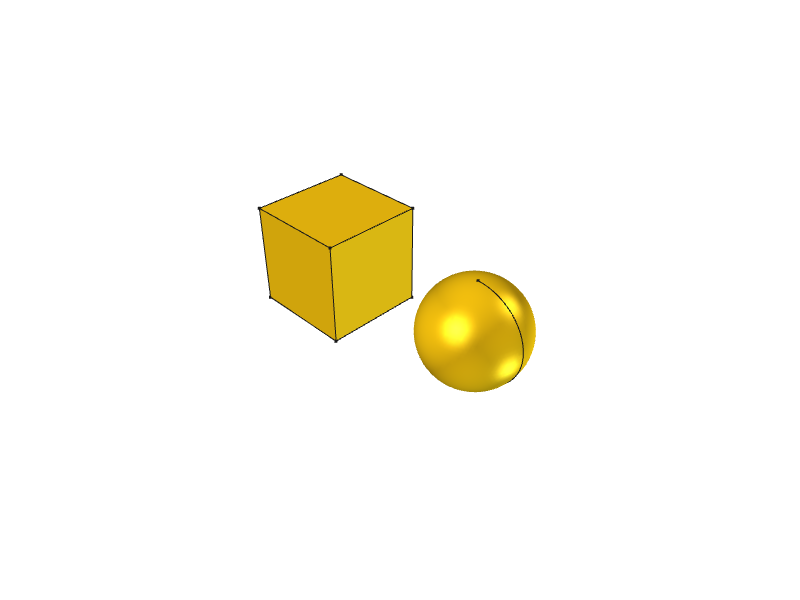](demos/finishes/PowderCoat-SafetyYellow.png) | **[PowderCoat-SafetyYellow](finishes/PowderCoat-SafetyYellow.FCMat)**<br><small>OSHA safety yellow powder-coated carbon steel (safety handles, brackets, guards)</small> | `7850 kg/m^3` | `200000 MPa` | <small>`0.95, 0.75, 0.05, 1.0`</small> | [View Model](demos/finishes/PowderCoat-SafetyYellow.FCStd) |
| [](demos/finishes/PowderCoat-StihlOrange.png) | **[PowderCoat-StihlOrange](finishes/PowderCoat-StihlOrange.FCMat)**<br><small>STIHL trademark high-visibility safety orange (tool housings, debris shields)</small> | `1050 kg/m^3` | `N/A` | <small>`0.95, 0.35, 0.05, 1.0`</small> | [View Model](demos/finishes/PowderCoat-StihlOrange.FCStd) |

### FLUIDS (1 Materials)

| Snapshot | Material | Density | Modulus | Appearance (Diffuse) | Demo Model |
| :---: | :--- | :---: | :---: | :---: | :---: |
| [](demos/fluids/Water.png) | **[Water](fluids/Water.FCMat)**<br><small>Liquid water (safety reservoir, ballast)</small> | `1000 kg/m^3` | `N/A` | <small>`0.20, 0.60, 0.90, 0.5`</small> | [View Model](demos/fluids/Water.FCStd) |

### METALS (6 Materials)

| Snapshot | Material | Density | Modulus | Appearance (Diffuse) | Demo Model |
| :---: | :--- | :---: | :---: | :---: | :---: |
| [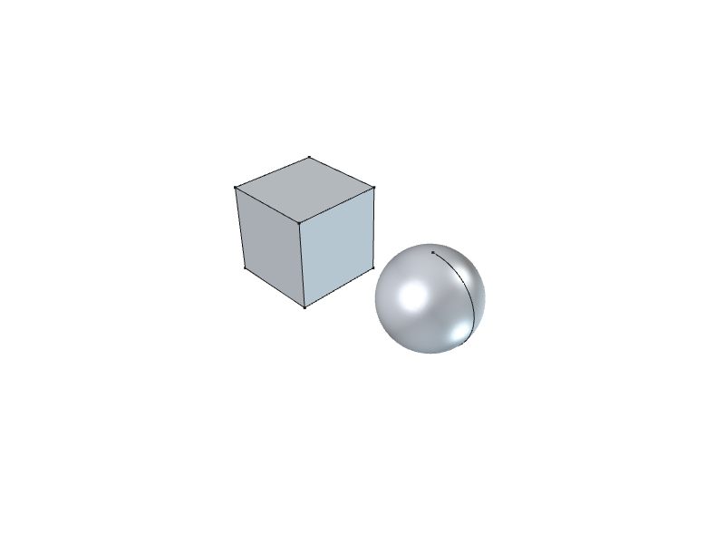](demos/metals/Aluminum-6061-T6.png) | **[Aluminum-6061-T6](metals/Aluminum-6061-T6.FCMat)**<br><small>Structural 6061-T6 aluminum alloy (diamond plate, structural tubing, extrusions)</small> | `2700 kg/m^3` | `68900 MPa` | <small>`0.78, 0.80, 0.83, 1.0`</small> | [View Model](demos/metals/Aluminum-6061-T6.FCStd) |
| [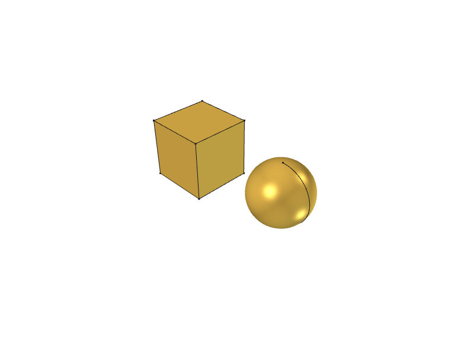](demos/metals/Brass-C360.png) | **[Brass-C360](metals/Brass-C360.FCMat)**<br><small>C360 free-cutting brass (propane valves, burner orifices, hose fittings)</small> | `8500 kg/m^3` | `97000 MPa` | <small>`0.85, 0.68, 0.28, 1.0`</small> | [View Model](demos/metals/Brass-C360.FCStd) |
| [](demos/metals/CastIron-Gray.png) | **[CastIron-Gray](metals/CastIron-Gray.FCMat)**<br><small>Gray cast iron (counterweights, cast wheels, burner housings)</small> | `7200 kg/m^3` | `110000 MPa` | <small>`0.28, 0.28, 0.30, 1.0`</small> | [View Model](demos/metals/CastIron-Gray.FCStd) |
| [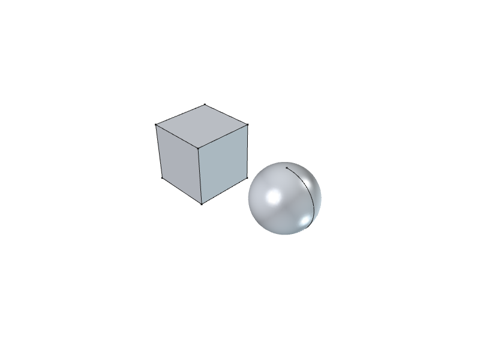](demos/metals/Steel-304Stainless.png) | **[Steel-304Stainless](metals/Steel-304Stainless.FCMat)**<br><small>AISI 304 austenitic stainless steel (sheet, tubing, burner hoods, hardware)</small> | `8000 kg/m^3` | `193000 MPa` | <small>`0.80, 0.82, 0.85, 1.0`</small> | [View Model](demos/metals/Steel-304Stainless.FCStd) |
| [](demos/metals/Steel-A36.png) | **[Steel-A36](metals/Steel-A36.FCMat)**<br><small>ASTM A36 structural carbon steel (tubing, plate, angle iron, channels)</small> | `7850 kg/m^3` | `200000 MPa` | <small>`0.42, 0.44, 0.48, 1.0`</small> | [View Model](demos/metals/Steel-A36.FCStd) |
| [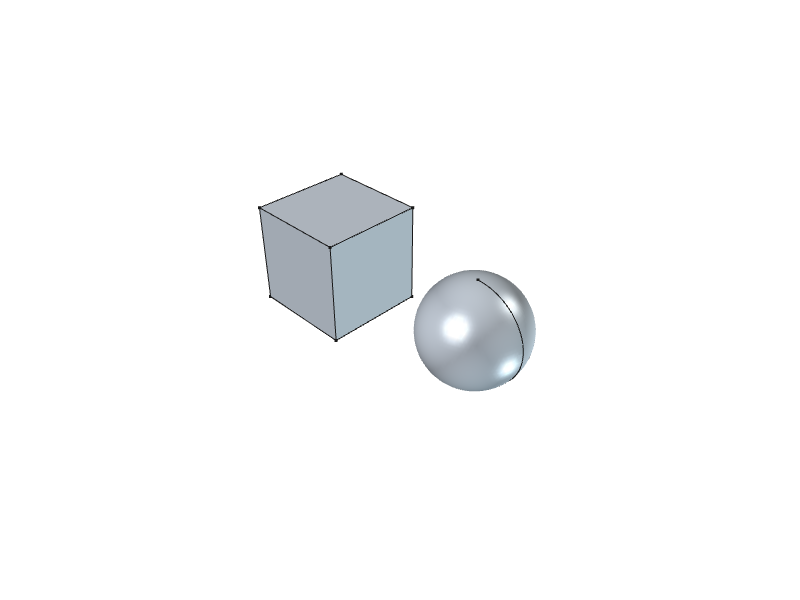](demos/metals/Steel-ZincPlated.png) | **[Steel-ZincPlated](metals/Steel-ZincPlated.FCMat)**<br><small>Zinc electroplated carbon steel (fasteners, caster forks, brackets, hardware)</small> | `7850 kg/m^3` | `200000 MPa` | <small>`0.75, 0.78, 0.82, 1.0`</small> | [View Model](demos/metals/Steel-ZincPlated.FCStd) |

### POLYMERS (7 Materials)

| Snapshot | Material | Density | Modulus | Appearance (Diffuse) | Demo Model |
| :---: | :--- | :---: | :---: | :---: | :---: |
| [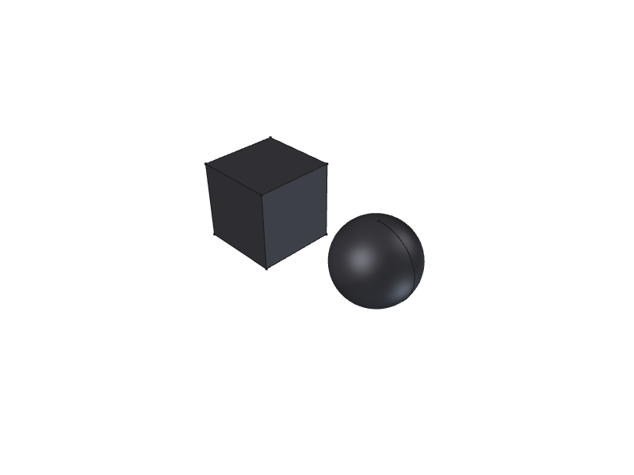](demos/polymers/Plastic-ABS.png) | **[Plastic-ABS](polymers/Plastic-ABS.FCMat)**<br><small>Acrylonitrile butadiene styrene rigid thermoplastic (tool cases, knobs, handle grips)</small> | `1040 kg/m^3` | `N/A` | <small>`0.20, 0.20, 0.22, 1.0`</small> | [View Model](demos/polymers/Plastic-ABS.FCStd) |
| [](demos/polymers/Plastic-StihlOrange.png) | **[Plastic-StihlOrange](polymers/Plastic-StihlOrange.FCMat)**<br><small>STIHL trademark high-visibility safety orange high-impact molded polymer (housings, shields, shrouds)</small> | `1050 kg/m^3` | `N/A` | <small>`0.95, 0.35, 0.05, 1.0`</small> | [View Model](demos/polymers/Plastic-StihlOrange.FCStd) |
| [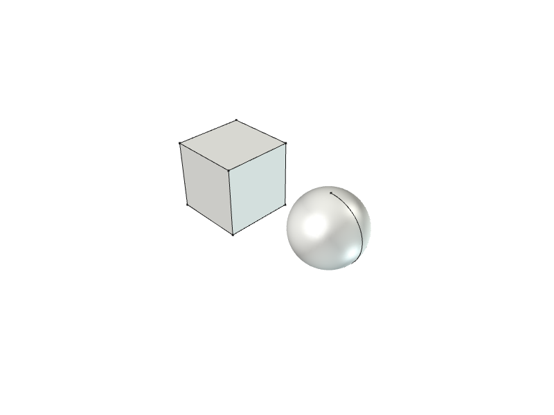](demos/polymers/Plastic-StihlWhite.png) | **[Plastic-StihlWhite](polymers/Plastic-StihlWhite.FCMat)**<br><small>STIHL trademark light gray/off-white high-impact polymer (tool housings, blower tubes)</small> | `1050 kg/m^3` | `N/A` | <small>`0.92, 0.92, 0.90, 1.0`</small> | [View Model](demos/polymers/Plastic-StihlWhite.FCStd) |
| [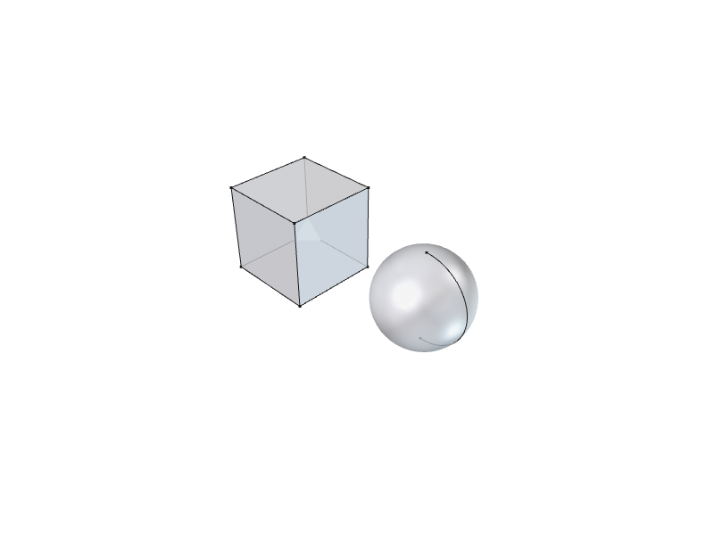](demos/polymers/Polyethylene-HDPE.png) | **[Polyethylene-HDPE](polymers/Polyethylene-HDPE.FCMat)**<br><small>High-density polyethylene (chemical tanks, water reservoirs, containers)</small> | `950 kg/m^3` | `1000 MPa` | <small>`0.88, 0.88, 0.90, 0.2`</small> | [View Model](demos/polymers/Polyethylene-HDPE.FCStd) |
| [](demos/polymers/Polyethylene-SafetyBlue.png) | **[Polyethylene-SafetyBlue](polymers/Polyethylene-SafetyBlue.FCMat)**<br><small>High-density polyethylene in vivid safety blue (pressurized water safety tanks, chemical wash reservoirs)</small> | `950 kg/m^3` | `1000 MPa` | <small>`0.10, 0.42, 0.85, 1.0`</small> | [View Model](demos/polymers/Polyethylene-SafetyBlue.FCStd) |
| [](demos/polymers/Polyurethane.png) | **[Polyurethane](polymers/Polyurethane.FCMat)**<br><small>High-impact molded polyurethane core (caster wheel centers, high-load wheels)</small> | `1200 kg/m^3` | `N/A` | <small>`0.92, 0.72, 0.08, 1.0`</small> | [View Model](demos/polymers/Polyurethane.FCStd) |
| [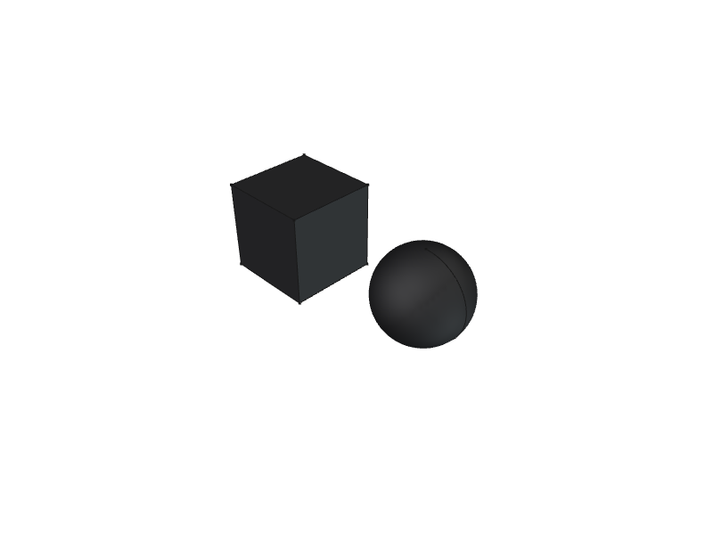](demos/polymers/Rubber-Solid.png) | **[Rubber-Solid](polymers/Rubber-Solid.FCMat)**<br><small>Vulcanized solid rubber (treaded tires, protective corner bumpers, feet)</small> | `1150 kg/m^3` | `N/A` | <small>`0.12, 0.12, 0.13, 1.0`</small> | [View Model](demos/polymers/Rubber-Solid.FCStd) |

### WOODS (2 Materials)

| Snapshot | Material | Density | Modulus | Appearance (Diffuse) | Demo Model |
| :---: | :--- | :---: | :---: | :---: | :---: |
| [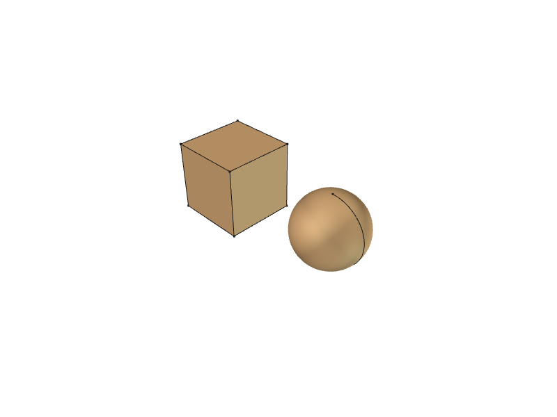](demos/woods/Wood-PlywoodSheathing.png) | **[Wood-PlywoodSheathing](woods/Wood-PlywoodSheathing.FCMat)**<br><small>Cross-laminated structural plywood sheathing (3/4in CDX / sanded pine plywood)</small> | `600 kg/m^3` | `8000 MPa` | <small>`0.76, 0.60, 0.42, 1.0`</small> | [View Model](demos/woods/Wood-PlywoodSheathing.FCStd) |
| [](demos/woods/Wood-SoftwoodPine.png) | **[Wood-SoftwoodPine](woods/Wood-SoftwoodPine.FCMat)**<br><small>Structural dimensional softwood lumber (2x4, 1x4 Pine / Spruce / Douglas Fir)</small> | `500 kg/m^3` | `10000 MPa` | <small>`0.82, 0.64, 0.45, 1.0`</small> | [View Model](demos/woods/Wood-SoftwoodPine.FCStd) |

---

## 3. YAML Specification Standard

All material cards adhere to FreeCAD 1.1's native YAML specification:
```yaml
---
# FreeCAD Material Card
General:
  UUID: "856988e2-8719-47c0-b934-b12aa2052c6f"
  Author: "phi ARCHITECT"
  License: "CC-BY-4.0"
  Name: "Steel-A36"
  Description: "ASTM A36 structural carbon steel"
Models:
  Density:
    UUID: '454661e5-265b-4320-8e6f-fcf6223ac3af'
    Density: "7850 kg/m^3"
  LinearElastic:
    UUID: '7b561d1d-fb9b-44f6-9da9-56a4f74d7536'
    YoungsModulus: "200000 MPa"
    PoissonRatio: "0.26"
AppearanceModels:
  BasicRendering:
    UUID: 'f006c7e4-35b7-43d5-bbf9-c5d572309e6e'
    AmbientColor: "(0.22, 0.23, 0.25, 1.0)"
    DiffuseColor: "(0.42, 0.44, 0.48, 1.0)"
    SpecularColor: "(0.60, 0.60, 0.62, 1.0)"
    EmissiveColor: "(0.0, 0.0, 0.0, 1.0)"
    Shininess: "0.25"
    Transparency: "0.0"
```
