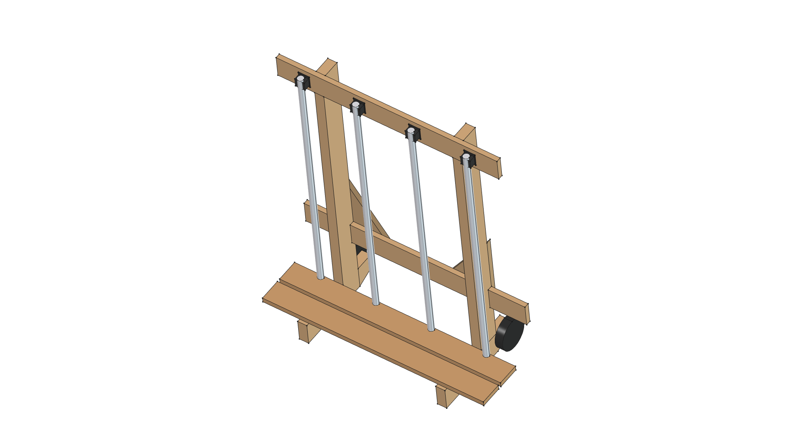

# STIHL Kombi Attachment Caddy — Version 10 (Master)

**Version Directory**: `projects/caddy/v10/`  
**Master Model Copy**: [`../caddy.FCStd`](../caddy.FCStd)  
**Status**: **Optimal Master Version**  

---

## 3D CAD Model Render (v10)



---

## Version 10 Directory Index

- 🛠️ [**`build.py`**](build.py): FreeCAD Python parametric generator script for Version 10.
- 📦 [**`caddy_v10.FCStd`**](caddy_v10.FCStd): FreeCAD 3D Master Model document file.
- 🖼️ [**`caddy_v10.png`**](caddy_v10.png): High-resolution 3D CAD isometric render snapshot.
- 📋 [**`REQUIREMENTS.md`**](REQUIREMENTS.md): Version 10 specific requirement refinements, delta matrix, and verification status.
- 📐 [**`SPECIFICATION.md`**](SPECIFICATION.md): Detailed engineering specification, parametric VarSet (`dims`) table, joinery pockets, and hardware specs.
- ✂️ [**`CUT_LIST.md`**](CUT_LIST.md): Complete DIY cut list, board optimization for 2x4 & 1x4 stock lumber, dado notch specs, and fastener list.

---

## Key Version 10 Improvements

1. **36.0 in Cross Rails**: Expanded top and lower 1x4 rails to 36.0 inches wide with 6.0 in cantilever overhangs beyond the vertical posts.
2. **24.0 in Post Span**: Maintained 24.0 in outer post spacing for garage wall stud alignment and wheel track stability.
3. **Calibrated Height**: 44.5 in post height places clip grab centers at 42.75 in, perfectly matching real-world 39.5" Kombi attachment standing heights.

---

## FreeCAD Execution Command

```bash
/home/phi/AppImages/FreeCAD_1.1.3-Linux-x86_64-py311.AppImage -c "__file__='/home/phi/PROJECTS/phi-WORKS/maker/projects/caddy/v10/build.py'; exec(open(__file__).read())"
```
