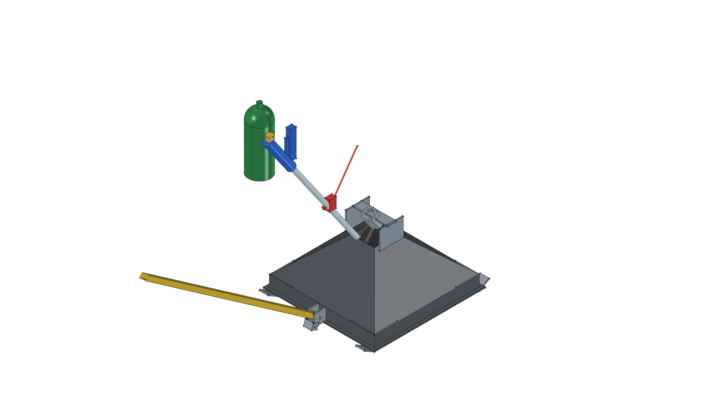
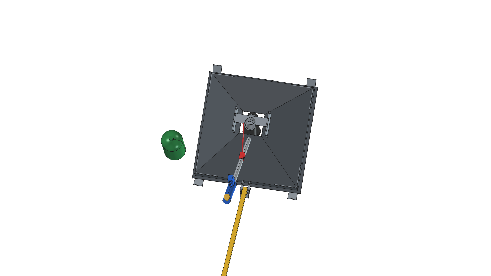
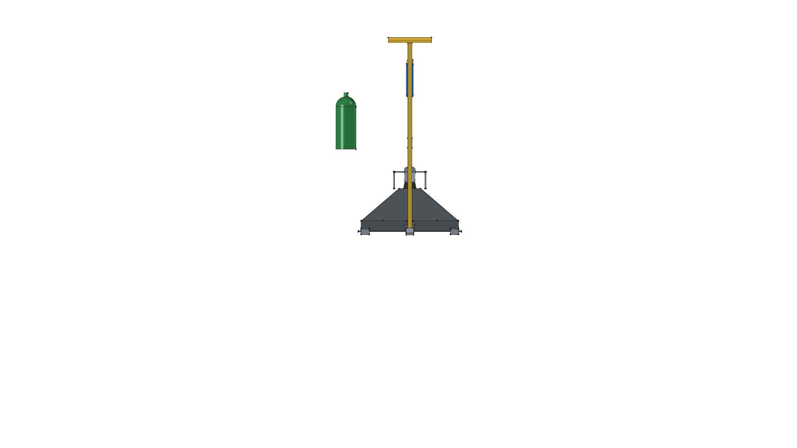
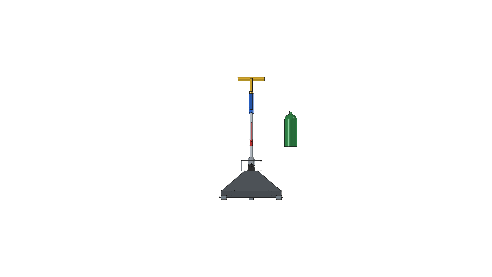
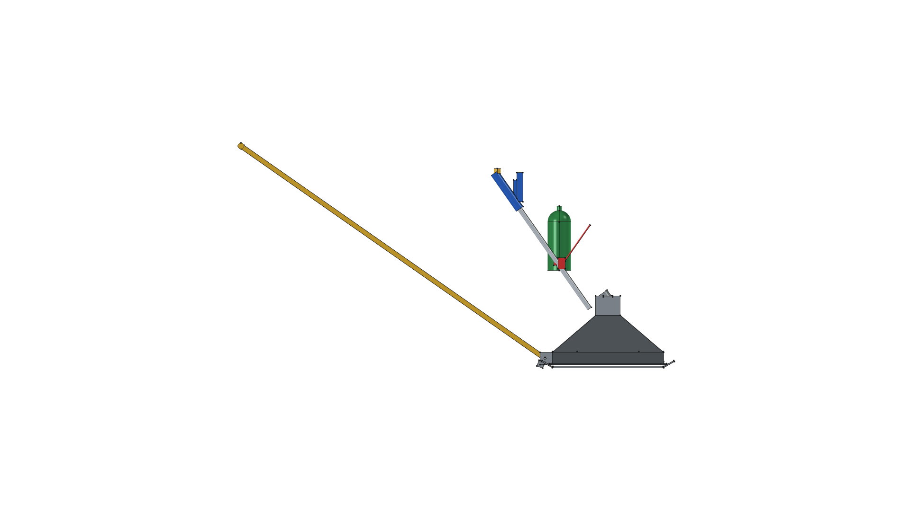
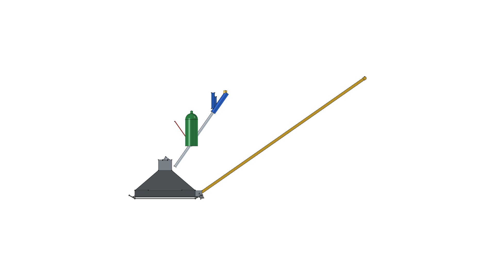
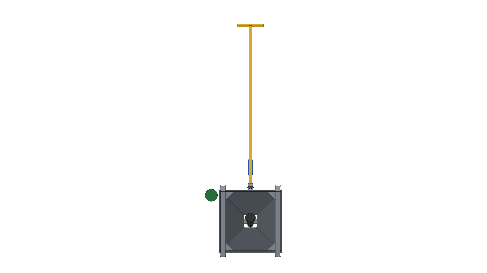

# Towable Flame Weeding Sled Project

**Project Location**: `projects/flame-weeding-sled/`  
**Master CAD Model**: [`flame_sled.FCStd`](flame_sled.FCStd) (Master copy of Version 04)  
**Latest Optimal Version**: **[Version 04](v04/)**  
**Torch Component Unit**: [Harbor Freight Propane Torch #91037](../../components/torch_hf91037/)  

---

## Project Overview

The **Towable Flame Weeding Sled** is a lightweight, heat-concentrating drag hood pulled ahead of an operator via a 5 ft rigid steel tow bar. Designed for gravel driveway weed management via thermal shock ($150^\circ\text{F}$–$180^\circ\text{F}$), it mounts a high-output **Harbor Freight #91037 Propane Torch** above an enclosed 14-gauge mild steel pyramidal hood.

---

## Master 3D CAD Multi-View Projection Gallery (v04)

| Isometric (Home View) | Top Plan View |
| :---: | :---: |
|  |  |
| **Front Elevation** | **Rear Elevation** |
|  |  |
| **Right Side Elevation** | **Left Side Elevation** |
|  |  |
| **Bottom Plan View** | |
|  | |

---

## Project Master Documentation Index

- 📋 [**REQUIREMENTS.md**](REQUIREMENTS.md): Master requirements specification, functional requirements table, physical fabrication constraints, and version evolution.
- 📐 [**v04/SPECIFICATION.md**](v04/SPECIFICATION.md): Version 04 engineering specification, thermal shock physics, geometry, torch mounting clamp, and forward tow kinetics.
- ✂️ [**v04/CUT_LIST.md**](v04/CUT_LIST.md): DIY cut list optimized for angle grinder cut-off wheels and flux-core MIG welding, flat trapezoid templates, and skid tip geometry.
- 🛠️ [**v04/FABRICATION_GUIDE.md**](v04/FABRICATION_GUIDE.md): Step-by-step angle grinder panel prep, flux-core seam welding, overhead frame assembly, torch clamping, and operating safety checklist.
- 📦 [**v04/BOM.md**](v04/BOM.md): Complete itemized Bill of Materials with dimensions, weights (~22.2 lbs dry sled), and sourcing recommendations.
- 🚀 [**v04/README.md**](v04/README.md): Version 04 self-contained directory index.

---

## Version Iteration Index

| Version | Directory | Description & Key Milestones | Status |
| :---: | :--- | :--- | :---: |
| **v01** | [`v01/`](v01/) | Apex collar & closed pyramid hood prototype. | Baseline |
| **v02** | [`v02/`](v02/) | Integrated Harbor Freight #91037 torch, overhead frame, and forward tow bar. | Mechanical Integration |
| **v03** | [`v03/`](v03/) | Re-angled torch handle 180° forward leaning toward operator puller. | Ergonomic Refinement |
| **v04** | [`v04/`](v04/) | **Master Version**: Organized 3D model into 4 modular FreeCAD `App::DocumentObjectGroup` containers. | **OPTIMAL MASTER** |

---

## FreeCAD Build Command

To build the active master model (Version 04) and generate all 7 orthographic view renders:

```bash
/home/phi/AppImages/FreeCAD_1.1.3-Linux-x86_64-py311.AppImage -c "__file__='/home/phi/PROJECTS/phi-WORKS/maker/projects/flame-weeding-sled/v04/build.py'; exec(open(__file__).read())"
```
