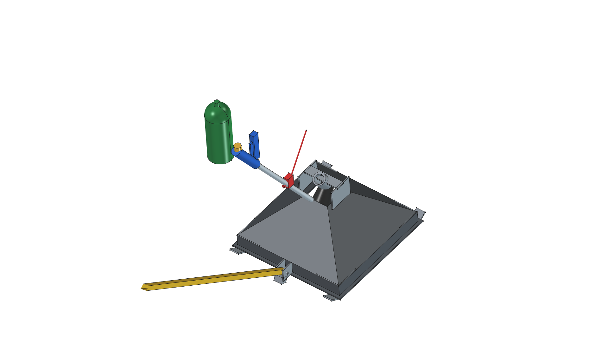

# Towable Flame Weeding Sled — Version 04 (Master)

**Version Directory**: `projects/flame-weeding-sled/v04/`  
**Master Model Copy**: [`../flame_sled.FCStd`](../flame_sled.FCStd)  
**Status**: **Optimal Master Version**  

---

## 3D CAD Model Render (v04)



---

## Version 04 Directory Index

- 🛠️ [**`build.py`**](build.py): FreeCAD Python parametric generator script for Version 04.
- 📦 [**`sled_v04.FCStd`**](sled_v04.FCStd): FreeCAD 3D Master Model document file.
- 🖼️ [**`sled_v04.png`**](sled_v04.png): High-resolution 3D CAD isometric render snapshot.
- 📋 [**`REQUIREMENTS.md`**](REQUIREMENTS.md): Version 04 specific requirement refinements, delta matrix, and verification status.
- 📐 [**`SPECIFICATION.md`**](SPECIFICATION.md): Version 04 detailed engineering specification, thermal physics, geometry, and torch interface.
- ✂️ [**`CUT_LIST.md`**](CUT_LIST.md): DIY cut list tailored for angle grinder cut-off wheels and flux-core MIG welding, flat trapezoid panel templates, and skid tips.
- 🛠️ [**`FABRICATION_GUIDE.md`**](FABRICATION_GUIDE.md): Step-by-step assembly guide, weld sequence, frame fitting, and safety checklist.
- 📦 [**`BOM.md`**](BOM.md): Complete Bill of Materials, dimensions, quantities, weights (~22.2 lbs dry sled), and sourcing links.

---

## FreeCAD Execution Command

```bash
/home/phi/AppImages/FreeCAD_1.1.3-Linux-x86_64-py311.AppImage -c "__file__='/home/phi/PROJECTS/phi-WORKS/maker/projects/flame-weeding-sled/v04/build.py'; exec(open(__file__).read())"
```
