# Compact Foam Camper v0.3.0 - Master Assembly Guide

> **Step-by-Step Shop Assembly Manual: 1D Developable Curved Foam Panels, Multi-Buck Suite, and Monocoque Pop-Top Integration**  
> *phi-WORKS Maker Framework (`projects/foam-camper`)*

**Master 3D Model**: [`foam-camper.FCStd`](foam-camper.FCStd)  
**Master Assembly Buck**: [`fabrication/camper_assembly_buck.FCStd`](fabrication/camper_assembly_buck.FCStd) *(also alias [`camper_buck.FCStd`](fabrication/camper_buck.FCStd))*  
**Pop-Up Roof Canopy Buck**: [`fabrication/roof_canopy_buck.FCStd`](fabrication/roof_canopy_buck.FCStd)  
**Side Wall Bending Jig**: [`fabrication/side_wall_buck.FCStd`](fabrication/side_wall_buck.FCStd)  
**Automated Buck Suite Script**: [`fabrication/build_bucks.py`](fabrication/build_bucks.py)  

---

## Executive Overview

The **Compact Foam Camper v0.3.0** is engineered around **single-axis 1D developable curvature**, allowing standard flat $4' \times 8'$ sheets of $2.0''$ ($50.8\ \text{mm}$) Extruded Polystyrene (XPS) rigid insulation foam to form an aerodynamic, compound-shouldered monocoque camper shell without requiring compound double-curvature bending.

### Curvature Geometry:
1. **Side Walls (Port & Starboard)**: Curved along the horizontal $XY$ plane (boat-tail planform curve) with **strictly vertical rulings** in $Z$. Flat sheets are scored with **vertical parallel kerfs**.
2. **Pop-Up Roof Canopy**: Curved along the vertical $XZ$ plane (aerodynamic teardrop elevation curve) with **strictly lateral horizontal rulings** in $Y$. Flat sheets are scored with **transverse horizontal kerfs**.
3. **Compound 3D Shoulder Seam**: Where the vertical ruled walls and horizontal ruled roof meet at $Y = \pm 533.5\ \text{mm}$ ($42''$ center aisle well), forming a self-aligning joint line.

---

## Master Assembly Buck Gallery (12' Chassis Jig)

| Master Assembly Buck (Perspective) | Assembly Buck Inside Ghost Shell |
| :---: | :---: |
| 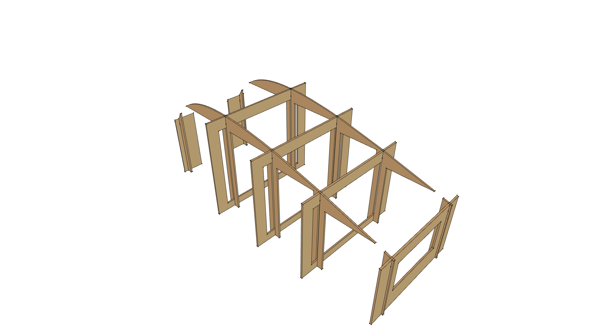 | 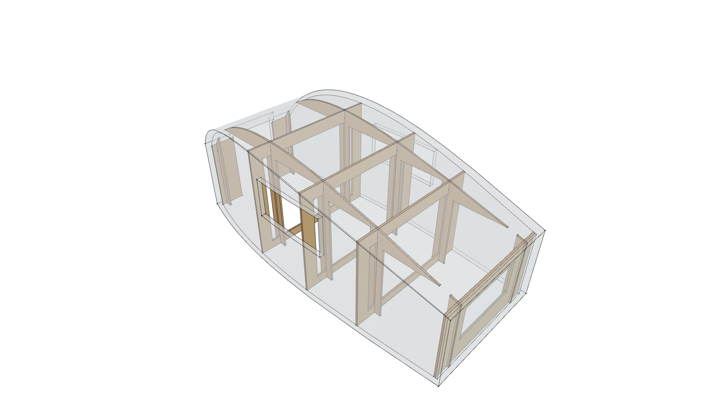 |
| **Top Plan View (Walk-Through Aisle & Shoulder Stringers)** | **Front Elevation (24" Walk-Through Door Cutout)** |
| 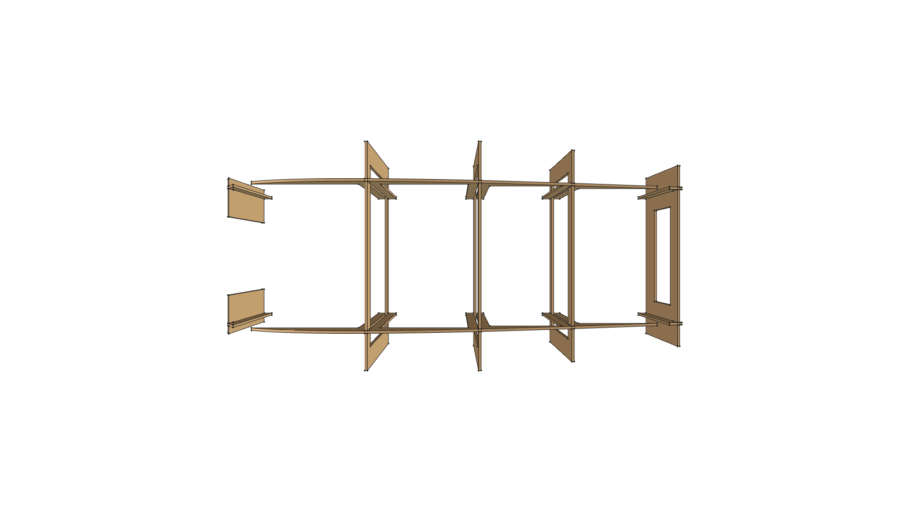 | 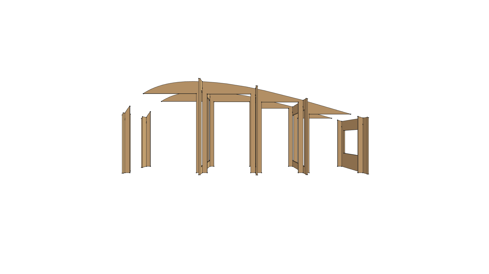 |
| **Side Elevation Profile** | **Rear Transom Elevation** |
| 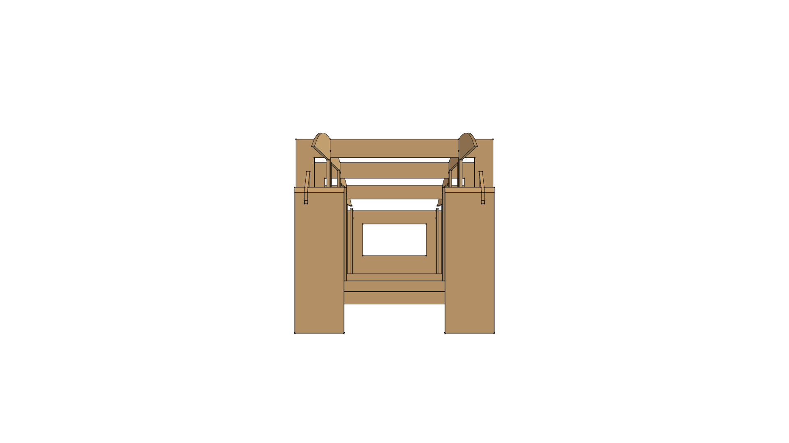 | 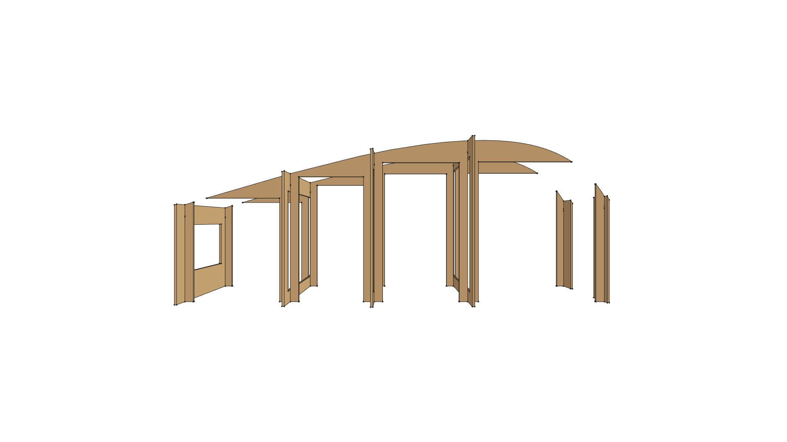 |

*Fig 1: Master 12' × 6.5' Interlocking 3/4" CDX Plywood Assembly Buck ([`camper_assembly_buck.FCStd`](fabrication/camper_assembly_buck.FCStd)). Features 24" center door cutout at Station 0, interior crawl-through access, and dual shoulder stringers at $Y = \pm 533.5\ \text{mm}$.*

---

## Standalone Formation Bucks Gallery

### 1. Pop-Up Roof Canopy Form Buck (`roof_canopy_buck.FCStd`)
Dedicated bench-top jig for pre-curving the $42'' \times 106''$ ($1,067 \times 2,700\ \text{mm}$) 1D $XZ$ arched pop-up roof canopy off-trailer.

| Roof Canopy Buck (Perspective) | Top Plan View |
| :---: | :---: |
| 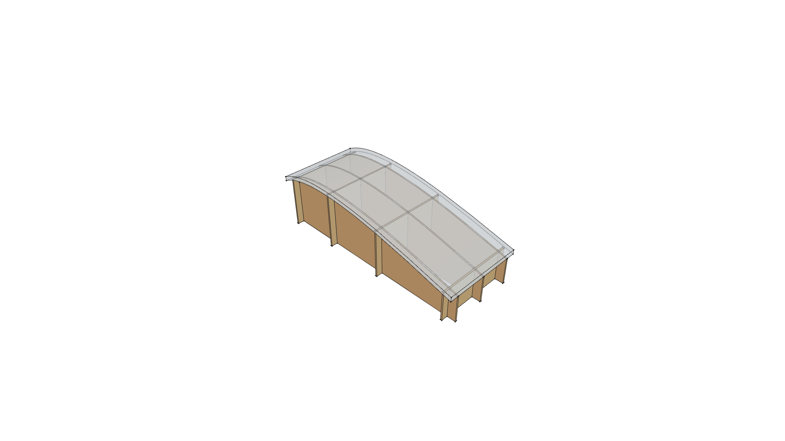 | 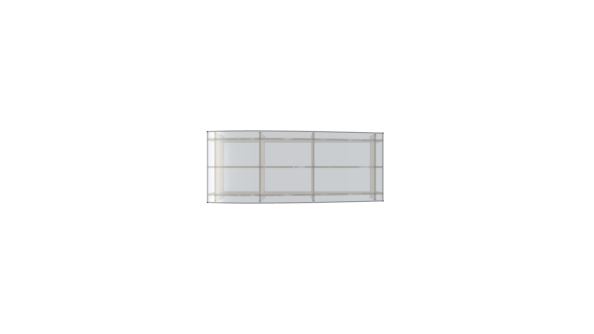 |
| **Side Profile (1D XZ Elevation Curve)** | **Transverse End Profile (3 Arched Formers)** |
| 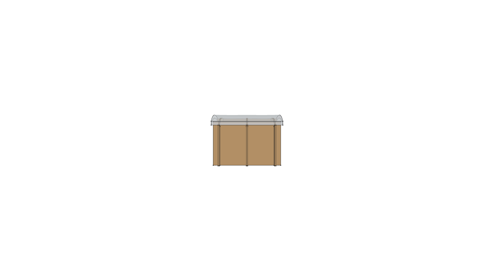 | 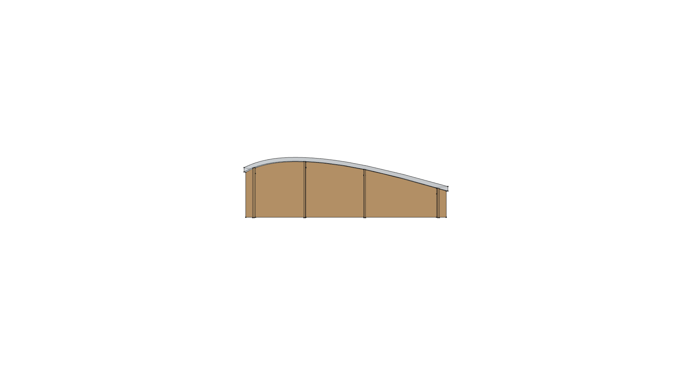 |

*Fig 2: Pop-Up Roof Canopy Form Buck ([`roof_canopy_buck.FCStd`](fabrication/roof_canopy_buck.FCStd)) — 3 longitudinal arched formers and 4 interlocking cross-ties supporting clamped $2.0''$ XPS foam canopy.*

### 2. Side Wall Planform Bending Jig (`side_wall_buck.FCStd`)
Curved shop floor / bench jig matching the boat-tail $XY$ planform contour for pre-curving the vertically kerfed $2.0''$ XPS side panels.

| Side Wall Jig (Perspective) | Top Plan View (Boat-Tail Curve) |
| :---: | :---: |
| 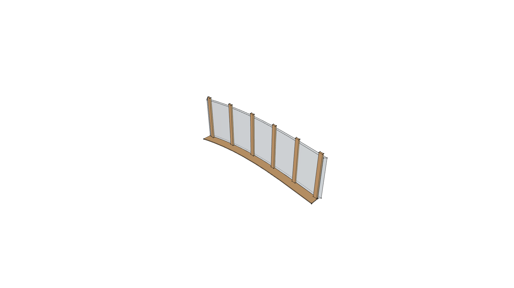 | 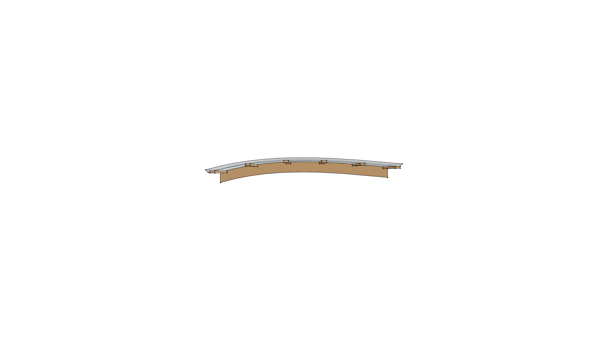 |
| **Side Elevation** | **Front View Profile** |
| 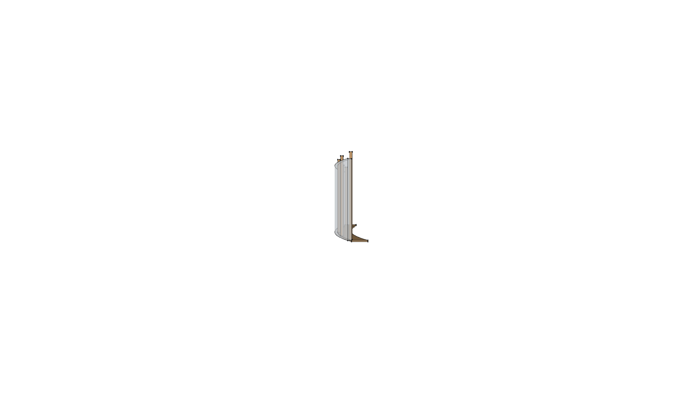 | 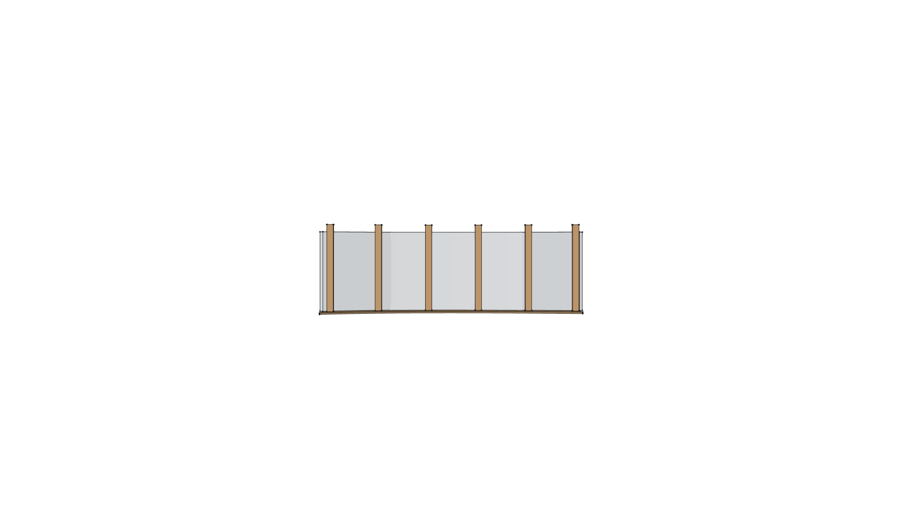 |

*Fig 3: Side Wall Planform Bending Jig ([`side_wall_buck.FCStd`](fabrication/side_wall_buck.FCStd)) — Curved 3/4" plywood sole plate with vertical 2x4 clamp posts.*

---

## Required Tools & Materials

### Sheet Goods & Framing:
- **XPS Rigid Insulation Foam**:
  - $6\times$ sheets of $2.0'' \times 4' \times 8'$ Extruded Polystyrene (Owens Corning Foamular 150/250 or Dow Styrofoam).
- **Plywood for Buck Suite**:
  - $3\times$ sheets of $3/4''$ ($19\ \text{mm}$) CDX Plywood (Master Assembly Buck: 5 bulkheads + 2 shoulder stringers).
  - $2\times$ sheets of $3/4''$ CDX Plywood (Roof Canopy Buck: 3 formers + 4 ties).
  - $1\times$ sheet of $3/4''$ Plywood + $4\times$ 2x4x8' studs (Side Wall Jig).
  - $1\times$ sheet of $3/4''$ Sanded Birch Plywood (permanent Station 3 Galley Bulkhead).
- **Floor Subdeck**:
  - $2\times$ sheets of $3/4''$ Exterior/Marine Plywood (fastened to trailer frame).

### Adhesives, Sealants & Armor:
- **Polyurethane Expanding Adhesive**: $5\times 18\ \text{oz}$ bottles of Gorilla Glue Original (or Titebond Fast Grab / Great Stuff Pro Foam Adhesive).
- **PMF Skinning Matrix**: $3\times 1\ \text{gallon}$ jugs of Titebond II Premium Wood Glue (or Gripper acrylic primer).
- **Fabric Skin (PMF Armor)**: $2\times$ Heavy 10 oz or 12 oz unbleached cotton canvas drop cloths ($12' \times 15'$).
- **Pop-Top Bellows**: Weather-resistant marine canvas (Sunbrella or heavy vinyl-coated polyester) with zippered bug-screen windows.
- **Gas Struts**: $4\times$ 40 lb or 60 lb 20" stroke gas lift struts for pop-up roof canopy.
- **Clamping Gear**: $6\times$ 2" Heavy-Duty Ratchet Cargo Straps (16 ft to 20 ft length).

---

## Step-by-Step Shop Fabrication & Assembly Workflow

```
                               FABRICATION & ASSEMBLY WORKFLOW
                               
   OFF-TRAILER FORMING                    MASTER CHASSIS ASSEMBLY
┌───────────────────────────┐          ┌───────────────────────────┐
│ Side Wall Planform Jig    │          │ 12' x 6.5' Trailer Deck   │
│ (side_wall_buck.FCStd)    │          │ Setup & Station Layout    │
│ Score vertical kerfs      │          └─────────────┬─────────────┘
│ Bond & cure 1D XY curve   │                        │
└─────────────┬─────────────┘                        ▼
              │                        ┌───────────────────────────┐
              │                        │ Assemble Master Buck      │
┌─────────────┴─────────────┐          │ (camper_assembly_buck)    │
│ Roof Canopy Bench Buck    │          │ 5 Bulkheads + Stringers   │
│ (roof_canopy_buck.FCStd)  │          └─────────────┬─────────────┘
│ Score transverse kerfs    │                        │
│ Bond & cure 1D XZ canopy  │                        ▼
└─────────────┬─────────────┘          ┌───────────────────────────┐
              │                        │ Mount Front Door Bulkhead │
              │                        │ & Rear Transom Wall       │
              │                        └─────────────┬─────────────┘
              │                                      │
              └─────────────────────────────────────►│
                                                     ▼
                                       ┌───────────────────────────┐
                                       │ Erect Pre-Curved Sides    │
                                       │ Clamp along Shoulder Line │
                                       └─────────────┬─────────────┘
                                                     │
                                                     ▼
                                       ┌───────────────────────────┐
                                       │ Inject Polyurethane Glue  │
                                       │ Fuse 3D Compound Seams    │
                                       └─────────────┬─────────────┘
                                                     │
                                                     ▼
                                       ┌───────────────────────────┐
                                       │ Disassemble & Slide Out   │
                                       │ Buck via Center Door!     │
                                       └─────────────┬─────────────┘
                                                     │
                                                     ▼
                                       ┌───────────────────────────┐
                                       │ Mount Pop-Up Canopy,      │
                                       │ Canvas Bellows & PMF Skin │
                                       └───────────────────────────┘
```

---

### Phase 1: Pre-Forming Modular Components Off-Trailer

#### 1. Side Wall Pre-Forming (1D $XY$ Boat-Tail Curve):
1. Lay flat $2.0'' \times 4' \times 8'$ XPS foam sheet on shop table with inside face up.
2. Track-saw vertical parallel kerfs at $2.0''$ ($50.8\ \text{mm}$) spacing, $1.57''$ ($40\ \text{mm}$) deep (leaving $10\text{--}11\ \text{mm}$ uncut outer hinge skin).
3. Mist kerfs with water; run beads of polyurethane expanding glue into each kerf.
4. Place sheet against the vertical stanchions of the **Side Wall Bending Jig** ([`side_wall_buck.FCStd`](fabrication/side_wall_buck.FCStd)).
5. Clamp against stanchions with ratchet straps until kerfs pinch shut. Allow 12–18 hours to cure into a rigid, boat-tail curved side panel.
6. Repeat for opposite side (port and starboard).

#### 2. Pop-Up Roof Canopy Pre-Forming (1D $XZ$ Elevation Curve):
1. Edge-join two $4' \times 8'$ XPS foam sheets to form a $42'' \times 106''$ blank.
2. Score **transverse horizontal kerfs** across the width at variable pitch ($1.9''$ to $3.5''$ spacing depending on local radius).
3. Mist kerfs; apply polyurethane glue.
4. Drape blank over the **Roof Canopy Form Buck** ([`roof_canopy_buck.FCStd`](fabrication/roof_canopy_buck.FCStd)).
5. Ratchet-strap down onto the 3 longitudinal arched formers until kerfs compress tight. Allow 12–18 hours to cure.

---

### Phase 2: Master Assembly on Trailer Deck

#### 1. Trailer Floor Setup:
- Bolt $3/4''$ exterior plywood subdeck to trailer chassis crossmembers.
- Verify squareness across diagonals ($D_1 = D_2$).
- Mark Station lines:
  - **Station 0**: $X = 60\ \text{mm}$ (Front Nose / Doorway)
  - **Station 1**: $X = 1,200\ \text{mm}$ (Shoulder Apex, $6'6''$ Max Width)
  - **Station 2**: $X = 2,000\ \text{mm}$ (Mid-Cabin)
  - **Station 3**: $X = 2,700\ \text{mm}$ (Galley Bulkhead / Rear Pop-Top Curb)
  - **Station 4**: $X = 3,580\ \text{mm}$ (Rear Transom)

#### 2. Erecting the Master Egg-Crate Assembly Buck:
- Erect Transverse Bulkheads 0 through 4 into their floor layout positions.
- Lower Left Shoulder Stringer ($Y = +533.5\ \text{mm}$) and Right Shoulder Stringer ($Y = -533.5\ \text{mm}$) into the top slots.
- Tap down with a rubber mallet until half-lap joints seat flush.
- Toe-screw bottom rib tabs to floor cleats. The buck is now completely self-squaring and rigid ($134.3\ \text{lbs}$).

#### 3. Erecting Front Bulkhead & Rear Transom:
- Mount the Front Foam Bulkhead ($2.0''$ XPS) with its centered $24''$ doorway opening aligned with Station 0.
- Mount the Rear Foam Transom ($2.0''$ XPS) with its $800 \times 400\ \text{mm}$ window cutout aligned with Station 4.

#### 4. Installing Pre-Curved Side Frames:
- Hoist pre-curved port and starboard side panels against the buck.
- The top curved edge of each side panel seats directly against the shoulder stringers at $Y = \pm 533.5\ \text{mm}$.
- Secure temporarily with drywall screws through scrap foam fender washers into the buck rib edges.
- Ratchet-strap the side panels firmly against the buck.

#### 5. Joint Bonding & Monocoque Fusion:
- Inject expanding polyurethane adhesive into all joint interfaces:
  - Floor-to-wall bottom sole joints.
  - Front bulkhead-to-side-wall vertical corner seams.
  - Rear transom-to-side-wall vertical corner seams.
  - Pop-up aperture coaming / shoulder seams along $Y = \pm 533.5\ \text{mm}$.
- Allow full 24-hour cure under compression.

---

### Phase 3: Buck Removal Through the Walk-Through Door

Because Station 0 and the front bulkhead feature a **24" wide walk-through doorway opening**, buck removal is dramatically simplified:
1. Release all external ratchet cargo straps.
2. Back out temporary drywall screws.
3. Unscrew floor base cleats.
4. Walk inside the camper through the front center door.
5. Tap shoulder stringers upward to unseat from half-lap slots.
6. Slide the shoulder stringers and temporary ribs (Station 0, 1, 2, 4) straight out through the 24" front walk-through door onto the tongue step platform!
7. **Station 3 (Galley Bulkhead)** remains permanently bonded in place as a structural firewall and galley support.

---

### Phase 4: Pop-Up Roof Canopy & Canvas Bellows Installation

1. Mount heavy-duty aluminum piano hinges or scissor-lift linkages to the pop-up roof frame opening.
2. Install $4\times$ 20" stroke gas lift struts calibrated for the $35\ \text{lb}$ foam canopy.
3. Fasten the pre-curved foam canopy to the lift mechanism.
4. Fasten the weather-resistant canvas bellows to the roof well perimeter and the underside of the raised canopy.
5. Test lift stroke: verify smooth 20" vertical travel yielding **$6'5.5''$ ($1,968\ \text{mm}$) standing headroom** in the center aisle.

---

### Phase 5: "Poor Man's Fiberglass" (PMF) Exterior Skinning

```
        PMF COMPOSITE LAMINATE CROSS-SECTION
        
  ═══════════════════════════════════════════════  2x Exterior UV Paint Coats
  ───────────────────────────────────────────────  Titebond II Saturation Topcoat
  ░░░░░░░░░░░░░░░░░░░░░░░░░░░░░░░░░░░░░░░░░░░░░░░  10 oz Unbleached Cotton Canvas
  ───────────────────────────────────────────────  Titebond II Basebed Adhesive
  █ █ █ █ █ █ █ █ █ █ █ █ █ █ █ █ █ █ █ █ █ █ █ █  2.0" XPS Rigid Foam Core
```

1. Shave expanding glue squeeze-out flush with a razor rasp.
2. Sand all exterior corner transitions to a smooth 1/2" radius.
3. Apply heavy basebed coat of Titebond II wood glue with a 3/8" paint roller.
4. Smooth 10 oz unbleached cotton canvas over the wet glue; roll immediately with saturation topcoat.
5. Overlap seams by $\ge 3.0''$ at corners.
6. Allow 48 hours to dry drum-tight into an ultra-tough, puncture-resistant composite armor.
7. Finish with 2 coats of premium 100% acrylic exterior latex or elastomeric RV roof coating.

---

## Technical Specifications Summary

| Specification | Master Value |
| :--- | :--- |
| **Camper Footprint** | $12'-0'' \times 6'-6''$ ($3,658 \times 1,981\ \text{mm}$) |
| **Closed Travel Height** | $4'-11''$ ($1,500\ \text{mm}$) — Clears 7' garage on trailer |
| **Pop-Up Lift Stroke** | $20.0''$ ($508\ \text{mm}$) |
| **Open Standing Headroom** | **$6'-5.5''$ ($1,968\ \text{mm}$)** in central aisle |
| **Entrance Doorway** | $24.0'' \times 50.0''$ ($610 \times 1,270\ \text{mm}$) on towing end |
| **Foam Shell Weight** | **$\sim 135\ \text{lbs}$ ($61.2\ \text{kg}$)** |
| **Finished Shell Weight (PMF)** | **$\sim 215\ \text{lbs}$ ($97.5\ \text{kg}$)** |
| **Master Assembly Buck Weight** | **$134.3\ \text{lbs}$ ($60.9\ \text{kg}$)** (~2.8 sheets 3/4" CDX) |
| **Roof Canopy Buck Weight** | **$187.3\ \text{lbs}$ ($84.9\ \text{kg}$)** |
| **Side Wall Jig Weight** | **$46.6\ \text{lbs}$ ($21.1\ \text{kg}$)** |

---

*For CAD build generators and automated scripts, see [`fabrication/build_bucks.py`](fabrication/build_bucks.py).*
