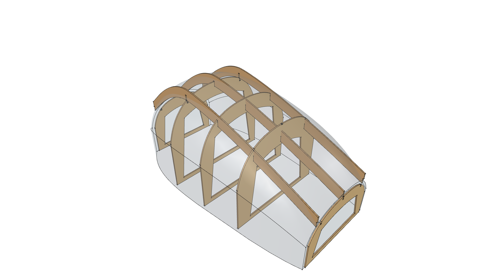
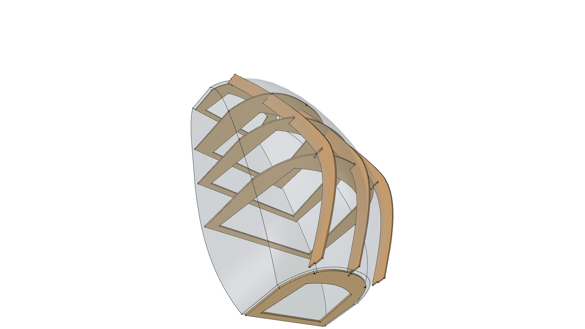
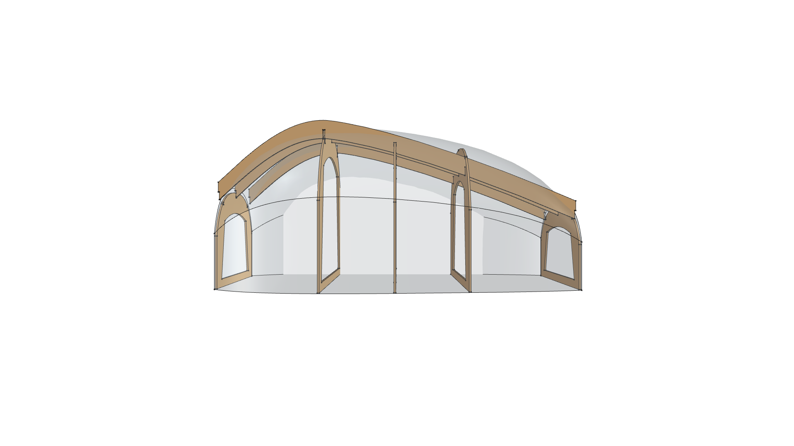
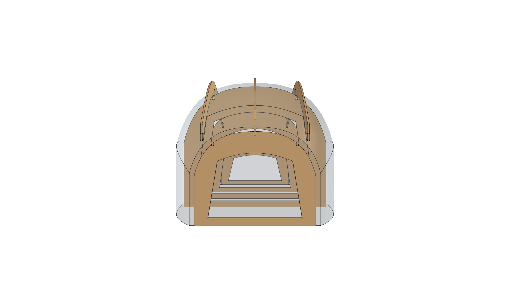
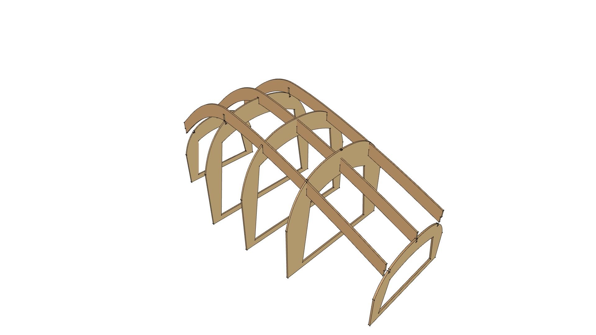
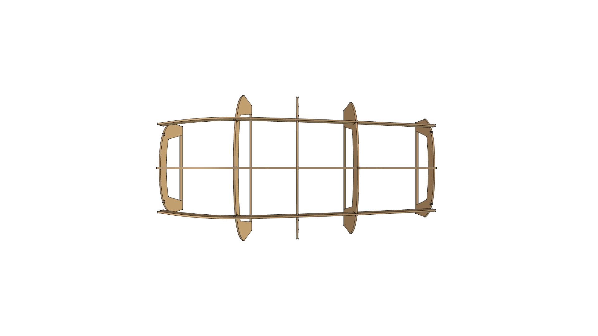
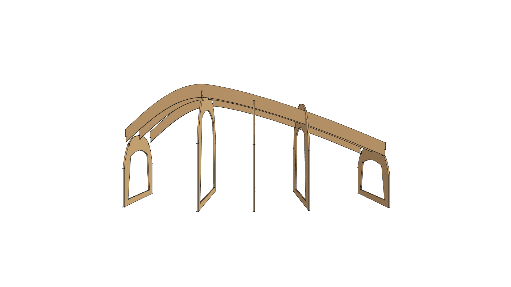
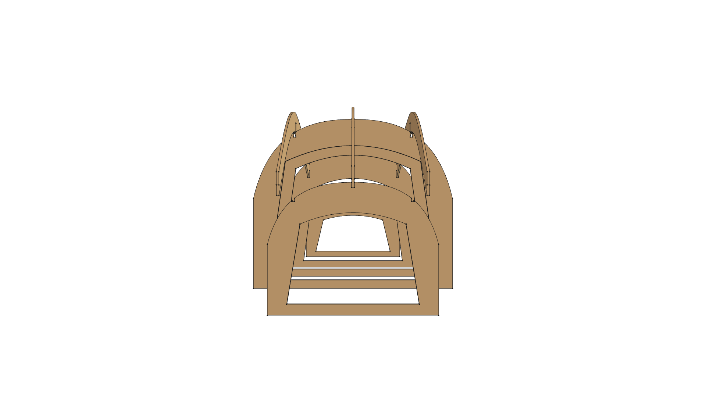
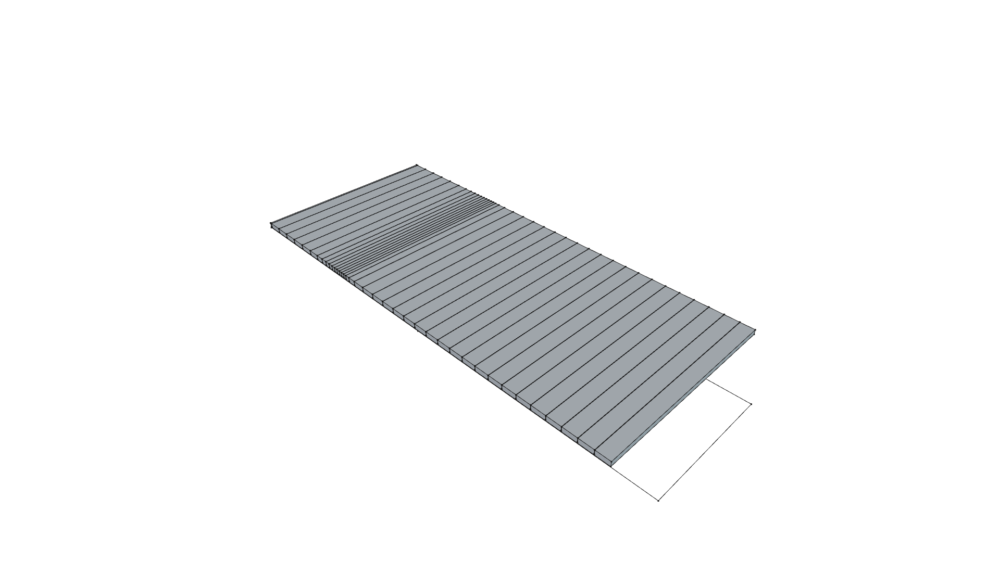
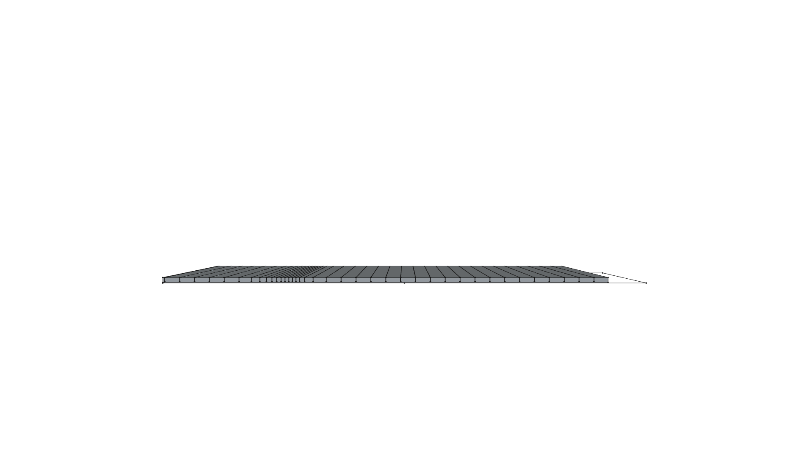

# Compact Foam Camper - Master Assembly Guide

> **Step-by-Step Shop Assembly Manual: From Flat Sheet Goods to Compound-Curved Monocoque Shell**  
> *phi-WORKS Maker Framework (`projects/foam-camper`)*

**Master 3D Model**: [`foam-camper.FCStd`](foam-camper.FCStd)  
**Fabrication Buck Model**: [`fabrication/camper_buck.FCStd`](fabrication/camper_buck.FCStd)  
**Flat Patterns & Kerf Schedule Model**: [`fabrication/flat_patterns.FCStd`](fabrication/flat_patterns.FCStd)  

---

## Executive Overview

This manual outlines the step-by-step physical assembly process for constructing a 12'-0" × 6'-6" (3,658 mm × 1,981 mm) compound-curved aerodynamic camper shell using $2.0''$ ($50.8\ \text{mm}$) Extruded Polystyrene (XPS) rigid insulation foam bent over a temporary interlocking plywood egg-crate jig.

| Master Assembly (Perspective) | Master Assembly (Top Plan) |
| :---: | :---: |
|  |  |
| **Side Elevation Profile** | **Front View Profile** |
|  |  |

*Fig 1: Complete 3D Assembly Overview — $2.0''$ scored rigid foam shell bent over the internal 3/4" interlocking plywood buck.*

---

## Required Tools & Materials

### Sheet Goods & Lumber:
- **XPS Rigid Insulation Foam**:
  - $6\times$ sheets of $2.0'' \times 4' \times 8'$ Extruded Polystyrene (Owens Corning Foamular 150/250 or Dow Styrofoam).
- **Plywood for Buck**:
  - $3\times$ sheets of $3/4''$ ($19\ \text{mm}$) CDX Plywood or OSB (for temporary ribs and stringers).
  - $1\times$ sheet of $3/4''$ Sanded Birch Plywood (for permanent Station 3 Galley Bulkhead).
- **Floor Deck**:
  - $2\times$ sheets of $3/4''$ Marine/Exterior Plywood (trailer floor subdeck).

### Adhesives & Fasteners:
- **Polyurethane Expanding Adhesive**: $4\times 18\ \text{oz}$ bottles of Gorilla Glue Original (or Titebond Fast Grab / Great Stuff Pro Foam Adhesive).
- **Skinning Matrix**: $3\times 1\ \text{gallon}$ jugs of Titebond II Premium Wood Glue (or Gripper acrylic primer).
- **Fabric Skin (PMF)**: $2\times$ Heavy 10 oz or 12 oz unbleached cotton canvas drop cloths ($12' \times 15'$).
- **Clamping Gear**: $6\times$ 2" Heavy-Duty Ratchet Cargo Straps (16 ft to 20 ft length).
- **Temporary Fasteners**: 2" drywall screws with scrap foam fender washers.

### Essential Shop Tools:
- Track saw or circular saw with aluminum straight-edge guide.
- Fine-finish carbide saw blade ($1/8''$ or $3.17\ \text{mm}$ kerf width).
- Rubber mallet (for interlocking buck slots).
- Spray bottle with clean water (to activate moisture-cure polyurethane glue).
- Drywall rasps and 80-grit sanding blocks.

---

## Stage 1: Trailer Chassis & Floor Deck Setup

1. **Verify Trailer Squareness**:
   - Confirm the 12' × 6.5' trailer frame is true by measuring corner-to-corner diagonals ($D_1 = D_2$).
2. **Mount the Plywood Floor**:
   - Lay $3/4''$ exterior plywood floor sheets over the trailer frame crossmembers.
   - Fasten with self-drilling elevator bolts or countersunk deck screws.
   - Seal bottom face with asphalt emulsion or exterior deck coating to block road moisture.
3. **Snap Centerline & Station Layout Lines**:
   - Snap a chalk line down the exact longitudinal centerline ($Y = 0$).
   - Mark the 5 transverse station lines across the deck:
     - **Station 0**: $X = 60\ \text{mm}$ ($2.4''$) from front edge (Nose Prow).
     - **Station 1**: $X = 1,100\ \text{mm}$ ($43.3''$) (Cabin Headroom Peak).
     - **Station 2**: $X = 1,800\ \text{mm}$ ($70.9''$) (Mid-Cabin).
     - **Station 3**: $X = 2,500\ \text{mm}$ ($98.4''$) (Galley Bulkhead).
     - **Station 4**: $X = 3,580\ \text{mm}$ ($140.9''$) (Rear Transom).

---

## Stage 2: Assembling the Interlocking Plywood Buck

The egg-crate skeleton provides the rigid 3D inner form. Every outer contour is offset inward by $2.0''$ ($50.8\ \text{mm}$) from the final aerodynamic shell.

| Perspective View | Top Plan View |
| :---: | :---: |
|  |  |
| **Side Elevation Profile** | **Front Transverse View** |
|  |  |

*Fig 2: 3D CAD Views of the standalone interlocking 3/4" plywood buck skeleton.*

### Assembly Sequence:
1. **Cut the Buck Components**:
   - Cut the 5 transverse bulkheads and 3 longitudinal stringers following [`fabrication/build_buck.py`](fabrication/build_buck.py).
   - Ensure all half-lap slots are cut to $19.5\ \text{mm}$ ($0.77''$) width ($3/4''$ stock $+ 0.5\ \text{mm}$ slide tolerance).
2. **Erect the Centerline Ridge Spine**:
   - Position the central spine along $Y = 0$ over the floor.
3. **Slide In Transverse Bulkheads**:
   - Drop the transverse ribs down into the matching upward-facing slots on the center spine:
     - Station 0 (Nose)
     - Station 1 (Headroom Peak)
     - Station 2 (Mid-Cabin)
     - Station 3 (Permanent Birch Galley Bulkhead)
     - Station 4 (Rear Transom)
   - Tap down firmly with a rubber mallet until slots fully seat flush.
4. **Lock In Left & Right Shoulder Stringers**:
   - Drop the Left ($Y = +550\ \text{mm}$) and Right ($Y = -550\ \text{mm}$) shoulder stringers into the top slots of the bulkheads.
   - The grid self-squares and becomes completely rigid.
5. **Toe-Pin to Deck**:
   - Secure the base corners of each rib to the floor deck using small wooden cleats and screws (cleats on the *inside* of temporary ribs for easy removal later).

---

## Stage 3: Preparing Flat Foam Sheets & Dynamic Kerf Scoring

The total unrolled length of the roof from front prow to rear transom is **$14.74\ \text{ft}$ ($4,492.6\ \text{mm}$)**.

| Perspective View | Top Plan View |
| :---: | :---: |
|  |  |
| **Longitudinal Side View** | **Transverse End Profile** |
|  |  |

*Fig 3: Unrolled 14.74 ft roof blank showing dynamic kerf score cuts and standard 4x8 ft sheet outlines.*

### 1. Fabricate the 16-Foot Roof Blank:
- Edge-join two $4' \times 8'$ XPS foam sheets end-to-end to create a continuous blank.
- Cut a $2.0''$ wide lap joint (shiplap) or use a biscuit/spline joint along the $4\ \text{ft}$ seam.
- Bond with polyurethane adhesive; clamp flat on the floor with weights until cured.

### 2. Cut Side Wall Panels:
- Trace the side elevation perimeter profiles onto two $4' \times 8'$ sheets (with lower extensions joined).
- Cut with a track saw or hot-wire cutter. Set aside.

### 3. Track-Saw Kerf Scoring:
- Set circular saw or track saw depth stop to **exactly $1.57''$ ($40.0\ \text{mm}$)**.
  > [!IMPORTANT]
  > Always verify cut depth on scrap foam! You must leave an uncut outer hinge skin of **$10\text{--}11\ \text{mm}$**.
- Lay the roof blank with its **inside (concave) face facing UP**.
- Using an aluminum track guide, cut the **38 cross-kerf lines** across the sheet width according to the dynamic pitch schedule:

| Cut Range | Sheet Distance $S$ | Local Radius $R$ | Kerf Pitch / Spacing | Action |
| :--- | :---: | :---: | :---: | :--- |
| **Cuts 1–6** | $0.8''$ to $25''$ | $> 100''$ | $5.9''$ ($150\ \text{mm}$) | Front lower prow taper |
| **Cuts 7–16** | $30''$ to $55''$ | $24''$ to $35''$ | **$1.9''$ to $2.6''$ ($48\text{--}65\ \text{mm}$)** | **Tight brow curve over cab** |
| **Cuts 17–28**| $55''$ to $120''$ | $60''$ to $80''$ | $4.5''$ to $5.9''$ ($115\text{--}150\ \text{mm}$)| Gentle main cabin roof crown |
| **Cuts 29–38**| $120''$ to $176''$| $35''$ to $45''$ | $3.2''$ to $3.8''$ ($80\text{--}95\ \text{mm}$) | Rear galley slope to transom |

---

## Stage 4: Dry-Fitting Over the Buck

1. **Mount Side Walls First**:
   - Align the flat side wall panels against the outer vertical edges of the buck ribs.
   - Temporarily secure to the rib edges using 2" drywall screws driven through 3" scrap foam washers (finger-tight only).
2. **Drape the Scored Roof Sheet**:
   - With two people, hoist the scored roof sheet over the buck with the **scored slits facing down against the buck ribs**.
   - Gently guide the sheet into curvature starting from the top cabin peak ($X = 1,100\ \text{mm}$) and working forward to the nose, then backward to the tail.
3. **Install Ratchet Straps**:
   - Wrap 2" wide cargo ratchet straps completely around the camper body over each bulkhead station.
   - Place scrap cardboard or foam angle-protectors along the top roof corners to prevent strap webbing from biting into the outer foam skin.
   - Ratchet down slowly. Observe the kerf slits: they smoothly **pinch closed** as the sheet conforms to the curved stringers!
4. **Check Seams**:
   - Confirm the roof blank meets the side wall panels along the shoulder seam with zero gap.

---

## Stage 5: Adhesive Injection & Monocoque Fusion

1. **Release Straps One by One**:
   - Loosen straps enough to tip open the kerf slits slightly.
2. **Moisture Mist**:
   - Lightly mist the kerfs with a water spray bottle (polyurethane adhesive cures via moisture).
3. **Inject Polyurethane Glue**:
   - Run a continuous bead of Gorilla Glue (or expanding foam adhesive) down every single kerf slit.
   - Apply a generous bead along the roof-to-side-wall lap joints.
4. **Full Compression Clamp Down**:
   - Re-tension all ratchet cargo straps firmly.
   - As the sheet compresses against the buck, the kerf slits **pinch shut**, forcing the polyurethane adhesive throughout the joints.
   - The glue will expand into any microscopic voids and cure into solid composite "I-beam" ribs.
5. **Cure Time**:
   - Allow **12 to 18 hours** of undisturbed cure at room temperature ($>60^\circ\text{F}$ / $15^\circ\text{C}$).

---

## Stage 6: Removing Temporary Buck Ribs

Once the polyurethane glue has cured, the foam shell is a self-supporting, rigid monocoque structure!

1. **Remove Straps & Screws**:
   - Release all exterior ratchet straps.
   - Back out any temporary drywall screws and remove foam washers.
2. **Unpin Buck Base**:
   - Unscrew the floor cleats securing Stations 0, 1, 2, and 4 to the floor deck.
3. **Slide Out Temporary Ribs**:
   - Crawl inside the camper through the central cutouts.
   - Tap upward on the shoulder stringers to unseat them from the rib slots.
   - Unslot and slide out Station 0, Station 1, Station 2, and Station 4 through the door opening.
4. **Permanent Galley Bulkhead Stays**:
   - **Station 3 remains permanently locked in place!** 
   - Glue and screw Station 3 directly to the floor and foam walls. It serves as the primary structural firewall and cabinetry mount between the cabin and rear galley.

---

## Stage 7: "Poor Man's Fiberglass" (PMF) Monocoque Skinning

```
       PMF COMPOSITE LAMINATE CROSS-SECTION
       
 ═══════════════════════════════════════════════  2x Exterior UV Paint Coats
 ───────────────────────────────────────────────  Titebond II Saturation Topcoat
 ░░░░░░░░░░░░░░░░░░░░░░░░░░░░░░░░░░░░░░░░░░░░░░░  10 oz Unbleached Cotton Canvas
 ───────────────────────────────────────────────  Titebond II Basebed Adhesive
 █ █ █ █ █ █ █ █ █ █ █ █ █ █ █ █ █ █ █ █ █ █ █ █  2.0" XPS Rigid Foam Core
```

1. **Surface Prep**:
   - Shave any expanding glue squeeze-out flush with a razor scraper.
   - Soften the roof-to-side-wall corner with an 80-grit sanding block to a 1/2" radius so canvas drapes smoothly without tenting.
2. **Apply Basebed Glue**:
   - Using a 3/8" nap paint roller, roll a heavy, even coat of unthinned Titebond II wood glue over one side of the camper.
3. **Hang Canvas**:
   - Drape 10 oz unbleached cotton canvas over the wet glue.
   - Smooth out all wrinkles from the center toward the edges using a wallpaper smoothing blade or plastic putty knife.
4. **Saturate Topcoat**:
   - Immediately roll a second heavy coat of Titebond II directly over the canvas, working it into the weave until fully saturated.
5. **Trim & Overlap**:
   - Overlap seams by at least $3.0''$ ($75\ \text{mm}$) at corners and roof transitions.
6. **Full Cure**:
   - Allow 24–48 hours to dry. The canvas shrinks slightly as it dries, pulling drum-tight over the compound curves and hardening into an ultra-tough composite armor.
7. **Weatherproof Paint**:
   - Apply 2 coats of premium 100% acrylic exterior latex house paint or elastomeric RV roof coating.

---

## Master Form Showcase Gallery

| Form C (Lofted Teardrop) | Form A (Carved Aero Capsule) | Form B (Multi-Chine Faceted) |
| :---: | :---: | :---: |
|  |  |  |

---

## Summary of Finished Shell Specifications

| Specification | Dimension / Value |
| :--- | :--- |
| **Camper Length** | $12'-0''$ ($3,658\ \text{mm}$) |
| **Maximum Width** | $6'-6''$ ($1,981\ \text{mm}$) |
| **Overall Shell Height** | $5'-9''$ ($1,750\ \text{mm}$) |
| **Foam Shell Weight** | **$\sim 140\ \text{lbs}$ ($63.5\ \text{kg}$)** |
| **Finished Skinned Weight** | **$\sim 220\ \text{lbs}$ ($99.8\ \text{kg}$)** |
| **Thermal Insulation** | **R-10** continuous thermal envelope |
| **Structural Modality** | Monocoque foam sandwich with integral composite kerf ribs |

---

*For parametric CAD models and CNC script generators, see [`fabrication/README.md`](fabrication/README.md).*
