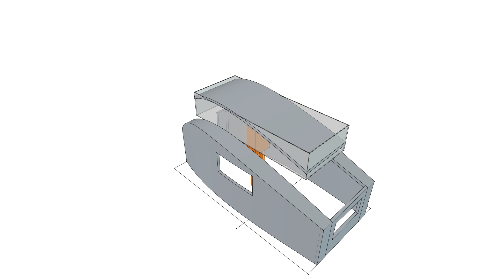
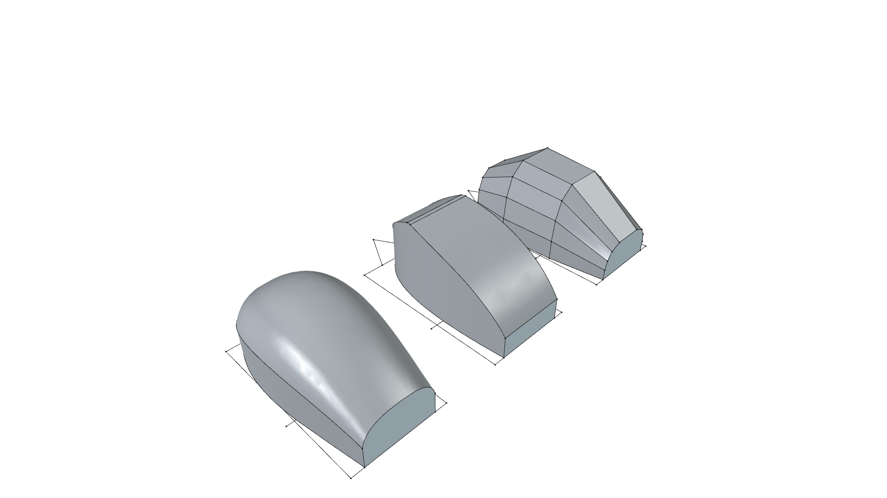

# Compact Foam Camper - Changelog

> **Visual Transformation History & Release Notes**  
> *phi-WORKS Maker Framework (`projects/foam-camper`)*

All notable changes, CAD model versions, and visual evolutions of the Compact Foam Camper project are documented here in reverse-chronological order.

---

## [v0.2.0] - Pop-Top & Orthogonal 1D Curvature Intersection Architecture

**Release Date**: 2026-09-09  
**Status**: 🟢 **`[CURRENT / ACTIVE]`**  
**Active Master Model**: [`foam-camper.FCStd`](foam-camper.FCStd)  
**Archived Version Model**: [`changelog/v0.2.0_foam-camper.FCStd`](changelog/v0.2.0_foam-camper.FCStd)  

| Milestone Thumbnail | Key Evolution & Architectural Features |
| :---: | :--- |
|  | • **Orthogonal 1D Developable Plane Intersection**: Side panels curve along the **$XY$ plane** (boat-tail planform curve with vertical developable rulings in $Z$), while the roof curves along the **$XZ$ plane** (aerodynamic teardrop elevation curve with lateral horizontal rulings in $Y$). • **Compound 3D Intersection Shoulder**: The two curved planes intersect along a smooth 3D shoulder seam line, while every individual foam sheet is curved along only one single axis ($K = 0$). • **Independent Modular Frames**: Partitioned shell into discrete subassemblies: Left Side Frame (Port), Right Side Frame (Starboard), Center Pop-Up Roof Frame, Front Bulkhead, and Rear Transom. • **Towing-End Center Entrance Door**: Placed $24''$ walk-through entrance doorway on the front towing end over the trailer tongue A-frame platform, providing direct walk-in access into the central standing aisle. • **Parametric Pop-Up Roof**: Implemented `Vars.PopUp_Lift` controlling vertical lift from $0\ \text{mm}$ (travel mode) to $508\ \text{mm}$ ($20''$, camping mode). • **6'5" Interior Standing Headroom**: Verified **$6'5.5''$ ($1,968\ \text{mm}$)** standing clearance in the central aisle, demonstrated with an ergonomic $6'0''$ human mannequin. • **Residential Garage Clearance**: Low-profile transit mode ($<5'0''$ shell height above bed, $\sim 6'5''$ total ground height on trailer) easily clears standard $7'-0''$ residential garage doors. |

---

## [v0.1.0] - Initial 3D Form Studies & Compound Curve Exploration

**Release Date**: 2026-09-09  
**Status**: ⚪ **`[SUPERSEDED BY v0.2.0]`**  
**Archived Version Model**: [**`changelog/v0.1.0_foam-camper.FCStd`**](changelog/v0.1.0_foam-camper.FCStd) *(Preserved study model featuring Forms A, B, and C)*  

| Milestone Thumbnail | Key Evolution & Architectural Features |
| :---: | :--- |
|  | • **Initial Project Inception**: Established 12'-0" (3,658 mm) length × 6'-6" (1,981 mm) width base trailer envelope. • **Parametric VarSet Engine**: Created `Vars` table controlling length, width, peak height, foam wall thickness, and station spacing. • **Form A (Carved Aero Capsule)**: Orthogonal sketch pad & pocket intersection modeling side elevation curve with boat-tail plan and 180 mm shoulder fillet. • **Form B (Multi-Chine Faceted Hull)**: Ruled developable chine panels directly modeling 12° to 35° kerf-score fold lines for rigid foam board fabrication over bulkheads. • **Form C (Lofted Organic Teardrop)**: 4-station transverse spline loft producing continuous double-curved aerodynamic teardrop shell. • **XPS Material Definition**: Added `materials/polymers/Polymer-XPS-Foam.FCMat` (32 kg/m³ density). • **Comparative Presentation Renders**: Exported full 7-view orthogonal and isometric renders for the master 3-form showcase and individual isolated forms. |
