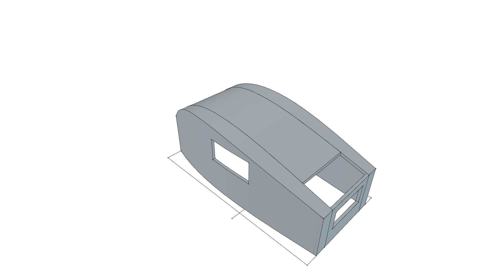
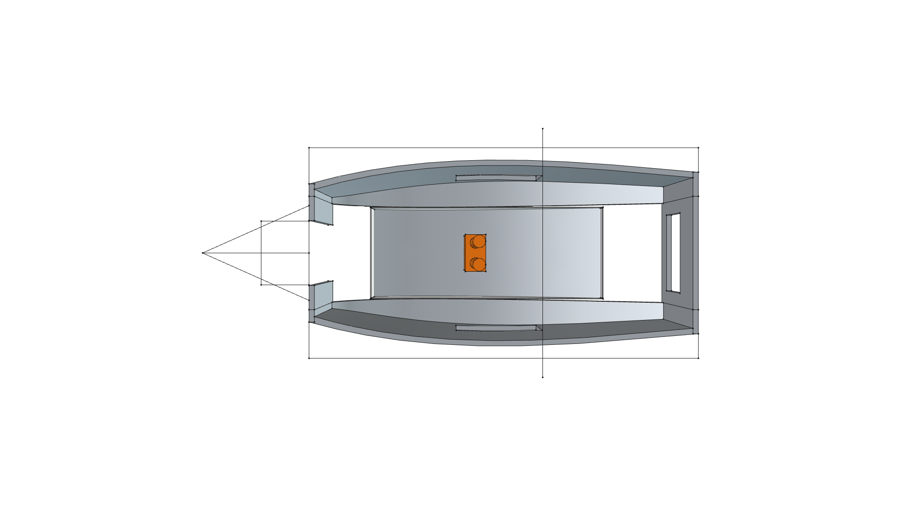
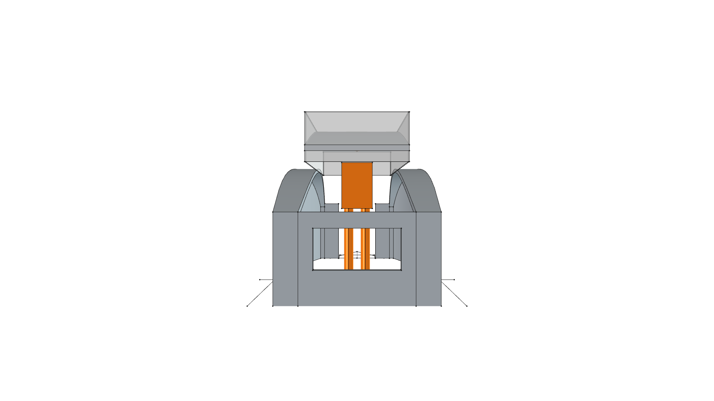
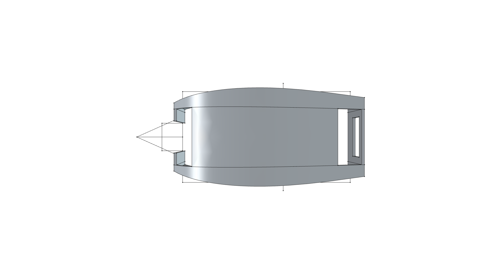
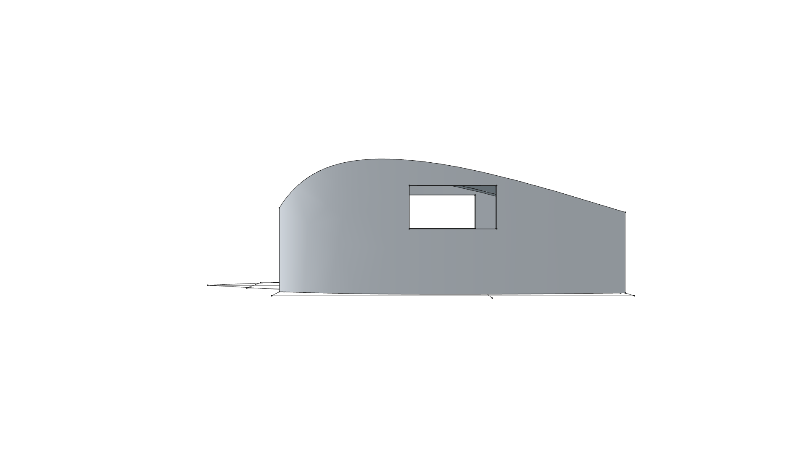
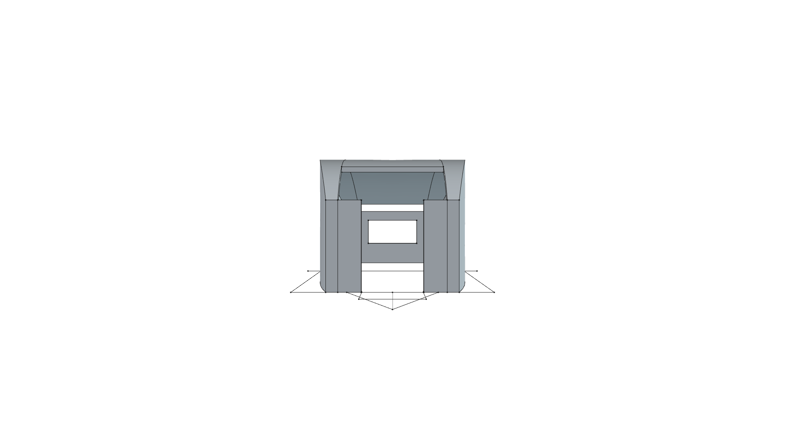

# Compact Foam Camper

> **Ultralight 12' x 6.5' Towable Rigid Foam Camper Shell - Pop-Top & 1D Transverse Curving Architecture**  
> *phi-WORKS Maker Framework (`projects/foam-camper`)*

**Active CAD Model**: [`foam-camper.FCStd`](foam-camper.FCStd)  
**Status**: 🟢 **`[CURRENT / ACTIVE - v0.2.0]`**  
**Master Shop Manual**: 📋 [**`ASSEMBLY.md`**](ASSEMBLY.md)  
**Fabrication & Unfurling Suite**: 🔨 [**`fabrication/README.md`**](fabrication/README.md)  
**Evolution History**: 📜 [**`CHANGELOG.md`**](CHANGELOG.md)

| Master Camping Mode (Pop-Up Raised — 6'4" Standing Headroom) | Travel / Towing Mode (Pop-Up Closed — Fits 7' Garage) |
| :---: | :---: |
|  |  |
| **Towing-End Center Entrance Door (Looking In From Tongue)** | **Side Elevation Profile (Tumblehome Curve & Window)** |
|  |  |

---

## Executive Overview

The **Compact Foam Camper v0.2.0** is an ultralight, towable micro-camper designed for fabrication from $2.0''$ ($50.8\ \text{mm}$) Extruded Polystyrene (XPS) rigid foam boards using **1D single-axis developable curvature** and a **modular pop-up roof architecture**.

Sized for a standard **12'-0" (3,658 mm) length × 6'-6" (1,981 mm) width** trailer bed, the camper addresses five key physical requirements:

1. **1D Transverse Curving Strategy ($K = 0$)**: Adopts continuous organic tumblehome curved sides and an arched roof crown directly derived from the fabrication egg-crate jig (`fabrication/camper_buck.FCStd`). Every curve is developable from flat $4' \times 8'$ XPS sheets using straight, parallel longitudinal kerf score lines—eliminating hand-rasping and compound stretch.
2. **Three Independent Modular Frames**: The shell is partitioned into three discrete subassemblies: **Left Side Frame (Port)**, **Right Side Frame (Starboard)**, and **Center Pop-Up Roof Frame (Canopy)**.
3. **Towing-End Center Entrance Doorway**: A $24''$ wide walk-through entrance doorway is placed directly in the center of the front towing bulkhead. Stepping onto the trailer tongue A-frame platform gives immediate walk-in access into the central standing aisle.
4. **$6'4''$ ($1,930\ \text{mm}$) Interior Standing Headroom**: When the center pop-up roof elevates by $20.0''$ ($508\ \text{mm}$), a 6-foot tall person stands comfortably in the center aisle with $+4.0''$ of hat/shoe margin (and $+7.5''$ clearance under the center arch apex).
5. **Standard 7-Foot Residential Garage Clearance**: In transit mode, the roof drops flush between the side shoulders, keeping the total camper shell height under $5'0''$ ($1,500\ \text{mm}$ above bed) and total ground height under $6'6''$, easily rolling into any standard residential garage.

---

## Operational Mode Comparison

| Characteristic | Travel / Towing Mode (Closed) | Camping Mode (Popped Up) |
| :--- | :---: | :---: |
| **Model State** | `Vars.PopUp_Lift = 0 mm` | `Vars.PopUp_Lift = 508 mm` ($20.0''$) |
| **Interior Central Headroom** | $4'-8''$ ($1,422\ \text{mm}$) (Berth / Seated) | **$6'-4''$ ($1,930\ \text{mm}$) Standing Aisle** |
| **Center Arch Apex Headroom** | $4'-11''$ ($1,500\ \text{mm}$) | **$6'-7.5''$ ($2,020\ \text{mm}$)** |
| **Overall Shell Height** | $4'-11''$ ($1,500\ \text{mm}$) | $6'-7''$ ($2,008\ \text{mm}$) |
| **Total Height on Trailer** | **$\sim 6'-5''$ ($1,955\ \text{mm}$)** (Garage Ready) | $\sim 8'-1''$ ($2,463\ \text{mm}$) |
| **Aerodynamic Drag** | Ultra-low frontal profile | High-volume standing room |
| **Weather Enclosure** | Hard foam nested overlap seal | Heavy-duty weatherproof canvas bellows |

---

## Modular Subassembly Breakdown

```
                            MASTER ASSEMBLY GRAPH
                            
                     ┌──────────────────────────────────┐
                     │    foam-camper (Root Assembly)   │
                     └────────────────┬─────────────────┘
                                      │
         ┌───────────────┬────────────┴───┬──────────────┬───────────────┐
         │               │                │              │               │
         ▼               ▼                ▼              ▼               ▼
   ┌───────────┐   ┌───────────┐   ┌─────────────┐ ┌───────────┐   ┌───────────┐
   │ Left Side │   │Right Side │   │Center Pop-Up│ │   Front   │   │   Rear    │
   │   Wall    │   │   Wall    │   │ Roof Frame  │ │ Bulkhead  │   │ Transom   │
   │  (Port)   │   │(Starboard)│   │  (Movable)  │ │(Tongue/Dr)│   │ (Galley)  │
   └───────────┘   └───────────┘   └─────────────┘ └───────────┘   └───────────┘
```

- **`Left_Side_Frame` (Port)**: 1D curved XPS foam wall with tumblehome curve and integrated $18''$ fixed roof shoulder shelf over side bunks.
- **`Right_Side_Frame` (Starboard)**: Symmetrical 1D curved XPS foam wall with integrated $18''$ fixed roof shoulder shelf over side kitchen counter.
- **`PopUp_Roof_Frame`**: Arched 1D canopy ($42'' \times 102.4''$) with $25\ \text{mm}$ weather lip and pop-up canvas bellows.
- **`Front_Bulkhead_Frame`**: Towing end wall with $24''$ center entrance doorway opening onto the trailer tongue A-frame platform.
- **`Rear_Transom_Frame`**: Rear vertical bulkhead with panoramic observation window / galley access.
- **`Trailer_Chassis_Ref`**: Reference 12' × 6.5' trailer chassis with tongue drawbar, walk platform, and 60/40 balance axle line.
- **`Ergonomic_Reference`**: $6'0''$ ($1,828.8\ \text{mm}$) scale human figure standing in the central aisle.

---

## Visual Orthogonal Projections

### Camping Mode (Roof Elevated 20")
| Top Plan View | Bottom Chassis View |
| :---: | :---: |
|  |  |
| **Front Door View (Towing End)** | **Rear Transom View** |
|  |  |

### Travel Mode (Roof Closed Flush)
| Travel Mode Perspective | Travel Mode Top Plan |
| :---: | :---: |
|  |  |
| **Travel Mode Side Elevation** | **Travel Mode Front View** |
|  |  |

---

## Documentation Index

- 📐 [**`SPECIFICATION.md`**](SPECIFICATION.md): Dimensional specifications, parametric VarSet parameters, station coordinates, and volumetric analysis.
- 📋 [**`ASSEMBLY.md`**](ASSEMBLY.md): **Master Shop Assembly Guide** with step-by-step photos/renders, tool checklist, and clamping protocol.
- 🔨 [**`fabrication/`**](fabrication/README.md): **Fabrication & Unfurling Manual**, interlocking egg-crate plywood buck generator (`build_buck.py`), and surface unfurling / kerf scoring engine (`unfurl.py`).
- 📜 [**`CHANGELOG.md`**](CHANGELOG.md): Version iteration log and visual milestone history.
- 🛠️ [**`build.py`**](build.py): Parametric FreeCAD 1.1 Python script generating the v0.2.0 modular assembly and multi-state snapshot renders.
- 📦 [**`foam-camper.FCStd`**](foam-camper.FCStd): Master 3D CAD project model.

---

## FreeCAD Headless Execution

To re-run the build script, recompute the models, and export all high-resolution snapshot renders:

```bash
./scripts/run_freecad.sh projects/foam-camper/build.py
```
