# Compact Foam Camper

> **Ultralight 12' x 6.5' Towable Rigid Foam Camper Shell - 3D Form Studies & Compound Curve Exploration**  
> *phi-WORKS Maker Framework (`projects/foam-camper`)*

**Active CAD Model**: [`foam-camper.FCStd`](foam-camper.FCStd)  
**Status**: 🟢 **`[CURRENT / ACTIVE - v0.1.0]`**  
**Master Shop Manual**: 📋 [**`ASSEMBLY.md`**](ASSEMBLY.md)  
**Fabrication & Unfurling Suite**: 🔨 [**`fabrication/README.md`**](fabrication/README.md)  


---

## Executive Overview

The **Compact Foam Camper** is a physical parametric design project exploring aerodynamic, compound-curved camper shell bodies designed for **scored and bent Extruded Polystyrene (XPS) rigid foam insulation** construction.

Targeted for a standard **12'-0" (3,658 mm) length × 6'-6" (1,981 mm) width** trailer platform, the study explores three distinct solid modeling philosophies in FreeCAD to test volume, aerodynamics, tumblehome side angles, roof camber, and real-world constructability for a maker fabricating with kerf-scored foam boards:

1. **Form A: Dual-Axis Carved Aero Capsule** (Center) — Sculpted by intersecting orthogonal 2D sketches (Elevation profile × Plan boat-tail profile) with a 180 mm compound shoulder roll.
2. **Form B: Multi-Chine Faceted Hull** (Right) — Modeled with ruled, developable longitudinal facets and tumblehome chines, directly reflecting kerf-score bend angles (12° to 35°) for folding 2" rigid foam sheets over bulkheads.
3. **Form C: Multi-Station Arched Loft** (Left) — Generated through 4 transverse aerodynamic station ribs, creating an organic double-curved teardrop shell.

---

## Comparative Form Study Matrix

| Characteristic | Form A: Carved Aero Capsule | Form B: Multi-Chine Faceted | Form C: Lofted Organic Teardrop |
| :--- | :--- | :--- | :--- |
| **Modeling Method** | Orthogonal Sketch Intersection (Pad & Pocket) | Ruled Multi-Chine Loft (Developable Facets) | Transverse Spline Loft (Continuous Arches) |
| **Visual Render** | 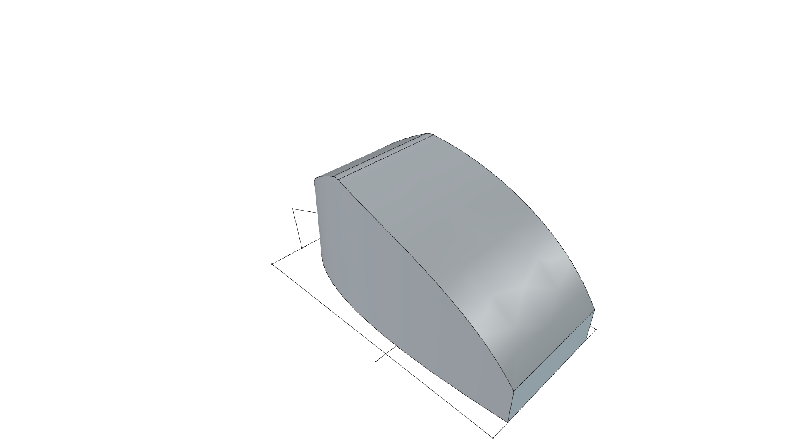 | 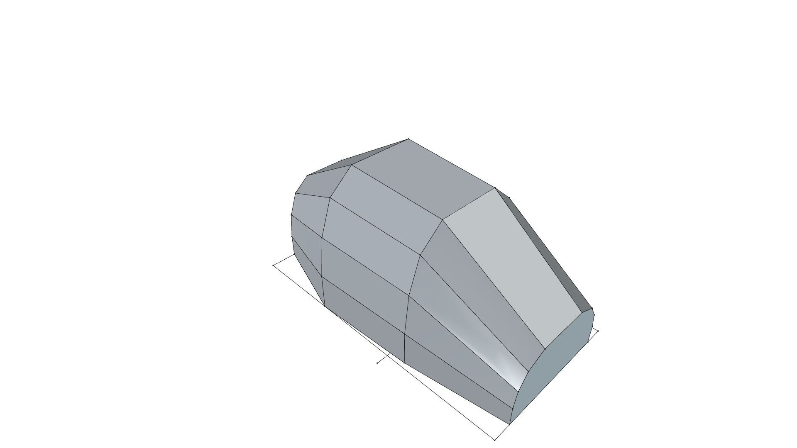 | 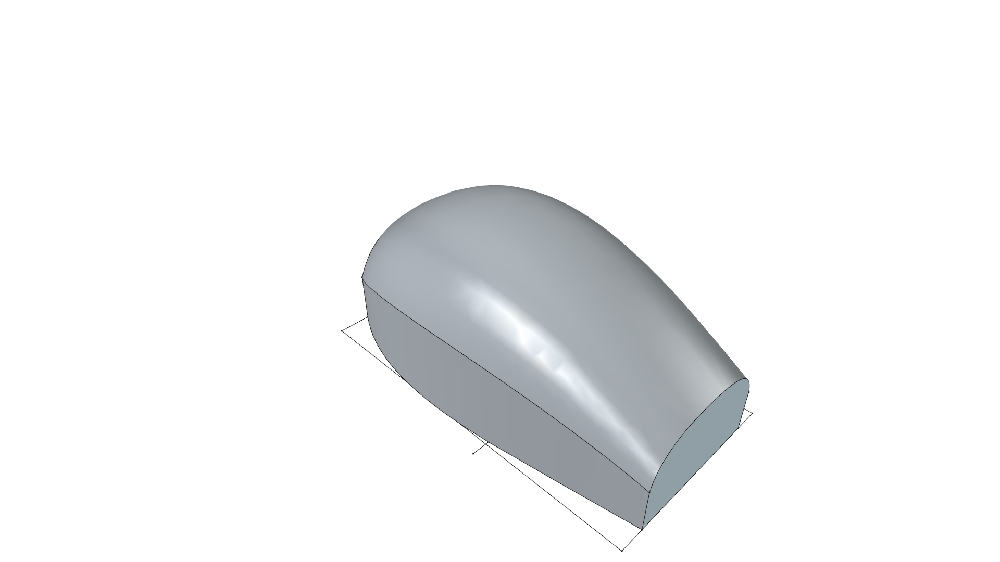 |
| **Enclosed Volume** | **6.94 m³** (245.0 cu.ft) | **8.41 m³** (297.1 cu.ft) | **8.53 m³** (301.2 cu.ft) |
| **Est. Foam Shell Weight** (2" XPS) | ~125 lbs (57 kg) | ~142 lbs (64 kg) | ~145 lbs (66 kg) |
| **Fabrication Suitability** | High (Planar sides, curved roof) | **Highest** (Exact planar developable facets) | Medium (Requires multi-directional kerfing) |
| **Aerodynamic Efficiency** | High (Smooth nose & Kamm tail) | Good (Faceted airflow deflection) | **Highest** (True 3D laminar teardrop) |
| **Interior Living Feel** | Compact teardrop with cozy berth | Maximum shoulder & headspace width | Spacious arched barrel-vault interior |

---

## Visual Gallery

### Master Comparison Showcase
| Isometric 3-Form Showcase | Top Plan Comparison |
| :---: | :---: |
|  | 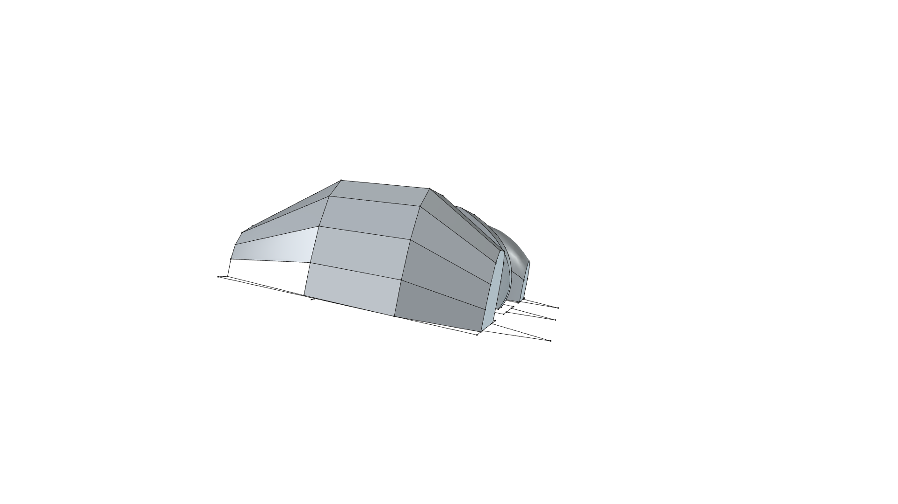 |
| **Side Elevation Comparison** | **Front View Comparison** |
| 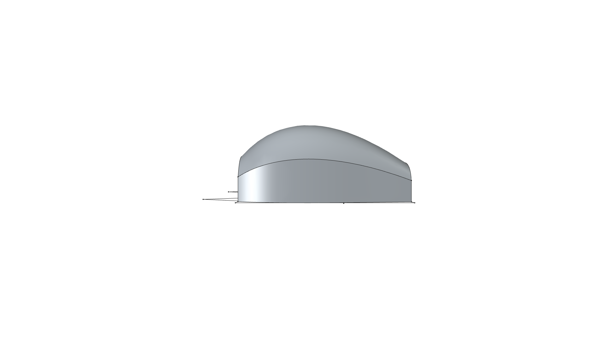 | 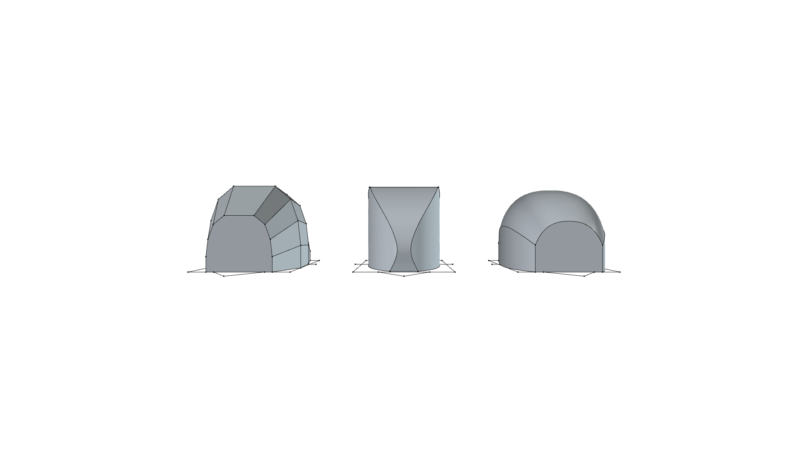 |

---

### Form A: Dual-Axis Carved Aero Capsule
*Sculpted via orthogonal 2D sketch pads and pockets with a top shoulder roll.*

| Perspective View | Top Plan View | Side Elevation | Front Elevation |
| :---: | :---: | :---: | :---: |
|  | 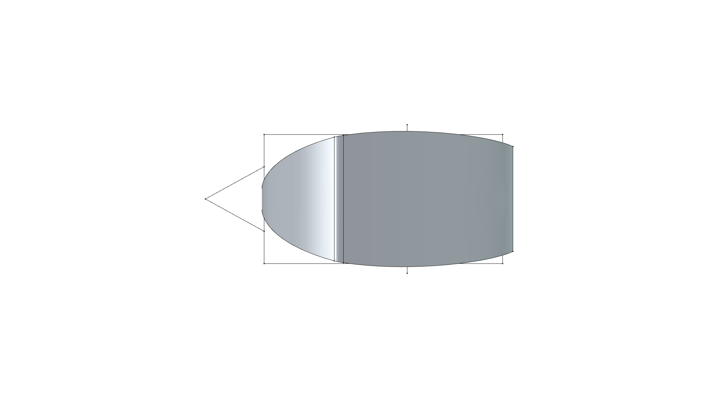 | 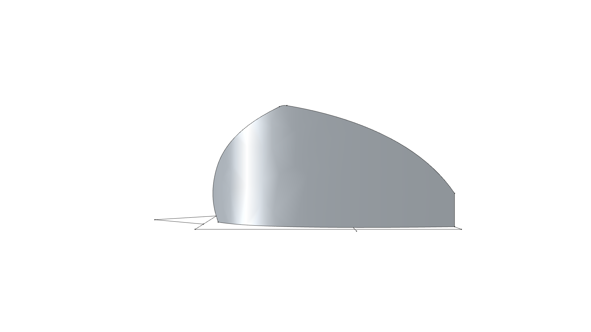 | 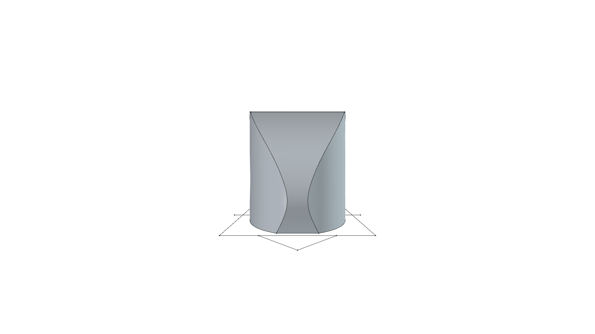 |

---

### Form B: Multi-Chine Faceted "Stealth" Shell
*Direct physical constructability study: ruled flat facets matching kerf-scored 2" foam bends.*

| Perspective View | Top Plan View | Side Elevation | Front Elevation |
| :---: | :---: | :---: | :---: |
|  | 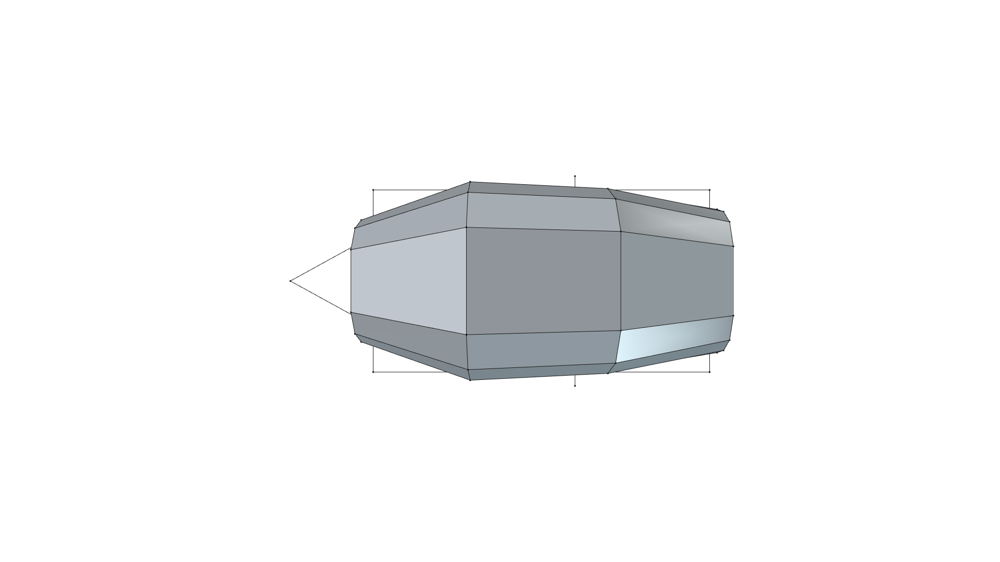 | 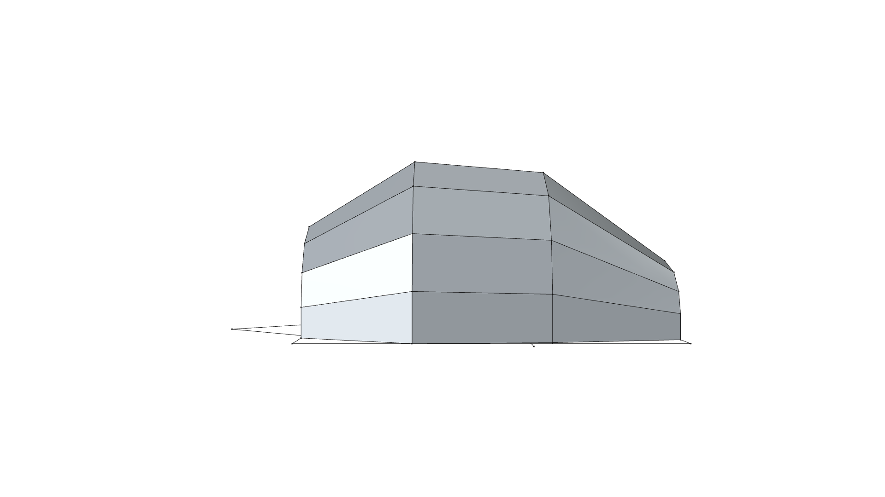 | 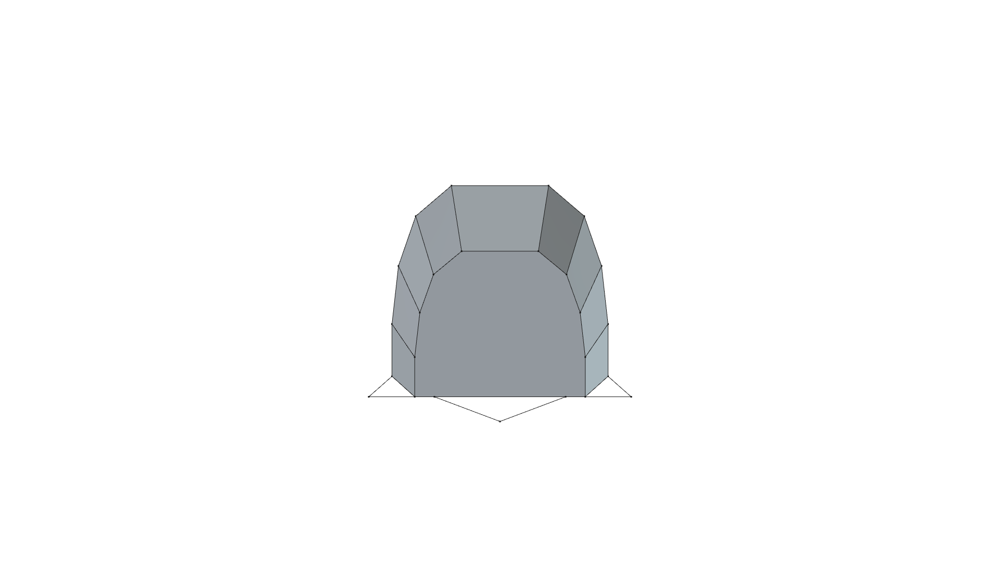 |

---

### Form C: Multi-Station Arched Loft
*Organic cross-section loft through 4 transverse bulkheads with crowned roof and tumblehome sides.*

| Perspective View | Top Plan View | Side Elevation | Front Elevation |
| :---: | :---: | :---: | :---: |
|  | 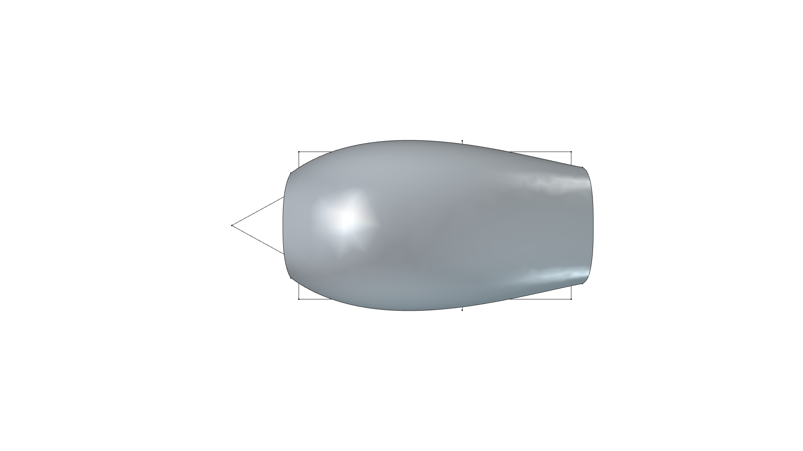 | 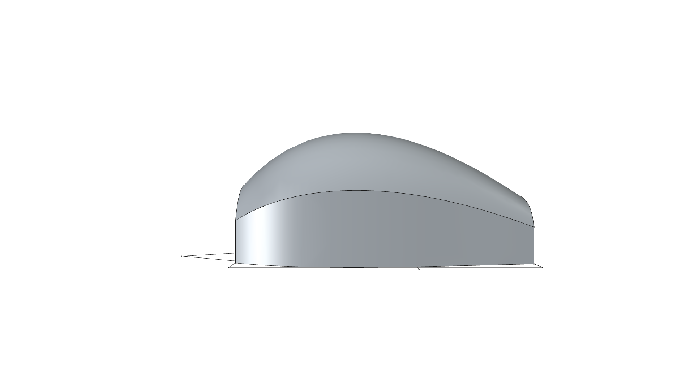 | 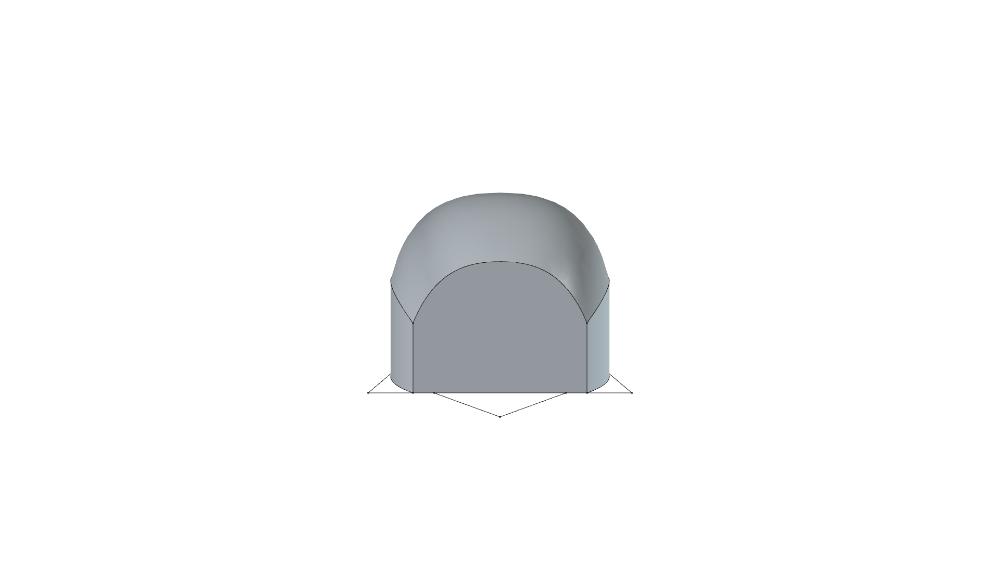 |

---

## Rigid Foam Fabrication & Kerf-Bending Principles

Rigid insulation boards (such as Owens Corning Foamular XPS or Dow Styrofoam, 1.5" or 2.0" thick) are lightweight, highly insulative (R-5 per inch), and structurally resilient once skinned with canvas ("Poor Man's Fiberglass" / PMF) or fiberglass/epoxy.

### How Rigid Foam Bends:
1. **Single-Axis Kerfing (Cylindrical / Conical Surfaces)**:
   - Cutting parallel kerf slits across the inner face (leaving 1/4" to 3/8" of outer foam uncut) allows foam to bend easily around bulkheads.
   - Ideal for **Form A's** roof arch and **Form B's** chine facets.
   - Kerf slits are injected with expanding polyurethane glue (Gorilla Glue or Great Stuff) upon assembly to lock the curved shape rigid.
2. **Compound / Double Curvature (Spherical / Saddle)**:
   - Flat rigid foam cannot stretch or compress simultaneously in two directions without buckling unless it is **faceted** (like **Form B**), **kerfed in a waffle grid**, or shaped using thicker laminated foam stock rasped/sanded along the crown (like **Form C**).
   - **Form B** eliminates compound stretching by converting the double-curved surface into planar ruled facets, each bent along straight crease lines.

---

## Documentation Index

- 📐 [**`SPECIFICATION.md`**](SPECIFICATION.md): Dimensional specifications, parametric VarSet parameters, station coordinates, and volumetric analysis.
- 📋 [**`ASSEMBLY.md`**](ASSEMBLY.md): **Master Shop Assembly Guide** with step-by-step photos/renders, tool checklist, and clamping protocol.
- 🔨 [**`fabrication/`**](fabrication/README.md): **Fabrication & Unfurling Manual**, interlocking egg-crate plywood buck generator (`build_buck.py`), and surface unfurling / kerf scoring engine (`unfurl.py`).
- 📜 [**`CHANGELOG.md`**](CHANGELOG.md): Version iteration log and visual milestone history.
- 🛠️ [**`build.py`**](build.py): Parametric FreeCAD 1.1 Python script generating all 3D solid forms and snapshot renders.
- 📦 [**`foam-camper.FCStd`**](foam-camper.FCStd): Master 3D CAD project model.

---

## FreeCAD Execution Command

To re-run the build script, recompute the models, and export all high-resolution snapshot renders:

```bash
./scripts/run_freecad.sh projects/foam-camper/build.py
```
