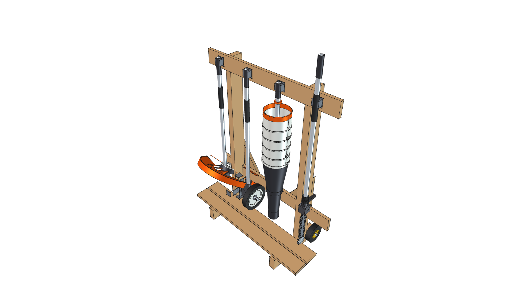

# Kombi Kaddy — Evolutionary Changelog & Visual History

> **Mobile STIHL KombiSystem Attachment Rack**  
> *Chronological Design Transformation Log & Release History*

---

## Releases & Transformation Story

### Version 1.0.0 — Modern Assembly Workbench & STIHL Fleet Overhaul
**Status**: 🟢 `[CURRENT / ACTIVE]`  
**Date**: 2026-09-05  
**Visual Snapshot**: 

#### Changes & Milestones
- **FreeCAD 1.1 Assembly Workbench & App::Link Architecture**: Converted the Kombi Kaddy to a native `Assembly::AssemblyObject` consuming standalone modular components via `App::Link`.
- **Imported Commercial STIHL Fleet**: Replaced generic mockup drive shafts with full commercial parametric STIHL attachments:
  - Bay 1: **FS-KM Straight Shaft String Trimmer** (`stihl/tools/kombi_trimmer_fs`) with AutoCut head and debris guard.
  - Bay 2: **FBD-KM Bed Redefiner** (`stihl/tools/kombi_bed_redefiner_fbd`) with rubber guide wheel and curved digging blade.
  - Bay 3: **BG-KM In-line Axial Blower** (`stihl/tools/kombi_blower_bg`) with axial fan housing and nozzle.
  - Bay 4: **FH-KM 145° Articulating Power Scythe** (`stihl/tools/kombi_scythe_fh`) with articulating gearbox, rubber boot, and reciprocating cutter bar resting on the deck slat.
- **COTS 5" Running Gear**: Linked standalone `caster_wheel_5in` components on 3/8" zinc-plated axle hardware.
- **Embedded Materials & Visibility Integrity**: Embedded project-native `App::MaterialObject` cards (softwood pine, ABS, cast iron, steel, STIHL orange/white polymers) and enforced explicit visibility across all subcomponents.
- **Kinematic Grounding & Exploded View**: Added kinematic ground joint anchoring the left foot and programmatic 6-step exploded presentation assembly view.

---

### Version 0.9.0 — Master Cantilever Expansion
**Status**: 📦 `[SUPERSEDED]`  
**Date**: 2026-08-13  
**Visual Snapshot**: 

#### Changes & Milestones
- **36.0 in Cantilever Rail Overhangs**: Expanded top and lower 1x4 cross rails to 36.0 inches wide with 6.0 in cantilever overhangs beyond the vertical posts.
- **Stud Spacing Preserved**: Maintained 24.0 in outer post spacing for garage wall stud alignment and wheel track stability while providing room for 4 full-sized attachments without clip crowding.
- **Calibrated Height**: 44.5 in post height places clip grab centers at 42.75 in, perfectly matching real-world 39.5" Kombi attachment standing heights.

---

### Version 0.8.0 — Height Calibration
**Status**: 📦 `[SUPERSEDED]`  
**Visual Snapshot**: 

#### Changes & Milestones
- **Standing Height Calibration**: Calibrated overall post height to 44.5" to align spring clip grab centers at 42.75", matching real-world attachment shaft lengths.

---

### Version 0.7.0 — Mobility Refinement
**Status**: 📦 `[SUPERSEDED]`  
**Visual Snapshot**: 

#### Changes & Milestones
- **Tilt-and-Roll Wheels**: Mounted rear 5" fixed rubber casters to the heel of base feet for tilt-and-roll transport across shop floors and driveway surfaces.

---

### Version 0.6.0 — Structural Joinery & Deck
**Status**: 📦 `[SUPERSEDED]`  
**Visual Snapshot**: 

#### Changes & Milestones
- **Dado Post Pockets**: Housed 1x4 cross rails inside 0.75" dado post pockets for rigid joint alignment.
- **Floor Deck Slats**: Added 2x 1x4 horizontal floor deck slats to support gearboxes off the ground.

---

### Version 0.5.0 — Ergonomic Clearance
**Status**: 📦 `[SUPERSEDED]`  
**Visual Snapshot**: 

#### Changes & Milestones
- **Post Offset**: Offset vertical 2x4 posts 8.5" rearward along base feet to prevent heavy tool heads (tillers, edgers, blowers) from striking posts during insertion.

---

### Version 0.4.0 — Parametric VarSet Rebuild
**Status**: 📦 `[SUPERSEDED]`  
**Visual Snapshot**: 

#### Changes & Milestones
- **FreeCAD App::VarSet**: Rebuilt 3D model using FreeCAD `App::VarSet` (`dims`) table for fully parametric dimension management across the assembly.

---

### Version 0.3.0 — Anti-Racking Stability
**Status**: 📦 `[SUPERSEDED]`  
**Visual Snapshot**: 

#### Changes & Milestones
- **Anti-Racking Bracing**: Added sloped front foot toe profile and 3/4" rear plywood corner gussets to eliminate lateral frame sway under heavy load.

---

### Version 0.2.0 — Clip Rail Integration
**Status**: 📦 `[SUPERSEDED]`  
**Visual Snapshot**: 

#### Changes & Milestones
- **Vertical Attachment Storage**: Added top 1x4 cross rail and heavy-duty spring clip mounting layout for vertical attachment storage.

---

### Version 0.1.0 — Foot Depth Extension
**Status**: 📦 `[SUPERSEDED]`  
**Visual Snapshot**: 

#### Changes & Milestones
- **Stability Extension**: Extended base foot depth to 15.0" to improve forward tipping stability under heavy head loads.

---

### Version 0.0.0 — Baseline Prototype
**Status**: 📦 `[SUPERSEDED]`  
**Visual Snapshot**: 

#### Changes & Milestones
- **Initial Concept**: Initial flat 2x4 frame prototype and baseline shop dimensions.
