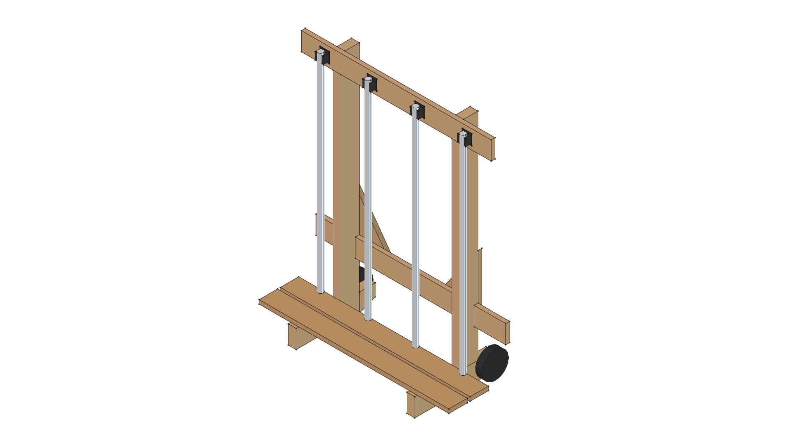
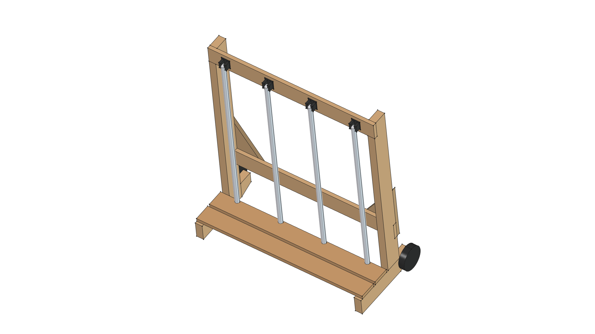
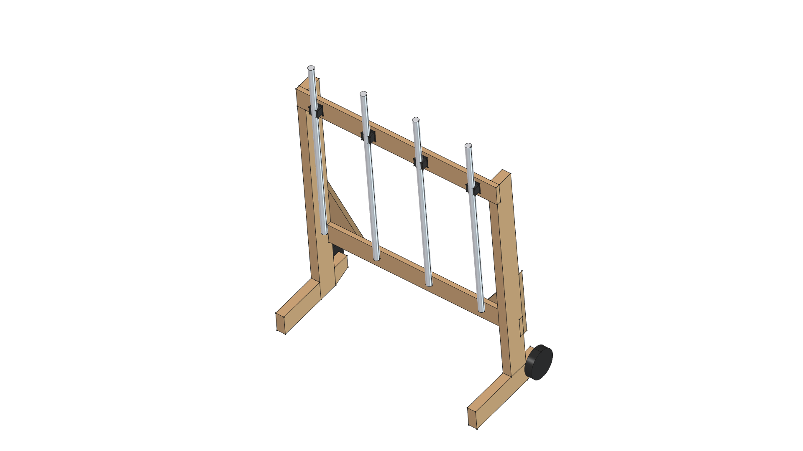
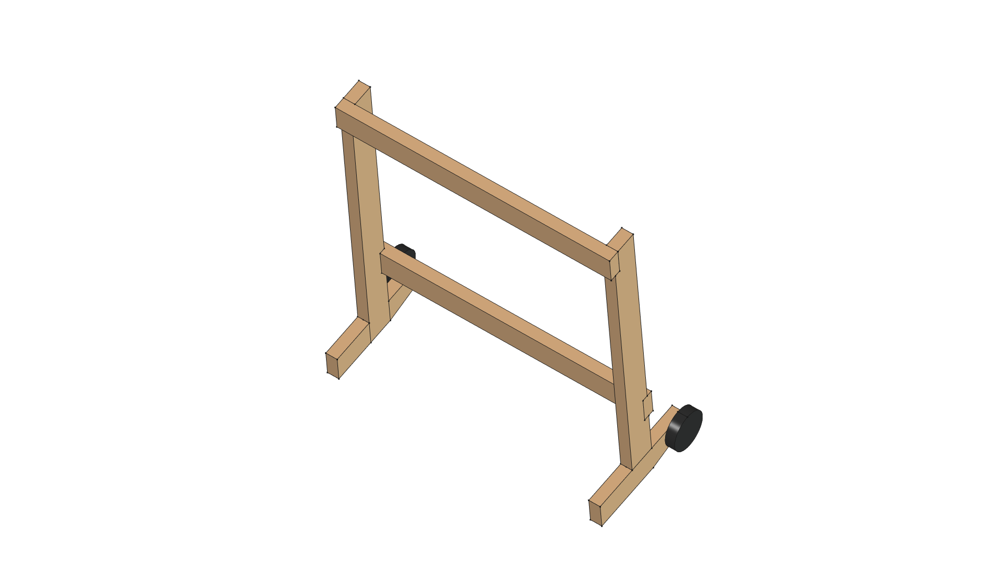
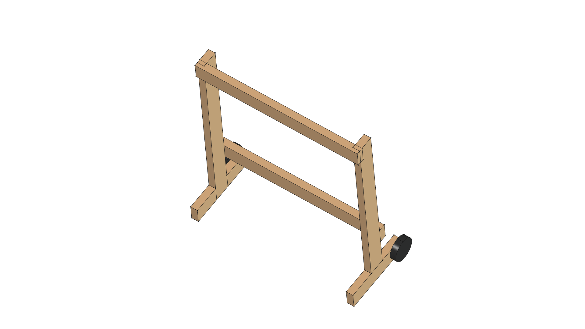
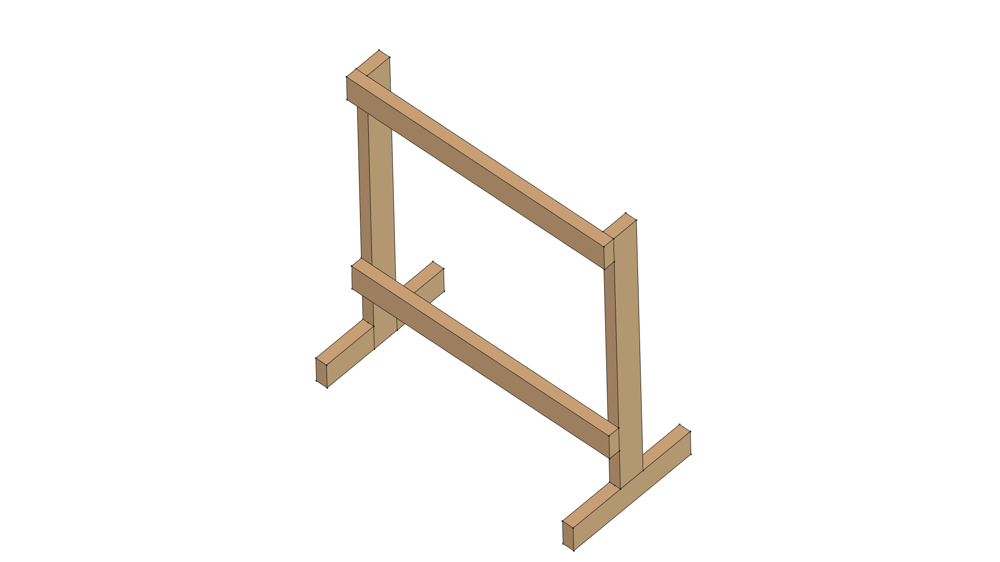

# Kombi Kaddy

> *Mobile STIHL KombiSystem Attachment Rack*

---

## Utility & Overview

The **Kombi Kaddy** is a heavy-duty mobile shop rack designed to store, organize, and transport STIHL KombiSystem power heads and straight-shaft attachments. Built from standard 2x4 lumber on heavy-duty swivel casters, it features 24.0 in outer post stud alignment, 36.0 in cantilever top/bottom rails for clip spacing, 1x4 floor deck slats for gearbox resting, and anti-racking plywood corner gussets to roll effortlessly between shop storage and active job sites.

---

## Evolutionary Version History & Human-AI Design Journey

This project documents the collaborative evolutionary cycle between human shop feedback and AI-agentic parametric CAD modeling across version iterations following **Semantic Versioning** (newest release at the top):

| Version | Representative CAD Snapshot | Design Milestones & Key Evolutionary Changes | Lifecycle Status |
| :---: | :---: | :--- | :---: |
| **[v0.9.0](v0.9.0/)**<br>*(Master)* |  | **Master Cantilever Expansion**: Expanded top/bottom rails to 36.0" width with 6.0" cantilever overhangs, allowing 4 full-sized attachments to be mounted without clip crowding while preserving 24.0" post alignment for garage studs.<br><br>📋 [**REQUIREMENTS.md**](v0.9.0/REQUIREMENTS.md) • 📐 [**SPECIFICATION.md**](v0.9.0/SPECIFICATION.md) • ✂️ [**CUT_LIST.md**](v0.9.0/CUT_LIST.md) • 🛠️ [**build.py**](v0.9.0/build.py) | 🟡 **`[IN PROGRESS]`** |
| **[v0.8.0](v0.8.0/)** |  | **Height Calibration**: Calibrated overall post height to 44.5" to align spring clip grab centers at 42.75", perfectly matching real-world 39.5" Kombi attachment standing heights.<br><br>✂️ [**CUT_LIST.md**](v0.8.0/CUT_LIST.md) • 🛠️ [**build.py**](v0.8.0/build.py) | 📦 **`[SUPERSEDED]`** |
| **[v0.7.0](v0.7.0/)** |  | **Mobility Refinement**: Mounted rear 5" fixed rubber casters to the heel of base feet for tilt-and-roll transport across shop floors and driveway surfaces.<br><br>✂️ [**CUT_LIST.md**](v0.7.0/CUT_LIST.md) • 🛠️ [**build.py**](v0.7.0/build.py) | 📦 **`[SUPERSEDED]`** |
| **[v0.6.0](v0.6.0/)** |  | **Structural Joinery & Deck**: Housed 1x4 cross rails inside 0.75" dado post pockets; added 2x 1x4 horizontal floor deck slats to support gearboxes off the ground.<br><br>✂️ [**CUT_LIST.md**](v0.6.0/CUT_LIST.md) • 🛠️ [**build.py**](v0.6.0/build.py) | 📦 **`[SUPERSEDED]`** |
| **[v0.5.0](v0.5.0/)** |  | **Ergonomic Clearance**: Offset vertical 2x4 posts 8.5" rearward along base feet to prevent heavy tool heads (tillers, edgers, blowers) from striking posts.<br><br>✂️ [**CUT_LIST.md**](v0.5.0/CUT_LIST.md) • 🛠️ [**build.py**](v0.5.0/build.py) | 📦 **`[SUPERSEDED]`** |
| **[v0.4.0](v0.4.0/)** |  | **Parametric VarSet Rebuild**: Rebuilt 3D model using FreeCAD `App::VarSet` (`dims`) table for fully parametric dimension management across the assembly. | 📦 **`[SUPERSEDED]`** |
| **[v0.3.0](v0.3.0/)** |  | **Anti-Racking Stability**: Added sloped front foot toe profile and 3/4" rear plywood corner gussets to eliminate lateral frame sway under heavy load. | 📦 **`[SUPERSEDED]`** |
| **[v0.2.0](v0.2.0/)** |  | **Clip Rail Integration**: Added top 1x4 cross rail and spring clip mounting layout for vertical attachment storage. | 📦 **`[SUPERSEDED]`** |
| **[v0.1.0](v0.1.0/)** |  | **Foot Depth Extension**: Extended base foot depth to 15.0" to improve forward tipping stability. | 📦 **`[SUPERSEDED]`** |
| **[v0.0.0](v0.0.0/)** |  | **Baseline Prototype**: Initial flat 2x4 frame prototype and baseline shop dimensions. | 📦 **`[SUPERSEDED]`** |

---

## FreeCAD Execution Command

To build the active master model (Version 0.9.0) and generate all orthographic view renders:

```bash
/home/phi/AppImages/FreeCAD_1.1.3-Linux-x86_64-py311.AppImage -c "__file__='/home/phi/PROJECTS/phi-WORKS/maker/projects/kombi-kaddy/v0.9.0/build.py'; exec(open(__file__).read())"
```
