# Kombi Kaddy

> **Mobile STIHL KombiSystem Attachment Rack**  
> *Git-Native Parametric CAD Model & Fabrication Documentation*

**Active CAD Model**: [`caddy.FCStd`](caddy.FCStd)  
**Status**: 🟡 **`[IN PROGRESS]`**  

---

## Active Model Gallery

| Isometric View | Top Plan View |
| :---: | :---: |
| 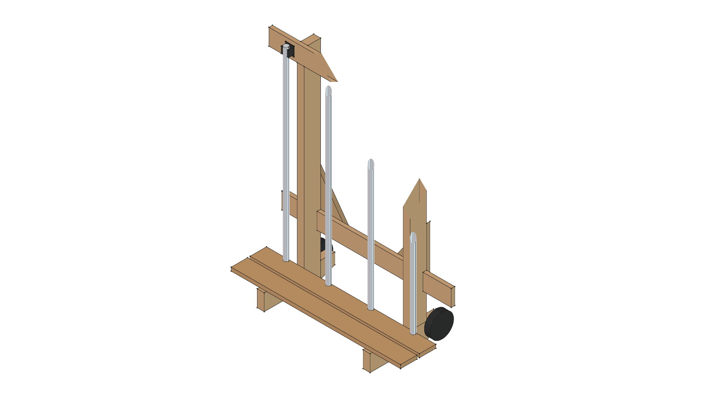 | 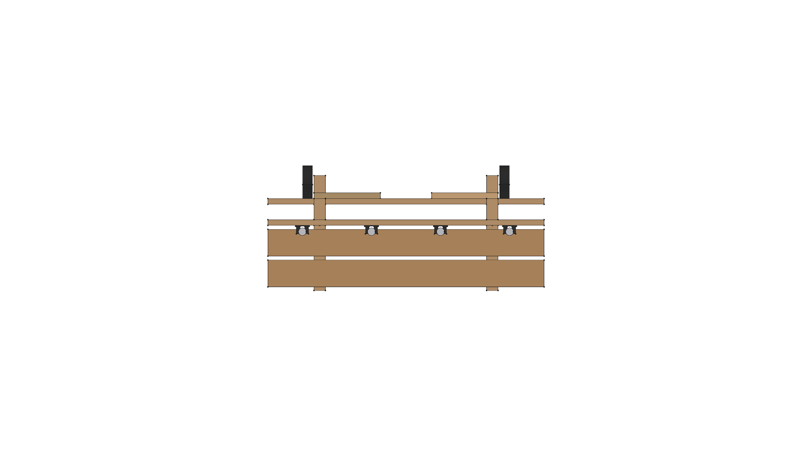 |
| **Front Elevation** | **Rear Elevation** |
| 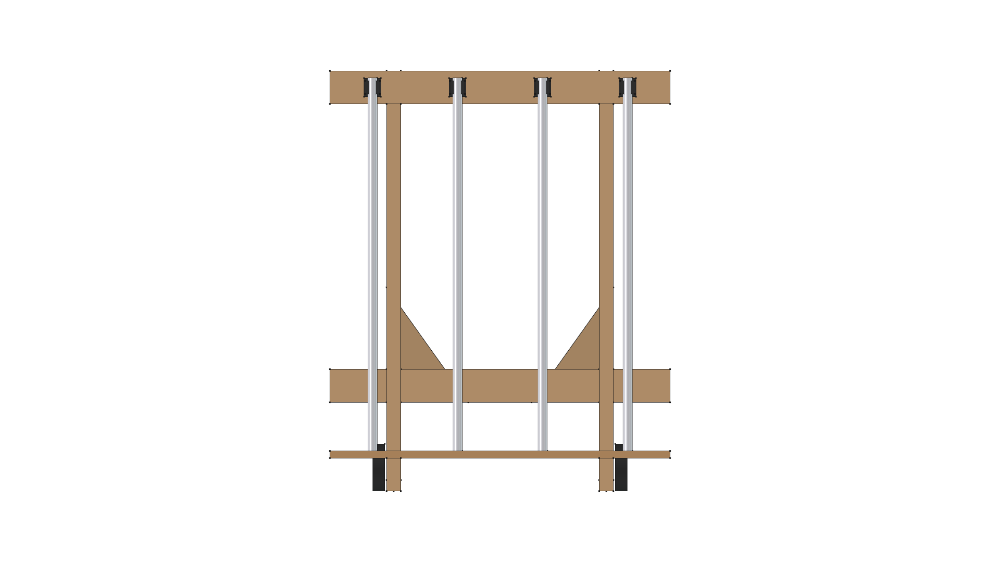 | 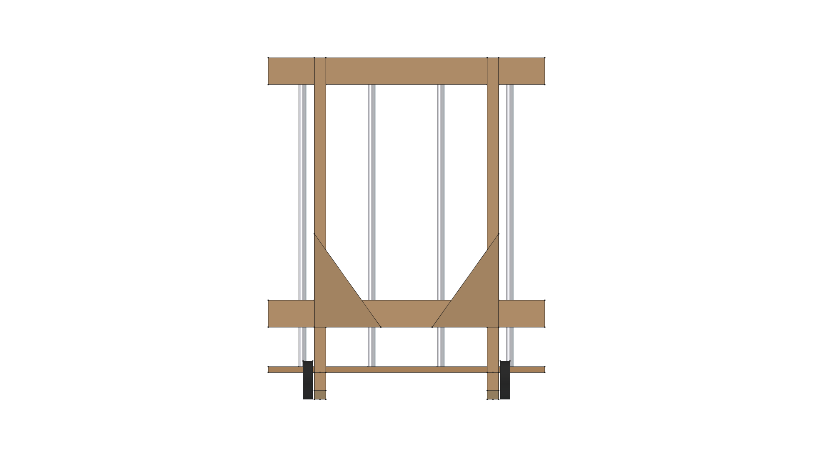 |
| **Right Side Elevation** | **Left Side Elevation** |
| 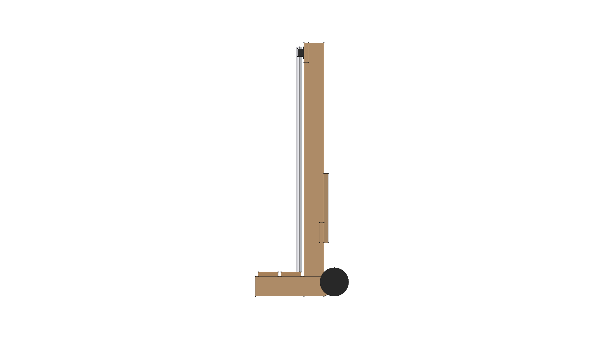 | 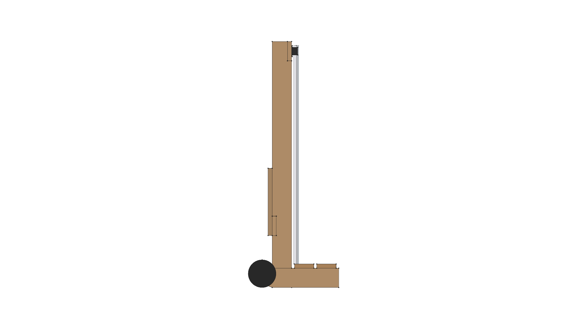 |
| **Bottom Plan View** | |
| 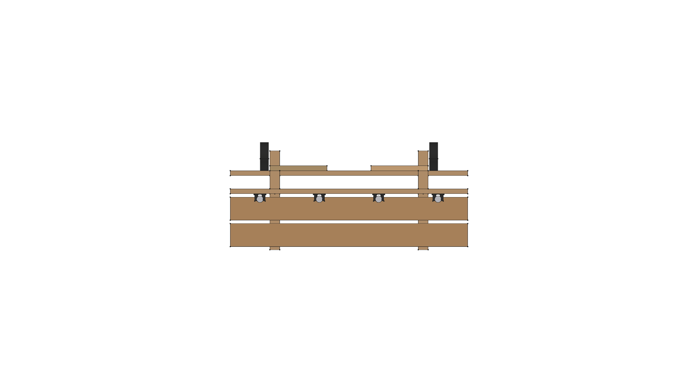 | |

---

## Documentation Index

- 📐 [**`SPECIFICATION.md`**](SPECIFICATION.md): Master technical specification, parametric VarSet (`dims`) table, joinery, and hardware.
- 📜 [**`CHANGELOG.md`**](CHANGELOG.md): Complete chronological version transformation log and release history.
- 🛠️ [**`build.py`**](build.py): Master FreeCAD Python parametric generator script.
- 📦 [**`caddy.FCStd`**](caddy.FCStd): Active 3D Master Model document file.

---

## Evolutionary Transformation Story

This project documents the evolutionary design transformation of the Kombi Kaddy. Historical CAD models are preserved natively via Git tags (`v0.0.0` .. `v0.9.0`).

| Version | Visual Milestone Snapshot | Key Evolutionary Milestone | Lifecycle Status |
| :---: | :---: | :--- | :---: |
| **v0.9.0** |  | **Master Cantilever Expansion**: Expanded top/bottom rails to 36.0" width with 6.0" cantilever overhangs, allowing 4 full-sized attachments without clip crowding while preserving 24.0" post alignment for garage studs. | 🟡 **`[IN PROGRESS]`** |
| **v0.8.0** | 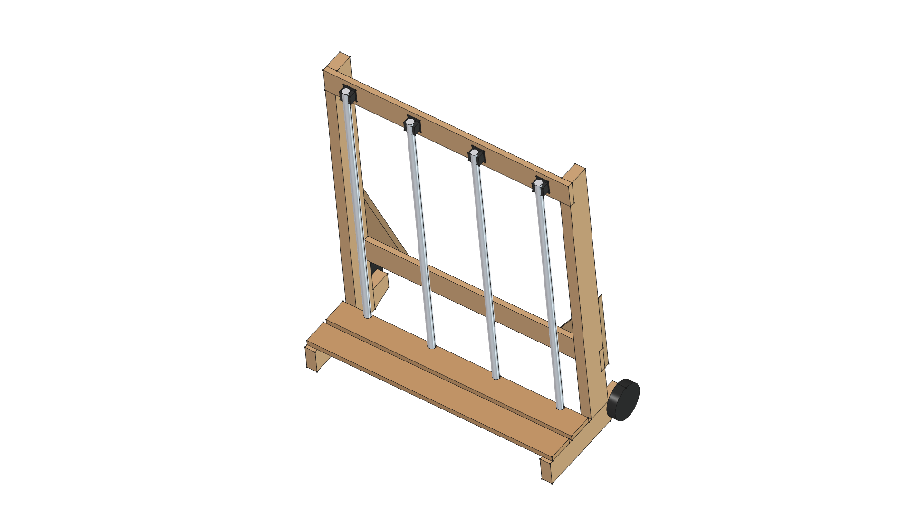 | **Height Calibration**: Calibrated overall post height to 44.5" to align spring clip grab centers at 42.75", matching real-world attachment standing heights. | 📦 **`[SUPERSEDED]`** |
| **v0.7.0** |  | **Mobility Refinement**: Mounted rear 5" fixed rubber casters to the heel of base feet for tilt-and-roll transport across shop floors. | 📦 **`[SUPERSEDED]`** |
| **v0.6.0** |  | **Structural Joinery & Deck**: Housed 1x4 cross rails inside 0.75" dado post pockets; added 2x 1x4 horizontal floor deck slats to support gearboxes. | 📦 **`[SUPERSEDED]`** |
| **v0.5.0** | 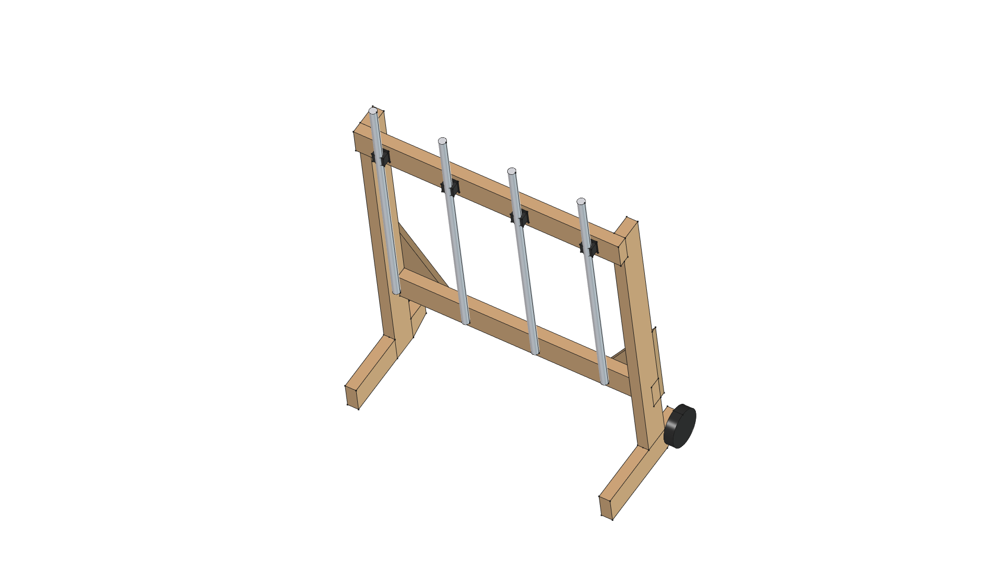 | **Ergonomic Clearance**: Offset vertical 2x4 posts 8.5" rearward along base feet to prevent heavy tool heads from striking posts during insertion. | 📦 **`[SUPERSEDED]`** |
| **v0.4.0** | 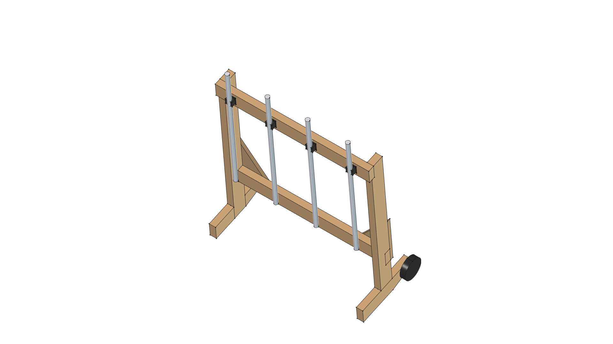 | **Parametric VarSet Rebuild**: Rebuilt 3D model using FreeCAD `App::VarSet` (`dims`) table for fully parametric dimension management. | 📦 **`[SUPERSEDED]`** |
| **v0.3.0** |  | **Anti-Racking Stability**: Added sloped front foot toe profile and 3/4" rear plywood corner gussets to eliminate lateral frame sway. | 📦 **`[SUPERSEDED]`** |
| **v0.2.0** |  | **Clip Rail Integration**: Added top 1x4 cross rail and spring clip mounting layout for vertical attachment storage. | 📦 **`[SUPERSEDED]`** |
| **v0.1.0** |  | **Foot Depth Extension**: Extended base foot depth to 15.0" to improve forward tipping stability. | 📦 **`[SUPERSEDED]`** |
| **v0.0.0** | 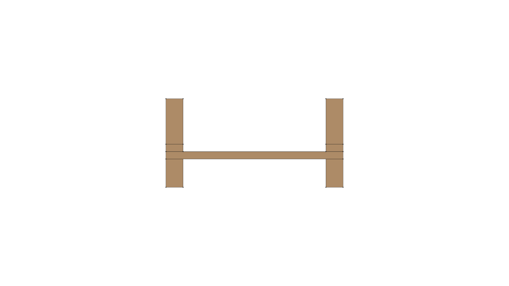 | **Baseline Prototype**: Initial flat 2x4 frame prototype and baseline shop dimensions. | 📦 **`[SUPERSEDED]`** |

---

## FreeCAD Execution Command

To build the active master model (`caddy.FCStd`) and export all 7 orthographic/isometric PNG snapshot renders:

```bash
/home/phi/AppImages/FreeCAD_1.1.3-Linux-x86_64-py311.AppImage -c "__file__='/home/phi/PROJECTS/phi-WORKS/maker/projects/kombi-kaddy/build.py'; exec(open(__file__).read())"
```
