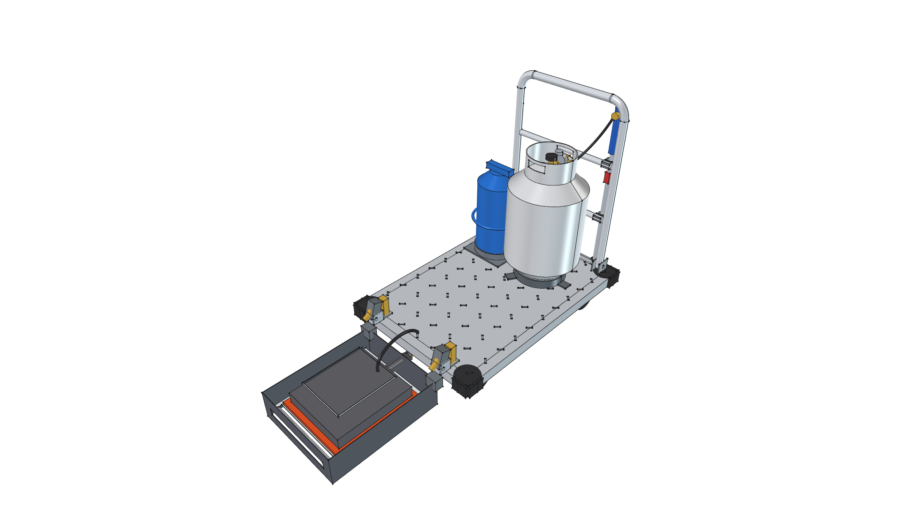

# Road Roaster 4W Changelog

All notable architectural transformations, parametric modifications, and visual milestone releases for the **Road Roaster 4W** (`road-roaster-4w`) are recorded here in reverse-chronological order.

---

## [[v0.1.0]](changelog/v0.1.0.png) — 2026-09-04: Full 4-Wheel Dolly System Integration

### Added
- **Project Genesis (`road-roaster-4w`)**: Established the 4-wheel commercial platform dolly parallel project, preserving the compact 2-wheel hand truck variant (`projects/road-roaster`) for tight garden paths and high slope agility.
- **Commercial 24" × 36" Cart Foundation**: Imported standalone `components/platform_cart_24x36`:
  - 24" × 36" diamond-tread aluminum deck with 1.75" perimeter skirt and 1.5" radiused corners.
  - 4 molded rubber corner impact guards with recessed blue socket screws.
  - 4-wheel running gear with **5.0" (127.0 mm)** solid rubber wheels on high-visibility yellow hubs (2 front rigid casters, 2 rear swivel casters with foot brake locks).
  - Ergonomic **29.0" (736.6 mm)** push handle with dual horizontal reinforcement/accessory cross rails.
- **Rear 20 lb Propane Fuel System**:
  - Modeled and integrated `components/propane_cylinder_20lb` (standard DOT 20 lb LP tank with foot ring, dual-handled protective collar, OPD service valve, and 11" W.C. regulator).
  - Added welded base retention ring anchored to the deck channels.
  - Modeled brass dual-outlet distribution manifold tee feeding both the radiant burner and auxiliary spot wand.
- **Front Cantilevered Radiant Burner & 180° Flip Hinge**:
  - Front deck twin-ear hinge brackets and heavy pivot pins at the front deck edge ($Y = -457.2\text{ mm}$).
  - Dual 1.5" square steel tube cantilever arms extending the burner forward past the front bumper to $Y = -720.0\text{ mm}$.
  - Threaded turnbuckle height-adjustment struts locking the burner hover height at $1.0''$ ($25.4\text{ mm}$) above the road (adjustable from $0.5''$ to $2.5''$).
  - 14-gauge protective steel burner cowl with perimeter heat skirts and breathing vents.
  - Integrated 60,000 BTU Solaronics ceramic infrared radiant engine pointing downward at the pavement.
  - Flexible high-temperature LP gas feed loop.
- **Handle-Mounted Spot Torch Wand & Safety Reservoir**:
  - Mounted Harbor Freight #91037 spot weed torch wand (`components/torch_hf91037`) to the handle cross rails using dual quick-draw holster clips.
  - Modeled 2.5-gallon pressurized stainless steel water safety spray canister with pump plunger and deck cradle for grass edge pre-wetting and emergency quenching.
