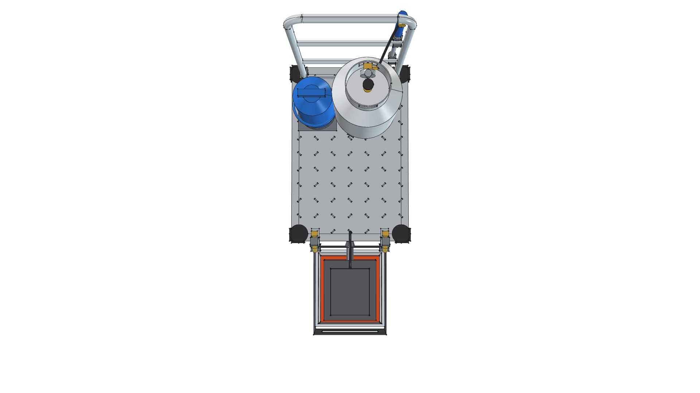
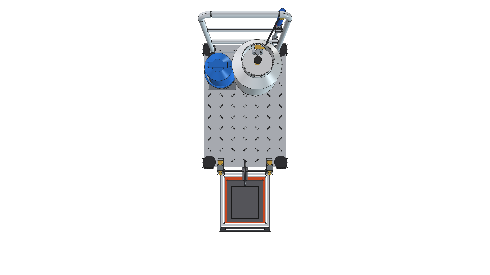
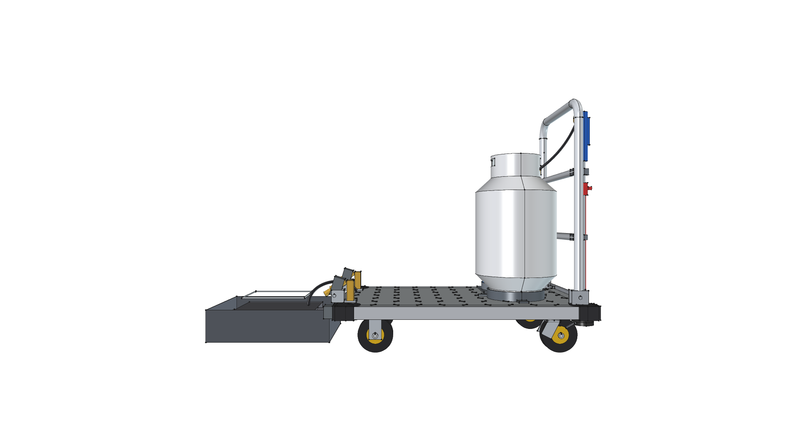
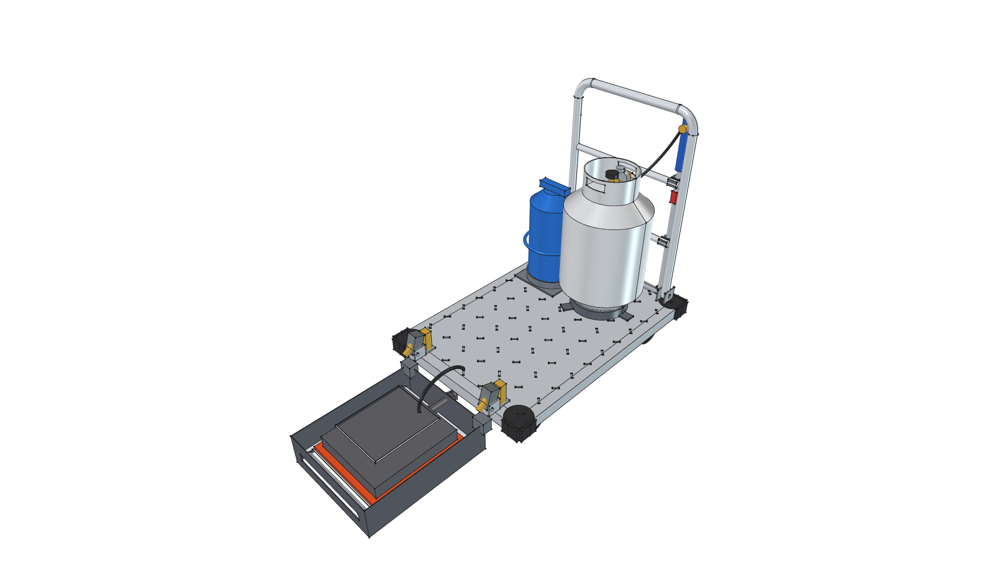

# Road Roaster 4W

> **4-Wheel Commercial Platform Dolly Architecture for Directional Ceramic Infrared Weed Eradication**  
> *Chemical-Free, Energy-Efficient Hardscape Weed Eradication via Cantilevered Radiant Heat*

**Active CAD Model**: [`road-roaster-4w.FCStd`](road-roaster-4w.FCStd)  
**Status**: 🟡 **`[IN PROGRESS - v0.1.0]`**  
**Foundation**: Commercial 24" × 36" Heavy-Duty Platform Truck (5" Caster Running Gear, 29" Push Handle)  
**Parallel Variant**: See [`projects/road-roaster`](../road-roaster/) for the ultra-compact 2-wheel vintage hand truck variant.


---

## 1. Architectural Vision: The 4-Wheel Dolly Evolution

While the original [Road Roaster (`road-roaster`)](../road-roaster/) leverages a 2-wheel vintage hand truck for tight garden paths and high slope agility, the **Road Roaster 4W** introduces a heavy-duty commercial platform cart foundation designed for large-scale driveway, roadway, and agricultural headland eradication:

```
┌────────────────────────────────────────────────────────────────────────────────────────┐
│                         ROAD ROASTER 4W SYSTEM ARCHITECTURE                            │
│                                                                                        │
│  [FRONT CANTILEVER BURNER]  ◄──  [24x36 PLATFORM DECK]  ──►  [REAR POWER & CONTROLS]   │
│   • 60,000 BTU Solaronics         • Commercial 1,000+ lb      • Standard 20 lb LP Tank │
│     Ceramic Infrared Engine         Diamond Plate Deck          (430,960 BTU capacity) │
│   • 180° Flip Transit Hinge       • 2.5 Gal Pressurized       • 29" Tubular Push Handle│
│     (Stows flat onto deck)          Water Safety Reservoir      with Dual Cross Rails  │
│   • Hover Height Adjustment       • 4-Wheel Running Gear:     • Auxiliary Spot Torch   │
│     (0.5" to 2.5" ground clr)       2 Front Rigid, 2 Rear       (HF #91037) Wand in    │
│   • Never touches the ground        Swivel w/ Foot Brakes       Quick-Draw Holster     │
└────────────────────────────────────────────────────────────────────────────────────────┘
```

1. **Massive Energy & Water Payload**: A spacious 24" × 36" (610 mm × 914 mm) deck effortlessly accommodates a full **20 lb LP propane cylinder** (430,000 BTU capacity = 7.2 hours continuous operation), auxiliary water reservoir, and safety gear without tipping risks.
2. **Cantilevered Front Burner**: The ceramic infrared radiant burner is suspended cantilevered out in front of the dolly deck, hovering stably 1.0" above the ground without dragging or requiring ground contact.
3. **180° Flip Transit / Stowage Mechanism**: A front hinged bracket allows the cantilevered burner assembly to flip 180° back onto the clear front deck space, tucking safely within the cart perimeter for compact transport, trailering, and garage storage.
4. **Auxiliary Spot Wand Integration**: Dual horizontal cross-rails on the 29" tubular push handle provide quick-draw clip mounts for an auxiliary spot weed torch (`torch_hf91037`) to target fence lines, curbs, and tight obstacles.
5. **Slow-Crawl Propulsion Ready**: Stable 4-wheel stance provides an ideal platform to add a slow motorized crawl drive to the front wheels (e.g. 0.5–1.0 mph), ensuring perfectly consistent heat soak depth without operator fatigue.

---

## 2. Platform Comparison: Road Roaster 4W vs. Road Roaster Hand Truck

| Feature | Road Roaster Hand Truck (`road-roaster`) | Road Roaster 4W (`road-roaster-4w`) |
| :--- | :--- | :--- |
| **Chassis** | Repurposed vintage 2-wheel hand truck | Commercial 24" × 36" 4-wheel platform cart |
| **Footprint** | 18" W × 20" L (ultra-compact) | 24" W × 36" L (spacious, stable) |
| **Wheel Setup** | Dual 9.5" pneumatic axle wheels | 4 Caster Wheels: 2 rigid front, 2 rear swivel w/ locks (5.0" dia) |
| **Fuel Capacity** | 1 lb Propane Bottle (~40 min runtime) | 20 lb Propane Tank (~7.2 hours runtime) |
| **Burner Position** | Common-axis axle suspension sled | Cantilevered front mount with 180° flip-back stowage |
| **Handle Height** | 46.0" top of U-bend | 29.0" above deck (with dual cross rails) |
| **Auxiliary Torch** | None | Handle-mounted spot torch wand (`torch_hf91037`) |
| **Water / Safety** | Handheld bottle only | Dedicated on-deck 2.5 gal pressurized spray tank |
| **Self-Propulsion** | Manual push / tilt | Future front-wheel slow crawl drive ready |
| **Target Use Case** | Narrow garden paths, steep stairs, tight gates | Driveways, roadways, paver patios, commercial headlands |

---

## 3. Visual Gallery

| Isometric View | Front Elevation View |
| :---: | :---: |
|  |  |

| Top Plan View | Side Elevation View |
| :---: | :---: |
|  |  |

---

## 4. Visual Transformation & Version Evolution

| Version | Milestone Thumbnail | Date | Key Architectural Highlights |
| :--- | :---: | :---: | :--- |
| **v0.1.0** |  | *2026-09-04* | **Integrated 4-Wheel Dolly Architecture**: Full integration of commercial 24" × 36" cart foundation (5" wheels, 29" handle), rear 20 lb propane cylinder, handle-mounted spot torch wand, 2.5 gal water safety tank, and front cantilevered 180° flip-back burner assembly with height adjustment. |

---

## 5. Build & CAD Verification

To generate the active `.FCStd` model and 7 perspective views:
```bash
/home/phi/AppImages/FreeCAD_1.1.3-Linux-x86_64-py311.AppImage -c "__file__='projects/road-roaster-4w/build.py'; exec(open(__file__).read())"
```
