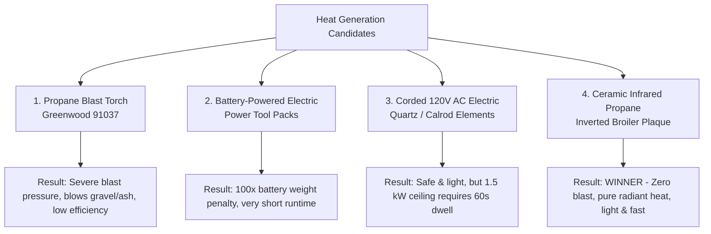

# Road Roaster — Heat Source & Thermal Analysis
*Engineering Evaluation: Blast Torches, Electric Elements, and Ceramic Infrared Burners*

---

## 1. Executive Summary & The "Inverted Broiler" Concept

The design goal of the **Road Roaster** is to deliver rapid, lethal cellular shock to invasive weeds in gravel corridors, driveways, and hardscapes without relying on toxic herbicides or open-air fuel waste.

Initial prototypes utilized commercial high-output propane weed torches (e.g., Greenwood 91037). While effective at producing raw heat, enclosing an open-flame jet inside a 14-gauge steel hood creates severe aerodynamic backpressure, blasting gravel, dust, and burning embers into the surrounding environment.

```
┌────────────────────────────────────────────────────────────────────────────────────────┐
│                          THE "INVERTED BROILER" PARADIGM                               │
│                                                                                        │
│     Instead of a high-pressure flamethrower blowing hot gas into a box,               │
│     the Road Roaster operates as an INVERTED GAS STEAK BROILER gliding                 │
│     over the ground: emitting high-intensity downward infrared radiation (1,600°F)     │
│     with ZERO blast pressure, ZERO flying gravel, and whisper-quiet operation.        │
└────────────────────────────────────────────────────────────────────────────────────────┘
```

This document provides the thermodynamic, aerodynamic, and electrical analysis that establishes **Ceramic Infrared Propane Burners** as the optimal thermal architecture for the Road Roaster platform.

---

## 2. Fundamentals of Thermal Measurement & Plant Lysis

### 2.1 BTU Definition & Energy Units
A **British Thermal Unit (BTU)** is the amount of heat energy required to raise the temperature of **1 pound of liquid water by $1^\circ\text{F}$** at standard atmospheric pressure.

* **1 BTU** $= 1,055.06\text{ Joules} = 1.055\text{ kJ} = 0.2931\text{ Watt-hours (Wh)}$
* **1 BTU/hr** (Power / Heat Rate) $= 0.2931\text{ Watts}$
* **1 kW (1,000 W)** $= 3,412.14\text{ BTU/hr}$
* **1 lb Propane** (HD-5) $= 21,548\text{ BTU} \approx 6,315\text{ Wh}$

### 2.2 How We Measure BTU Generation in Practice

```
┌────────────────────────────────────────────────────────────────────────────────────────┐
│                                BTU MEASUREMENT METHODS                                │
├─────────────────────────┬───────────────────────────────┬──────────────────────────────┤
│ 1. Fuel Mass-Loss (Gas) │ 2. Electrical Power (Watts)   │ 3. Target Calorimetry (Soil) │
│   BTU/hr = (Δm / Δt)    │   BTU/hr = V × I × 3.412      │   Q = m × c_p × ΔT           │
│     × 21,548 BTU/lb     │                               │                              │
└─────────────────────────┴───────────────────────────────┴──────────────────────────────┘
```

1. **Gravimetric Mass-Loss (Propane Systems)**:
   Weigh the propane canister on a digital scale before and after a timed burn ($\Delta t$ in hours):
   $$\text{Power (BTU/hr)} = \frac{m_{\text{start}} - m_{\text{end}}\;(\text{lbs})}{\Delta t\;(\text{hours})} \times 21,548\text{ BTU/lb}$$
2. **Electrical Wattmeter (Electric Systems)**:
   Measure continuous voltage and amperage draw:
   $$\text{Power (BTU/hr)} = V \times I \times 3.41214\text{ BTU/(W}\cdot\text{hr)}$$
3. **Calorimetric Ground Absorption (Effective Dose)**:
   Measures thermal energy successfully transferred to the weed/stone canopy rather than lost to exhaust:
   $$Q_{\text{absorbed}} = m_{\text{gravel/leaf}} \cdot c_p \cdot (T_{\text{final}} - T_{\text{initial}})$$

### 2.3 The Biological Target: Cellular Shock vs. Incineration
Effective weed management **does not require burning vegetation to ash**. 
* Heating plant leaves to **$60^\circ\text{C}$ to $80^\circ\text{C}$ ($140^\circ\text{F} - 175^\circ\text{F}$)** for **1 to 2 seconds** causes the moisture inside plant cells to boil and expand rapidly.
* This ruptures the cell walls, coagulates photosynthetic proteins, and collapses the vascular sap network.
* Target energy density: **$30\text{ to }60\text{ kJ/m}^2$ ($\approx 25\text{ to }50\text{ BTU/ft}^2$)**. Across an 18" × 18" ($2.25\text{ sq ft}$) sled footprint, the required thermal dose is **$60\text{ to }90\text{ BTU}$ per patch**.

---

## 3. Evaluation of Heat Generation Candidates



---

### Candidate 1: High-Velocity Propane Blast Torch (Greenwood 91037)

* **Rated Thermal Power**: $340,644\text{ BTU/hr}$ ($\approx 100\text{ kW}$) at full unregulated tank pressure.
* **Mechanism**: High-pressure nozzle injects high-velocity propane into a venturi cone, throwing a continuous jet flame ($>1,500^\circ\text{C}$) into the hood.

#### Failure Modes in Enclosed Sled Operation:
1. **Dynamic Aerodynamic Pressure ($q = \frac{1}{2}\rho v^2$)**:
   The massive volume expansion of burning gas inside an enclosed 18" hood creates intense positive static pressure. The hood acts as a pneumatic chamber, forcing exhaust out the bottom skirts at high velocity.
2. **Gravel, Dust & Ash Ejection**:
   The forced gas jet acts like a leaf blower, blasting gravel stones, loose dirt, and burning plant embers out from under the skirts, creating a major eye and fire hazard.
3. **Low Downward Efficiency (20%–30%)**:
   Because hot gas is driven by high-velocity forced convection, it rushes out the exhaust vents before the thermal energy can conduct into the ground.

---

### Candidate 2: Battery-Powered Electric Radiant Heat

The proposition of dragging a quiet electric heating element powered by commercial tool batteries (such as 36V Stihl AP batteries) is clean and appealing. However, it encounters the fundamental laws of **gravimetric energy density**.

#### Energy Comparison: Stihl AP 300 S vs. 1 lb Propane Bottle
* **Stihl AP 300 S Battery (4.0 lbs)**: $36\text{V} \times 7.8\text{Ah} = 281\text{ Wh} = \mathbf{959\text{ BTU}}$.
* **1 lb Propane Bottle (1.9 lbs gross)**: $21,548\text{ BTU} = \mathbf{6,315\text{ Wh}}$.

$$\text{Energy Ratio} = \frac{6,315\text{ Wh}}{281\text{ Wh}} \approx \mathbf{22.5\times}$$

> **The Battery Weight Problem:**  
> A single 1 lb propane canister contains the thermal energy of **twenty-two (22) Stihl AP 300 S batteries**, which would weigh **$88\text{ lbs}$**.  
> If drawing $1,500\text{ W}$ ($5,118\text{ BTU/hr}$) from a Stihl battery, the battery is completely drained in **$11.2\text{ minutes}$**, while delivering only a fraction of the required weeding heat.

---

### Candidate 3: Corded 120V AC Electric Radiant Heat

Plugging the sled into a standard household outlet via a 12-gauge extension cord eliminates the battery weight and cost completely.

* **Household Circuit Ceiling**: Standard 120V / 15A circuits are limited by electrical code to **$1,500\text{ Watts}$ continuous ($5,118\text{ BTU/hr}$)**.
* **Thermal Performance**: Delivering $90\text{ BTU}$ to an 18" × 18" patch at $5,118\text{ BTU/hr}$ ($1.42\text{ BTU/sec}$) requires **$60\text{ to }65\text{ seconds of stationary dwell}$**.
* **Verdict**: Excellent for small, localized patios within 50–100 ft of an outlet where slow dwell times are acceptable, but impractical for covering long driveway corridors at a walking pace.

---

### Candidate 4 (The Selected Architecture): Ceramic Infrared Propane Burners

The **Ceramic Infrared Propane Burner** operates on the exact same thermodynamic principle as a commercial high-end steakhouse broiler or asphalt rejuvenator:

```
                          [ 11" W.C. Low-Pressure Gas ]
                                      │
                                      ▼
                        ┌───────────────────────────┐
                        │   Venturi Pre-Mix Cone    │
                        └─────────────┬─────────────┘
                                      │
                                      ▼
                        ┌───────────────────────────┐
                        │ Sealed Stainless Plaque   │
                        ├───────────────────────────┤
                        │  Cordierite Ceramic Tile  │ ◄── 1,600°F Cherry-Red Glow
                        │ (Thousands of Micro-Pores)│     (Flameless Surface Combustion)
                        ├───────────────────────────┤
                        │ 304 SS Protective Screen  │
                        └─────────────┬─────────────┘
                                      │
                 ▼   ▼   ▼   ▼   ▼   ▼   ▼   ▼   ▼   ▼   ▼   ▼
               DIRECT INFRARED RADIANT FLUX (3 to 5 µm Wavelength)
                                      │
                                      ▼
                 ============================================
                 WEED CANOPY & GRAVEL MATRIX (Cellular Lysis)
```

#### Why Ceramic Infrared is the Superior Solution:
1. **Zero Blast Pressure / Zero Flying Gravel**:
   Propane and air premix at low pressure ($11''\text{ W.C.} \approx 0.4\text{ PSI}$) and combust entirely within the micro-pores of the cordierite ceramic matrix. There is **no high-velocity jet stream**—combustion is atmospheric, gentle, and flameless at the surface.
2. **Direct Radiative Energy Transfer**:
   Ceramic plaques convert **$70\% - 85\%$** of fuel energy directly into electromagnetic infrared radiation ($3 - 5\,\mu\text{m}$ wavelength), perfectly matched to the absorption band of water in plant cells.
3. **High Efficiency at Reduced BTU**:
   Because radiation travels directly to the target without blowing away in the wind, a **$30,000\text{ to }45,000\text{ BTU/hr}$ ($8.8 - 13.2\text{ kW}$)** ceramic array achieves equal or faster cell kill than a $340,000\text{ BTU/hr}$ blast torch.
4. **Superior Fuel Economy**:
   * A standard 1 lb propane bottle runs for **~40–45 minutes**.
   * A 20 lb BBQ tank runs for **~15 hours**.

---

## 4. Comprehensive Heat Source Decision Matrix

| Engineering Metric | High-Output Blast Torch | Battery Electric (36V Stihl) | 120V Corded Electric | Ceramic Infrared Gas (Winner) |
| :--- | :--- | :--- | :--- | :--- |
| **Gross Thermal Power** | 100,000 – 340,000 BTU/hr | 3,400 BTU/hr (1.0 kW) | 5,118 BTU/hr (1.5 kW) | **30,000 – 45,000 BTU/hr** |
| **Downward Thermal Efficiency** | Low (20% – 30%) | High (85% – 95%) | High (85% – 95%) | **High (70% – 85%)** |
| **Dynamic Air Blast & Noise** | **Severe jet roar & gravel blast** | Silent / Zero blast | Silent / Zero blast | **Gentle hiss / Zero blast** |
| **Gravel / Ember Ejection Risk** | **High** | None | None | **None** |
| **Energy Source Payload** | 1 – 20 lbs (Propane) | 45 – 90 lbs (Batteries) | 0 lbs (Chassis tethered) | **1 – 20 lbs (Propane)** |
| **Continuous Runtime** | ~4 min (1 lb) / 1.3 hr (20 lb) | 11 min (AP 300 S @ 1.5 kW) | Infinite (Tethered) | **43 min (1 lb) / 15 hr (20 lb)** |
| **Effective Ground Speed** | 1.0 – 2.0 mph | 0.05 mph (Stationary) | 0.10 mph (60s dwell) | **0.8 – 1.5 mph (Continuous)** |
| **Hardware Integration Cost** | ~$30 – $45 | ~$800 – $1,500 | ~$40 – $75 | **~$60 – $120** |

---

## 5. Off-the-Shelf Parts Architecture for Road Roaster

To implement the "Inverted Ground Broiler" system, the following modular off-the-shelf components can be integrated into the Road Roaster chassis:

```
┌────────────────────────────────────────────────────────────────────────────────────────┐
│                        INFRARED GAS-TRAIN HARDWARE STACK                               │
├─────────────────────────┬──────────────────────────────────────────────────────────────┤
│ 1. Burner Element       │ 2x HD262 Industrial Infrared Ceramic Plaques                 │
│                         │ (or dual 12"x5" 304 SS BBQ Sear Burner Boxes, 35k BTU total) │
├─────────────────────────┼──────────────────────────────────────────────────────────────┤
│ 2. Protective Screen    │ Heavy-gauge 304 Stainless Steel expanded mesh (shields tile) │
├─────────────────────────┼──────────────────────────────────────────────────────────────┤
│ 3. Pressure Regulation  │ Low-Pressure LP Regulator (11" W.C. / 0.4 PSI) with hose     │
├─────────────────────────┼──────────────────────────────────────────────────────────────┤
│ 4. Operator Controls    │ Cockpit brass needle shutoff + push-button piezo sparker     │
└─────────────────────────┴──────────────────────────────────────────────────────────────┘
```

### Next Steps for Implementation
1. **CAD Component Library**: Create a parametric CAD model for the standard HD262 / BBQ sear ceramic plaque under `components/infrared_burner_plaque/`.
2. **Chassis Mount Update**: Adapt the internal apex bracket of the `road-roaster` hood to suspend the ceramic plaques 3.0"–4.0" above the ground plane with integrated rock-guard screens.
3. **Gas Train Update**: Update the specification to low-pressure 11" W.C. hardware, eliminating the high-pressure torch tube.
