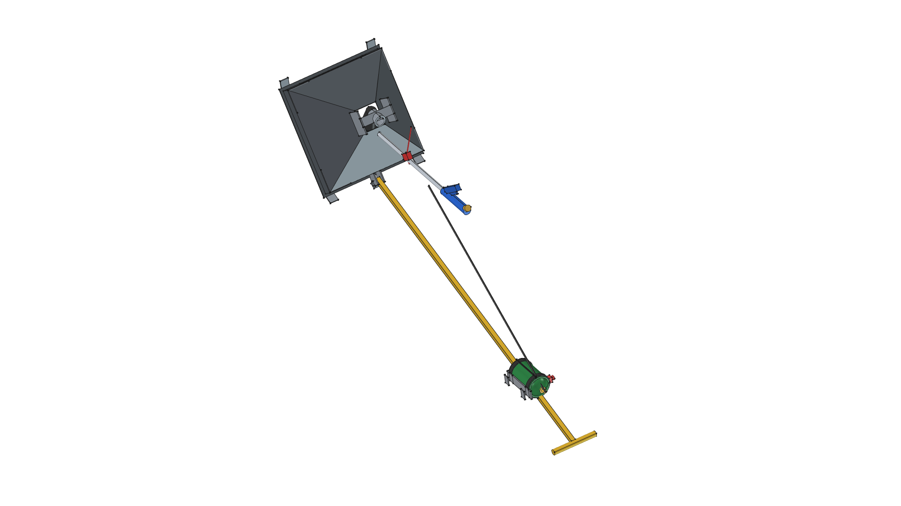
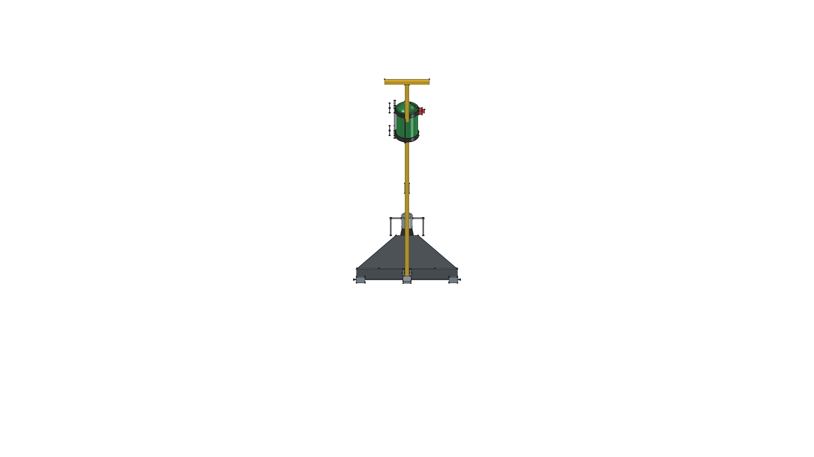
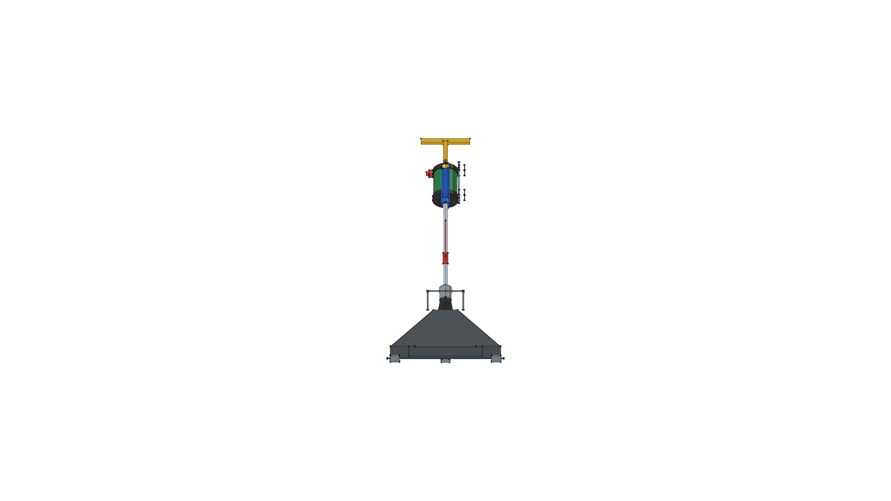
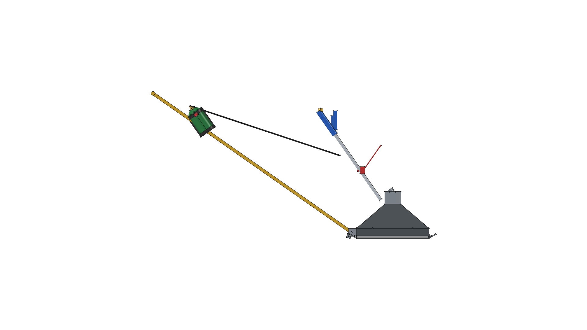
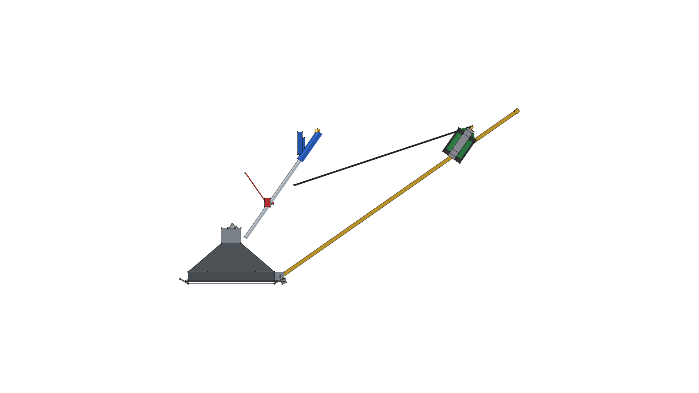
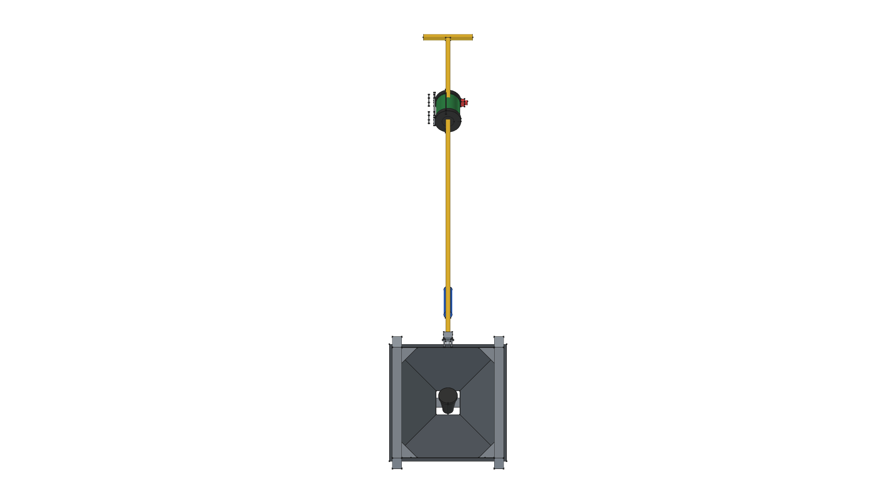

# Road Roaster

> **Towable Thermal Weed Shock Sled**  
> *Git-Native Parametric CAD Model & Fabrication Documentation*

**Active CAD Model**: [`sled.FCStd`](sled.FCStd)  
**Status**: 🟡 **`[IN PROGRESS]`**  

---

## Active Model Gallery

| Isometric View | Top Plan View |
| :---: | :---: |
|  |  |
| **Front Elevation** | **Rear Elevation** |
|  |  |
| **Right Side Elevation** | **Left Side Elevation** |
|  |  |
| **Bottom Plan View** | |
|  | |

---

## Documentation Index

- 📐 [**`SPECIFICATION.md`**](SPECIFICATION.md): Master technical specification, parametric VarSet (`dims`) table, joinery, and hardware.
- 📜 [**`CHANGELOG.md`**](CHANGELOG.md): Complete chronological version transformation log and release history.
- 🛠️ [**`build.py`**](build.py): Master FreeCAD Python parametric generator script.
- 📦 [**`sled.FCStd`**](sled.FCStd): Active 3D Master Model document file.

---

## Evolutionary Transformation Story

This project documents the evolutionary design transformation of the Road Roaster. Historical CAD models are preserved natively via Git tags (`v0.0.0` .. `v0.4.0`).

| Version | Visual Milestone Snapshot | Key Evolutionary Milestone | Lifecycle Status |
| :---: | :---: | :--- | :---: |
| **v0.4.0** |  | **Onboard Propane Harness & Imported Components**: Integrated standalone 1 lb Propane Cylinder (`components/propane_cylinder_1lb/`) and quick-slip Propane Bottle Harness (`components/propane_harness/`) onto upper tow bar handle tube. Refactored `build.py` to consume pre-built `.FCStd` component files directly via `import_component()`. | 🟡 **`[IN PROGRESS]`** |
| **v0.3.0** |  | **Modular Master Container**: Organized 3D model into 4 modular FreeCAD `App::DocumentObjectGroup` containers (`Flame_Sled_Pyramid_Hood`, `Overhead_Support_Frame`, `Rigid_Towbar_Hitch`, `Harbor_Freight_Torch_91037`), establishing clean tree structure and parametric VarSet (`dims`) control. | 📦 **`[SUPERSEDED]`** |
| **v0.2.0** |  | **Ergonomic Forward Lean**: Re-angled torch handle wand 180° forward leaning toward the operator pulling at the front, putting the blue handle, flow knob, and piezo igniter button within comfortable walking reach. | 📦 **`[SUPERSEDED]`** |
| **v0.1.0** |  | **Mechanical Integration**: Integrated overhead steel bridge mounting frame, Harbor Freight #91037 propane torch module, 2.0" vertical skirts, and 5 ft rigid square tube tow bar with 20° drop-stop rest tab. | 📦 **`[SUPERSEDED]`** |
| **v0.0.0** |  | **Baseline Prototype**: Initial $18'' \times 18''$ closed pyramid hood geometry, 14-gauge sheet metal templates, and dual $1.5'' \times 3/16''$ flat bar skid runners with 30° turned-up tips. | 📦 **`[SUPERSEDED]`** |

---

## FreeCAD Execution Command

To build the active master model (`sled.FCStd`) and export all 7 orthographic/isometric PNG snapshot renders:

```bash
/home/phi/AppImages/FreeCAD_1.1.3-Linux-x86_64-py311.AppImage -c "__file__='/home/phi/PROJECTS/phi-WORKS/maker/projects/road-roaster/build.py'; exec(open(__file__).read())"
```
