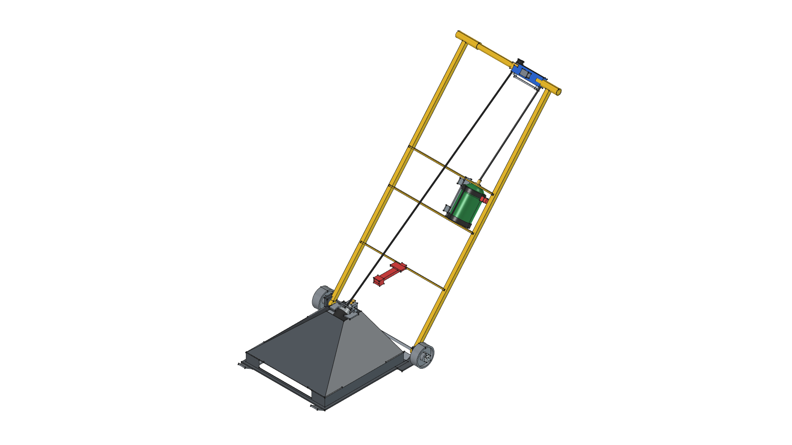
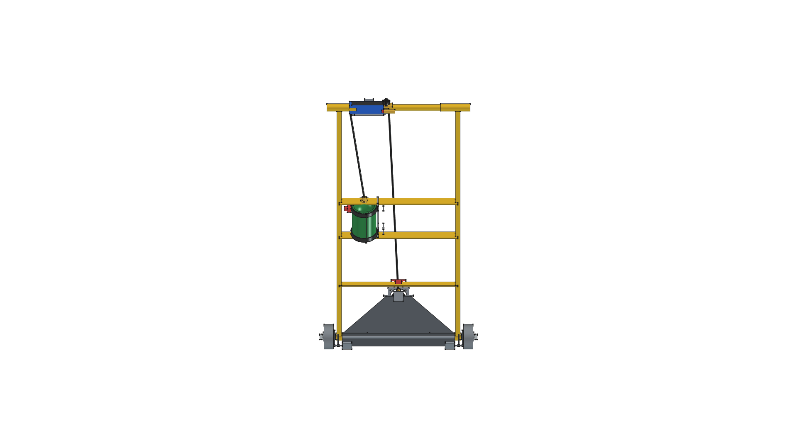
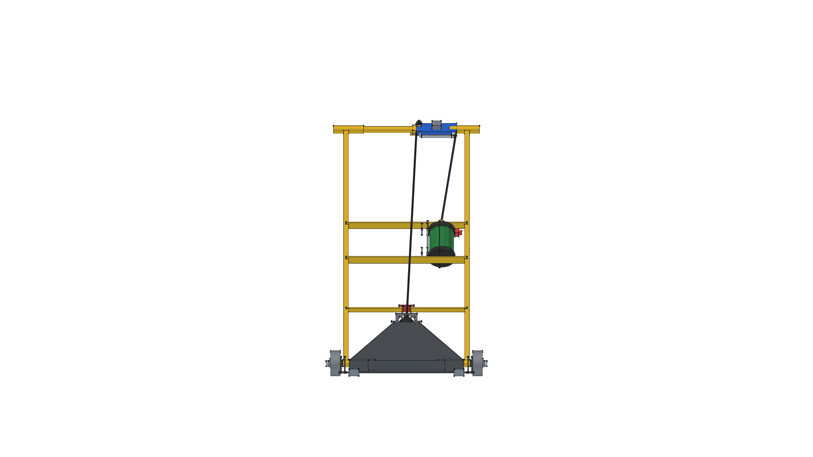
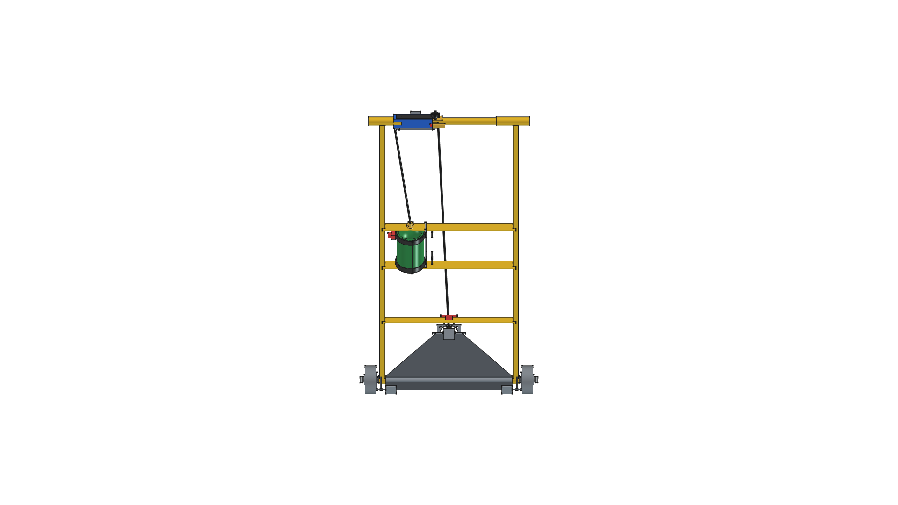
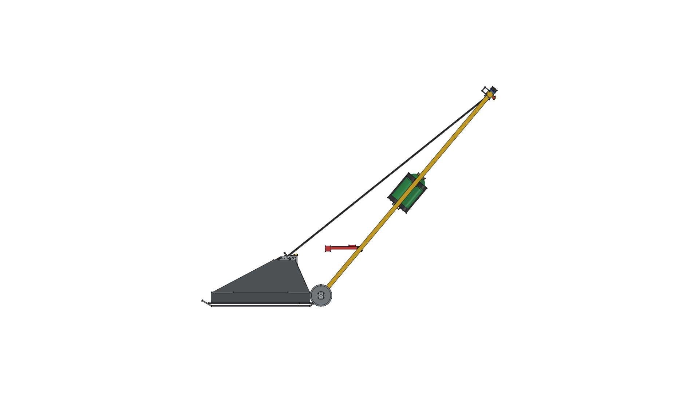
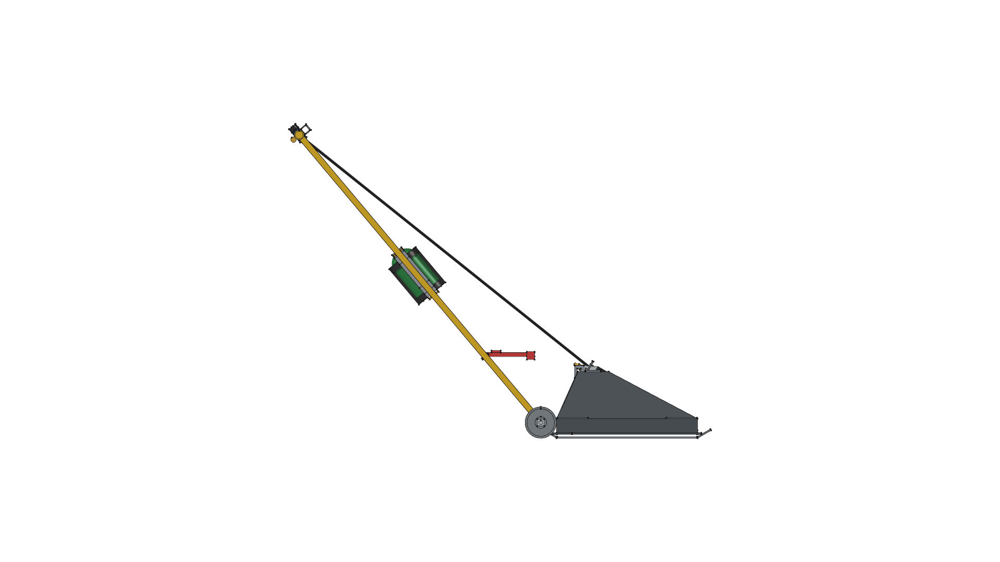
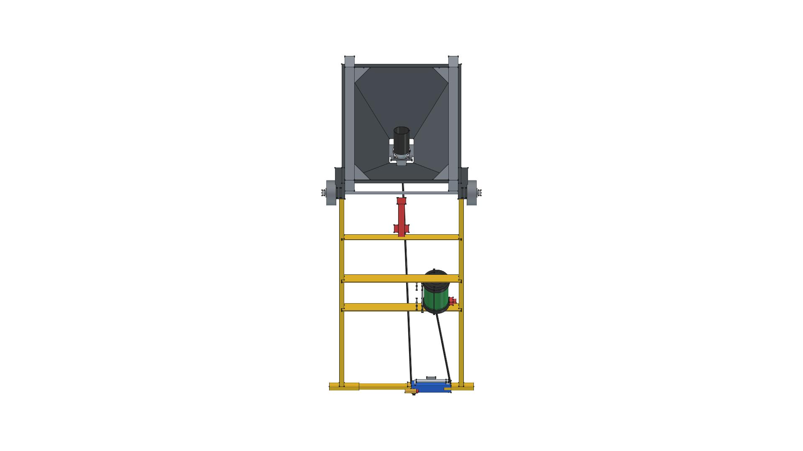
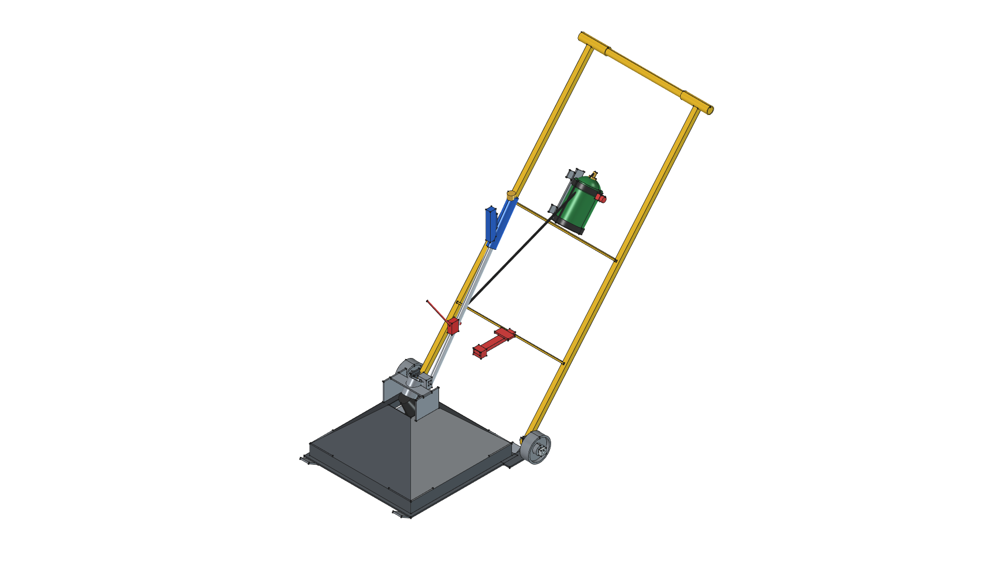
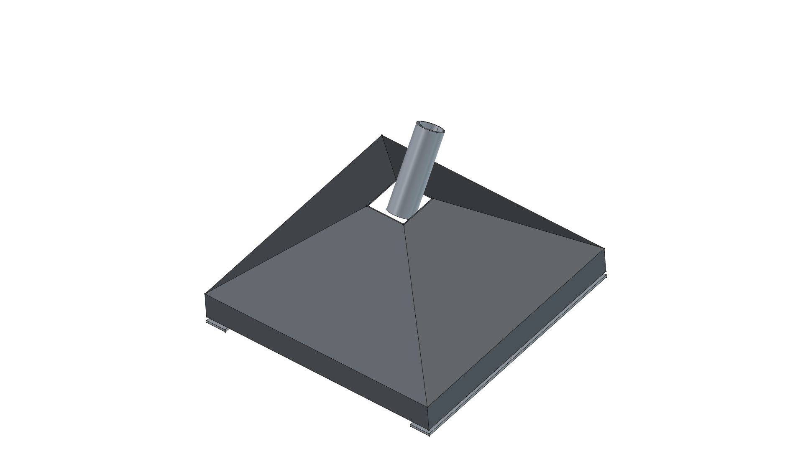

# Road Roaster

> **Directional Thermal Weed Shock Sled**  
> *Chemical-Free, Energy-Efficient Hardscape Weed Eradication via Concentrated Radiant Heat*

**Active CAD Model**: [`road-roaster.FCStd`](road-roaster.FCStd)  
**Status**: 🟡 **`[IN PROGRESS]`**  

---

## 1. The Problem: Hardscape Weed Invasions & The Chemical Trap

Gravel driveways, roadside corridors, cobblestone pathways, paver patios, and agricultural headlands are chronically invaded by resilient, deep-rooted weeds (dandelions, thistles, crabgrass, bindweed, and woody invasives). Managing these unwanted plants presents major challenges:

* **The Failure of Mechanical Weeding**: Hand-pulling is back-breaking, time-consuming, and leaves deep taproots intact to regrow within days. String trimmers fling hazardous gravel projectiles, damage surrounding structures, and only sever top growth without damaging root crowns.
* **The Environmental & Health Hazards of Chemical Herbicides**: Many property owners turn to synthetic chemical herbicides (glyphosate, 2,4-D, diquat). However, chemical weed control brings severe liabilities:
  * Persistent toxic runoff into surrounding soil, vegetable beds, and groundwater tables.
  * Health hazards to children, pets, livestock, and beneficial native pollinators.
  * Accelerated emergence of chemical-resistant "superweeds".
  * Leaving behind unsightly, chemically tainted dead biomass.

---

## 2. The Solution: Concentrated Thermal Cellular Shock

The **Road Roaster** completely eliminates chemical dependency by applying **concentrated, directional thermal shock**. 

### The Science of Thermal Weed Eradication
Thermal weed control does **not** require burning green vegetation to ash. Instead, it relies on brief, intense heat exposure to raise internal plant cell moisture above **$140^\circ\text{F} – 180^\circ\text{F}$ ($60^\circ\text{C} – 82^\circ\text{C}$)**. At this critical threshold:
1. **Cellular Rupture**: Intracellular water expands instantaneously, bursting plant cell membranes.
2. **Protein Coagulation**: Photosynthetic protein structures instantly denature and coagulate.
3. **Sap Desiccation**: Vascular sap pressure collapses, cutting off moisture transport and causing the weed to rapidly wither, dry out, and die down into the root crown within 24 to 48 hours.

---

## 3. Why Conventional Open Torches Fail vs. Road Roaster's Closed Heat Trap

| Feature | Conventional Open Flame Torch Wand | Road Roaster Closed Thermal Sled |
| :--- | :--- | :--- |
| **Energy Efficiency** | **Terrible (<15%)**: 85%+ of heat is lost to ambient convective air draft and wind. | **Exceptional (>80%)**: Enclosed 14-gauge steel pyramid hood traps and recirculates all radiant energy. |
| **Fuel Consumption** | Extremely high propane usage due to constant open flame dissipation. | **Uses up to 70% less propane** to achieve the same cellular lethality. |
| **Wind Resistance** | Easily quenched or deflected by 5+ mph wind gusts. | **Wind-Immune**: 2.0" vertical perimeter skirts isolate the flame chamber from ground drafts. |
| **Deep Heat Soak Capability** | Cannot dwell over problem spots without blowing flame wild or wasting fuel. | **Stationary Heat-Soak**: Dwell 15–30s to conduct $180^\circ\text{F}$ heat **1–2 inches into soil/gravel**, killing taproots & seed banks. |
| **Fire Safety** | High danger of stray open flames and flying sparks igniting dry grass or brush. | **Full Flame Containment**: Flame is safely enclosed under steel; exhaust vents forward away from operator. |
| **Operator Fatigue** | Heavy wand cantilevered in hand; constant bending and aiming required. | **Effortless Upright Vacuum Rolling**: Dual 4.0" steel wheels and ergonomic U-frame carry all weight. |

---

## 4. Dual Operational Modes

```
               [ TRANSIT / LATCHED MODE ]                                  [ GLIDE ROASTING / FREE MODE ]
           (Tilt back to roll across grass/asphalt)                     (Glides flat on ground for weed shock)

                     /                                                           /
                    /                                                           /
                   /  [Snap Latch ENGAGED]                                     /  [Snap Latch RELEASED]
                  /                                                           /
   (Skids 4" UP) /                                                           /
    ▲           /                                                           /
    │   ┌──────┴──────┐                                            ┌───────┴──────┐
    └───│ SLED HOOD   │ ──(Solid Rear Wheel Fulcrum)               │  SLED HOOD   │ ──(Solid Rear Wheels)
        └─────────────┘                                            └──────────────┘ ════════ (Ground)
```

1. **Continuous Glide Roasting**:
   * For surface broadleaf seedlings, moss, and general gravel maintenance.
   * Disengage the snap latch; the operator walks at a steady pace ($1–2\text{ mph}$). The sled glides smoothly on its $1.5'' \times 3/16''$ steel skids, subjecting weeds to a 2–3 second thermal pulse that triggers immediate cellular collapse.
2. **Prolonged Heat-Soak Station (Deep Root & Seed Bank Sterilization)**:
   * For stubborn perennial taproots (mature dandelions, bull thistles, field bindweed) and dormant weed seed banks.
   * The operator parks the hood directly over the problem patch and holds the turbo boost squeeze lever for 15 to 30 seconds.
   * The captured convective heat conducts **1 to 2 inches into the upper gravel/soil matrix**, driving soil temperature past $180^\circ\text{F}$, thermally destroying root crowns and devitalizing weed seeds to permanently halt regrowth.
3. **Non-Contact Rolling Transit**:
   * When moving across manicured lawns, turf, concrete, or asphalt where hot skids must not contact the surface, engage the foot-release tilt latch and press down on the handle.
   * The entire front hood levers 4 inches into the air, rolling on its heavy-duty 4.0" solid steel wheels.

---

## 5. Active Model Gallery

| Isometric View | Top Plan View |
| :---: | :---: |
|  |  |
| **Front Elevation** | **Rear Elevation** |
|  |  |
| **Right Side Elevation** | **Left Side Elevation** |
|  |  |
| **Bottom Plan View** | |
|  | |

---

## 6. Documentation Index

- 📐 [**`SPECIFICATION.md`**](SPECIFICATION.md): Master technical specification, parametric VarSet (`dims`) table, joinery, and hardware.
- 📜 [**`CHANGELOG.md`**](CHANGELOG.md): Complete chronological version transformation log and release history.
- 🛠️ [**`build.py`**](build.py): Master FreeCAD Python parametric generator script.
- 📦 [**`road-roaster.FCStd`**](road-roaster.FCStd): Active 3D Master Model document file.

---

## 7. Evolutionary Transformation Story

| Version | Visual Milestone Snapshot | Key Evolutionary Milestone | Lifecycle Status |
| :---: | :---: | :--- | :---: |
| **v0.6.0** |  | **Decomposed Torch Controls, Forward-Firing Asymmetrical Hood & Dual Cross-Rails**: Transformed hood into a directional heat scoop with rearward offset apex ($Y_{apex} = +110\text{ mm}$), steep rear heat deflector, and long forward-sloping radiant roof ramp. Decomposed torch into a top-crossbar squeeze cockpit (`components/torch_control_handle/`), dual horizontal cross-rails with side-mounted 1 lb propane harness, chassis burner nozzle (`components/torch_burner_head/`), and continuous solid $1/2''$ steel through-axle. | 🟡 **`[IN PROGRESS]`** |
| **v0.5.0** |  | **Upright-Vacuum Tilt-Back Frame & Dual Metal Wheels**: Transformed towing concept to an upright vacuum / hand-truck architecture. Integrated dual 4.0" solid steel wheels at the rear pivot axis, a 48" dual-riser U-frame handle, and a foot-release snap tilt-latch allowing the sled to be levered completely off the ground for non-contact rolling transit across grass and asphalt. | 📦 **`[SUPERSEDED]`** |
| **v0.4.0** |  | **Onboard Propane Harness & Imported Components**: Integrated standalone 1 lb Propane Cylinder (`components/propane_cylinder_1lb/`) and quick-slip Propane Bottle Harness (`components/propane_harness/`) onto handle tube. Refactored `build.py` to consume pre-built `.FCStd` component files directly via `import_component()`. | 📦 **`[SUPERSEDED]`** |
| **v0.3.0** |  | **Modular Master Container**: Organized 3D model into modular FreeCAD `App::DocumentObjectGroup` containers (`Flame_Sled_Pyramid_Hood`, `Overhead_Support_Frame`, `Rigid_Towbar_Hitch`, `Harbor_Freight_Torch_91037`), establishing clean tree structure and parametric VarSet (`dims`) control. | 📦 **`[SUPERSEDED]`** |
| **v0.2.0** |  | **Ergonomic Forward Lean**: Re-angled torch handle wand 180° forward leaning toward the operator pulling at the front, putting the blue handle, flow knob, and piezo igniter button within comfortable walking reach. | 📦 **`[SUPERSEDED]`** |
| **v0.1.0** |  | **Mechanical Integration**: Integrated overhead steel bridge mounting frame, Harbor Freight #91037 propane torch module, 2.0" vertical skirts, and 5 ft rigid square tube tow bar with 20° drop-stop rest tab. | 📦 **`[SUPERSEDED]`** |
| **v0.0.0** |  | **Baseline Prototype**: Initial $18'' \times 18''$ closed pyramid hood geometry, 14-gauge sheet metal templates, and dual $1.5'' \times 3/16''$ flat bar skid runners with 30° turned-up tips. | 📦 **`[SUPERSEDED]`** |

---

## 8. FreeCAD Execution Command

To build the active master model (`road-roaster.FCStd`) and export all 7 orthographic/isometric PNG snapshot renders:

```bash
/home/phi/AppImages/FreeCAD_1.1.3-Linux-x86_64-py311.AppImage -c "__file__='/home/phi/PROJECTS/phi-WORKS/maker/projects/road-roaster/build.py'; exec(open(__file__).read())"
```
